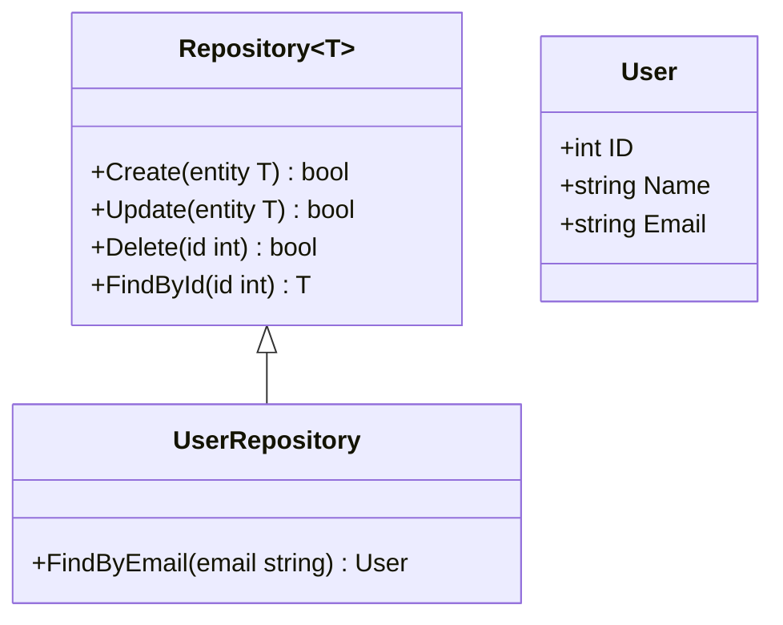

## 12.4 Repository Pattern Extensions

The Repository Pattern is a cornerstone of data management in software design, providing a layer of abstraction between the domain and data access code. This section delves into advanced implementations of the Repository Pattern in Go, particularly focusing on the use of Go 1.18+ generics to create flexible and reusable repositories, as well as implementing custom queries tailored to specific entities.

### Introduction

The Repository Pattern aims to encapsulate the logic required to access data sources, providing a clean API for data operations. By extending this pattern with generics and custom queries, developers can create more versatile and maintainable data access layers.

### Advanced Implementations

#### Generic Repositories

With the introduction of generics in Go 1.18, developers can now create repositories that are not tied to specific entity types. This allows for the creation of reusable and type-safe data access components.

**Conceptual Diagram:**



**Explanation:** The diagram illustrates a generic `Repository` interface that can be used with any entity type, such as `User`. The `UserRepository` extends this generic repository to include specific methods like `FindByEmail`.

**Code Example:**

```go
package repository

type Entity interface {
    GetID() int
}

type Repository[T Entity] interface {
    Create(entity T) bool
    Update(entity T) bool
    Delete(id int) bool
    FindById(id int) (T, bool)
}

type User struct {
    ID    int
    Name  string
    Email string
}

func (u User) GetID() int {
    return u.ID
}

type UserRepository struct {
    data map[int]User
}

func NewUserRepository() *UserRepository {
    return &UserRepository{data: make(map[int]User)}
}

func (r *UserRepository) Create(user User) bool {
    r.data[user.ID] = user
    return true
}

func (r *UserRepository) Update(user User) bool {
    if _, exists := r.data[user.ID]; exists {
        r.data[user.ID] = user
        return true
    }
    return false
}

func (r *UserRepository) Delete(id int) bool {
    if _, exists := r.data[id]; exists {
        delete(r.data, id)
        return true
    }
    return false
}

func (r *UserRepository) FindById(id int) (User, bool) {
    user, exists := r.data[id]
    return user, exists
}

func (r *UserRepository) FindByEmail(email string) (User, bool) {
    for _, user := range r.data {
        if user.Email == email {
            return user, true
        }
    }
    return User{}, false
}
```

**Explanation:** This code defines a generic `Repository` interface and a `UserRepository` that implements this interface for `User` entities. The `UserRepository` also includes a custom method `FindByEmail`.

#### Custom Queries

Custom queries allow repositories to provide methods that perform complex operations specific to the entity's needs. These methods can encapsulate intricate SQL queries or other data retrieval logic.

**Example Use Case:**

Consider a `UserRepository` that needs to support searching users by name. This requires a custom query method `SearchByName`.

**Code Example:**

```go
func (r *UserRepository) SearchByName(name string) []User {
    var results []User
    for _, user := range r.data {
        if user.Name == name {
            results = append(results, user)
        }
    }
    return results
}
```

**Explanation:** The `SearchByName` method iterates over the repository's data map to find users with a matching name, demonstrating a simple custom query implementation.

### Best Practices

- **Balance Generic and Specific Repositories:** While generics offer flexibility, it's crucial to balance between generic and specific repositories to avoid unnecessary complexity. Use generics for common operations and extend them with specific methods for entity-specific logic.
- **Abstraction from Data Store:** Repositories should remain abstracted from the underlying data store. This ensures that changes to the data storage mechanism do not affect the rest of the application.

### Advantages and Disadvantages

**Advantages:**

- **Reusability:** Generic repositories promote code reuse across different entities.
- **Type Safety:** Generics ensure compile-time type safety, reducing runtime errors.
- **Flexibility:** Custom queries provide flexibility to handle complex data retrieval needs.

**Disadvantages:**

- **Complexity:** Introducing generics can increase the complexity of the codebase.
- **Overhead:** Custom queries might introduce performance overhead if not optimized properly.

### Conclusion

The Repository Pattern, when extended with generics and custom queries, becomes a powerful tool for managing data access in Go applications. By leveraging these advanced implementations, developers can create flexible, reusable, and maintainable data access layers that adhere to modern software design principles.

## Quiz Time!



### What is the primary benefit of using generics in repositories?

- [x] Reusability and type safety
- [ ] Faster execution
- [ ] Simplified code
- [ ] Reduced memory usage

> **Explanation:** Generics enhance reusability and type safety by allowing repositories to work with different entity types without sacrificing compile-time checks.

### What is a custom query in the context of the Repository Pattern?

- [x] A method that performs complex operations specific to an entity
- [ ] A generic method applicable to all entities
- [ ] A SQL query embedded in the repository
- [ ] A method that only retrieves data by ID

> **Explanation:** Custom queries are methods tailored to perform complex operations specific to an entity's needs, often involving intricate logic or SQL queries.

### How does the `FindByEmail` method in `UserRepository` work?

- [x] It iterates over the data map to find a user with a matching email
- [ ] It uses a SQL query to find the user
- [ ] It directly accesses the database to find the user
- [ ] It uses a third-party library to search for the user

> **Explanation:** The `FindByEmail` method iterates over the repository's data map to find a user with a matching email, demonstrating a simple custom query.

### What is a potential disadvantage of using generics in repositories?

- [x] Increased complexity
- [ ] Reduced flexibility
- [ ] Lack of type safety
- [ ] Incompatibility with Go

> **Explanation:** While generics offer flexibility and type safety, they can increase the complexity of the codebase, especially if not used judiciously.

### Why should repositories remain abstracted from the underlying data store?

- [x] To ensure changes to the data storage mechanism do not affect the application
- [ ] To improve performance
- [ ] To simplify code
- [ ] To reduce memory usage

> **Explanation:** Keeping repositories abstracted from the data store ensures that changes to the storage mechanism do not impact the rest of the application, promoting maintainability.

### What is the role of the `Entity` interface in the generic repository example?

- [x] It defines a contract for entities to implement a `GetID` method
- [ ] It provides default implementations for repository methods
- [ ] It stores entity data
- [ ] It manages database connections

> **Explanation:** The `Entity` interface defines a contract for entities to implement a `GetID` method, allowing the generic repository to work with any entity type.

### How can custom queries impact performance?

- [x] They might introduce overhead if not optimized
- [ ] They always improve performance
- [ ] They have no impact on performance
- [ ] They reduce memory usage

> **Explanation:** Custom queries can introduce performance overhead if not optimized properly, especially if they involve complex logic or large data sets.

### What is a key consideration when balancing generic and specific repositories?

- [x] Avoiding unnecessary complexity
- [ ] Ensuring all methods are generic
- [ ] Using only specific repositories
- [ ] Reducing code duplication

> **Explanation:** It's important to balance between generic and specific repositories to avoid unnecessary complexity, using generics for common operations and specific methods for entity-specific logic.

### Which Go version introduced generics?

- [x] Go 1.18
- [ ] Go 1.16
- [ ] Go 1.14
- [ ] Go 1.12

> **Explanation:** Generics were introduced in Go 1.18, allowing developers to create more flexible and reusable code components.

### True or False: Custom queries should be avoided in all repository implementations.

- [ ] True
- [x] False

> **Explanation:** Custom queries are essential for handling complex data retrieval needs specific to an entity and should be used judiciously to enhance repository functionality.


