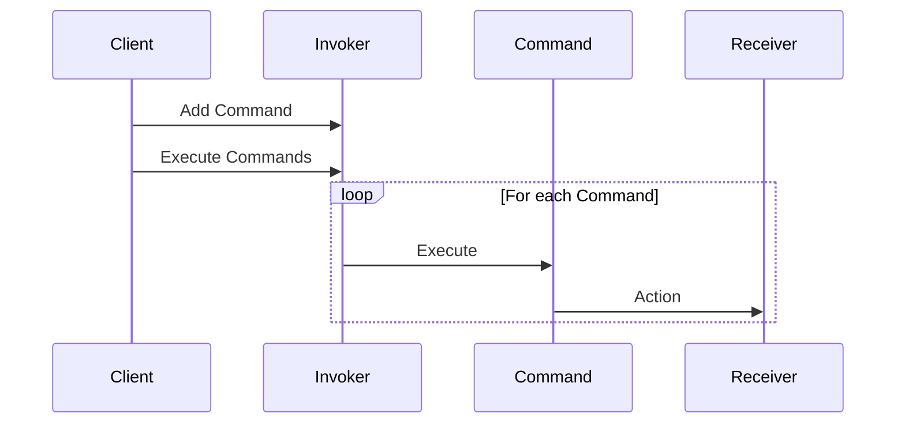

## 12.7 Command Pattern in Data Management

In the realm of software design, the Command Pattern is a behavioral design pattern that turns a request into a stand-alone object containing all information about the request. This transformation allows for parameterization of clients with queues, requests, and operations, enabling logging, undoable operations, and more. In the context of data management, the Command Pattern can be particularly powerful, providing a structured approach to handling database operations.

### Introduction to the Command Pattern

The Command Pattern is designed to encapsulate a request as an object, thereby allowing for parameterization of clients with different requests, queuing of requests, and logging of the requests. It also provides support for undoable operations. The pattern involves four main components:

- **Command Interface**: Declares an interface for executing an operation.
- **Concrete Command**: Implements the command interface and defines the binding between a Receiver object and an action.
- **Invoker**: Asks the command to carry out the request.
- **Receiver**: Knows how to perform the operations associated with carrying out a request.

### Application in Data Management

In data management, the Command Pattern can be used to encapsulate database operations as command objects. This encapsulation provides several advantages:

1. **Decoupling**: The pattern decouples the object that invokes the operation from the one that knows how to perform it.
2. **Flexibility**: Commands can be queued, logged, or executed asynchronously, providing flexibility in how operations are handled.
3. **Transaction Management**: Commands can be executed in a transactional context, ensuring that a series of operations are completed successfully or rolled back in case of failure.
4. **Undo/Redo Functionality**: By storing the state of the command, it is possible to implement undo and redo functionalities.

### Example: Implementing the Command Pattern in Go

Let's consider a practical example where we use the Command Pattern to manage database operations in a Go application. We'll create command objects for operations like `InsertUser` and `UpdateOrderStatus`.

#### Step 1: Define the Command Interface

First, we define a `Command` interface with an `Execute` method.

```go
package main

// Command interface
type Command interface {
    Execute() error
}
```

#### Step 2: Implement Concrete Commands

Next, we implement concrete command types for specific database operations.

```go
package main

import "fmt"

// InsertUserCommand is a concrete command
type InsertUserCommand struct {
    UserID   int
    UserName string
}

// Execute inserts a user into the database
func (c *InsertUserCommand) Execute() error {
    // Simulate database insertion
    fmt.Printf("Inserting user: %d, %s\n", c.UserID, c.UserName)
    return nil
}

// UpdateOrderStatusCommand is another concrete command
type UpdateOrderStatusCommand struct {
    OrderID int
    Status  string
}

// Execute updates the order status in the database
func (c *UpdateOrderStatusCommand) Execute() error {
    // Simulate updating order status
    fmt.Printf("Updating order %d to status: %s\n", c.OrderID, c.Status)
    return nil
}
```

#### Step 3: Create an Invoker

The invoker is responsible for executing commands. It can also manage a queue of commands for batch processing.

```go
package main

// CommandInvoker is responsible for executing commands
type CommandInvoker struct {
    commands []Command
}

// AddCommand adds a command to the queue
func (i *CommandInvoker) AddCommand(cmd Command) {
    i.commands = append(i.commands, cmd)
}

// ExecuteCommands executes all commands in the queue
func (i *CommandInvoker) ExecuteCommands() error {
    for _, cmd := range i.commands {
        if err := cmd.Execute(); err != nil {
            return err
        }
    }
    return nil
}
```

#### Step 4: Use the Command Pattern

Finally, we use the command pattern to manage our database operations.

```go
package main

func main() {
    invoker := &CommandInvoker{}

    // Create commands
    insertUserCmd := &InsertUserCommand{UserID: 1, UserName: "John Doe"}
    updateOrderCmd := &UpdateOrderStatusCommand{OrderID: 101, Status: "Shipped"}

    // Add commands to the invoker
    invoker.AddCommand(insertUserCmd)
    invoker.AddCommand(updateOrderCmd)

    // Execute all commands
    if err := invoker.ExecuteCommands(); err != nil {
        fmt.Println("Error executing commands:", err)
    }
}
```

### Visualizing the Command Pattern

To better understand the flow of the Command Pattern, let's visualize it using a sequence diagram.



### Advantages and Disadvantages

**Advantages:**

- **Decoupling**: Separates the object that invokes the operation from the one that knows how to perform it.
- **Flexibility**: Supports queuing, logging, and asynchronous execution of commands.
- **Transaction Management**: Facilitates execution within a transactional context.
- **Undo/Redo**: Enables implementation of undo and redo functionalities.

**Disadvantages:**

- **Complexity**: Introduces additional layers of abstraction, which can increase complexity.
- **Overhead**: May introduce overhead if not used judiciously, especially for simple operations.

### Best Practices

- **Use for Complex Operations**: Employ the Command Pattern for complex operations that benefit from decoupling and flexibility.
- **Avoid Overuse**: Avoid using the pattern for simple operations where the overhead outweighs the benefits.
- **Combine with Other Patterns**: Consider combining with other patterns like the Strategy Pattern for enhanced flexibility.

### Conclusion

The Command Pattern is a powerful tool in data management, providing a structured approach to handling database operations. By encapsulating operations as command objects, developers can achieve greater flexibility, decoupling, and control over how operations are executed. While it introduces some complexity, the benefits in terms of transaction management, logging, and undo/redo functionality make it a valuable pattern in the right contexts.

## Quiz Time!



### What is the primary purpose of the Command Pattern?

- [x] To encapsulate a request as an object
- [ ] To create a single instance of a class
- [ ] To provide a simplified interface to a complex system
- [ ] To define a family of algorithms

> **Explanation:** The Command Pattern encapsulates a request as an object, allowing for parameterization, queuing, and logging of requests.

### Which component of the Command Pattern knows how to perform the operations?

- [ ] Invoker
- [ ] Command
- [x] Receiver
- [ ] Client

> **Explanation:** The Receiver knows how to perform the operations associated with carrying out a request.

### What is a key advantage of using the Command Pattern in data management?

- [x] Decoupling the invoker from the receiver
- [ ] Simplifying the codebase
- [ ] Reducing the number of classes
- [ ] Increasing the speed of execution

> **Explanation:** The Command Pattern decouples the invoker from the receiver, allowing for more flexible and maintainable code.

### How does the Command Pattern facilitate transaction management?

- [x] By allowing commands to be executed in a transactional context
- [ ] By reducing the number of database connections
- [ ] By simplifying SQL queries
- [ ] By providing direct access to the database

> **Explanation:** Commands can be executed in a transactional context, ensuring that a series of operations are completed successfully or rolled back in case of failure.

### Which of the following is a disadvantage of the Command Pattern?

- [x] Increased complexity
- [ ] Reduced flexibility
- [ ] Limited scalability
- [ ] Lack of decoupling

> **Explanation:** The Command Pattern can introduce additional layers of abstraction, increasing complexity.

### In the Command Pattern, what role does the Invoker play?

- [x] It executes commands
- [ ] It knows how to perform operations
- [ ] It encapsulates requests
- [ ] It defines the command interface

> **Explanation:** The Invoker is responsible for executing commands.

### Can the Command Pattern be used to implement undo/redo functionality?

- [x] Yes
- [ ] No

> **Explanation:** The Command Pattern can store the state of commands, enabling undo and redo functionalities.

### What is the role of the Client in the Command Pattern?

- [x] It creates and configures commands
- [ ] It executes commands
- [ ] It knows how to perform operations
- [ ] It defines the command interface

> **Explanation:** The Client is responsible for creating and configuring commands.

### Which of the following is NOT a component of the Command Pattern?

- [ ] Command
- [ ] Receiver
- [ ] Invoker
- [x] Adapter

> **Explanation:** The Adapter is not a component of the Command Pattern; it is a separate design pattern.

### True or False: The Command Pattern can be used for asynchronous execution of operations.

- [x] True
- [ ] False

> **Explanation:** The Command Pattern supports queuing and asynchronous execution of commands.


