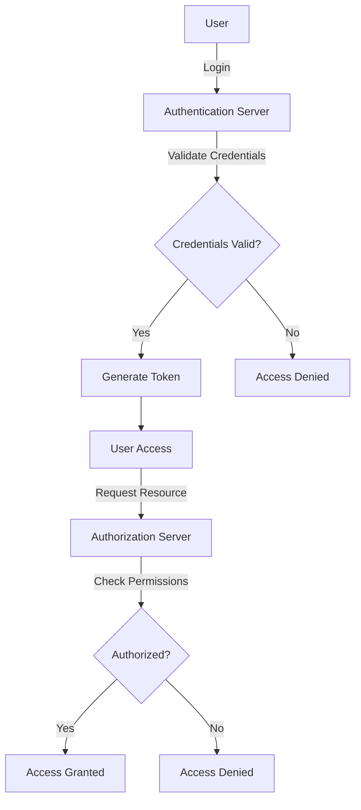

## 13.1 Authentication and Authorization Patterns

In today's digital landscape, securing applications is paramount. Authentication and authorization are critical components of application security, ensuring that users are who they claim to be and have the appropriate permissions to access resources. This article delves into the patterns and practices for implementing robust authentication and authorization mechanisms in Go applications.

### Introduction to Authentication and Authorization

Authentication is the process of verifying the identity of a user or system, while authorization determines what an authenticated user is allowed to do. Together, they form the backbone of application security, protecting sensitive data and ensuring compliance with security standards.

### Implement Robust Authentication

#### Secure Password Storage

Storing passwords securely is crucial to prevent unauthorized access in case of a data breach. Go provides several libraries to facilitate secure password storage:

- **Use Secure Hashing Algorithms:** Employ algorithms like `bcrypt` to hash passwords before storing them. `bcrypt` is designed to be computationally expensive, making brute-force attacks more difficult.

```go
package main

import (
	"fmt"
	"golang.org/x/crypto/bcrypt"
)

func hashPassword(password string) (string, error) {
	bytes, err := bcrypt.GenerateFromPassword([]byte(password), bcrypt.DefaultCost)
	return string(bytes), err
}

func checkPasswordHash(password, hash string) bool {
	err := bcrypt.CompareHashAndPassword([]byte(hash), []byte(password))
	return err == nil
}

func main() {
	password := "mySuperSecretPassword"
	hash, _ := hashPassword(password)

	fmt.Println("Password:", password)
	fmt.Println("Hash:    ", hash)

	match := checkPasswordHash(password, hash)
	fmt.Println("Match:   ", match)
}
```

- **Implement Multi-Factor Authentication (MFA):** Enhance security by requiring additional verification methods, such as SMS codes or authenticator apps, alongside passwords.

#### Multi-Factor Authentication (MFA)

MFA adds an extra layer of security by requiring users to provide two or more verification factors. This can significantly reduce the risk of unauthorized access due to compromised passwords.

- **Time-Based One-Time Passwords (TOTP):** Use libraries like `github.com/pquerna/otp/totp` to generate and verify time-based one-time passwords.

```go
package main

import (
	"fmt"
	"log"
	"time"

	"github.com/pquerna/otp/totp"
)

func main() {
	key, err := totp.Generate(totp.GenerateOpts{
		Issuer:      "ExampleApp",
		AccountName: "user@example.com",
	})
	if err != nil {
		log.Fatal(err)
	}

	fmt.Println("Secret:", key.Secret())

	// Simulate user entering a TOTP code
	code, err := totp.GenerateCode(key.Secret(), time.Now())
	if err != nil {
		log.Fatal(err)
	}

	fmt.Println("Generated Code:", code)

	valid := totp.Validate(code, key.Secret())
	fmt.Println("Code Valid:", valid)
}
```

### Authorization Mechanisms

Authorization ensures that authenticated users have the necessary permissions to access resources. Go applications can implement various authorization mechanisms:

#### Role-Based Access Control (RBAC)

RBAC assigns permissions to roles rather than individual users, simplifying permission management and enhancing security.

- **Define Roles and Permissions:** Create a mapping of roles to permissions and assign roles to users.

```go
type Role string

const (
	Admin Role = "admin"
	User  Role = "user"
)

type Permission string

const (
	Read  Permission = "read"
	Write Permission = "write"
)

var rolePermissions = map[Role][]Permission{
	Admin: {Read, Write},
	User:  {Read},
}

func hasPermission(role Role, permission Permission) bool {
	for _, p := range rolePermissions[role] {
		if p == permission {
			return true
		}
	}
	return false
}
```

#### Access Control Lists (ACLs)

ACLs provide fine-grained access control by specifying which users or roles can access specific resources.

- **Implement ACLs:** Define access rules for resources and check these rules during access requests.

```go
type Resource string

const (
	Document Resource = "document"
)

type ACL struct {
	Resource   Resource
	Permission Permission
	Role       Role
}

var aclList = []ACL{
	{Document, Read, User},
	{Document, Write, Admin},
}

func canAccess(role Role, resource Resource, permission Permission) bool {
	for _, acl := range aclList {
		if acl.Role == role && acl.Resource == resource && acl.Permission == permission {
			return true
		}
	}
	return false
}
```

### Session Management

Session management is crucial for maintaining user state and ensuring secure interactions with the application.

#### Secure Cookies

- **Use Secure Cookies:** Set the `HttpOnly` and `Secure` flags to prevent client-side scripts from accessing cookies and ensure cookies are only sent over HTTPS.

```go
import (
	"net/http"
)

func setSecureCookie(w http.ResponseWriter, name, value string) {
	cookie := &http.Cookie{
		Name:     name,
		Value:    value,
		HttpOnly: true,
		Secure:   true,
	}
	http.SetCookie(w, cookie)
}
```

#### Session Timeouts and Refresh Tokens

- **Implement Session Timeouts:** Automatically log users out after a period of inactivity to reduce the risk of unauthorized access.

- **Use Refresh Tokens:** Implement refresh tokens to extend session duration securely without requiring users to log in again.

### Visual Aids

#### Authentication and Authorization Workflow



### Advantages and Disadvantages

#### Advantages

- **Enhanced Security:** Robust authentication and authorization mechanisms protect against unauthorized access and data breaches.
- **Scalability:** RBAC and ACLs simplify permission management, making it easier to scale applications.
- **User Experience:** MFA and secure session management improve user trust and satisfaction.

#### Disadvantages

- **Complexity:** Implementing comprehensive security measures can increase application complexity.
- **Performance Overhead:** Additional security checks may introduce performance overhead.

### Best Practices

- **Regularly Update Security Libraries:** Keep libraries and dependencies up to date to mitigate vulnerabilities.
- **Conduct Security Audits:** Regularly audit your security mechanisms to identify and address potential weaknesses.
- **Educate Users:** Inform users about security best practices, such as using strong passwords and enabling MFA.

### Conclusion

Implementing robust authentication and authorization patterns in Go is essential for securing applications and protecting sensitive data. By leveraging secure password storage, MFA, RBAC, ACLs, and secure session management, developers can build applications that are both secure and user-friendly. As security threats evolve, it's crucial to stay informed about the latest best practices and continuously improve security measures.

## Quiz Time!



### What is the primary purpose of authentication in application security?

- [x] To verify the identity of a user or system
- [ ] To determine what resources a user can access
- [ ] To encrypt user data
- [ ] To manage user sessions

> **Explanation:** Authentication is the process of verifying the identity of a user or system.

### Which hashing algorithm is recommended for secure password storage in Go?

- [ ] MD5
- [ ] SHA-1
- [x] bcrypt
- [ ] AES

> **Explanation:** `bcrypt` is recommended for secure password storage because it is designed to be computationally expensive, making brute-force attacks more difficult.

### What is the purpose of Multi-Factor Authentication (MFA)?

- [ ] To encrypt user data
- [x] To add an extra layer of security by requiring additional verification factors
- [ ] To manage user sessions
- [ ] To store passwords securely

> **Explanation:** MFA adds an extra layer of security by requiring users to provide two or more verification factors.

### In Role-Based Access Control (RBAC), what is assigned to roles?

- [ ] Users
- [ ] Resources
- [x] Permissions
- [ ] Sessions

> **Explanation:** In RBAC, permissions are assigned to roles, and roles are assigned to users.

### What flag should be set on cookies to prevent client-side scripts from accessing them?

- [ ] Secure
- [x] HttpOnly
- [ ] SameSite
- [ ] Domain

> **Explanation:** The `HttpOnly` flag should be set on cookies to prevent client-side scripts from accessing them.

### What is the advantage of using Access Control Lists (ACLs)?

- [ ] They simplify password storage
- [x] They provide fine-grained access control
- [ ] They enhance session management
- [ ] They encrypt user data

> **Explanation:** ACLs provide fine-grained access control by specifying which users or roles can access specific resources.

### What is a common method for implementing session timeouts?

- [ ] Using secure cookies
- [ ] Encrypting session data
- [x] Automatically logging users out after a period of inactivity
- [ ] Storing sessions in a database

> **Explanation:** Session timeouts are commonly implemented by automatically logging users out after a period of inactivity.

### How can refresh tokens enhance session management?

- [ ] By encrypting session data
- [ ] By storing sessions in a database
- [x] By extending session duration securely without requiring users to log in again
- [ ] By simplifying password storage

> **Explanation:** Refresh tokens enhance session management by allowing sessions to be extended securely without requiring users to log in again.

### What is a disadvantage of implementing comprehensive security measures?

- [ ] Enhanced security
- [ ] Improved user experience
- [x] Increased application complexity
- [ ] Simplified permission management

> **Explanation:** Implementing comprehensive security measures can increase application complexity.

### True or False: Regularly updating security libraries is a best practice for maintaining application security.

- [x] True
- [ ] False

> **Explanation:** Regularly updating security libraries is a best practice to mitigate vulnerabilities and maintain application security.


