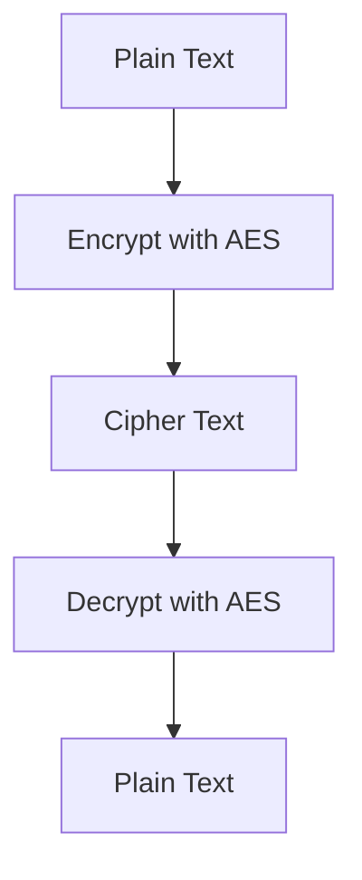
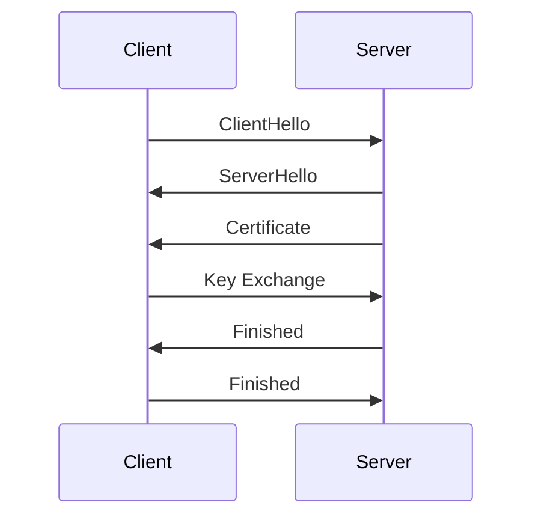

## 13.4 Encryption and Data Protection

In today's digital landscape, protecting sensitive data is paramount. Encryption and data protection are critical components of any secure application. This section will guide you through the essential practices of encrypting sensitive data, managing encryption keys securely, and implementing TLS in Go applications.

### Introduction

Encryption is the process of converting data into a coded format to prevent unauthorized access. In Go, the `crypto` package provides robust tools for implementing encryption. This section will cover how to encrypt data, manage encryption keys, and ensure secure data transmission using TLS.

### Encrypt Sensitive Data

Encrypting sensitive data is crucial to protect it from unauthorized access. In Go, you can use the `crypto/aes` package to encrypt data using the Advanced Encryption Standard (AES), a widely used encryption algorithm.

#### Using `crypto/aes` for Encryption

The `crypto/aes` package in Go provides a straightforward way to implement AES encryption. Here's a basic example of how to encrypt and decrypt data using AES:

```go
package main

import (
	"crypto/aes"
	"crypto/cipher"
	"crypto/rand"
	"encoding/hex"
	"fmt"
	"io"
)

// Encrypt encrypts plain text using AES encryption.
func Encrypt(plainText, key string) (string, error) {
	block, err := aes.NewCipher([]byte(key))
	if err != nil {
		return "", err
	}

	cipherText := make([]byte, aes.BlockSize+len(plainText))
	iv := cipherText[:aes.BlockSize]
	if _, err := io.ReadFull(rand.Reader, iv); err != nil {
		return "", err
	}

	stream := cipher.NewCFBEncrypter(block, iv)
	stream.XORKeyStream(cipherText[aes.BlockSize:], []byte(plainText))

	return hex.EncodeToString(cipherText), nil
}

// Decrypt decrypts cipher text using AES encryption.
func Decrypt(cipherText, key string) (string, error) {
	cipherTextBytes, err := hex.DecodeString(cipherText)
	if err != nil {
		return "", err
	}

	block, err := aes.NewCipher([]byte(key))
	if err != nil {
		return "", err
	}

	if len(cipherTextBytes) < aes.BlockSize {
		return "", fmt.Errorf("ciphertext too short")
	}

	iv := cipherTextBytes[:aes.BlockSize]
	cipherTextBytes = cipherTextBytes[aes.BlockSize:]

	stream := cipher.NewCFBDecrypter(block, iv)
	stream.XORKeyStream(cipherTextBytes, cipherTextBytes)

	return string(cipherTextBytes), nil
}

func main() {
	key := "myverystrongpasswordo32bitlength"
	plainText := "Hello, World!"

	encrypted, err := Encrypt(plainText, key)
	if err != nil {
		fmt.Println("Error encrypting:", err)
		return
	}
	fmt.Println("Encrypted:", encrypted)

	decrypted, err := Decrypt(encrypted, key)
	if err != nil {
		fmt.Println("Error decrypting:", err)
		return
	}
	fmt.Println("Decrypted:", decrypted)
}
```

**Explanation:**
- **Key Management:** The key must be 32 bytes for AES-256 encryption.
- **Initialization Vector (IV):** A unique IV is generated for each encryption operation to ensure security.
- **Cipher Feedback (CFB) Mode:** This mode allows encryption of data in units smaller than the block size.

### Secure Key Management

Managing encryption keys securely is as important as the encryption itself. Poor key management can lead to data breaches even if strong encryption is used.

#### Storing Keys Securely

- **Environment Variables:** Store keys in environment variables to keep them separate from the codebase.
- **Key Vaults:** Use key management services like AWS KMS, Azure Key Vault, or HashiCorp Vault to store and manage keys securely.

#### Key Rotation

Regularly rotating encryption keys reduces the risk of key compromise. Implement automated key rotation policies to enhance security.

### TLS Implementation

Transport Layer Security (TLS) is essential for securing data in transit. It encrypts the data exchanged between clients and servers, preventing eavesdropping and tampering.

#### Using HTTPS with TLS 1.2 or Higher

To implement TLS in Go, use the `crypto/tls` package. Here's an example of setting up a simple HTTPS server:

```go
package main

import (
	"crypto/tls"
	"fmt"
	"log"
	"net/http"
)

func helloHandler(w http.ResponseWriter, r *http.Request) {
	fmt.Fprintf(w, "Hello, Secure World!")
}

func main() {
	mux := http.NewServeMux()
	mux.HandleFunc("/hello", helloHandler)

	server := &http.Server{
		Addr:    ":443",
		Handler: mux,
		TLSConfig: &tls.Config{
			MinVersion: tls.VersionTLS12,
		},
	}

	log.Println("Starting server on https://localhost:443")
	err := server.ListenAndServeTLS("server.crt", "server.key")
	if err != nil {
		log.Fatalf("server failed to start: %v", err)
	}
}
```

**Explanation:**
- **TLS Version:** Ensure the minimum TLS version is 1.2 to protect against vulnerabilities in older versions.
- **Certificates:** Obtain certificates from trusted Certificate Authorities (CAs) to establish trust.

### Visual Aids

#### Encryption Workflow



**Explanation:** This diagram illustrates the encryption and decryption process using AES.

#### TLS Handshake Process



**Explanation:** The TLS handshake establishes a secure connection between the client and server.

### Best Practices

- **Use Strong Encryption Algorithms:** Always use strong encryption algorithms like AES-256.
- **Secure Key Storage:** Never hard-code keys in your application.
- **Regularly Update TLS Configurations:** Keep your TLS configurations up to date to address new vulnerabilities.
- **Monitor and Audit:** Regularly monitor and audit your encryption practices to ensure compliance with security standards.

### Conclusion

Encryption and data protection are vital for safeguarding sensitive information in Go applications. By implementing robust encryption, secure key management, and TLS, you can significantly enhance the security of your applications. Always stay informed about the latest security practices and ensure your implementations adhere to industry standards.

## Quiz Time!



### What is the primary purpose of encryption?

- [x] To convert data into a coded format to prevent unauthorized access
- [ ] To compress data for storage efficiency
- [ ] To enhance data readability
- [ ] To ensure data integrity

> **Explanation:** Encryption is used to convert data into a coded format to prevent unauthorized access.

### Which Go package is commonly used for AES encryption?

- [x] `crypto/aes`
- [ ] `encoding/json`
- [ ] `net/http`
- [ ] `fmt`

> **Explanation:** The `crypto/aes` package is used for AES encryption in Go.

### What is a secure way to store encryption keys?

- [x] Environment variables
- [x] Key vaults
- [ ] Hard-coded in the application
- [ ] In plain text files

> **Explanation:** Environment variables and key vaults are secure ways to store encryption keys.

### Why is key rotation important?

- [x] To reduce the risk of key compromise
- [ ] To improve application performance
- [ ] To increase data redundancy
- [ ] To simplify code maintenance

> **Explanation:** Key rotation reduces the risk of key compromise by regularly updating encryption keys.

### What is the minimum recommended TLS version for secure communications?

- [x] TLS 1.2
- [ ] TLS 1.0
- [ ] SSL 3.0
- [ ] TLS 1.1

> **Explanation:** TLS 1.2 is the minimum recommended version for secure communications.

### What does the `crypto/tls` package in Go provide?

- [x] Tools for implementing TLS in applications
- [ ] Functions for JSON parsing
- [ ] Utilities for file I/O operations
- [ ] Methods for database connections

> **Explanation:** The `crypto/tls` package provides tools for implementing TLS in applications.

### What is the role of a Certificate Authority (CA) in TLS?

- [x] To issue and verify digital certificates
- [ ] To encrypt data
- [ ] To manage encryption keys
- [ ] To compress data

> **Explanation:** A Certificate Authority (CA) issues and verifies digital certificates to establish trust.

### What is the purpose of the TLS handshake?

- [x] To establish a secure connection between client and server
- [ ] To compress data for transmission
- [ ] To authenticate user credentials
- [ ] To encrypt data at rest

> **Explanation:** The TLS handshake establishes a secure connection between the client and server.

### How can you enhance the security of your TLS configurations?

- [x] Regularly update configurations
- [ ] Use older TLS versions
- [ ] Disable encryption
- [ ] Hard-code keys in the application

> **Explanation:** Regularly updating TLS configurations enhances security by addressing new vulnerabilities.

### True or False: Hard-coding encryption keys in your application is a secure practice.

- [ ] True
- [x] False

> **Explanation:** Hard-coding encryption keys in your application is not secure and should be avoided.


