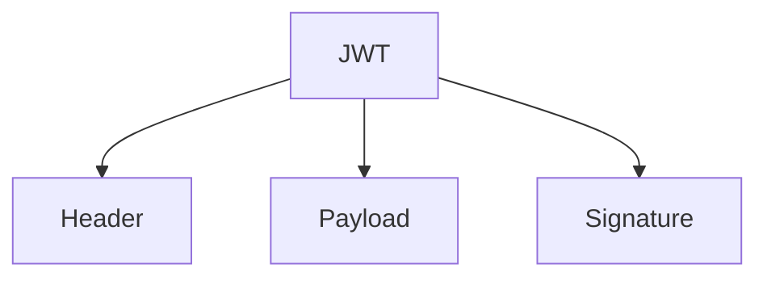

## 13.5 Secure Token Management

In today's digital landscape, secure token management is a critical aspect of application security. Tokens are widely used for authentication and authorization, providing a secure way to transmit user information across systems. This article delves into secure token management in Go, focusing on implementing JSON Web Tokens (JWTs), protecting token storage, and managing token revocation.

### Introduction to Secure Token Management

Secure token management involves generating, storing, and revoking tokens in a way that ensures the security and integrity of user data. Tokens, particularly JWTs, are a popular choice due to their compact size and ease of use across different platforms. However, improper management can lead to vulnerabilities such as token theft or replay attacks.

### Implementing Secure Tokens with JWTs

#### What are JWTs?

JSON Web Tokens (JWTs) are a compact, URL-safe means of representing claims to be transferred between two parties. The claims in a JWT are encoded as a JSON object that is used as the payload of a JSON Web Signature (JWS) structure or as the plaintext of a JSON Web Encryption (JWE) structure, enabling the claims to be digitally signed or integrity protected with a Message Authentication Code (MAC) and/or encrypted.

#### Structure of a JWT

A JWT consists of three parts:

1. **Header**: Contains metadata about the token, such as the type of token and the signing algorithm used.
2. **Payload**: Contains the claims. Claims are statements about an entity (typically, the user) and additional data.
3. **Signature**: Used to verify the authenticity of the token and ensure that the payload hasn't been tampered with.

Here is a diagram illustrating the structure of a JWT:



#### Implementing JWTs in Go

To implement JWTs in Go, you can use the popular `github.com/golang-jwt/jwt/v4` package. Here's a basic example of creating and parsing a JWT:

```go
package main

import (
	"fmt"
	"time"

	"github.com/golang-jwt/jwt/v4"
)

var jwtKey = []byte("my_secret_key")

// Claims defines the structure of the JWT claims
type Claims struct {
	Username string `json:"username"`
	jwt.RegisteredClaims
}

func createToken(username string) (string, error) {
	expirationTime := time.Now().Add(5 * time.Minute)
	claims := &Claims{
		Username: username,
		RegisteredClaims: jwt.RegisteredClaims{
			ExpiresAt: jwt.NewNumericDate(expirationTime),
		},
	}

	token := jwt.NewWithClaims(jwt.SigningMethodHS256, claims)
	tokenString, err := token.SignedString(jwtKey)
	if err != nil {
		return "", err
	}
	return tokenString, nil
}

func parseToken(tokenString string) (*Claims, error) {
	claims := &Claims{}
	token, err := jwt.ParseWithClaims(tokenString, claims, func(token *jwt.Token) (interface{}, error) {
		return jwtKey, nil
	})

	if err != nil {
		return nil, err
	}

	if !token.Valid {
		return nil, fmt.Errorf("invalid token")
	}

	return claims, nil
}

func main() {
	tokenString, err := createToken("user123")
	if err != nil {
		fmt.Println("Error creating token:", err)
		return
	}

	fmt.Println("Generated Token:", tokenString)

	claims, err := parseToken(tokenString)
	if err != nil {
		fmt.Println("Error parsing token:", err)
		return
	}

	fmt.Println("Parsed Claims:", claims.Username)
}
```

### Protecting Token Storage

#### Secure Client-Side Storage

Storing tokens securely on the client side is crucial to prevent unauthorized access. Here are some best practices:

- **Use Secure Storage**: Store tokens in secure storage mechanisms such as `localStorage` or `sessionStorage` in web applications, but be aware of their vulnerabilities. Consider using more secure options like `Secure Enclave` on iOS or `Keychain` on Android.
- **HTTPS**: Always use HTTPS to prevent token interception during transmission.
- **SameSite Cookies**: If storing tokens in cookies, use the `SameSite` attribute to prevent cross-site request forgery (CSRF) attacks.

#### Preventing Token Replay Attacks

Token replay attacks occur when an attacker intercepts a token and reuses it to gain unauthorized access. To prevent this:

- **Use Nonce Values**: Include a unique nonce value in each token to ensure that tokens cannot be reused.
- **Short Expiration Times**: Set short expiration times for tokens to limit the window of opportunity for replay attacks.

### Token Revocation

Token revocation is essential for maintaining security, especially when a token is compromised or a user logs out.

#### Implementing Token Revocation

- **Blacklist Revoked Tokens**: Maintain a server-side blacklist of revoked tokens. Check this list during token validation to ensure the token is still valid.
- **Token Versioning**: Use token versioning to invalidate tokens when a user's permissions change.

Here's a simple example of how you might implement a token blacklist in Go:

```go
package main

import (
	"fmt"
	"sync"
	"time"
)

var blacklist = struct {
	sync.RWMutex
	tokens map[string]time.Time
}{tokens: make(map[string]time.Time)}

func addToBlacklist(token string, expiration time.Time) {
	blacklist.Lock()
	defer blacklist.Unlock()
	blacklist.tokens[token] = expiration
}

func isTokenBlacklisted(token string) bool {
	blacklist.RLock()
	defer blacklist.RUnlock()
	expiration, exists := blacklist.tokens[token]
	if !exists {
		return false
	}
	return time.Now().Before(expiration)
}

func main() {
	token := "exampleToken"
	expiration := time.Now().Add(5 * time.Minute)
	addToBlacklist(token, expiration)

	if isTokenBlacklisted(token) {
		fmt.Println("Token is blacklisted")
	} else {
		fmt.Println("Token is valid")
	}
}
```

### Advantages and Disadvantages

#### Advantages

- **Security**: Proper token management enhances the security of your application by ensuring that only authorized users can access resources.
- **Scalability**: Tokens are stateless and can be easily scaled across distributed systems.
- **Interoperability**: JWTs are widely supported across different platforms and languages.

#### Disadvantages

- **Complexity**: Implementing secure token management requires careful consideration of various security aspects.
- **Storage**: Managing token storage and revocation lists can add overhead to your system.

### Best Practices for Secure Token Management

- **Use Strong Secrets**: Ensure that your signing keys are strong and kept secure.
- **Regularly Rotate Keys**: Regularly rotate your signing keys to minimize the impact of a key compromise.
- **Monitor Token Usage**: Implement logging and monitoring to detect unusual token usage patterns.

### Conclusion

Secure token management is a vital component of modern application security. By implementing JWTs, securing token storage, and managing token revocation effectively, you can protect your application from unauthorized access and potential attacks. Adhering to best practices and staying informed about the latest security developments will help you maintain a robust security posture.

## Quiz Time!



### What is a JWT?

- [x] A compact, URL-safe means of representing claims to be transferred between two parties.
- [ ] A type of database used for storing user credentials.
- [ ] A protocol for secure communication over the internet.
- [ ] A programming language used for web development.

> **Explanation:** A JWT (JSON Web Token) is a compact, URL-safe means of representing claims to be transferred between two parties.

### Which part of a JWT contains the claims?

- [ ] Header
- [x] Payload
- [ ] Signature
- [ ] Footer

> **Explanation:** The payload of a JWT contains the claims, which are statements about an entity and additional data.

### What is the purpose of the signature in a JWT?

- [x] To verify the authenticity of the token and ensure that the payload hasn't been tampered with.
- [ ] To store user credentials securely.
- [ ] To encrypt the payload of the token.
- [ ] To provide a timestamp for the token.

> **Explanation:** The signature in a JWT is used to verify the authenticity of the token and ensure that the payload hasn't been tampered with.

### How can you prevent token replay attacks?

- [x] Use nonce values and set short expiration times for tokens.
- [ ] Store tokens in plain text files.
- [ ] Use long expiration times for tokens.
- [ ] Encrypt tokens using a simple cipher.

> **Explanation:** Using nonce values and setting short expiration times for tokens can help prevent token replay attacks.

### What is a common method for storing tokens securely on the client side?

- [x] Using secure storage mechanisms like `localStorage` or `sessionStorage`.
- [ ] Storing tokens in plain text files.
- [ ] Embedding tokens in HTML comments.
- [ ] Using cookies without the `SameSite` attribute.

> **Explanation:** Secure storage mechanisms like `localStorage` or `sessionStorage` are commonly used for storing tokens securely on the client side.

### What is a token blacklist used for?

- [x] To maintain a list of revoked tokens that should no longer be accepted.
- [ ] To store all valid tokens for quick access.
- [ ] To encrypt tokens before transmission.
- [ ] To log all token usage for auditing purposes.

> **Explanation:** A token blacklist is used to maintain a list of revoked tokens that should no longer be accepted.

### Why is it important to regularly rotate signing keys?

- [x] To minimize the impact of a key compromise.
- [ ] To increase the size of the token payload.
- [ ] To decrease the token expiration time.
- [ ] To simplify the token parsing process.

> **Explanation:** Regularly rotating signing keys helps minimize the impact of a key compromise.

### What is the main advantage of using JWTs in distributed systems?

- [x] They are stateless and can be easily scaled across distributed systems.
- [ ] They require less storage space than other token types.
- [ ] They provide built-in encryption for sensitive data.
- [ ] They automatically handle token expiration and revocation.

> **Explanation:** JWTs are stateless and can be easily scaled across distributed systems, making them advantageous for such environments.

### Which Go package is commonly used for implementing JWTs?

- [x] `github.com/golang-jwt/jwt/v4`
- [ ] `github.com/go-sql-driver/mysql`
- [ ] `github.com/gorilla/mux`
- [ ] `github.com/stretchr/testify`

> **Explanation:** The `github.com/golang-jwt/jwt/v4` package is commonly used for implementing JWTs in Go.

### True or False: Tokens should always be stored in plain text for easy access.

- [ ] True
- [x] False

> **Explanation:** Tokens should not be stored in plain text as it poses a security risk. They should be stored securely using appropriate mechanisms.


