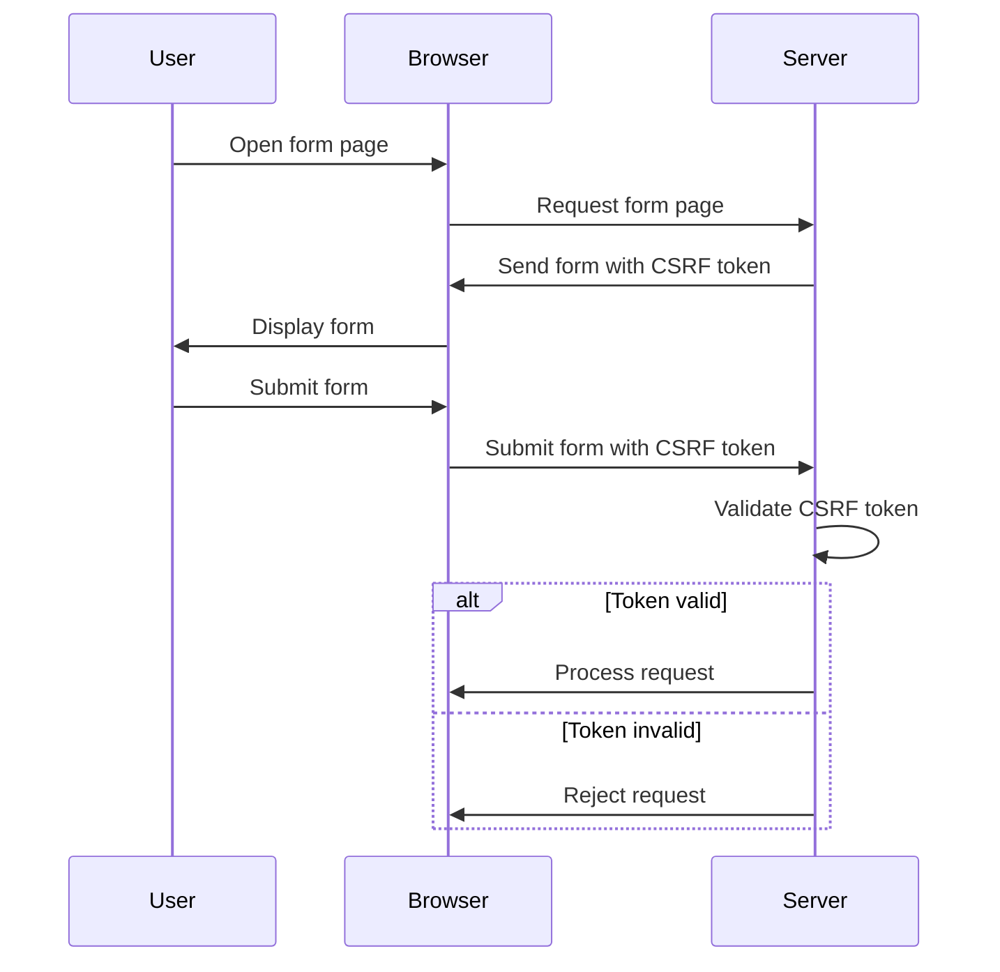

## 13.6 Cross-Site Request Forgery (CSRF) Protection

Cross-Site Request Forgery (CSRF) is a malicious exploit where unauthorized commands are transmitted from a user that the web application trusts. This section explores how to protect Go applications from CSRF attacks by implementing CSRF tokens, utilizing SameSite cookies, and validating origin headers.

### Introduction

CSRF attacks can have severe consequences, such as unauthorized fund transfers, email address changes, or other actions performed on behalf of the user without their consent. To mitigate these risks, developers can employ several strategies to ensure that requests are legitimate and originate from trusted sources.

### Implementing CSRF Tokens

CSRF tokens are unique, secret, and unpredictable values generated by the server and associated with a user's session. They are included in forms and validated upon submission to ensure that the request is genuine.

#### Generating Unique Tokens for User Sessions

To implement CSRF protection using tokens, follow these steps:

1. **Generate a CSRF Token:**
   - Create a unique token for each user session. This token should be unpredictable and securely stored on the server.

2. **Include the Token in Forms:**
   - Embed the CSRF token in each form as a hidden field. This ensures that the token is submitted along with the form data.

3. **Validate the Token on Submission:**
   - Upon form submission, verify that the token matches the one stored on the server. If the tokens do not match, reject the request.

Here's an example of how to implement CSRF tokens in a Go web application:

```go
package main

import (
    "crypto/rand"
    "encoding/base64"
    "net/http"
    "sync"
)

var (
    tokenStore = make(map[string]string)
    mu         sync.Mutex
)

func generateCSRFToken() (string, error) {
    token := make([]byte, 32)
    if _, err := rand.Read(token); err != nil {
        return "", err
    }
    return base64.StdEncoding.EncodeToString(token), nil
}

func setCSRFToken(w http.ResponseWriter, r *http.Request) {
    token, err := generateCSRFToken()
    if err != nil {
        http.Error(w, "Unable to generate CSRF token", http.StatusInternalServerError)
        return
    }
    sessionID := getSessionID(r) // Assume a function to get session ID
    mu.Lock()
    tokenStore[sessionID] = token
    mu.Unlock()
    http.SetCookie(w, &http.Cookie{
        Name:  "csrf_token",
        Value: token,
        Path:  "/",
    })
}

func validateCSRFToken(r *http.Request) bool {
    sessionID := getSessionID(r)
    mu.Lock()
    token, exists := tokenStore[sessionID]
    mu.Unlock()
    if !exists {
        return false
    }
    submittedToken := r.FormValue("csrf_token")
    return token == submittedToken
}
```

### Using SameSite Cookies

The `SameSite` attribute on cookies helps mitigate CSRF attacks by restricting how cookies are sent with cross-site requests. This attribute can be set to `Strict`, `Lax`, or `None`, each providing different levels of protection.

- **Strict:** Cookies are only sent in a first-party context and not with requests initiated by third-party websites.
- **Lax:** Cookies are not sent on normal cross-site subrequests (e.g., loading images), but are sent when a user navigates to the URL from an external site (e.g., following a link).
- **None:** Cookies are sent in all contexts, including cross-origin requests, but the `Secure` attribute must also be set.

#### Setting SameSite Cookies in Go

Here's how you can set cookies with the `SameSite` attribute in a Go web application:

```go
package main

import (
    "net/http"
)

func setSameSiteCookie(w http.ResponseWriter) {
    http.SetCookie(w, &http.Cookie{
        Name:     "session_id",
        Value:    "some_session_value",
        Path:     "/",
        SameSite: http.SameSiteStrictMode,
        Secure:   true, // Ensure cookies are only sent over HTTPS
    })
}
```

### Validating Origin Headers

Another layer of CSRF protection involves validating the `Origin` or `Referer` headers of incoming requests. This ensures that requests originate from trusted domains.

#### Checking Origin Headers

To implement origin header validation, follow these steps:

1. **Extract the Origin Header:**
   - Retrieve the `Origin` or `Referer` header from the incoming request.

2. **Validate the Origin:**
   - Compare the extracted origin with a list of allowed origins. If the origin is not trusted, reject the request.

Here's an example of how to validate origin headers in Go:

```go
package main

import (
    "net/http"
    "strings"
)

var allowedOrigins = []string{"https://trusted.com", "https://anothertrusted.com"}

func validateOrigin(r *http.Request) bool {
    origin := r.Header.Get("Origin")
    for _, allowedOrigin := range allowedOrigins {
        if strings.EqualFold(origin, allowedOrigin) {
            return true
        }
    }
    return false
}

func handler(w http.ResponseWriter, r *http.Request) {
    if !validateOrigin(r) {
        http.Error(w, "Forbidden", http.StatusForbidden)
        return
    }
    // Proceed with request processing
}
```

### Visualizing CSRF Protection Workflow

To better understand the CSRF protection workflow, consider the following diagram:



### Advantages and Disadvantages

#### Advantages

- **Enhanced Security:** CSRF tokens and SameSite cookies provide robust protection against CSRF attacks.
- **User Trust:** Implementing CSRF protection increases user trust by safeguarding their actions.

#### Disadvantages

- **Complexity:** Implementing CSRF protection adds complexity to the application.
- **Maintenance:** Keeping track of tokens and ensuring they are correctly validated can be challenging.

### Best Practices

- **Use HTTPS:** Always use HTTPS to prevent token interception.
- **Rotate Tokens:** Regularly rotate CSRF tokens to enhance security.
- **Educate Users:** Inform users about the importance of CSRF protection and encourage them to report suspicious activity.

### Conclusion

Protecting your Go applications from CSRF attacks is crucial for maintaining security and user trust. By implementing CSRF tokens, utilizing SameSite cookies, and validating origin headers, you can significantly reduce the risk of CSRF attacks.

## Quiz Time!



### What is the primary purpose of a CSRF token?

- [x] To ensure that a request is genuine and originates from the user's session
- [ ] To encrypt user data
- [ ] To authenticate users
- [ ] To log user actions

> **Explanation:** CSRF tokens are used to verify that a request is legitimate and originates from the user's session, preventing unauthorized actions.

### Which SameSite attribute provides the strictest level of CSRF protection?

- [x] Strict
- [ ] Lax
- [ ] None
- [ ] Secure

> **Explanation:** The `Strict` attribute ensures that cookies are only sent in a first-party context, providing the highest level of CSRF protection.

### What should you check to validate the origin of a request?

- [x] Origin or Referer headers
- [ ] User-Agent header
- [ ] Content-Type header
- [ ] Accept header

> **Explanation:** Validating the `Origin` or `Referer` headers helps ensure that requests originate from trusted domains.

### What is a potential disadvantage of implementing CSRF protection?

- [x] Increased complexity
- [ ] Reduced security
- [ ] Slower performance
- [ ] Less user trust

> **Explanation:** Implementing CSRF protection can add complexity to the application, requiring careful management of tokens and validation logic.

### Which of the following is a best practice when using CSRF tokens?

- [x] Rotate tokens regularly
- [ ] Use HTTP instead of HTTPS
- [ ] Store tokens in local storage
- [ ] Ignore token validation for trusted users

> **Explanation:** Regularly rotating CSRF tokens enhances security by reducing the risk of token reuse.

### How can SameSite cookies help prevent CSRF attacks?

- [x] By restricting how cookies are sent with cross-site requests
- [ ] By encrypting cookies
- [ ] By increasing cookie size
- [ ] By storing cookies in local storage

> **Explanation:** SameSite cookies restrict how cookies are sent with cross-site requests, helping to prevent CSRF attacks.

### What is the role of the `Secure` attribute in cookies?

- [x] To ensure cookies are only sent over HTTPS
- [ ] To encrypt cookie data
- [ ] To increase cookie size
- [ ] To allow cross-site cookie usage

> **Explanation:** The `Secure` attribute ensures that cookies are only sent over HTTPS, protecting them from interception.

### Why is HTTPS important for CSRF protection?

- [x] It prevents token interception
- [ ] It encrypts user data
- [ ] It authenticates users
- [ ] It logs user actions

> **Explanation:** HTTPS prevents token interception by encrypting data in transit, ensuring that CSRF tokens are not exposed to attackers.

### What is a CSRF attack?

- [x] An attack where unauthorized commands are transmitted from a user that the web application trusts
- [ ] An attack that encrypts user data
- [ ] An attack that logs user actions
- [ ] An attack that authenticates users

> **Explanation:** A CSRF attack involves unauthorized commands being transmitted from a user that the web application trusts, often without the user's knowledge.

### True or False: CSRF tokens should be stored in local storage for security.

- [ ] True
- [x] False

> **Explanation:** CSRF tokens should not be stored in local storage as it can be accessed by malicious scripts. They should be stored securely on the server.


