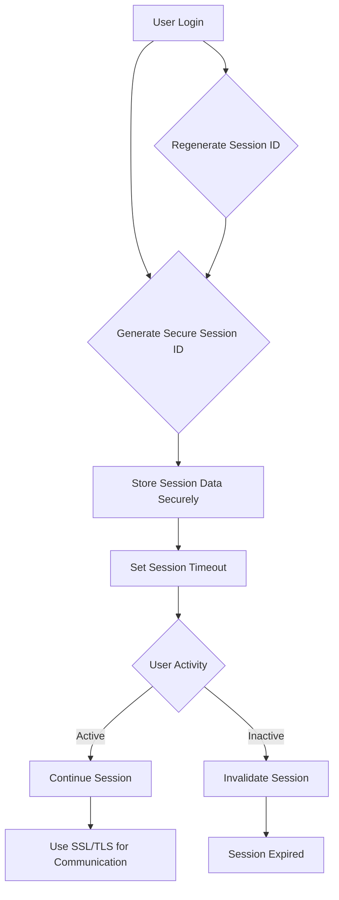

## 13.7 Secure Session Management

In the realm of web development, managing user sessions securely is paramount to safeguarding sensitive data and maintaining user trust. Secure session management involves a set of practices aimed at protecting session data from unauthorized access and ensuring that sessions are handled efficiently and safely. This article delves into the best practices for secure session management in Go, focusing on generating secure session IDs, session expiration, and preventing session hijacking.

### Session Security

#### Generating Secure Session IDs

A session ID is a unique identifier assigned to a user session. It is crucial to generate session IDs using strong random functions to prevent attackers from predicting or guessing them. In Go, you can utilize the `crypto/rand` package to generate cryptographically secure random numbers.

Here's an example of generating a secure session ID in Go:

```go
package main

import (
	"crypto/rand"
	"encoding/base64"
	"fmt"
	"log"
)

func generateSessionID() (string, error) {
	b := make([]byte, 32) // 32 bytes for a 256-bit session ID
	if _, err := rand.Read(b); err != nil {
		return "", err
	}
	return base64.URLEncoding.EncodeToString(b), nil
}

func main() {
	sessionID, err := generateSessionID()
	if err != nil {
		log.Fatalf("Failed to generate session ID: %v", err)
	}
	fmt.Println("Generated Secure Session ID:", sessionID)
}
```

In this example, `rand.Read` fills a byte slice with random data, and `base64.URLEncoding.EncodeToString` converts it to a URL-safe string, suitable for use as a session ID.

#### Storing Session Data Securely

Session data should be stored securely on the server side to prevent unauthorized access. Common approaches include using in-memory stores like Redis or Memcached, or databases with encryption at rest. Ensure that session data is not stored in client-side cookies, as this exposes it to potential tampering.

### Session Expiration

#### Setting Session Timeouts

Session timeouts are essential for limiting the lifetime of a session, reducing the risk of session hijacking. Implement session expiration by setting a timeout period after which the session becomes invalid.

```go
package main

import (
	"time"
)

type Session struct {
	ID        string
	ExpiresAt time.Time
}

func isSessionExpired(session Session) bool {
	return time.Now().After(session.ExpiresAt)
}

func main() {
	session := Session{
		ID:        "exampleSessionID",
		ExpiresAt: time.Now().Add(30 * time.Minute), // Session expires in 30 minutes
	}

	if isSessionExpired(session) {
		fmt.Println("Session has expired.")
	} else {
		fmt.Println("Session is still valid.")
	}
}
```

In this example, a session is set to expire 30 minutes after its creation. The `isSessionExpired` function checks if the current time is past the session's expiration time.

#### Invalidating Sessions

Sessions should be invalidated upon user logout or after a period of inactivity. This can be achieved by removing the session data from the server store or marking it as invalid.

### Prevent Session Hijacking

#### Regenerating Session IDs

To prevent session fixation attacks, regenerate the session ID after a user logs in or when their privileges change. This ensures that any previously captured session ID is rendered useless.

```go
func regenerateSessionID(oldSessionID string) (string, error) {
	newSessionID, err := generateSessionID()
	if err != nil {
		return "", err
	}
	// Update session store with new session ID
	// Remove old session ID from store
	return newSessionID, nil
}
```

#### Using SSL/TLS

Encrypting session data in transit is crucial for preventing session hijacking through network sniffing. Always use SSL/TLS to secure communication between the client and server.

### Visualizing Secure Session Management

Below is a conceptual diagram illustrating the secure session management workflow:



### Advantages and Disadvantages

#### Advantages

- **Enhanced Security:** Secure session management significantly reduces the risk of session hijacking and fixation attacks.
- **User Trust:** Proper session handling increases user confidence in the security of your application.
- **Compliance:** Adhering to secure session management practices helps meet regulatory requirements for data protection.

#### Disadvantages

- **Complexity:** Implementing secure session management can add complexity to your application.
- **Performance Overhead:** Additional security measures may introduce performance overhead, particularly with frequent session ID regeneration and encryption.

### Best Practices

- Use strong random functions for generating session IDs.
- Store session data securely on the server side.
- Implement session timeouts and invalidate sessions upon logout or inactivity.
- Regenerate session IDs after login and use SSL/TLS for secure communication.

### Conclusion

Secure session management is a critical aspect of web application security. By following best practices such as generating secure session IDs, setting session timeouts, and preventing session hijacking, you can protect your application and its users from common security threats. Implementing these practices in Go is straightforward, thanks to its robust standard library and third-party tools.

## Quiz Time!



### What is the primary purpose of generating secure session IDs?

- [x] To prevent attackers from predicting or guessing session IDs
- [ ] To make session IDs easier to remember
- [ ] To increase the length of session IDs
- [ ] To ensure session IDs are unique across different applications

> **Explanation:** Secure session IDs are generated to prevent attackers from predicting or guessing them, thereby enhancing security.

### Which Go package is commonly used to generate cryptographically secure random numbers for session IDs?

- [x] `crypto/rand`
- [ ] `math/rand`
- [ ] `encoding/base64`
- [ ] `crypto/sha256`

> **Explanation:** The `crypto/rand` package is used for generating cryptographically secure random numbers in Go.

### What is a common method for storing session data securely on the server side?

- [x] Using in-memory stores like Redis or Memcached
- [ ] Storing in client-side cookies
- [ ] Writing to a text file
- [ ] Embedding in HTML

> **Explanation:** In-memory stores like Redis or Memcached are commonly used to store session data securely on the server side.

### Why is it important to set session timeouts?

- [x] To limit the lifetime of a session and reduce the risk of session hijacking
- [ ] To make sessions last indefinitely
- [ ] To increase server load
- [ ] To allow users to stay logged in permanently

> **Explanation:** Session timeouts limit the lifetime of a session, reducing the risk of session hijacking.

### What should be done to a session upon user logout?

- [x] Invalidate the session
- [ ] Extend the session timeout
- [ ] Regenerate the session ID
- [ ] Encrypt the session data

> **Explanation:** Upon user logout, the session should be invalidated to prevent unauthorized access.

### How can session fixation attacks be prevented?

- [x] By regenerating the session ID after login
- [ ] By storing session data in cookies
- [ ] By using short session IDs
- [ ] By disabling session timeouts

> **Explanation:** Regenerating the session ID after login prevents session fixation attacks.

### What is the role of SSL/TLS in session management?

- [x] To encrypt session data in transit
- [ ] To generate session IDs
- [ ] To store session data
- [ ] To increase session timeout

> **Explanation:** SSL/TLS encrypts session data in transit, preventing session hijacking through network sniffing.

### What is a potential disadvantage of secure session management?

- [x] It can add complexity to the application
- [ ] It makes session IDs predictable
- [ ] It reduces user trust
- [ ] It violates data protection regulations

> **Explanation:** Implementing secure session management can add complexity to the application.

### Which of the following is a best practice for secure session management?

- [x] Use strong random functions for generating session IDs
- [ ] Store session data in client-side cookies
- [ ] Disable session timeouts
- [ ] Avoid using SSL/TLS

> **Explanation:** Using strong random functions for generating session IDs is a best practice for secure session management.

### True or False: Secure session management is only necessary for applications handling financial data.

- [ ] True
- [x] False

> **Explanation:** Secure session management is necessary for all applications that handle sensitive data, not just those dealing with financial information.


