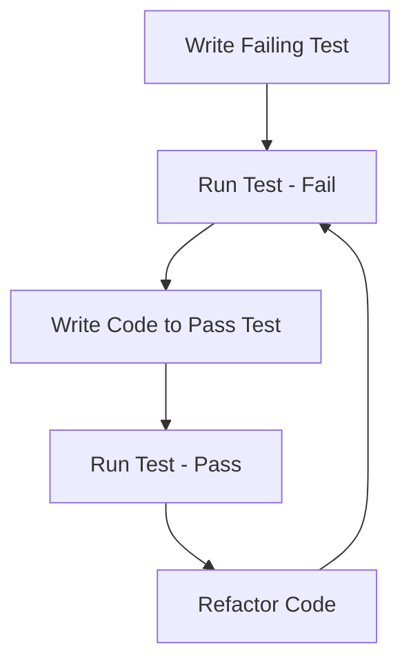

## 14.1 Test-Driven Development (TDD)

Test-Driven Development (TDD) is a software development approach that emphasizes writing tests before writing the actual code. This methodology helps ensure that the code meets its requirements and promotes cleaner, more maintainable code. In this section, we'll explore how TDD can be effectively applied in Go, a language known for its simplicity and efficiency.

### Introduction to TDD

TDD is a cycle of writing a test, writing the minimum amount of code to pass the test, and then refactoring the code while keeping the tests passing. This cycle is often referred to as "Red-Green-Refactor."

- **Red:** Write a test that fails because the feature isn't implemented yet.
- **Green:** Write the simplest code to make the test pass.
- **Refactor:** Improve the code's structure and readability without changing its behavior, ensuring all tests still pass.

### Writing Tests First

The core principle of TDD is to write tests before writing the corresponding code. This approach helps developers focus on the requirements and design of the feature.

#### Begin Each Feature by Writing a Failing Test

Starting with a failing test ensures that the test is meaningful and that the code is necessary. It helps clarify the feature's requirements and provides a clear goal for implementation.

```go
package calculator

import "testing"

func TestAdd(t *testing.T) {
    result := Add(2, 3)
    expected := 5
    if result != expected {
        t.Errorf("expected '%d' but got '%d'", expected, result)
    }
}
```

In this example, we start by writing a test for an `Add` function that doesn't exist yet. The test will fail, prompting us to implement the function.

#### Focus Tests on Specific Functionality

Each test should focus on a specific piece of functionality, ensuring that it is both necessary and sufficient. This granularity helps in identifying the exact cause of a failure when a test doesn't pass.

### Iterative Development

Once a failing test is in place, the next step is to write just enough code to pass the test. This iterative process helps in building the feature incrementally.

#### Implement Code to Pass the Tests

After writing the failing test, implement the simplest code that will make the test pass.

```go
func Add(a, b int) int {
    return a + b
}
```

With the `Add` function implemented, the test should now pass, moving us from the "Red" phase to the "Green" phase.

#### Refactor Code While Keeping Tests Passing

Refactoring is an essential part of TDD. It involves cleaning up the code, improving its structure, and removing any duplication, all while ensuring that the tests continue to pass.

```go
// Refactored code might involve more complex logic or optimizations
func Add(a, b int) int {
    // Example of a more complex implementation
    return a + b
}
```

The goal of refactoring is to enhance code quality without altering its behavior. The tests act as a safety net, ensuring that changes don't introduce new bugs.

### Maintain Test Coverage

Test coverage is a measure of how much of your code is exercised by your tests. High test coverage is crucial for ensuring that your code is reliable and that all critical paths are tested.

#### Ensure All Critical Paths Are Tested

It's important to write tests that cover all possible execution paths, including edge cases and error conditions.

```go
func TestAddNegativeNumbers(t *testing.T) {
    result := Add(-2, -3)
    expected := -5
    if result != expected {
        t.Errorf("expected '%d' but got '%d'", expected, result)
    }
}
```

By testing negative numbers, we ensure that the `Add` function handles all integer inputs correctly.

#### Use Tools Like `go test` with Coverage Flags

Go provides built-in tools to measure test coverage. Using the `go test` command with coverage flags can help identify untested parts of your code.

```bash
go test -coverprofile=coverage.out
go tool cover -html=coverage.out
```

These commands generate a coverage report that can be viewed in a web browser, highlighting which parts of the code are covered by tests.

### Visualizing the TDD Workflow

To better understand the TDD process, let's visualize the Red-Green-Refactor cycle:



This diagram illustrates the iterative nature of TDD, emphasizing continuous testing and refactoring.

### Advantages and Disadvantages of TDD

#### Advantages

- **Improved Code Quality:** TDD encourages writing clean, maintainable code.
- **Early Bug Detection:** Writing tests first helps catch bugs early in the development process.
- **Better Design:** Focusing on tests helps clarify requirements and improve design.
- **Documentation:** Tests serve as documentation for the code's expected behavior.

#### Disadvantages

- **Initial Overhead:** Writing tests first can slow down initial development.
- **Learning Curve:** Developers new to TDD may find the approach challenging.
- **Maintenance:** Tests need to be maintained alongside the code, which can increase workload.

### Best Practices for TDD in Go

- **Keep Tests Simple:** Write clear and concise tests that are easy to understand.
- **Test Behavior, Not Implementation:** Focus on what the code should do, not how it does it.
- **Use Mocks and Stubs:** Isolate the unit under test by mocking dependencies.
- **Automate Testing:** Use continuous integration tools to automate test execution.

### Conclusion

Test-Driven Development is a powerful methodology that can lead to more reliable and maintainable code. By writing tests first, developers can ensure that their code meets its requirements and is free from defects. While TDD requires discipline and practice, the benefits it offers make it a valuable approach for Go developers.

## Quiz Time!



### What is the first step in the TDD cycle?

- [x] Write a failing test
- [ ] Write the code to pass the test
- [ ] Refactor the code
- [ ] Deploy the code

> **Explanation:** The TDD cycle begins with writing a failing test to define the desired functionality.

### What does the "Green" phase in TDD involve?

- [ ] Writing a failing test
- [x] Writing code to pass the test
- [ ] Refactoring the code
- [ ] Removing tests

> **Explanation:** The "Green" phase involves writing the simplest code to make the test pass.

### Why is refactoring important in TDD?

- [x] To improve code structure and readability
- [ ] To add more features
- [ ] To remove tests
- [ ] To deploy the code

> **Explanation:** Refactoring improves the code's structure and readability while ensuring tests still pass.

### Which Go tool is used to measure test coverage?

- [ ] go build
- [ ] go run
- [x] go test
- [ ] go fmt

> **Explanation:** The `go test` command with coverage flags is used to measure test coverage.

### What is a key advantage of TDD?

- [x] Improved code quality
- [ ] Faster initial development
- [ ] Less documentation
- [ ] No need for refactoring

> **Explanation:** TDD leads to improved code quality by encouraging clean, maintainable code.

### What should tests focus on in TDD?

- [x] Specific functionality
- [ ] Implementation details
- [ ] Unrelated features
- [ ] Code formatting

> **Explanation:** Tests should focus on specific functionality to ensure the code meets its requirements.

### What is a disadvantage of TDD?

- [ ] Improved code quality
- [x] Initial overhead
- [ ] Early bug detection
- [ ] Better design

> **Explanation:** TDD can have an initial overhead as writing tests first may slow down development.

### How can you automate testing in Go?

- [ ] By writing more code
- [x] Using continuous integration tools
- [ ] By skipping tests
- [ ] By refactoring code

> **Explanation:** Continuous integration tools can automate test execution, ensuring tests are run consistently.

### What is the purpose of using mocks and stubs in TDD?

- [x] To isolate the unit under test
- [ ] To increase test coverage
- [ ] To write more tests
- [ ] To deploy the code

> **Explanation:** Mocks and stubs help isolate the unit under test by simulating dependencies.

### TDD helps in early bug detection. True or False?

- [x] True
- [ ] False

> **Explanation:** TDD helps catch bugs early in the development process by writing tests before code.


