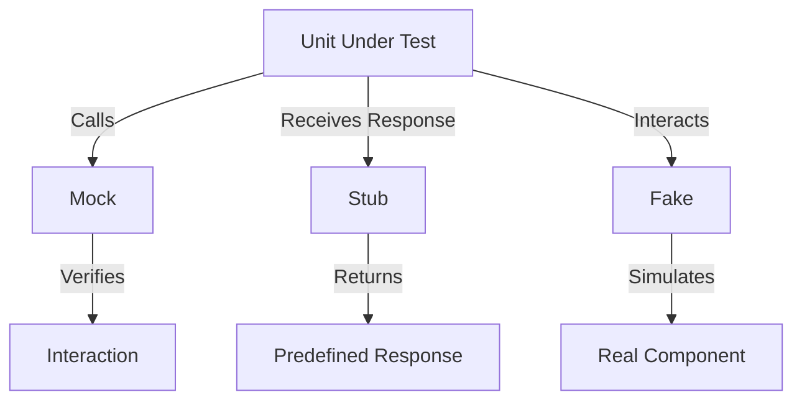

## 14.3 Mocks, Stubs, and Fakes

In the realm of software testing, especially in Go, the use of mocks, stubs, and fakes is crucial for isolating components, simulating external dependencies, and verifying interactions. These techniques enable developers to test their code in controlled environments, ensuring that each unit functions correctly in isolation. This article delves into the distinctions between mocks, stubs, and fakes, their implementation in Go, and best practices for their use.

### Introduction

Testing is an integral part of software development, ensuring that code behaves as expected. However, testing in isolation can be challenging when components depend on external systems or complex interactions. This is where mocks, stubs, and fakes come into play, allowing developers to simulate parts of the system and focus on the unit under test.

### Detailed Explanation

#### Mocks

Mocks are objects that simulate the behavior of real objects. They are primarily used to verify interactions between components, ensuring that functions call dependencies with the correct parameters and expected frequency.

- **Purpose:** Mocks are used to assert that certain interactions occur, such as method calls with specific arguments.
- **Implementation:** In Go, mocks can be generated using libraries like `gomock` or `mockery`, which create mock implementations based on interfaces.

#### Stubs

Stubs are simplified implementations of interfaces or methods that return predefined responses. They are used to provide controlled responses to method calls, allowing the test to focus on the behavior of the unit under test.

- **Purpose:** Stubs are used to provide fixed responses to method calls, regardless of input.
- **Implementation:** Stubs can be manually coded or generated, depending on the complexity of the interface.

#### Fakes

Fakes are more sophisticated than stubs, providing a working implementation that mimics the behavior of a real component. They are useful for testing complex interactions without relying on external systems.

- **Purpose:** Fakes are used to simulate real components with more complexity than stubs, often maintaining state or performing logic.
- **Implementation:** Fakes are typically hand-coded to ensure they mimic the real component's behavior accurately.

### Visual Aids

To better understand the differences and applications of mocks, stubs, and fakes, consider the following conceptual diagram:



### Incorporate Up-to-Date Code Examples

Let's explore how to implement mocks, stubs, and fakes in Go with practical examples.

#### Using Mocks with `gomock`

`gomock` is a popular library for generating mocks in Go. It allows you to create mock implementations of interfaces and verify interactions.

```go
package main

import (
    "testing"
    "github.com/golang/mock/gomock"
    "example.com/mocks"
)

// Example interface to be mocked
type Database interface {
    GetUser(id string) (User, error)
}

// Test function using gomock
func TestGetUser(t *testing.T) {
    ctrl := gomock.NewController(t)
    defer ctrl.Finish()

    mockDB := mocks.NewMockDatabase(ctrl)
    mockDB.EXPECT().GetUser("123").Return(User{Name: "John Doe"}, nil)

    user, err := mockDB.GetUser("123")
    if err != nil {
        t.Fatalf("expected no error, got %v", err)
    }
    if user.Name != "John Doe" {
        t.Fatalf("expected user name to be John Doe, got %s", user.Name)
    }
}
```

#### Creating Stubs

Stubs can be manually created by implementing the required interface methods to return predefined responses.

```go
package main

type StubDatabase struct{}

func (s *StubDatabase) GetUser(id string) (User, error) {
    return User{Name: "Jane Doe"}, nil
}

// Usage in tests
func TestGetUserWithStub(t *testing.T) {
    db := &StubDatabase{}
    user, err := db.GetUser("123")
    if err != nil {
        t.Fatalf("expected no error, got %v", err)
    }
    if user.Name != "Jane Doe" {
        t.Fatalf("expected user name to be Jane Doe, got %s", user.Name)
    }
}
```

#### Implementing Fakes

Fakes are more complex and often require maintaining state or logic to mimic real components.

```go
package main

type FakeDatabase struct {
    users map[string]User
}

func (f *FakeDatabase) GetUser(id string) (User, error) {
    if user, exists := f.users[id]; exists {
        return user, nil
    }
    return User{}, fmt.Errorf("user not found")
}

// Usage in tests
func TestGetUserWithFake(t *testing.T) {
    db := &FakeDatabase{
        users: map[string]User{"123": {Name: "Alice"}},
    }
    user, err := db.GetUser("123")
    if err != nil {
        t.Fatalf("expected no error, got %v", err)
    }
    if user.Name != "Alice" {
        t.Fatalf("expected user name to be Alice, got %s", user.Name)
    }
}
```

### Use Cases

- **Mocks:** Ideal for verifying interactions and ensuring that functions call dependencies correctly.
- **Stubs:** Useful for providing fixed responses to method calls, simplifying the testing of specific scenarios.
- **Fakes:** Suitable for testing complex interactions without relying on real components, especially when state or logic is involved.

### Advantages and Disadvantages

#### Advantages

- **Isolation:** Allows testing of components in isolation, reducing dependencies on external systems.
- **Control:** Provides control over the responses and interactions, making tests more predictable.
- **Speed:** Tests run faster as they do not rely on real components or external systems.

#### Disadvantages

- **Maintenance:** Mocks, stubs, and fakes require maintenance as interfaces and components evolve.
- **Complexity:** Fakes can become complex if they need to mimic intricate behaviors or maintain state.
- **False Positives:** Over-reliance on mocks can lead to tests that pass even when the real system would fail.

### Best Practices

- **Use Mocks for Interactions:** Employ mocks to verify that functions interact with dependencies correctly.
- **Keep Stubs Simple:** Use stubs for straightforward scenarios where fixed responses suffice.
- **Design Fakes Carefully:** Ensure fakes accurately mimic real components without unnecessary complexity.
- **Automate Mock Generation:** Use tools like `gomock` or `mockery` to automate the creation of mocks, reducing manual effort.

### Comparisons

- **Mocks vs. Stubs:** Mocks are used for interaction verification, while stubs provide predefined responses.
- **Stubs vs. Fakes:** Stubs are simpler and return fixed responses, whereas fakes simulate more complex behaviors.

### Conclusion

Mocks, stubs, and fakes are powerful tools in the Go testing arsenal, enabling developers to isolate components, simulate dependencies, and verify interactions. By understanding their differences and applications, developers can write more effective and reliable tests, ensuring that their code behaves as expected in isolation.

## Quiz Time!



### What is the primary purpose of mocks in testing?

- [x] To verify interactions between components
- [ ] To provide predefined responses
- [ ] To simulate real components
- [ ] To maintain state

> **Explanation:** Mocks are primarily used to verify that functions call dependencies with the correct parameters and expected frequency.

### Which Go library is commonly used to generate mocks?

- [x] gomock
- [ ] testify
- [ ] ginkgo
- [ ] go-kit

> **Explanation:** `gomock` is a popular library for generating mocks in Go.

### What is a stub used for in testing?

- [ ] To verify interactions
- [x] To provide fixed responses to method calls
- [ ] To simulate real components
- [ ] To maintain state

> **Explanation:** Stubs are used to provide fixed responses to method calls, regardless of input.

### How do fakes differ from stubs?

- [x] Fakes simulate real components with more complexity
- [ ] Fakes provide fixed responses
- [ ] Fakes verify interactions
- [ ] Fakes are generated automatically

> **Explanation:** Fakes are more sophisticated than stubs, providing a working implementation that mimics the behavior of a real component.

### What is a disadvantage of using mocks?

- [ ] They are difficult to implement
- [x] They require maintenance as interfaces evolve
- [ ] They cannot verify interactions
- [ ] They are slower than real components

> **Explanation:** Mocks require maintenance as interfaces and components evolve, which can be a disadvantage.

### Which tool can automate the creation of mocks in Go?

- [x] mockery
- [ ] testify
- [ ] ginkgo
- [ ] go-kit

> **Explanation:** `mockery` is a tool that can automate the creation of mocks in Go.

### When should you use fakes in testing?

- [ ] When verifying interactions
- [ ] When providing fixed responses
- [x] When simulating complex behaviors
- [ ] When testing performance

> **Explanation:** Fakes are suitable for testing complex interactions without relying on real components, especially when state or logic is involved.

### What is a key advantage of using stubs?

- [x] They simplify testing by providing fixed responses
- [ ] They verify interactions
- [ ] They simulate real components
- [ ] They maintain state

> **Explanation:** Stubs simplify testing by providing fixed responses to method calls.

### Which of the following is a disadvantage of using fakes?

- [x] They can become complex if they need to mimic intricate behaviors
- [ ] They cannot verify interactions
- [ ] They are slower than real components
- [ ] They require external dependencies

> **Explanation:** Fakes can become complex if they need to mimic intricate behaviors or maintain state.

### True or False: Mocks are used to simulate real components with more complexity than stubs.

- [ ] True
- [x] False

> **Explanation:** This statement is false. Fakes, not mocks, are used to simulate real components with more complexity than stubs.


