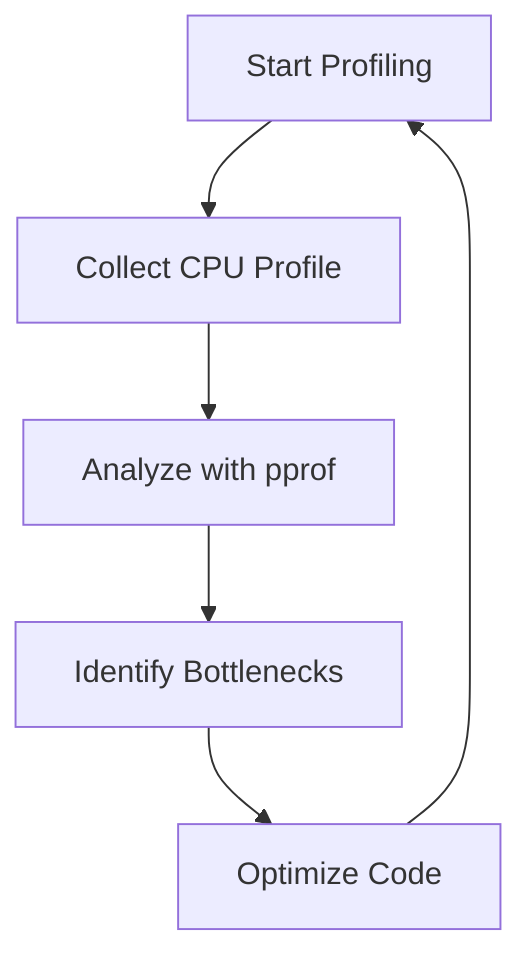

## 14.5 Benchmarking and Profiling

In the realm of software development, performance is a critical aspect that can significantly impact user experience and system efficiency. Go, with its robust standard library, provides powerful tools for benchmarking and profiling, enabling developers to measure and optimize the performance of their applications. This section delves into the techniques and best practices for benchmarking and profiling in Go, guiding you through writing benchmark tests, using the `pprof` tool for profiling, and optimizing performance based on insights gained.

### Introduction to Benchmarking and Profiling

Benchmarking and profiling are essential techniques in performance optimization. Benchmarking involves measuring the performance of code to identify areas that need improvement, while profiling provides detailed insights into the runtime behavior of an application, highlighting bottlenecks and resource usage.

### Writing Benchmark Tests in Go

Go's `testing` package not only supports unit testing but also provides a framework for writing benchmark tests. These tests help evaluate the performance of functions by measuring the time taken to execute them repeatedly.

#### Creating Benchmark Functions

Benchmark functions in Go must start with the word `Benchmark` and accept a single parameter of type `*testing.B`. Here's a simple example:

```go
package main

import (
    "testing"
)

// Function to benchmark
func Sum(a, b int) int {
    return a + b
}

// Benchmark function
func BenchmarkSum(b *testing.B) {
    for i := 0; i < b.N; i++ {
        Sum(1, 2)
    }
}
```

In this example, the `BenchmarkSum` function measures the performance of the `Sum` function. The `b.N` variable represents the number of iterations the benchmark should run, which is automatically determined by the Go testing framework to provide stable results.

#### Running Benchmark Tests

To run benchmark tests, use the `go test` command with the `-bench` flag:

```bash
go test -bench=.
```

This command runs all benchmark functions in the package and outputs their performance metrics.

### Profiling Applications with `pprof`

Profiling provides a deeper understanding of how an application utilizes CPU and memory resources. Go's `pprof` package is a powerful tool for collecting and analyzing profiles.

#### Collecting CPU and Memory Profiles

To profile an application, you need to import the `net/http/pprof` package and start an HTTP server. Here's an example:

```go
package main

import (
    "net/http"
    _ "net/http/pprof"
)

func main() {
    go func() {
        http.ListenAndServe("localhost:6060", nil)
    }()
    // Your application logic here
}
```

With this setup, you can collect CPU and memory profiles by visiting `http://localhost:6060/debug/pprof/` in your browser or using the `go tool pprof` command.

#### Analyzing Profiles

Once profiles are collected, use the `go tool pprof` command to analyze them:

```bash
go tool pprof http://localhost:6060/debug/pprof/profile
```

This command opens an interactive shell where you can explore the profile data, identify bottlenecks, and visualize the call graph.



### Optimizing Performance

Optimization is an iterative process that involves profiling, identifying bottlenecks, and refining code. Focus on optimizing critical parts of the code that have the most significant impact on performance.

#### Strategies for Optimization

1. **Algorithmic Improvements:** Optimize algorithms to reduce complexity.
2. **Efficient Data Structures:** Use appropriate data structures for better performance.
3. **Concurrency:** Leverage Go's concurrency features to parallelize tasks.
4. **Memory Management:** Minimize memory allocations and deallocations.

### Best Practices for Benchmarking and Profiling

- **Isolate Benchmarks:** Ensure benchmarks are not affected by external factors.
- **Use Realistic Data:** Test with data that closely resembles production scenarios.
- **Iterate:** Continuously profile and optimize as the application evolves.
- **Automate:** Integrate benchmarking and profiling into the CI/CD pipeline for ongoing performance monitoring.

### Conclusion

Benchmarking and profiling are invaluable tools in the Go developer's toolkit, enabling the identification and resolution of performance bottlenecks. By writing effective benchmark tests and utilizing `pprof` for profiling, developers can ensure their applications run efficiently and meet performance expectations.

## Quiz Time!



### What is the primary purpose of benchmarking in Go?

- [x] To measure the performance of code
- [ ] To find syntax errors in code
- [ ] To test the functionality of code
- [ ] To compile the code

> **Explanation:** Benchmarking is used to measure the performance of code, helping identify areas for optimization.

### Which Go package is used for writing benchmark tests?

- [x] testing
- [ ] fmt
- [ ] net/http
- [ ] pprof

> **Explanation:** The `testing` package in Go provides the framework for writing both unit tests and benchmark tests.

### How do you run benchmark tests in Go?

- [x] go test -bench=.
- [ ] go run benchmark
- [ ] go build -bench
- [ ] go benchmark run

> **Explanation:** The `go test -bench=.` command runs all benchmark functions in the package.

### What does the `b.N` variable represent in a benchmark function?

- [x] The number of iterations for the benchmark
- [ ] The number of test cases
- [ ] The number of errors found
- [ ] The number of goroutines

> **Explanation:** `b.N` represents the number of iterations the benchmark should run, determined by the Go testing framework.

### Which tool is used for profiling applications in Go?

- [x] pprof
- [ ] fmt
- [ ] ioutil
- [ ] reflect

> **Explanation:** The `pprof` tool is used for profiling applications, providing insights into CPU and memory usage.

### How can you collect CPU profiles in a Go application?

- [x] By importing `net/http/pprof` and starting an HTTP server
- [ ] By using the `fmt` package
- [ ] By running `go build`
- [ ] By using the `os` package

> **Explanation:** Importing `net/http/pprof` and starting an HTTP server allows you to collect CPU profiles.

### What is the purpose of the `go tool pprof` command?

- [x] To analyze profile data
- [ ] To compile Go code
- [ ] To run unit tests
- [ ] To format Go code

> **Explanation:** The `go tool pprof` command is used to analyze profile data and identify performance bottlenecks.

### Which of the following is a strategy for optimizing performance in Go?

- [x] Algorithmic improvements
- [ ] Increasing code complexity
- [ ] Ignoring memory usage
- [ ] Disabling concurrency

> **Explanation:** Algorithmic improvements are a key strategy for optimizing performance by reducing complexity.

### What should you focus on when optimizing performance?

- [x] Critical parts of the code
- [ ] All parts of the code equally
- [ ] Only the user interface
- [ ] Non-critical parts of the code

> **Explanation:** Focus on optimizing critical parts of the code that have the most significant impact on performance.

### True or False: Profiling should be done continuously as the application evolves.

- [x] True
- [ ] False

> **Explanation:** Profiling should be an ongoing process to ensure performance remains optimal as the application changes.


