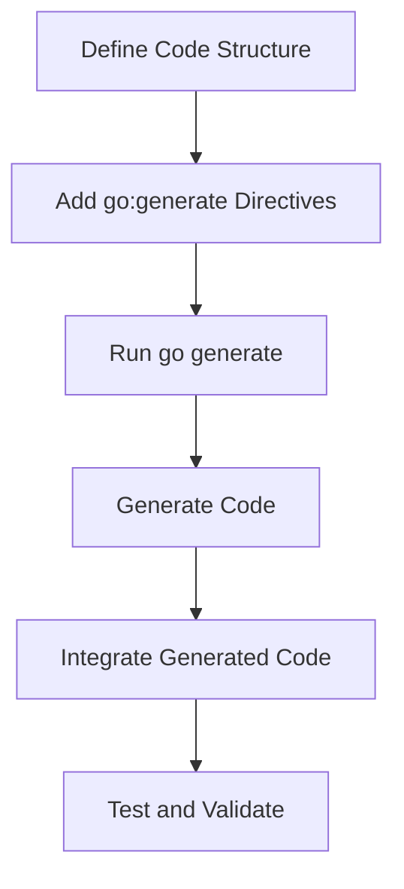

## 15.3 Code Generation Tools

In the world of software development, automation is key to increasing productivity and reducing human error. Code generation tools in Go offer powerful capabilities to automate repetitive tasks, enforce consistency, and streamline the development process. In this section, we will explore some of the most effective code generation tools available in Go, including `go generate`, string generators, and mock generators. These tools not only enhance your workflow but also ensure that your codebase remains maintainable and scalable.

### Introduction to Code Generation in Go

Code generation involves creating code automatically based on specific templates or rules. In Go, this process is facilitated by several tools that integrate seamlessly into the development environment. These tools help developers automate mundane tasks, such as generating boilerplate code, implementing interfaces, or creating mock objects for testing.

### `go generate`

`go generate` is a powerful command in Go that automates the execution of code generation tasks. It allows developers to include directives within their code comments, specifying commands to be run when `go generate` is executed. This feature is particularly useful for tasks that need to be repeated across different parts of a codebase.

#### How `go generate` Works

`go generate` scans the source files for special comments that specify commands to be executed. These comments typically start with `//go:generate`, followed by the command to run. This approach allows developers to keep their codebase clean and organized while automating repetitive tasks.

Here's an example of how `go generate` can be used:

```go
//go:generate stringer -type=Pill
package main

import "fmt"

// Pill represents a type of medication.
type Pill int

const (
    Aspirin Pill = iota
    Ibuprofen
    Paracetamol
)

func main() {
    fmt.Println(Aspirin)
}
```

In this example, the `stringer` tool is used to generate a `String()` method for the `Pill` type, which will allow the constants to be printed as strings.

#### Benefits of Using `go generate`

- **Automation:** Automates repetitive tasks, reducing the likelihood of human error.
- **Consistency:** Ensures consistent code generation across the codebase.
- **Maintainability:** Keeps the codebase clean by separating code generation logic from the main code.

### String Generators

String generators, such as `stringer`, are tools that automatically generate `String()` methods for types in Go. This is particularly useful for enumerations, where you want to print the name of the constant rather than its numeric value.

#### Using `stringer`

The `stringer` tool is part of the Go tools suite and can be used to generate `String()` methods for types that have a set of constants defined. This makes it easier to debug and log information about these types.

Here's how you can use `stringer`:

1. Define a type with constants:

```go
//go:generate stringer -type=Day
package main

// Day represents a day of the week.
type Day int

const (
    Sunday Day = iota
    Monday
    Tuesday
    Wednesday
    Thursday
    Friday
    Saturday
)
```

2. Run `go generate` to generate the `String()` method:

```bash
go generate
```

3. Use the generated `String()` method:

```go
func main() {
    fmt.Println(Monday) // Output: Monday
}
```

#### Advantages of String Generators

- **Readability:** Improves the readability of logs and error messages by printing meaningful names instead of numeric values.
- **Efficiency:** Saves time by automating the generation of `String()` methods for enumerations.

### Mock Generators

Mock generators are essential tools for testing in Go. They automatically generate mock implementations of interfaces, allowing developers to test their code in isolation without relying on real implementations.

#### Popular Mock Generators

- **gomock:** A widely used mocking framework that integrates with `go generate` to create mock implementations.
- **mockery:** Another popular tool that generates mock objects from Go interfaces.

#### Using `gomock`

`gomock` is a powerful mocking framework that works seamlessly with Go's testing tools. It allows developers to create mock implementations of interfaces, making it easier to test components in isolation.

Here's a step-by-step guide to using `gomock`:

1. Install `gomock` and `mockgen`:

```bash
go install github.com/golang/mock/mockgen@latest
```

2. Define an interface to be mocked:

```go
package main

// Database is an interface representing a database.
type Database interface {
    GetUser(id int) (string, error)
}
```

3. Use `mockgen` to generate the mock implementation:

```bash
//go:generate mockgen -destination=mocks/mock_database.go -package=mocks . Database
```

4. Run `go generate` to create the mock:

```bash
go generate
```

5. Use the generated mock in your tests:

```go
package main

import (
    "testing"
    "github.com/golang/mock/gomock"
    "mocks"
)

func TestGetUser(t *testing.T) {
    ctrl := gomock.NewController(t)
    defer ctrl.Finish()

    mockDB := mocks.NewMockDatabase(ctrl)
    mockDB.EXPECT().GetUser(1).Return("John Doe", nil)

    // Use mockDB in your tests
}
```

#### Benefits of Mock Generators

- **Isolation:** Allows testing of components in isolation by providing mock implementations.
- **Flexibility:** Easily configure mock behavior to test different scenarios.
- **Efficiency:** Reduces the effort required to write and maintain mock implementations manually.

### Visualizing Code Generation Workflow

To better understand how these tools fit into the development workflow, let's visualize the process using a Mermaid.js diagram:



### Use Cases for Code Generation Tools

- **Large Codebases:** Automate repetitive tasks to maintain consistency and reduce errors.
- **Testing:** Generate mocks to facilitate unit testing and ensure code reliability.
- **Enumerations:** Simplify the process of printing and logging enumeration values.

### Advantages and Disadvantages

#### Advantages

- **Time-Saving:** Automates repetitive tasks, freeing up developer time for more complex work.
- **Consistency:** Ensures uniformity across the codebase, reducing the risk of errors.
- **Scalability:** Facilitates the management of large codebases by automating routine tasks.

#### Disadvantages

- **Complexity:** May introduce complexity if not used judiciously, especially in smaller projects.
- **Overhead:** Requires initial setup and understanding of the tools.

### Best Practices for Code Generation

- **Use Judiciously:** Apply code generation tools where they provide clear benefits, avoiding unnecessary complexity.
- **Keep Directives Organized:** Clearly document and organize `go:generate` directives to maintain readability.
- **Regularly Update Tools:** Ensure that code generation tools are kept up-to-date to leverage new features and improvements.

### Conclusion

Code generation tools in Go offer a powerful way to automate and streamline the development process. By leveraging tools like `go generate`, string generators, and mock generators, developers can enhance productivity, maintain consistency, and ensure the scalability of their codebases. As with any tool, it's important to use them judiciously and keep them updated to maximize their benefits.

## Quiz Time!



### What is the primary purpose of `go generate` in Go?

- [x] To automate code generation tasks within the codebase.
- [ ] To compile Go programs.
- [ ] To run tests.
- [ ] To manage dependencies.

> **Explanation:** `go generate` is used to automate code generation tasks by executing commands specified in code comments.

### How does `stringer` improve code readability?

- [x] By generating `String()` methods for types, making enumeration values human-readable.
- [ ] By compiling code faster.
- [ ] By reducing memory usage.
- [ ] By simplifying error handling.

> **Explanation:** `stringer` generates `String()` methods for types, allowing enumeration values to be printed as human-readable strings.

### Which tool is commonly used for generating mock implementations in Go?

- [x] gomock
- [ ] gofmt
- [ ] godoc
- [ ] goimports

> **Explanation:** `gomock` is a popular tool for generating mock implementations of interfaces in Go.

### What is a key benefit of using mock generators in testing?

- [x] They allow testing of components in isolation by providing mock implementations.
- [ ] They increase code execution speed.
- [ ] They reduce the size of the codebase.
- [ ] They simplify the deployment process.

> **Explanation:** Mock generators provide mock implementations, enabling testing of components in isolation.

### Which command is used to install `mockgen`?

- [x] go install github.com/golang/mock/mockgen@latest
- [ ] go get github.com/golang/mock/mockgen
- [ ] go build github.com/golang/mock/mockgen
- [ ] go run github.com/golang/mock/mockgen

> **Explanation:** The `go install` command is used to install `mockgen` from the specified repository.

### What is a potential disadvantage of using code generation tools?

- [x] They may introduce complexity if not used judiciously.
- [ ] They always decrease code readability.
- [ ] They increase the risk of runtime errors.
- [ ] They make codebases unmaintainable.

> **Explanation:** Code generation tools can introduce complexity if not used appropriately, especially in smaller projects.

### How can `go generate` directives be included in a Go file?

- [x] By adding comments starting with `//go:generate` followed by the command.
- [ ] By writing the command in the main function.
- [ ] By using a separate configuration file.
- [ ] By including them in the package declaration.

> **Explanation:** `go generate` directives are included as comments starting with `//go:generate` in the Go file.

### What is the output of running `go generate` with `stringer` on an enumeration type?

- [x] A generated `String()` method for the enumeration type.
- [ ] A compiled binary of the program.
- [ ] A list of all Go files in the directory.
- [ ] A report of code coverage.

> **Explanation:** Running `go generate` with `stringer` generates a `String()` method for the enumeration type.

### What is a common use case for code generation tools in large codebases?

- [x] Automating repetitive tasks to maintain consistency and reduce errors.
- [ ] Compiling code faster.
- [ ] Reducing the number of dependencies.
- [ ] Simplifying user interfaces.

> **Explanation:** In large codebases, code generation tools automate repetitive tasks, ensuring consistency and reducing errors.

### True or False: Code generation tools can only be used in Go projects.

- [ ] True
- [x] False

> **Explanation:** Code generation tools are not limited to Go projects; they can be used in various programming languages to automate code generation tasks.


