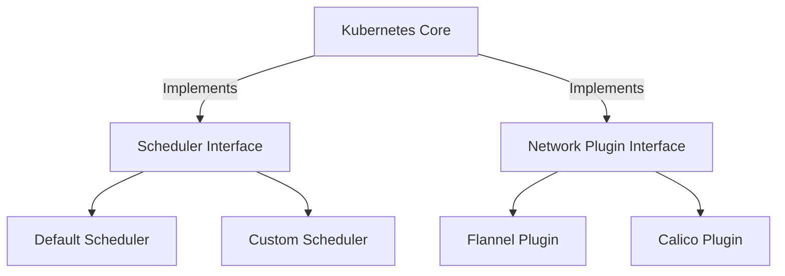
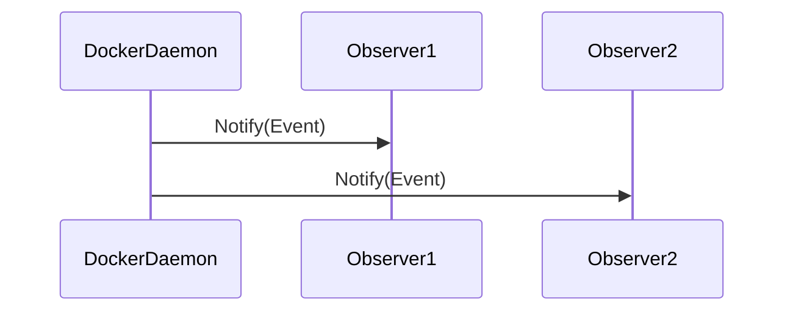
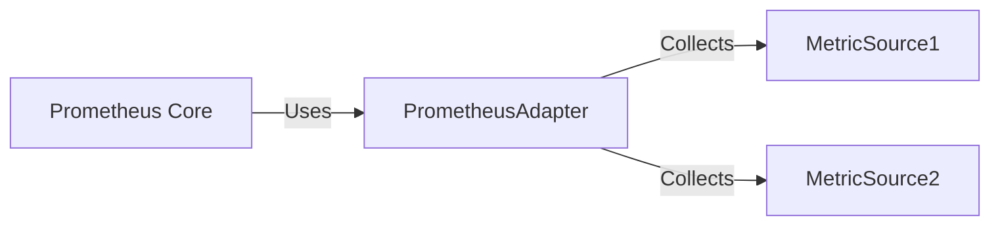

## 16.1 Open Source Projects in Go

Open-source projects often serve as a rich source of practical insights into the application of design patterns. In this section, we will delve into three prominent Go-based open-source projects: Kubernetes, Docker, and Prometheus. Each of these projects demonstrates the effective use of design patterns to solve complex problems, enhance scalability, and maintain modularity.

### Kubernetes: Design Patterns in Container Orchestration

Kubernetes, a leading container orchestration platform, is a prime example of how design patterns can be leveraged to manage complex distributed systems. Let's explore some of the key patterns used in Kubernetes.

#### Extensibility Through Interfaces and Plugins

Kubernetes is designed to be highly extensible, allowing developers to customize and extend its functionality. This is achieved through the use of interfaces and plugins.

- **Interface-Based Design:** Kubernetes uses Go interfaces extensively to define contracts for various components, such as schedulers and controllers. This allows different implementations to be swapped in and out without altering the core system.

```go
type Scheduler interface {
    Schedule(pod *v1.Pod) (*v1.Node, error)
}
```

- **Plugins:** The plugin pattern is used to extend Kubernetes' capabilities. For example, the network plugins allow different networking solutions to be integrated seamlessly.

```go
type NetworkPlugin interface {
    Init() error
    Name() string
    SetUpPod(namespace string, name string, id kubecontainer.ContainerID) error
}
```

#### Architectural Diagram

Below is a simplified architectural diagram illustrating how Kubernetes uses interfaces and plugins to achieve extensibility.



### Docker: Modularity and Encapsulation

Docker revolutionized the software industry by introducing containerization. Its architecture is a testament to the power of modularity and encapsulation.

#### Modularity and Encapsulation

Docker's architecture is modular, with each component responsible for a specific functionality. This modularity is achieved through encapsulation, where each module has a well-defined interface.

- **Encapsulation:** Docker encapsulates the complexities of container management within modules like the Docker Engine, Docker CLI, and Docker Daemon.

```go
type Container struct {
    ID     string
    Image  string
    Status string
    // Other fields...
}

func (c *Container) Start() error {
    // Start the container
}
```

#### Observer Pattern for Event Handling

Docker uses the observer pattern to handle events such as container start, stop, and restart. This pattern allows Docker to notify multiple components about changes in container states.

- **Observer Pattern:** Docker's event system notifies subscribers about changes, allowing them to react accordingly.

```go
type Event struct {
    Type    string
    Message string
}

type Observer interface {
    Notify(event Event)
}

type ContainerManager struct {
    observers []Observer
}

func (cm *ContainerManager) AddObserver(o Observer) {
    cm.observers = append(cm.observers, o)
}

func (cm *ContainerManager) NotifyObservers(event Event) {
    for _, observer := range cm.observers {
        observer.Notify(event)
    }
}
```

#### Workflow Diagram

The following diagram illustrates how Docker uses the observer pattern for event handling.



### Prometheus: Adapter Pattern and Custom Expression Languages

Prometheus is a powerful monitoring and alerting toolkit. It employs several design patterns to efficiently collect and process metrics.

#### Adapter Pattern for Data Collection

Prometheus uses the adapter pattern to collect metrics from various sources. This pattern allows Prometheus to interface with different systems without altering its core logic.

- **Adapter Pattern:** By using adapters, Prometheus can collect data from different sources in a uniform manner.

```go
type MetricSource interface {
    Collect() ([]Metric, error)
}

type PrometheusAdapter struct {
    source MetricSource
}

func (pa *PrometheusAdapter) CollectMetrics() ([]Metric, error) {
    return pa.source.Collect()
}
```

#### Custom Expression Languages and Parsers

Prometheus features a powerful query language called PromQL, which allows users to query time-series data. The implementation of PromQL involves custom parsers and interpreters.

- **Custom Parsers:** Prometheus uses custom parsers to interpret PromQL queries, enabling complex data analysis.

```go
type Parser struct {
    input string
}

func (p *Parser) Parse() (Query, error) {
    // Parse the input string into a Query
}
```

#### Data Flow Diagram

The diagram below shows how Prometheus uses the adapter pattern for data collection.



### Conclusion

The use of design patterns in open-source projects like Kubernetes, Docker, and Prometheus demonstrates their effectiveness in solving complex architectural challenges. By leveraging patterns such as interfaces, plugins, observer, and adapter, these projects achieve scalability, modularity, and efficient data handling. Understanding these implementations provides valuable insights into building robust and maintainable software systems.

## Quiz Time!



### Which design pattern is extensively used in Kubernetes to achieve extensibility?

- [x] Interface-Based Design
- [ ] Singleton Pattern
- [ ] Factory Method
- [ ] Prototype Pattern

> **Explanation:** Kubernetes uses interfaces to define contracts, allowing different implementations to be swapped in and out without altering the core system.


### What pattern does Docker use for handling events like container start and stop?

- [ ] Factory Method
- [x] Observer Pattern
- [ ] Strategy Pattern
- [ ] Adapter Pattern

> **Explanation:** Docker uses the observer pattern to notify multiple components about changes in container states.


### How does Prometheus collect metrics from various sources?

- [ ] Using the Singleton Pattern
- [ ] Through Factory Methods
- [x] By employing the Adapter Pattern
- [ ] Using the Proxy Pattern

> **Explanation:** Prometheus uses the adapter pattern to interface with different systems for data collection.


### What is the primary benefit of using the observer pattern in Docker?

- [ ] It reduces memory usage.
- [x] It allows multiple components to be notified of events.
- [ ] It simplifies code structure.
- [ ] It enhances security.

> **Explanation:** The observer pattern allows Docker to notify multiple components about changes in container states.


### Which of the following is a feature of Prometheus' query language, PromQL?

- [x] Custom parsers and interpreters
- [ ] Built-in caching
- [ ] Automatic scaling
- [ ] Dependency injection

> **Explanation:** Prometheus uses custom parsers to interpret PromQL queries, enabling complex data analysis.


### What is the role of plugins in Kubernetes?

- [ ] To manage memory allocation
- [x] To extend Kubernetes' capabilities
- [ ] To enforce security policies
- [ ] To handle network traffic

> **Explanation:** Plugins in Kubernetes allow for the extension of its capabilities, such as integrating different networking solutions.


### Which design pattern helps Prometheus interface with different systems for data collection?

- [ ] Singleton Pattern
- [x] Adapter Pattern
- [ ] Observer Pattern
- [ ] Strategy Pattern

> **Explanation:** The adapter pattern allows Prometheus to collect data from various sources in a uniform manner.


### In Docker, what is encapsulated within modules like the Docker Engine and Docker CLI?

- [x] Complexities of container management
- [ ] User interface design
- [ ] Network protocols
- [ ] Security policies

> **Explanation:** Docker encapsulates the complexities of container management within its modules.


### What is the primary purpose of using interfaces in Kubernetes?

- [ ] To enhance security
- [ ] To reduce code size
- [x] To define contracts for various components
- [ ] To improve performance

> **Explanation:** Interfaces in Kubernetes define contracts for components, allowing for extensibility and flexibility.


### True or False: Prometheus uses the observer pattern for data collection.

- [ ] True
- [x] False

> **Explanation:** Prometheus uses the adapter pattern, not the observer pattern, for data collection.


