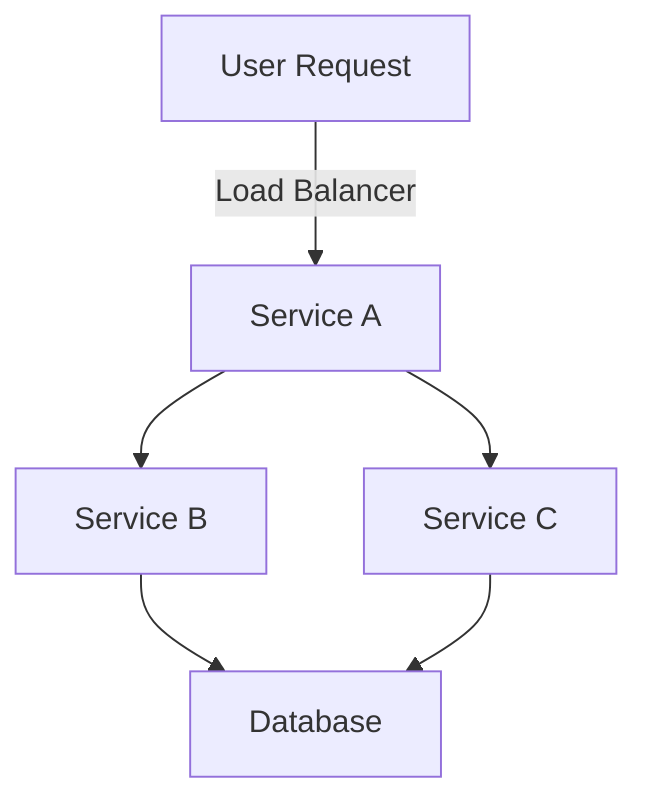
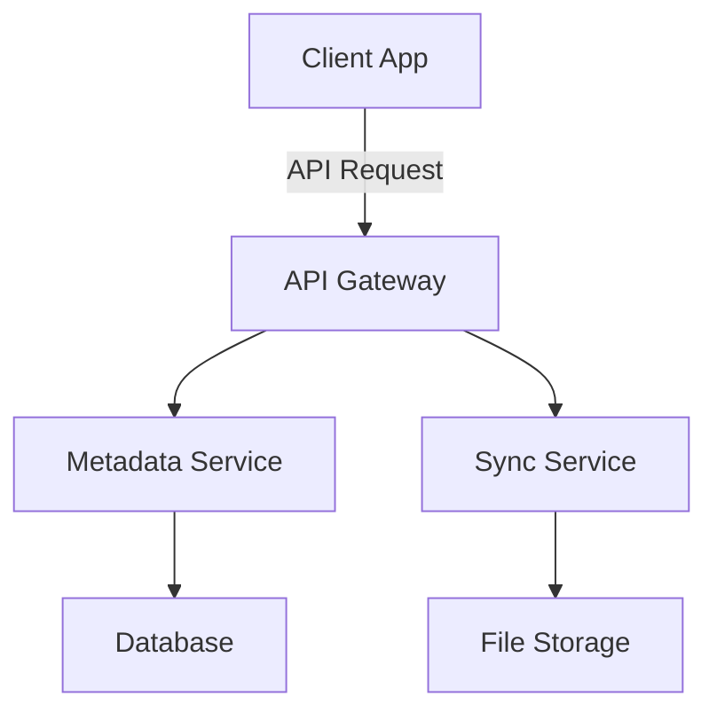
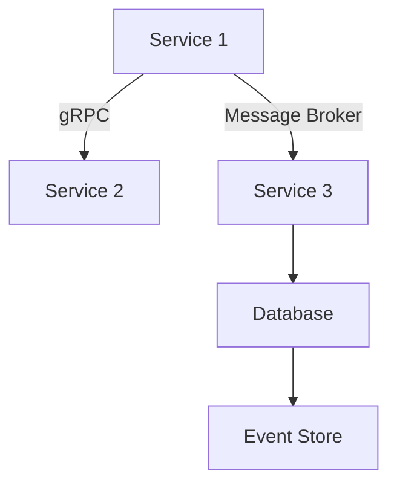

## 16.2 Enterprise Applications in Go

In recent years, Go has emerged as a powerful language for building enterprise applications, particularly in environments requiring high performance, scalability, and reliability. This section delves into how leading companies like Uber and Dropbox have harnessed Go's capabilities to develop robust enterprise solutions. We will explore their architectural decisions, scaling strategies, and the implementation of microservices, providing insights into how Go can be effectively utilized in large-scale applications.

### Case Studies

#### Uber: Real-Time, Scalable Systems

Uber, a global leader in ride-sharing and logistics, has been a pioneer in adopting Go for its backend services. The company faced challenges in scaling its infrastructure to handle millions of rides and requests per day across the globe. Here's how Uber leveraged Go to address these challenges:

##### Architectural Decisions

- **Microservices Architecture:** Uber transitioned from a monolithic architecture to microservices to improve scalability and maintainability. Go's simplicity and performance made it an ideal choice for developing these microservices.
  
- **Concurrency with Goroutines:** Uber extensively uses Go's lightweight goroutines to handle concurrent requests efficiently. This allows them to manage thousands of simultaneous connections without significant overhead.

- **gRPC for Communication:** Uber employs gRPC, a high-performance RPC framework, for service-to-service communication. Go's native support for gRPC facilitates efficient and reliable communication between microservices.

##### Scaling Strategies

- **Load Balancing:** Uber uses sophisticated load balancing techniques to distribute traffic evenly across its services. Go's performance characteristics help in handling high loads with minimal latency.

- **Service Discovery:** Uber implements service discovery mechanisms to dynamically locate services within its architecture. This ensures that requests are routed to the appropriate service instances, enhancing reliability and fault tolerance.

- **Data Consistency Models:** Uber employs eventual consistency models in certain services to ensure data availability and partition tolerance, crucial for a globally distributed system.

> **Explanation:** This diagram illustrates a simplified view of Uber's microservices architecture, highlighting the flow of user requests through load balancers to various services and databases.

#### Dropbox: Efficient File Storage and Synchronization

Dropbox, a leading cloud storage provider, has also adopted Go for several of its backend services. The need for efficient file storage, synchronization, and data processing led Dropbox to explore Go's capabilities.

##### Architectural Decisions

- **High-Performance Data Processing:** Dropbox utilizes Go for building high-performance data processing pipelines. Go's efficient memory management and concurrency model are key to processing large volumes of data quickly.

- **Service-Oriented Architecture (SOA):** Dropbox employs a service-oriented architecture, where Go services handle specific tasks such as file metadata management, synchronization, and sharing.

- **RESTful APIs:** Dropbox's APIs are built using Go, providing a robust and scalable interface for client applications to interact with Dropbox services.

##### Scaling Strategies

- **Horizontal Scaling:** Dropbox scales its services horizontally by adding more instances to handle increased load. Go's stateless nature in service design simplifies this scaling approach.

- **Caching Mechanisms:** To reduce latency and improve performance, Dropbox implements caching strategies using Go. This involves caching frequently accessed data in memory to minimize database hits.

- **Data Consistency and Replication:** Dropbox ensures data consistency and availability through replication strategies. Go's performance allows for efficient data replication across multiple data centers.

> **Explanation:** This diagram depicts Dropbox's service-oriented architecture, showing how client applications interact with various services through an API gateway.

### Microservices Architecture in Production

The adoption of microservices architecture has been a game-changer for enterprises looking to build scalable and maintainable applications. Let's analyze how Go facilitates the implementation of microservices in production environments.

#### Service Communication

- **gRPC and Protobuf:** Go's support for gRPC and Protocol Buffers (Protobuf) enables efficient and type-safe communication between microservices. This is particularly beneficial for high-performance applications requiring low-latency communication.

- **Message Brokers:** Many enterprises use message brokers like Kafka or RabbitMQ for asynchronous communication between services. Go's libraries provide robust support for integrating with these brokers, ensuring reliable message delivery.

#### Data Consistency Models

- **Eventual Consistency:** In distributed systems, achieving strong consistency can be challenging. Go's performance characteristics make it suitable for implementing eventual consistency models, where data is eventually consistent across all nodes.

- **CQRS and Event Sourcing:** Go is often used to implement Command Query Responsibility Segregation (CQRS) and event sourcing patterns. These patterns help in separating read and write operations and maintaining a history of changes, respectively.

> **Explanation:** This diagram illustrates a microservices architecture with gRPC communication and message broker integration, highlighting data consistency models.

### Advantages and Disadvantages

#### Advantages

- **Scalability:** Go's lightweight concurrency model and efficient memory management make it ideal for building scalable applications.
- **Performance:** Go's compiled nature and efficient execution model ensure high performance, crucial for enterprise applications.
- **Maintainability:** The simplicity and readability of Go code enhance maintainability, especially in large codebases.

#### Disadvantages

- **Learning Curve:** Developers new to Go may face a learning curve, particularly with its concurrency model and idiomatic practices.
- **Ecosystem Maturity:** While Go's ecosystem is growing, it may not be as mature as other languages for certain enterprise needs.

### Best Practices

- **Adopt Microservices Wisely:** Ensure that the decision to use microservices aligns with the application's needs and complexity.
- **Leverage Go's Concurrency:** Utilize goroutines and channels effectively to handle concurrent operations.
- **Focus on API Design:** Design APIs with scalability and maintainability in mind, using REST or gRPC as appropriate.
- **Implement Robust Monitoring:** Use monitoring tools to track service performance and detect issues early.

### Conclusion

Go has proven to be a powerful language for building enterprise applications, offering a balance of performance, scalability, and simplicity. By examining case studies from companies like Uber and Dropbox, we gain valuable insights into how Go can be leveraged to build robust, scalable systems. As enterprises continue to adopt microservices and other modern architectural patterns, Go's role in the software development landscape is set to grow even further.

## Quiz Time!



### Which company is known for using Go to handle millions of rides and requests per day?

- [x] Uber
- [ ] Dropbox
- [ ] Google
- [ ] Facebook

> **Explanation:** Uber uses Go for its backend services to manage the high volume of rides and requests globally.

### What architectural style did Uber transition to for better scalability?

- [x] Microservices
- [ ] Monolithic
- [ ] Serverless
- [ ] Event-Driven

> **Explanation:** Uber transitioned to a microservices architecture to improve scalability and maintainability.

### Which communication framework does Uber use for service-to-service communication?

- [x] gRPC
- [ ] REST
- [ ] SOAP
- [ ] GraphQL

> **Explanation:** Uber employs gRPC for efficient and reliable service-to-service communication.

### What is a key feature of Go that Dropbox utilizes for high-performance data processing?

- [x] Efficient memory management
- [ ] Dynamic typing
- [ ] Extensive libraries
- [ ] Built-in GUI support

> **Explanation:** Go's efficient memory management and concurrency model are crucial for high-performance data processing.

### How does Dropbox scale its services to handle increased load?

- [x] Horizontal Scaling
- [ ] Vertical Scaling
- [ ] Manual Scaling
- [ ] No Scaling

> **Explanation:** Dropbox scales its services horizontally by adding more instances to handle increased load.

### Which pattern is often implemented in Go to separate read and write operations?

- [x] CQRS
- [ ] Singleton
- [ ] Factory
- [ ] Observer

> **Explanation:** CQRS (Command Query Responsibility Segregation) is used to separate read and write operations.

### What is a common challenge when adopting microservices architecture?

- [x] Service Communication
- [ ] Code Reusability
- [ ] Single Point of Failure
- [ ] Lack of Modularity

> **Explanation:** Service communication is a common challenge in microservices architecture, requiring efficient protocols.

### Which Go feature is leveraged for handling concurrent requests efficiently?

- [x] Goroutines
- [ ] Interfaces
- [ ] Reflection
- [ ] Channels

> **Explanation:** Goroutines are lightweight threads in Go used for handling concurrent requests efficiently.

### What is a disadvantage of using Go for enterprise applications?

- [x] Learning Curve
- [ ] Poor Performance
- [ ] Lack of Concurrency Support
- [ ] High Memory Usage

> **Explanation:** Developers new to Go may face a learning curve, especially with its concurrency model.

### True or False: Go's ecosystem is as mature as other languages for all enterprise needs.

- [ ] True
- [x] False

> **Explanation:** While Go's ecosystem is growing, it may not be as mature as other languages for certain enterprise needs.


