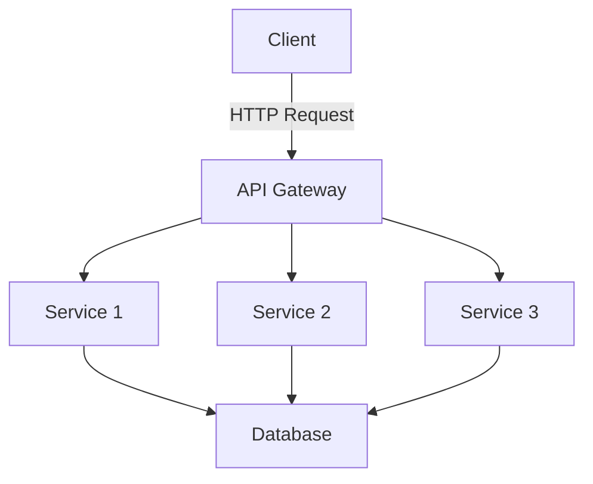

---

linkTitle: "16.3 Startups and Small Businesses Using Go"
title: "Startups and Small Businesses Using Go: Lean Development and Success Stories"
description: "Explore how startups and small businesses leverage Go for rapid development and performance gains, with real-world success stories and minimalistic design approaches."
categories:
- Software Development
- Go Programming
- Startups
tags:
- Go Language
- Lean Development
- Startups
- Small Business
- Software Design
date: 2024-10-25
type: docs
nav_weight: 1630000
canonical: "https://softwarepatternslexicon.com/patterns-go/16/3"
license: "© 2024 Tokenizer Inc. CC BY-NC-SA 4.0"
---

## 16.3 Startups and Small Businesses Using Go

In the fast-paced world of startups and small businesses, the ability to develop and iterate quickly is crucial. The Go programming language, with its simplicity, efficiency, and robust concurrency support, has become a popular choice for many startups aiming to build scalable and performant applications. This section explores how Go facilitates lean development, highlights success stories, and delves into the challenges and solutions faced by startups using Go.

### Lean Development with Go

Lean development emphasizes minimizing waste, maximizing value, and delivering features quickly. Go's design philosophy aligns well with these principles, making it an ideal choice for startups and small businesses.

#### Rapid Development Cycles

Go's simplicity and ease of use allow developers to write clean and efficient code quickly. The language's straightforward syntax reduces the learning curve, enabling teams to onboard new developers rapidly and maintain high productivity. Additionally, Go's fast compilation times and efficient execution speed contribute to shorter development cycles.

Here's a simple example of a Go program that demonstrates its clean syntax and efficiency:

```go
package main

import "fmt"

func main() {
    fmt.Println("Hello, Go!")
}
```

This minimalistic approach allows developers to focus on solving business problems rather than dealing with complex language features.

#### Minimalistic Design Approaches

Go encourages minimalism in design, promoting the use of simple, composable functions and interfaces. This aligns with the lean development philosophy, where the goal is to build only what is necessary to deliver value to customers.

For instance, Go's interface system allows for flexible and decoupled design. By defining small interfaces with only the methods needed, developers can create modular and testable code. Here's an example of a simple interface in Go:

```go
type Notifier interface {
    Notify(message string) error
}

type EmailNotifier struct{}

func (e EmailNotifier) Notify(message string) error {
    fmt.Println("Sending email:", message)
    return nil
}
```

This approach ensures that components remain loosely coupled, making it easier to modify or replace parts of the system without affecting the whole.

### Success Stories of Startups Using Go

Several startups have successfully leveraged Go to achieve significant performance gains and scalability. Let's explore some of these success stories and the lessons learned from their experiences.

#### Case Study: Iron.io

Iron.io, a cloud-based platform for building and running microservices, adopted Go to improve the performance and scalability of their services. By rewriting critical components in Go, Iron.io achieved a 30% reduction in server costs and significantly improved response times.

**Key Takeaways:**
- **Performance Gains:** Go's efficient concurrency model and low memory footprint enabled Iron.io to handle a large number of concurrent requests with fewer resources.
- **Scalability:** The simplicity of Go's goroutines allowed Iron.io to scale their services horizontally with ease.

#### Case Study: SendGrid

SendGrid, a cloud-based email delivery service, chose Go to handle their high-volume email processing needs. By leveraging Go's concurrency features, SendGrid was able to process millions of emails per day with minimal latency.

**Key Takeaways:**
- **Concurrency:** Go's goroutines and channels provided a simple yet powerful way to manage concurrent email processing tasks.
- **Resource Efficiency:** The lightweight nature of goroutines allowed SendGrid to maximize resource utilization and reduce operational costs.

### Challenges and Solutions in Resource-Constrained Environments

Startups often operate in resource-constrained environments, where optimizing performance and minimizing costs are critical. Go's features and ecosystem provide several solutions to these challenges.

#### Efficient Resource Management

Go's garbage collector and memory management features help startups manage resources efficiently. However, understanding and tuning these features is essential for optimal performance.

**Solution:** Use Go's profiling tools, such as `pprof`, to identify memory bottlenecks and optimize garbage collection settings. This ensures that applications run smoothly even under heavy load.

#### Handling Concurrency

While Go's concurrency model is powerful, it can introduce complexity if not managed correctly. Startups must design their systems carefully to avoid common pitfalls such as race conditions and deadlocks.

**Solution:** Leverage Go's `sync` package and tools like `go vet` to detect and prevent concurrency issues. Implementing proper synchronization mechanisms ensures that concurrent operations are safe and efficient.

### Visual Aids

To better understand how startups utilize Go, let's look at a conceptual diagram of a typical Go-based microservices architecture:



This diagram illustrates how Go's simplicity and efficiency make it well-suited for building microservices architectures, enabling startups to scale their applications seamlessly.

### Conclusion

Go's combination of simplicity, performance, and concurrency support makes it an excellent choice for startups and small businesses looking to develop scalable and efficient applications. By adopting lean development practices and leveraging Go's strengths, startups can achieve rapid development cycles and significant performance gains. The success stories of companies like Iron.io and SendGrid demonstrate the potential of Go to transform business operations and deliver value to customers.

## Quiz Time!



### What is one of the main advantages of using Go for startups?

- [x] Rapid development cycles
- [ ] Complex language features
- [ ] High learning curve
- [ ] Slow execution speed

> **Explanation:** Go's simplicity and fast compilation times contribute to rapid development cycles, making it ideal for startups.

### How does Go's interface system support lean development?

- [x] By promoting flexible and decoupled design
- [ ] By enforcing strict type hierarchies
- [ ] By requiring complex inheritance structures
- [ ] By limiting modularity

> **Explanation:** Go's interface system allows for flexible and decoupled design, aligning with lean development principles.

### What performance improvement did Iron.io achieve by adopting Go?

- [x] 30% reduction in server costs
- [ ] 50% increase in server costs
- [ ] No change in performance
- [ ] 10% increase in response times

> **Explanation:** Iron.io achieved a 30% reduction in server costs by leveraging Go's efficient concurrency model.

### How did SendGrid benefit from using Go?

- [x] Efficient concurrency for email processing
- [ ] Increased latency in email processing
- [ ] Higher operational costs
- [ ] Reduced email processing capacity

> **Explanation:** SendGrid used Go's concurrency features to process millions of emails per day efficiently.

### What tool can be used to identify memory bottlenecks in Go applications?

- [x] `pprof`
- [ ] `go vet`
- [ ] `sync`
- [ ] `go fmt`

> **Explanation:** `pprof` is a profiling tool used to identify memory bottlenecks and optimize performance in Go applications.

### What is a common challenge when handling concurrency in Go?

- [x] Race conditions
- [ ] Lack of concurrency support
- [ ] High memory usage
- [ ] Slow execution

> **Explanation:** Race conditions are a common challenge in concurrent programming, which can be addressed using Go's synchronization mechanisms.

### Which package in Go helps with synchronization in concurrent programming?

- [x] `sync`
- [ ] `fmt`
- [ ] `http`
- [ ] `os`

> **Explanation:** The `sync` package provides synchronization primitives to help manage concurrency in Go applications.

### What is a key feature of Go that supports lean development?

- [x] Minimalistic design approaches
- [ ] Complex inheritance structures
- [ ] High memory usage
- [ ] Slow compilation times

> **Explanation:** Go's minimalistic design approaches align with lean development by focusing on simplicity and efficiency.

### How does Go's garbage collector benefit startups?

- [x] By managing resources efficiently
- [ ] By increasing memory usage
- [ ] By slowing down execution
- [ ] By complicating memory management

> **Explanation:** Go's garbage collector helps manage resources efficiently, which is crucial for startups operating in resource-constrained environments.

### True or False: Go's goroutines are lightweight and allow for efficient concurrency.

- [x] True
- [ ] False

> **Explanation:** True. Go's goroutines are lightweight and provide a simple way to handle concurrency efficiently.


