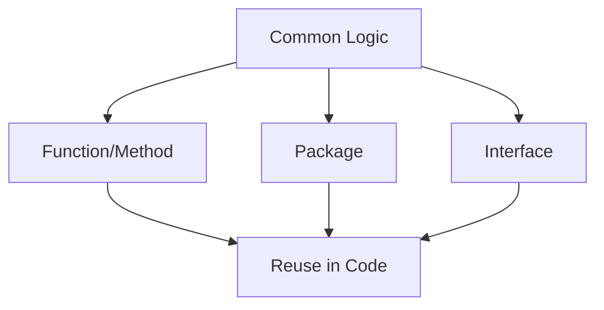
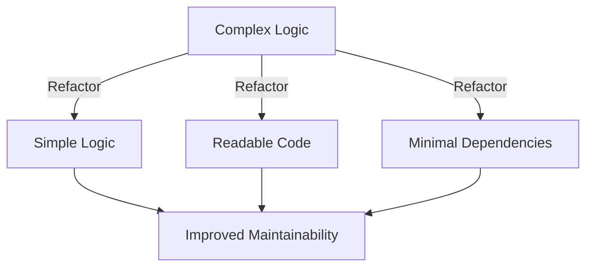

---

linkTitle: "17.2 DRY and KISS"
title: "DRY and KISS: Simplifying Go Code with Design Principles"
description: "Explore the DRY and KISS principles in Go programming to enhance code maintainability and simplicity."
categories:
- Software Design
- Go Programming
- Best Practices
tags:
- DRY Principle
- KISS Principle
- Code Reusability
- Simplicity
- Go Language
date: 2024-10-25
type: docs
nav_weight: 1720000
canonical: "https://softwarepatternslexicon.com/patterns-go/17/2"
license: "© 2024 Tokenizer Inc. CC BY-NC-SA 4.0"
---

## 17.2 DRY and KISS

In the realm of software development, two fundamental principles stand out for their ability to enhance code quality and maintainability: DRY (Don't Repeat Yourself) and KISS (Keep It Simple, Stupid). These principles are particularly relevant in Go programming, where simplicity and efficiency are core language philosophies. This article delves into these principles, illustrating their application in Go with examples, best practices, and visual aids.

### Introduction to DRY and KISS

#### DRY (Don't Repeat Yourself)

The DRY principle emphasizes the elimination of redundancy in code. By abstracting common functionality and reusing code through functions and packages, developers can reduce maintenance overhead and improve code clarity. The essence of DRY is to ensure that every piece of knowledge in a system has a single, unambiguous representation.

#### KISS (Keep It Simple, Stupid)

KISS advocates for simplicity in design and implementation. The goal is to avoid unnecessary complexity, making the code easier to understand, maintain, and extend. Simple solutions are often more robust and less prone to errors, aligning well with Go's design philosophy.

### Detailed Explanation

#### DRY Principle in Go

In Go, the DRY principle can be implemented through various strategies:

1. **Functions and Methods**: Encapsulate repetitive logic into functions or methods to promote reuse.

2. **Packages**: Organize related functions and types into packages, allowing for modular and reusable code.

3. **Interfaces**: Use interfaces to define common behaviors, enabling different types to be used interchangeably.

**Example:**

Consider a scenario where you need to calculate the area of different shapes. Instead of repeating the calculation logic for each shape, you can abstract it into a function:

```go
package main

import (
    "fmt"
    "math"
)

// Shape interface
type Shape interface {
    Area() float64
}

// Circle struct
type Circle struct {
    Radius float64
}

// Rectangle struct
type Rectangle struct {
    Width, Height float64
}

// Area method for Circle
func (c Circle) Area() float64 {
    return math.Pi * c.Radius * c.Radius
}

// Area method for Rectangle
func (r Rectangle) Area() float64 {
    return r.Width * r.Height
}

func printArea(s Shape) {
    fmt.Printf("Area: %.2f\n", s.Area())
}

func main() {
    c := Circle{Radius: 5}
    r := Rectangle{Width: 4, Height: 6}

    printArea(c)
    printArea(r)
}
```

In this example, the `printArea` function demonstrates the DRY principle by abstracting the logic to print the area of any shape that implements the `Shape` interface.

#### KISS Principle in Go

Applying the KISS principle involves:

1. **Simple Logic**: Avoid convoluted logic and complex algorithms when a simpler solution exists.

2. **Readable Code**: Write code that is easy to read and understand, using clear naming conventions and straightforward control structures.

3. **Minimal Dependencies**: Reduce dependencies to simplify the build process and minimize potential points of failure.

**Example:**

Let's refactor a complex function to adhere to the KISS principle:

```go
package main

import "fmt"

// Complex function
func calculateDiscount(price float64, customerType string) float64 {
    if customerType == "regular" {
        return price * 0.9
    } else if customerType == "premium" {
        return price * 0.8
    } else if customerType == "vip" {
        return price * 0.7
    }
    return price
}

// Simplified function
func calculateDiscountSimple(price float64, discountRate float64) float64 {
    return price * discountRate
}

func main() {
    price := 100.0
    fmt.Println("Regular customer discount:", calculateDiscountSimple(price, 0.9))
    fmt.Println("Premium customer discount:", calculateDiscountSimple(price, 0.8))
    fmt.Println("VIP customer discount:", calculateDiscountSimple(price, 0.7))
}
```

The simplified version of `calculateDiscount` uses a single function with a discount rate parameter, adhering to the KISS principle by reducing complexity and improving readability.

### Visual Aids

#### DRY Principle Diagram



**Explanation:** This diagram illustrates how common logic can be abstracted into functions, packages, or interfaces, promoting reuse and adhering to the DRY principle.

#### KISS Principle Diagram



**Explanation:** The diagram shows the transformation of complex logic into simpler, more maintainable code by applying the KISS principle.

### Best Practices

1. **Identify Redundancies**: Regularly review your codebase to identify and eliminate redundant code.

2. **Modular Design**: Break down your code into smaller, reusable modules to adhere to the DRY principle.

3. **Simplify Interfaces**: Design interfaces that are easy to understand and use, avoiding unnecessary complexity.

4. **Refactor Regularly**: Continuously refactor your code to maintain simplicity and clarity.

5. **Documentation**: Document your code to enhance readability and understanding, especially when implementing complex logic.

### Advantages and Disadvantages

#### Advantages

- **Improved Maintainability**: DRY and KISS principles lead to code that is easier to maintain and extend.
- **Enhanced Readability**: Simplified code is easier for developers to read and understand.
- **Reduced Errors**: By minimizing redundancy and complexity, the likelihood of errors decreases.

#### Disadvantages

- **Over-Abstraction**: Excessive abstraction in the name of DRY can lead to code that is difficult to understand.
- **Oversimplification**: Over-simplifying complex logic can result in inadequate solutions that fail to meet requirements.

### Conclusion

The DRY and KISS principles are foundational to writing clean, maintainable, and efficient Go code. By eliminating redundancy and embracing simplicity, developers can create robust applications that are easier to understand and extend. These principles not only align with Go's philosophy but also enhance the overall quality of software projects.

## Quiz Time!



### What does the DRY principle stand for?

- [x] Don't Repeat Yourself
- [ ] Do Repeat Yourself
- [ ] Don't Refactor Yourself
- [ ] Do Refactor Yourself

> **Explanation:** DRY stands for "Don't Repeat Yourself," emphasizing the elimination of redundant code.

### Which principle advocates for simplicity in design?

- [ ] DRY
- [x] KISS
- [ ] SOLID
- [ ] YAGNI

> **Explanation:** The KISS principle stands for "Keep It Simple, Stupid," advocating for simplicity in design and implementation.

### How can the DRY principle be implemented in Go?

- [x] By using functions and packages
- [ ] By writing more code
- [ ] By avoiding interfaces
- [ ] By increasing redundancy

> **Explanation:** The DRY principle can be implemented by using functions, packages, and interfaces to promote code reuse.

### What is a potential disadvantage of the DRY principle?

- [x] Over-abstraction
- [ ] Improved maintainability
- [ ] Enhanced readability
- [ ] Reduced errors

> **Explanation:** Over-abstraction can occur if the DRY principle is applied excessively, making the code difficult to understand.

### Which of the following is a benefit of the KISS principle?

- [x] Improved maintainability
- [ ] Increased complexity
- [ ] More dependencies
- [ ] Reduced readability

> **Explanation:** The KISS principle leads to improved maintainability by simplifying code and reducing complexity.

### What does KISS stand for in software design?

- [x] Keep It Simple, Stupid
- [ ] Keep It Safe, Secure
- [ ] Keep It Short, Simple
- [ ] Keep It Smart, Simple

> **Explanation:** KISS stands for "Keep It Simple, Stupid," focusing on simplicity in design.

### Which principle helps in reducing code errors?

- [x] Both DRY and KISS
- [ ] Only DRY
- [ ] Only KISS
- [ ] Neither DRY nor KISS

> **Explanation:** Both DRY and KISS principles help in reducing code errors by minimizing redundancy and complexity.

### How does the KISS principle affect code readability?

- [x] Enhances readability
- [ ] Reduces readability
- [ ] Has no effect on readability
- [ ] Makes code unreadable

> **Explanation:** The KISS principle enhances code readability by promoting simplicity and clarity.

### What is a common practice to adhere to the DRY principle?

- [x] Refactoring code
- [ ] Writing more code
- [ ] Avoiding functions
- [ ] Increasing complexity

> **Explanation:** Refactoring code to eliminate redundancy is a common practice to adhere to the DRY principle.

### True or False: The KISS principle encourages the use of complex algorithms.

- [ ] True
- [x] False

> **Explanation:** False. The KISS principle encourages simplicity and discourages the use of complex algorithms unless necessary.




