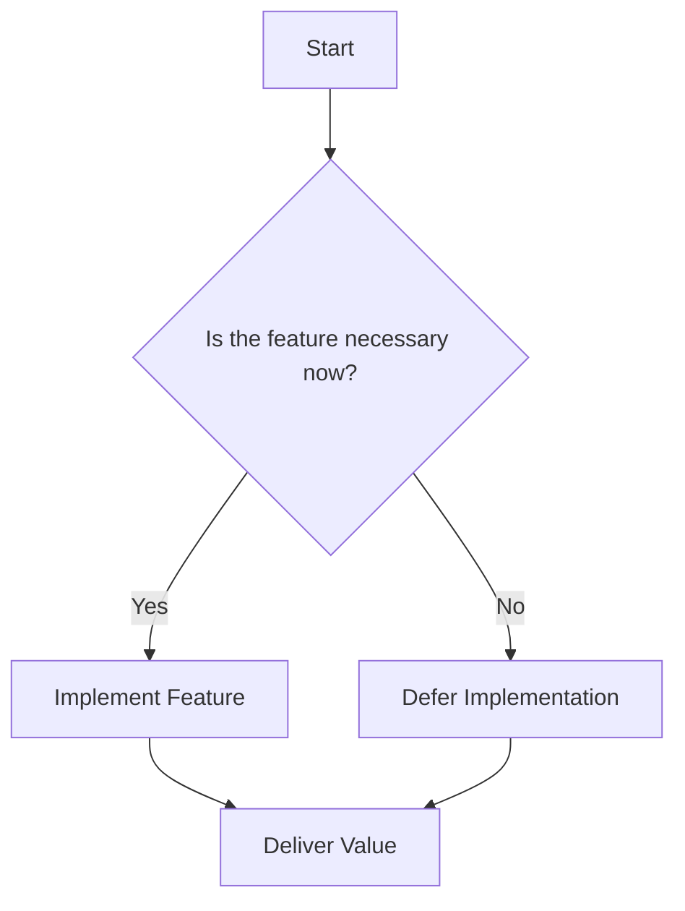

## 17.3 YAGNI

In the realm of software development, the principle of YAGNI, which stands for "You Aren't Gonna Need It," serves as a guiding beacon to prevent over-engineering and reduce waste. This principle is a cornerstone of agile methodologies and emphasizes the importance of implementing features only when they are necessary. By adhering to YAGNI, developers can maintain focus on delivering value, enhancing productivity, and ensuring that resources are utilized efficiently.

### Introduction to YAGNI

YAGNI is a principle that encourages developers to refrain from adding functionality until it is absolutely necessary. This approach is rooted in the agile development philosophy, which prioritizes delivering working software quickly and iteratively. The YAGNI principle helps teams avoid the pitfalls of over-engineering by discouraging the anticipation of future requirements that may never materialize.

### The Purpose and Relevance of YAGNI

The primary purpose of YAGNI is to streamline the development process by focusing on the immediate needs of the project. This principle is particularly relevant in today's fast-paced development environments, where requirements can change rapidly. By implementing only what is needed, teams can adapt more easily to changes and avoid the burden of maintaining unused code.

### Detailed Explanation of YAGNI

YAGNI is not about cutting corners or neglecting necessary features. Instead, it is about making informed decisions regarding what is essential for the current iteration of the project. This involves:

- **Prioritizing Features:** Focus on delivering features that provide immediate value to users.
- **Avoiding Speculative Development:** Resist the temptation to build features based on assumptions about future needs.
- **Emphasizing Simplicity:** Keep the codebase simple and maintainable by avoiding unnecessary complexity.

### Visual Aids: Conceptual Diagram

To better understand the YAGNI principle, consider the following conceptual diagram that illustrates the decision-making process in feature implementation:



**Explanation:** This diagram shows that if a feature is not necessary at the moment, its implementation should be deferred, allowing the team to focus on delivering value with the current set of features.

### Code Example: Applying YAGNI in Go

Consider a scenario where a developer is tempted to add a caching mechanism to a Go application. While caching can improve performance, it may not be needed initially. Here's how YAGNI can be applied:

```go
package main

import (
    "fmt"
    "time"
)

// Simulate a function that fetches data
func fetchData() string {
    time.Sleep(2 * time.Second) // Simulate delay
    return "Data from source"
}

func main() {
    // Fetch data without caching initially
    fmt.Println("Fetching data...")
    data := fetchData()
    fmt.Println("Received:", data)

    // Implement caching only if performance becomes an issue
}
```

**Explanation:** In this example, caching is not implemented initially. The developer can monitor the application's performance and decide to add caching only if it becomes a bottleneck.

### Use Cases for YAGNI

YAGNI is applicable in various scenarios, including:

- **Startups and MVPs:** When developing a Minimum Viable Product (MVP), focus on core features to validate the product idea quickly.
- **Agile Development:** In agile environments, where requirements evolve, YAGNI helps teams adapt without being bogged down by unnecessary features.
- **Resource-Constrained Projects:** For projects with limited resources, YAGNI ensures that efforts are directed towards delivering essential functionality.

### Advantages and Disadvantages of YAGNI

#### Advantages

- **Reduced Complexity:** By avoiding unnecessary features, the codebase remains simpler and more maintainable.
- **Increased Agility:** Teams can respond to changes more swiftly without the burden of unused code.
- **Cost Efficiency:** Resources are allocated to features that provide immediate value, reducing waste.

#### Disadvantages

- **Potential Rework:** In some cases, deferring features may lead to rework if future requirements necessitate their implementation.
- **Short-Term Focus:** Overemphasis on immediate needs might overlook strategic long-term goals.

### Best Practices for Implementing YAGNI

- **Regularly Review Requirements:** Continuously assess the necessity of features based on current project goals.
- **Collaborate with Stakeholders:** Engage with stakeholders to ensure alignment on feature priorities.
- **Embrace Iterative Development:** Use iterative cycles to refine and expand features as needed.

### Comparisons with Other Principles

YAGNI complements other design principles such as KISS (Keep It Simple, Stupid) and DRY (Don't Repeat Yourself) by promoting simplicity and efficiency. While KISS focuses on simplicity, YAGNI emphasizes necessity, and DRY aims to eliminate redundancy.

### Conclusion

The YAGNI principle is a powerful tool for preventing over-engineering and ensuring that development efforts are aligned with delivering value. By focusing on what is necessary, teams can maintain a lean and adaptable codebase, ready to meet the challenges of evolving requirements.

## Quiz Time!



### What does YAGNI stand for?

- [x] You Aren't Gonna Need It
- [ ] You Always Get New Ideas
- [ ] You Are Going Nowhere Instantly
- [ ] Your Application Grows Naturally

> **Explanation:** YAGNI stands for "You Aren't Gonna Need It," a principle that discourages adding features until they are necessary.

### Which development methodology is YAGNI most closely associated with?

- [x] Agile Development
- [ ] Waterfall Development
- [ ] Spiral Development
- [ ] V-Model Development

> **Explanation:** YAGNI is closely associated with Agile Development, which emphasizes iterative progress and adapting to change.

### What is a primary benefit of following the YAGNI principle?

- [x] Reduced complexity in the codebase
- [ ] Increased initial development time
- [ ] Guaranteed feature completeness
- [ ] Immediate implementation of all features

> **Explanation:** By following YAGNI, unnecessary complexity is avoided, keeping the codebase simpler and more maintainable.

### How does YAGNI help in resource-constrained projects?

- [x] By ensuring resources are focused on essential features
- [ ] By requiring all features to be implemented upfront
- [ ] By increasing the number of features developed
- [ ] By eliminating the need for stakeholder collaboration

> **Explanation:** YAGNI helps focus resources on essential features, which is crucial in projects with limited resources.

### What is a potential disadvantage of YAGNI?

- [x] Potential rework if deferred features become necessary
- [ ] Increased complexity in the codebase
- [ ] Immediate implementation of all features
- [ ] Guaranteed feature completeness

> **Explanation:** A potential disadvantage of YAGNI is the need for rework if deferred features become necessary later.

### Which principle complements YAGNI by focusing on simplicity?

- [x] KISS (Keep It Simple, Stupid)
- [ ] DRY (Don't Repeat Yourself)
- [ ] SOLID
- [ ] GRASP

> **Explanation:** KISS complements YAGNI by emphasizing simplicity in design and implementation.

### In which scenario is YAGNI particularly useful?

- [x] Developing a Minimum Viable Product (MVP)
- [ ] Finalizing a fully-featured product
- [ ] Implementing all possible features
- [ ] Designing a complex architecture upfront

> **Explanation:** YAGNI is particularly useful in developing an MVP, where focus is on core features to validate the product idea.

### What should teams do to effectively implement YAGNI?

- [x] Regularly review requirements and collaborate with stakeholders
- [ ] Implement all features at once
- [ ] Avoid stakeholder input
- [ ] Focus solely on long-term goals

> **Explanation:** To effectively implement YAGNI, teams should regularly review requirements and collaborate with stakeholders.

### How does YAGNI relate to iterative development?

- [x] It encourages refining and expanding features as needed
- [ ] It requires all features to be implemented upfront
- [ ] It discourages changes during development
- [ ] It focuses solely on long-term planning

> **Explanation:** YAGNI relates to iterative development by encouraging the refinement and expansion of features as needed.

### True or False: YAGNI means you should never implement new features.

- [ ] True
- [x] False

> **Explanation:** False. YAGNI means you should implement new features only when they are necessary, not never implement them.


