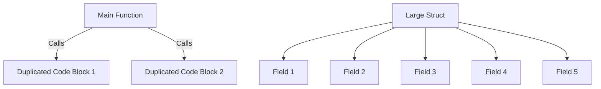

## 17.4 Code Smells and Refactoring

In the world of software development, maintaining clean, efficient, and readable code is paramount. Over time, as codebases grow and evolve, they can accumulate "code smells"—subtle indicators of deeper problems within the code. Refactoring is the disciplined technique of restructuring existing code without changing its external behavior, aimed at improving its internal structure. This section delves into identifying common code smells and employing refactoring techniques to enhance code quality in Go applications.

### Introduction to Code Smells

Code smells are not bugs; they are not technically incorrect but indicate weaknesses in design that may hinder future development and maintenance. Recognizing these smells is the first step towards improving code quality. Here are some common code smells:

1. **Long Functions**: Functions that are excessively long can be difficult to understand and maintain.
2. **Large Structs**: Structs with too many fields can indicate a lack of cohesion and potential for refactoring.
3. **Duplicated Code**: Repeated code blocks can lead to inconsistencies and increased maintenance efforts.
4. **Complex Conditionals**: Nested or overly complex conditional statements can reduce code readability.
5. **Primitive Obsession**: Overuse of primitive data types instead of small objects for simple tasks.
6. **Feature Envy**: A class that uses methods of another class excessively.
7. **Data Clumps**: Groups of data that are often passed together in multiple places.

### Identifying Code Smells

Identifying code smells requires a keen eye and experience. Here are some strategies to help spot them:

- **Code Reviews**: Regular peer reviews can help identify code smells early.
- **Static Analysis Tools**: Tools like `golint` and `gometalinter` can automatically detect certain smells.
- **Unit Tests**: Writing tests can reveal smells by highlighting areas of the code that are difficult to test.

### Visualizing Code Smells

To better understand how code smells manifest, consider the following diagram illustrating a typical scenario of duplicated code and large structs:



### Refactoring Techniques

Refactoring is the process of improving the design of existing code without altering its external behavior. Here are some common refactoring techniques:

1. **Extract Function**: Break down long functions into smaller, more manageable ones.
2. **Simplify Conditionals**: Use guard clauses or polymorphism to simplify complex conditionals.
3. **Replace Magic Numbers with Constants**: Use named constants instead of hard-coded numbers.
4. **Encapsulate Fields**: Use getter and setter methods to control access to class fields.
5. **Introduce Parameter Object**: Replace groups of parameters that are often passed together with a single object.
6. **Remove Duplicated Code**: Consolidate duplicated code into a single location.

### Code Example: Refactoring in Go

Consider the following Go code snippet with a code smell:

```go
package main

import "fmt"

// Original function with code smell
func calculateDiscount(price float64, customerType string) float64 {
    if customerType == "regular" {
        return price * 0.9
    } else if customerType == "premium" {
        return price * 0.8
    } else if customerType == "vip" {
        return price * 0.7
    }
    return price
}

func main() {
    fmt.Println(calculateDiscount(100, "premium"))
}
```

This function has a complex conditional that can be refactored:

```go
package main

import "fmt"

// Refactored function using a map for discount rates
func calculateDiscount(price float64, customerType string) float64 {
    discountRates := map[string]float64{
        "regular": 0.9,
        "premium": 0.8,
        "vip":     0.7,
    }
    if rate, exists := discountRates[customerType]; exists {
        return price * rate
    }
    return price
}

func main() {
    fmt.Println(calculateDiscount(100, "premium"))
}
```

### Advantages and Disadvantages of Refactoring

**Advantages:**

- **Improved Readability**: Cleaner code is easier to read and understand.
- **Enhanced Maintainability**: Well-structured code is easier to modify and extend.
- **Reduced Complexity**: Simplifying code reduces the likelihood of errors.

**Disadvantages:**

- **Initial Time Investment**: Refactoring can be time-consuming.
- **Potential for New Bugs**: Changes to code can introduce new bugs if not carefully managed.

### Best Practices for Refactoring

- **Test-Driven Development (TDD)**: Write tests before refactoring to ensure behavior remains unchanged.
- **Incremental Changes**: Make small, incremental changes rather than large overhauls.
- **Continuous Integration**: Use CI tools to run tests automatically after refactoring.
- **Code Reviews**: Have peers review refactored code to catch potential issues.

### Conclusion

Code smells are indicators of potential problems in your codebase, and refactoring is a powerful technique to address these issues. By regularly identifying and refactoring code smells, developers can maintain high-quality, maintainable, and scalable code. Embrace the practice of refactoring as a continuous process, integrated into your development workflow, to ensure your Go applications remain robust and adaptable.

## Quiz Time!



### What is a code smell?

- [x] An indicator of potential problems in the code
- [ ] A syntax error in the code
- [ ] A runtime error in the code
- [ ] A type of bug in the code

> **Explanation:** A code smell is an indicator of potential problems in the code that may hinder future development and maintenance.

### Which of the following is a common code smell?

- [x] Long functions
- [ ] Properly encapsulated fields
- [ ] Well-documented code
- [ ] Efficient algorithms

> **Explanation:** Long functions are a common code smell as they can be difficult to understand and maintain.

### What is the purpose of refactoring?

- [x] To improve the internal structure of the code without changing its external behavior
- [ ] To add new features to the code
- [ ] To fix bugs in the code
- [ ] To optimize the code for performance

> **Explanation:** Refactoring aims to improve the internal structure of the code without changing its external behavior.

### Which refactoring technique involves breaking down long functions into smaller ones?

- [x] Extract Function
- [ ] Simplify Conditionals
- [ ] Encapsulate Fields
- [ ] Introduce Parameter Object

> **Explanation:** The Extract Function technique involves breaking down long functions into smaller, more manageable ones.

### What is a disadvantage of refactoring?

- [x] Initial time investment
- [ ] Improved readability
- [ ] Enhanced maintainability
- [ ] Reduced complexity

> **Explanation:** Refactoring can be time-consuming, which is considered a disadvantage.

### How can static analysis tools help in identifying code smells?

- [x] By automatically detecting certain smells
- [ ] By fixing code smells automatically
- [ ] By writing tests for the code
- [ ] By optimizing code performance

> **Explanation:** Static analysis tools can automatically detect certain code smells.

### What is the benefit of using Test-Driven Development (TDD) in refactoring?

- [x] Ensures behavior remains unchanged
- [ ] Speeds up the refactoring process
- [ ] Eliminates the need for code reviews
- [ ] Automatically fixes code smells

> **Explanation:** TDD ensures that the behavior of the code remains unchanged during refactoring.

### Which of the following is NOT a code smell?

- [x] Efficient use of resources
- [ ] Duplicated code
- [ ] Large structs
- [ ] Complex conditionals

> **Explanation:** Efficient use of resources is not a code smell; it is a positive attribute of code.

### What does the term "Primitive Obsession" refer to?

- [x] Overuse of primitive data types instead of small objects
- [ ] Excessive use of complex data structures
- [ ] Over-reliance on third-party libraries
- [ ] Use of outdated programming techniques

> **Explanation:** Primitive Obsession refers to the overuse of primitive data types instead of small objects for simple tasks.

### True or False: Refactoring should only be done when adding new features.

- [ ] True
- [x] False

> **Explanation:** Refactoring should be a continuous process and not limited to when new features are added.


