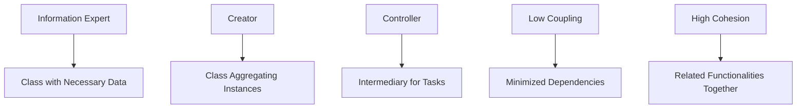

## 17.6 GRASP Principles

In the realm of software design, the General Responsibility Assignment Software Patterns (GRASP) principles serve as a foundational guide for assigning responsibilities to classes and objects. These principles help developers create systems that are maintainable, scalable, and robust by promoting effective responsibility distribution. This article delves into each of the GRASP principles, providing insights into their application and significance in software design.

### Introduction to GRASP Principles

GRASP principles are a set of guidelines that help software developers assign responsibilities to objects in a way that enhances system design. These principles are crucial for creating systems that are easy to understand, modify, and extend. The main GRASP principles include Information Expert, Creator, Controller, Low Coupling, and High Cohesion. Each principle addresses a specific aspect of responsibility assignment, ensuring that the system's architecture remains sound and efficient.

### Information Expert

The Information Expert principle suggests that responsibilities should be assigned to the class that has the necessary information to fulfill them. This principle ensures that the class with the most relevant data handles the associated responsibilities, leading to more cohesive and efficient designs.

#### Example

Consider a simple e-commerce application where an `Order` class needs to calculate the total price of an order. According to the Information Expert principle, the `Order` class should handle this responsibility because it has access to the order items and their prices.

```go
type Order struct {
    Items []OrderItem
}

type OrderItem struct {
    Price    float64
    Quantity int
}

func (o *Order) CalculateTotal() float64 {
    total := 0.0
    for _, item := range o.Items {
        total += item.Price * float64(item.Quantity)
    }
    return total
}
```

In this example, the `Order` class is the information expert as it possesses the necessary data to calculate the total price.

### Creator

The Creator principle advises that a class should be responsible for creating instances of another class if it contains, aggregates, or closely uses instances of that class. This principle helps in maintaining a clear and logical object creation process.

#### Example

In a blogging application, a `Blog` class might be responsible for creating `Post` instances since it aggregates posts.

```go
type Blog struct {
    Posts []Post
}

type Post struct {
    Title   string
    Content string
}

func (b *Blog) CreatePost(title, content string) Post {
    post := Post{Title: title, Content: content}
    b.Posts = append(b.Posts, post)
    return post
}
```

Here, the `Blog` class is the creator of `Post` instances, as it aggregates them.

### Controller

The Controller principle suggests using a controller to handle input and coordinate tasks. A controller is an intermediary that delegates work to other objects, promoting separation of concerns and reducing direct dependencies between classes.

#### Example

In a web application, a `UserController` might handle user-related requests and delegate tasks to service classes.

```go
type UserController struct {
    UserService *UserService
}

func (uc *UserController) HandleCreateUserRequest(name, email string) {
    uc.UserService.CreateUser(name, email)
}

type UserService struct{}

func (us *UserService) CreateUser(name, email string) {
    // Logic to create a user
}
```

The `UserController` acts as a mediator, coordinating between the input (user request) and the business logic (user creation).

### Low Coupling

Low Coupling is a principle that emphasizes minimizing dependencies between classes. By reducing coupling, systems become more flexible and easier to maintain, as changes in one class are less likely to impact others.

#### Example

Using interfaces in Go is a common way to achieve low coupling. Consider a payment processing system:

```go
type PaymentProcessor interface {
    ProcessPayment(amount float64) error
}

type Order struct {
    Payment PaymentProcessor
}

func (o *Order) Checkout(amount float64) error {
    return o.Payment.ProcessPayment(amount)
}
```

Here, the `Order` class depends on the `PaymentProcessor` interface rather than a specific implementation, reducing coupling.

### High Cohesion

High Cohesion refers to keeping related functionalities within the same class. A highly cohesive class has a single, well-defined purpose, making it easier to understand and maintain.

#### Example

A `ReportGenerator` class that handles all aspects of report generation is an example of high cohesion:

```go
type ReportGenerator struct{}

func (rg *ReportGenerator) GenerateReport(data []ReportData) string {
    // Logic to generate report
    return "Report Content"
}
```

The `ReportGenerator` class focuses solely on generating reports, maintaining high cohesion.

### Visualizing GRASP Principles

To better understand the relationships and interactions promoted by GRASP principles, consider the following conceptual diagram:



### Advantages and Disadvantages

#### Advantages

- **Improved Maintainability:** GRASP principles lead to designs that are easier to understand and modify.
- **Enhanced Scalability:** By promoting low coupling and high cohesion, systems can scale more effectively.
- **Clear Responsibility Assignment:** Each class has a well-defined role, reducing ambiguity.

#### Disadvantages

- **Initial Complexity:** Applying GRASP principles may introduce complexity during the initial design phase.
- **Overhead:** Ensuring low coupling and high cohesion might require additional interfaces or classes, leading to overhead.

### Best Practices

- **Adopt Incrementally:** Start by applying GRASP principles to critical parts of the system and expand gradually.
- **Review and Refactor:** Regularly review the system design to ensure adherence to GRASP principles and refactor as needed.
- **Balance Principles:** Strive for a balance between low coupling and high cohesion to avoid over-engineering.

### Conclusion

GRASP principles provide a robust framework for assigning responsibilities in software design. By adhering to these principles, developers can create systems that are maintainable, scalable, and easy to understand. As you design your next software project, consider how GRASP principles can guide your responsibility assignment decisions.

## Quiz Time!



### Which GRASP principle suggests assigning responsibilities to the class with the necessary information?

- [x] Information Expert
- [ ] Creator
- [ ] Controller
- [ ] Low Coupling

> **Explanation:** The Information Expert principle assigns responsibilities to the class that has the necessary information to fulfill them.

### What is the main goal of the Creator principle?

- [x] Assign object creation to classes that have the initialization data.
- [ ] Minimize dependencies between classes.
- [ ] Use controllers to handle input and coordinate tasks.
- [ ] Keep related functionalities within the same class.

> **Explanation:** The Creator principle assigns object creation to classes that have the initialization data or aggregate the created objects.

### Which principle emphasizes minimizing dependencies between classes?

- [ ] Information Expert
- [ ] Creator
- [ ] Controller
- [x] Low Coupling

> **Explanation:** Low Coupling emphasizes minimizing dependencies between classes to enhance flexibility and maintainability.

### What does the Controller principle advocate for?

- [ ] Assigning responsibilities to classes with necessary information.
- [ ] Assigning object creation to classes with initialization data.
- [x] Using controllers to handle input and coordinate tasks.
- [ ] Keeping related functionalities within the same class.

> **Explanation:** The Controller principle advocates using controllers to handle input and coordinate tasks, promoting separation of concerns.

### Which principle focuses on keeping related functionalities within the same class?

- [ ] Information Expert
- [ ] Creator
- [ ] Controller
- [x] High Cohesion

> **Explanation:** High Cohesion focuses on keeping related functionalities within the same class to maintain a single, well-defined purpose.

### What is a potential disadvantage of applying GRASP principles?

- [x] Initial Complexity
- [ ] Improved Maintainability
- [ ] Enhanced Scalability
- [ ] Clear Responsibility Assignment

> **Explanation:** Applying GRASP principles may introduce initial complexity during the design phase.

### How can low coupling be achieved in Go?

- [x] Using interfaces
- [ ] Using global variables
- [ ] Hardcoding dependencies
- [ ] Avoiding interfaces

> **Explanation:** Low coupling can be achieved by using interfaces, which reduce dependencies between classes.

### What is the benefit of high cohesion?

- [x] Easier to understand and maintain
- [ ] Increased complexity
- [ ] More dependencies
- [ ] Less flexibility

> **Explanation:** High cohesion makes classes easier to understand and maintain by focusing on a single, well-defined purpose.

### Which principle would you apply to ensure a class has a single, well-defined purpose?

- [ ] Information Expert
- [ ] Creator
- [ ] Controller
- [x] High Cohesion

> **Explanation:** High Cohesion ensures a class has a single, well-defined purpose, making it easier to understand and maintain.

### True or False: GRASP principles are only applicable to object-oriented programming.

- [x] False
- [ ] True

> **Explanation:** While GRASP principles are often associated with object-oriented programming, their concepts can be applied to other programming paradigms as well.


