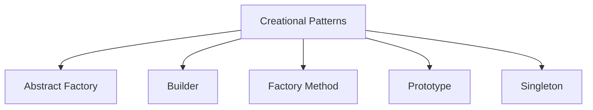
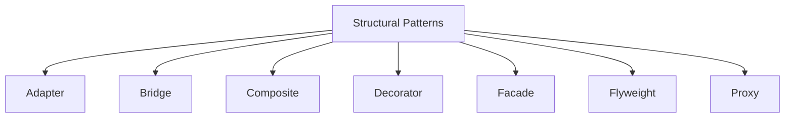
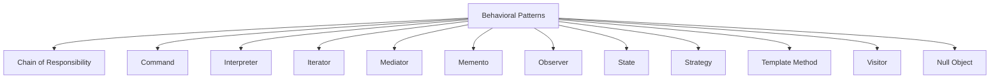

## 18.3 Pattern Comparison Matrix

Design patterns are essential tools in a developer's toolkit, providing proven solutions to common problems in software design. In this section, we present a comprehensive comparison matrix of design patterns, focusing on their application within the Go programming language. This matrix will help you understand the differences, similarities, and appropriate use cases for each pattern, categorized into Creational, Structural, and Behavioral patterns.

### Introduction

Design patterns are categorized into three main types:

- **Creational Patterns:** These patterns focus on the mechanisms of object creation, aiming to create objects in a manner suitable to the situation.
- **Structural Patterns:** These patterns deal with object composition, forming larger structures from individual objects and classes.
- **Behavioral Patterns:** These patterns are concerned with object interaction and the delegation of responsibilities among objects.

### Creational Patterns

Creational patterns abstract the instantiation process, making it more adaptable and flexible. Here, we compare the most common creational patterns used in Go.

| Pattern          | Intent                                                                 | Key Features                                                                 | Use Cases                                                                 |
|------------------|------------------------------------------------------------------------|------------------------------------------------------------------------------|---------------------------------------------------------------------------|
| Abstract Factory | Provide an interface for creating families of related objects          | Encapsulates object creation logic, promotes consistency                     | UI toolkits, cross-platform applications                                  |
| Builder          | Separate the construction of a complex object from its representation  | Step-by-step construction, immutable objects, fluent interface               | Building complex configurations, constructing objects with many options   |
| Factory Method   | Define an interface for creating an object, but let subclasses decide  | Promotes loose coupling, allows for subclassing                              | Frameworks, libraries that require extensibility                          |
| Prototype        | Create new objects by copying an existing object                       | Cloning, avoids subclassing, dynamic object creation                         | Object caching, dynamic object creation                                   |
| Singleton        | Ensure a class has only one instance and provide a global point of access | Global access, controlled instantiation, lazy initialization                 | Configuration settings, logging, database connections                     |

#### Visual Representation

### Structural Patterns

Structural patterns focus on the composition of classes and objects, facilitating the design of flexible and efficient structures.

| Pattern          | Intent                                                                 | Key Features                                                                 | Use Cases                                                                 |
|------------------|------------------------------------------------------------------------|------------------------------------------------------------------------------|---------------------------------------------------------------------------|
| Adapter          | Convert the interface of a class into another interface clients expect | Interface conversion, promotes reusability                                   | Legacy code integration, third-party library integration                  |
| Bridge           | Decouple an abstraction from its implementation                        | Separation of concerns, promotes flexibility                                 | GUI toolkits, device drivers                                              |
| Composite        | Compose objects into tree structures to represent part-whole hierarchies | Recursive composition, uniform treatment of individual and composite objects | File systems, UI component hierarchies                                    |
| Decorator        | Attach additional responsibilities to an object dynamically            | Flexible alternative to subclassing, promotes single responsibility          | Stream processing, UI enhancements                                        |
| Facade           | Provide a unified interface to a set of interfaces in a subsystem      | Simplifies complex systems, promotes ease of use                             | Library simplification, API design                                        |
| Flyweight        | Use sharing to support large numbers of fine-grained objects efficiently | Memory optimization, intrinsic and extrinsic state separation                | Text editors, graphical applications                                      |
| Proxy            | Provide a surrogate or placeholder for another object                  | Access control, lazy initialization, logging                                 | Remote proxies, virtual proxies, protection proxies                       |

#### Visual Representation

### Behavioral Patterns

Behavioral patterns are concerned with algorithms and the assignment of responsibilities between objects.

| Pattern                   | Intent                                                                 | Key Features                                                                 | Use Cases                                                                 |
|---------------------------|------------------------------------------------------------------------|------------------------------------------------------------------------------|---------------------------------------------------------------------------|
| Chain of Responsibility   | Pass a request along a chain of handlers                               | Decouples sender and receiver, promotes flexibility                          | Event handling, logging frameworks                                        |
| Command                   | Encapsulate a request as an object                                     | Parameterization of requests, queuing, logging                               | Transactional systems, undo functionality                                 |
| Interpreter               | Define a representation for a grammar and an interpreter               | Language parsing, syntax tree evaluation                                     | Expression evaluation, scripting languages                                |
| Iterator                  | Provide a way to access elements of a collection sequentially          | Encapsulation of iteration logic, promotes uniformity                        | Collection traversal, data structure iteration                            |
| Mediator                  | Define an object that encapsulates how a set of objects interact       | Promotes loose coupling, centralizes control                                 | GUI frameworks, communication between components                          |
| Memento                   | Capture and externalize an object's state                              | State restoration, encapsulation of state                                    | Undo mechanisms, state persistence                                        |
| Observer                  | Define a one-to-many dependency between objects                        | Event-driven systems, promotes decoupling                                    | GUI event handling, data binding                                          |
| State                     | Allow an object to alter its behavior when its state changes           | State encapsulation, promotes single responsibility                          | State machines, workflow systems                                          |
| Strategy                  | Define a family of algorithms, encapsulate them, and make them interchangeable | Promotes flexibility, encapsulation of algorithms                            | Sorting algorithms, data compression                                      |
| Template Method           | Define the skeleton of an algorithm in an operation                    | Promotes code reuse, allows for customization                                | Frameworks, libraries with customizable behavior                          |
| Visitor                   | Represent an operation to be performed on elements of an object structure | Promotes separation of concerns, double dispatch                             | Compiler design, object structure traversal                               |
| Null Object               | Provide an object with a defined neutral behavior                      | Eliminates null checks, promotes simplicity                                  | Default behavior, placeholder objects                                     |

#### Visual Representation

### Comparative Analysis

When selecting a design pattern, consider the following factors:

- **Suitability:** Choose a pattern that aligns with the specific problem you are trying to solve. For instance, use the Singleton pattern for managing shared resources, while the Strategy pattern is ideal for interchangeable algorithms.
- **Complexity:** Some patterns, like the Composite or Mediator, can introduce additional complexity. Ensure the benefits outweigh the overhead.
- **Flexibility:** Patterns like Decorator and Strategy offer high flexibility, allowing you to extend functionality without modifying existing code.
- **Performance:** Consider the performance implications. For example, the Flyweight pattern can optimize memory usage, while the Proxy pattern might introduce latency.

### Conclusion

Understanding the nuances of each design pattern and their application in Go can significantly enhance your software design skills. By leveraging the right pattern for the right problem, you can create more maintainable, scalable, and efficient Go applications.

## Quiz Time!



### Which pattern is best suited for creating a family of related objects?

- [x] Abstract Factory
- [ ] Builder
- [ ] Singleton
- [ ] Proxy

> **Explanation:** The Abstract Factory pattern provides an interface for creating families of related or dependent objects without specifying their concrete classes.

### What is the primary benefit of the Builder pattern?

- [x] It separates the construction of a complex object from its representation.
- [ ] It ensures a class has only one instance.
- [ ] It provides a surrogate for another object.
- [ ] It converts the interface of a class into another interface.

> **Explanation:** The Builder pattern is used to construct a complex object step by step, separating the construction process from the final representation.

### Which pattern is used to decouple an abstraction from its implementation?

- [ ] Adapter
- [x] Bridge
- [ ] Composite
- [ ] Decorator

> **Explanation:** The Bridge pattern decouples an abstraction from its implementation, allowing both to vary independently.

### What is the main purpose of the Composite pattern?

- [x] To compose objects into tree structures to represent part-whole hierarchies.
- [ ] To provide a unified interface to a set of interfaces.
- [ ] To attach additional responsibilities to an object dynamically.
- [ ] To convert the interface of a class into another interface.

> **Explanation:** The Composite pattern allows you to compose objects into tree structures to represent part-whole hierarchies, enabling clients to treat individual objects and compositions uniformly.

### Which pattern is ideal for implementing undo functionality?

- [ ] Observer
- [ ] Strategy
- [x] Command
- [ ] Memento

> **Explanation:** The Command pattern encapsulates a request as an object, allowing for parameterization and queuing of requests, making it ideal for implementing undo functionality.

### What is a key feature of the Flyweight pattern?

- [x] Memory optimization through data sharing.
- [ ] Providing a surrogate for another object.
- [ ] Separating construction from representation.
- [ ] Defining a family of algorithms.

> **Explanation:** The Flyweight pattern reduces memory consumption by sharing as much data as possible with other similar objects.

### Which pattern provides a way to access elements of a collection sequentially?

- [ ] Observer
- [ ] Strategy
- [x] Iterator
- [ ] Visitor

> **Explanation:** The Iterator pattern provides a way to access elements of a collection sequentially without exposing its underlying representation.

### What is the primary goal of the State pattern?

- [ ] To provide a unified interface to a set of interfaces.
- [x] To allow an object to alter its behavior when its internal state changes.
- [ ] To define a family of algorithms.
- [ ] To represent an operation to be performed on elements of an object structure.

> **Explanation:** The State pattern allows an object to alter its behavior when its internal state changes, appearing to change its class.

### Which pattern is used to define a one-to-many dependency between objects?

- [x] Observer
- [ ] Strategy
- [ ] Command
- [ ] Memento

> **Explanation:** The Observer pattern defines a one-to-many dependency between objects so that when one object changes state, all its dependents are notified and updated automatically.

### True or False: The Null Object pattern eliminates the need for null checks.

- [x] True
- [ ] False

> **Explanation:** The Null Object pattern provides an object with a defined neutral behavior, eliminating the need for null checks.


