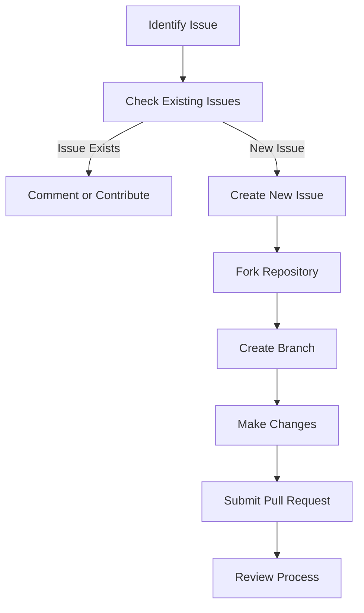

---

linkTitle: "18.4 Contribution Guidelines"
title: "Contribution Guidelines for Effective Collaboration"
description: "Explore comprehensive guidelines for contributing to our project, including submission processes, style adherence, and review protocols to ensure high-quality contributions."
categories:
- Contribution
- Open Source
- Collaboration
tags:
- Contribution Guidelines
- Open Source
- Code Review
- Style Guide
- Collaboration
date: 2024-10-25
type: docs
nav_weight: 1840000
canonical: "https://softwarepatternslexicon.com/patterns-go/18/4"
license: "© 2024 Tokenizer Inc. CC BY-NC-SA 4.0"
---

## 18.4 Contribution Guidelines

Contributing to an open-source project is a rewarding way to engage with the community, enhance your skills, and help improve the software. This section outlines the comprehensive guidelines for contributing to our project, ensuring a smooth and effective collaboration process. Whether you're fixing a bug, adding a feature, or improving documentation, your contributions are valuable and appreciated.

### How to Contribute

Contributing to our project involves several key steps, from identifying issues to submitting your work for review. Here's a detailed guide to help you through the process:

#### 1. Submit Issues or Pull Requests

- **Identifying Issues:**
  - If you encounter a bug or have a feature request, start by checking the existing issues in the project's repository to see if it's already reported.
  - If not, create a new issue with a clear and descriptive title and provide as much detail as possible, including steps to reproduce the problem or a rationale for the feature.

- **Submitting Pull Requests:**
  - Fork the repository and create a new branch for your changes. Use a descriptive name for your branch that reflects the work being done.
  - Make your changes in this branch, ensuring that each commit is atomic and has a clear message explaining the change.
  - Before submitting, ensure your branch is up to date with the main branch to avoid merge conflicts.
  - Submit a pull request (PR) with a detailed description of the changes, referencing any related issues.

#### 2. Follow the Code of Conduct and Contribution Guidelines

- **Code of Conduct:**
  - Our project adheres to a code of conduct that ensures a welcoming and inclusive environment. Be respectful and considerate in all interactions.
  - Report any unacceptable behavior to the project maintainers.

- **Contribution Guidelines:**
  - Review the project's contribution guidelines, which provide specific instructions on the contribution process, including coding standards, testing requirements, and documentation expectations.

### Style Guidelines

Maintaining a consistent style across the project is crucial for readability and maintainability. Here are the key style guidelines to follow:

#### 1. Adhere to the Project's Coding Standards

- **Coding Standards:**
  - Follow the project's coding standards, which may include naming conventions, code formatting, and best practices specific to the language or framework used.
  - Use tools like `gofmt` for Go code to ensure consistent formatting.

- **Code Comments:**
  - Write clear and concise comments to explain complex logic or important decisions in the code.
  - Use comments to document public functions and methods, describing their purpose, parameters, and return values.

#### 2. Include Tests and Documentation with Contributions

- **Testing:**
  - Write unit tests for new features or bug fixes to ensure they work as expected and do not introduce regressions.
  - Use testing frameworks and tools recommended by the project, such as `testing` in Go.

- **Documentation:**
  - Update the project's documentation to reflect any changes made, including new features, API changes, or configuration updates.
  - Ensure documentation is clear, concise, and easy to follow.

### Review Process

Once you've submitted your contribution, it will go through a review process to ensure quality and alignment with the project's goals.

#### 1. Contributions Will Be Reviewed by Maintainers

- **Initial Review:**
  - A project maintainer will review your pull request, checking for code quality, adherence to guidelines, and overall fit with the project.
  - Reviews are typically conducted within a few days, but response times can vary based on the project's activity level.

- **Feedback and Iteration:**
  - Maintain open communication with the reviewers. Address any feedback or requested changes promptly.
  - If changes are requested, update your pull request accordingly and notify the reviewers.

#### 2. Feedback Will Be Provided for Improvements

- **Constructive Feedback:**
  - Expect constructive feedback aimed at improving the contribution and maintaining project quality.
  - Engage positively with feedback, using it as an opportunity to learn and enhance your skills.

- **Final Approval:**
  - Once all feedback is addressed and the contribution meets the project's standards, a maintainer will merge your pull request into the main branch.
  - Celebrate your contribution and continue to engage with the project!

### Conclusion

Contributing to our project is a collaborative effort that benefits from clear communication, adherence to guidelines, and a commitment to quality. By following these contribution guidelines, you help maintain the project's integrity and foster a positive community experience. We look forward to your contributions and appreciate your efforts to improve the project.

## Quiz Time!



### What is the first step in contributing to the project?

- [x] Identifying issues or submitting pull requests
- [ ] Writing code without checking existing issues
- [ ] Directly contacting the project maintainer
- [ ] Submitting documentation changes

> **Explanation:** The first step is to identify issues or submit pull requests, ensuring that your contribution is relevant and needed.

### What should you do if you encounter a bug?

- [x] Check existing issues and create a new one if not found
- [ ] Ignore it and continue working
- [ ] Directly fix it without reporting
- [ ] Contact the maintainer immediately

> **Explanation:** Checking existing issues helps avoid duplicates, and creating a new issue provides a record for others.

### How should you name your branch when contributing?

- [x] Use a descriptive name reflecting the work
- [ ] Use your name
- [ ] Use the date of creation
- [ ] Use random characters

> **Explanation:** A descriptive branch name helps maintainers understand the purpose of the branch at a glance.

### What tool can you use to ensure consistent formatting in Go code?

- [x] `gofmt`
- [ ] `gocode`
- [ ] `golint`
- [ ] `govet`

> **Explanation:** `gofmt` is used to format Go code consistently according to the language's standards.

### What should be included with your code contributions?

- [x] Tests and documentation
- [ ] Only code
- [ ] Only tests
- [ ] Only documentation

> **Explanation:** Including tests and documentation ensures that your contribution is complete and understandable.

### Who reviews the contributions?

- [x] Project maintainers
- [ ] Other contributors
- [ ] Automated systems
- [ ] External auditors

> **Explanation:** Project maintainers review contributions to ensure they meet the project's standards.

### How should you handle feedback on your contribution?

- [x] Address feedback promptly and positively
- [ ] Ignore it
- [ ] Argue with the reviewer
- [ ] Withdraw your contribution

> **Explanation:** Addressing feedback promptly and positively helps improve the contribution and fosters collaboration.

### What is the purpose of the code of conduct?

- [x] To ensure a welcoming and inclusive environment
- [ ] To enforce strict rules
- [ ] To limit contributions
- [ ] To provide legal protection

> **Explanation:** The code of conduct ensures a respectful and inclusive environment for all contributors.

### What should you do if changes are requested in your pull request?

- [x] Update the pull request and notify reviewers
- [ ] Ignore the request
- [ ] Close the pull request
- [ ] Start a new pull request

> **Explanation:** Updating the pull request and notifying reviewers helps move the contribution forward.

### True or False: Documentation is not necessary for code contributions.

- [ ] True
- [x] False

> **Explanation:** Documentation is necessary to explain changes and ensure that others can understand and use the new features or fixes.



