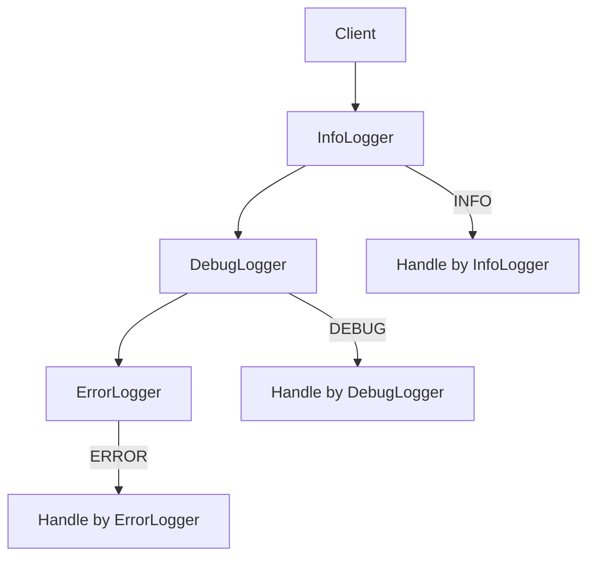

## 2.3.1 Chain of Responsibility

The Chain of Responsibility pattern is a behavioral design pattern that allows an object to pass a request along a chain of potential handlers until one of them handles it. This pattern is particularly useful for decoupling the sender of a request from its receivers, allowing multiple objects the opportunity to handle the request without the sender needing to know which object will ultimately process it.

### Purpose of the Chain of Responsibility Pattern

- **Decoupling:** The primary goal is to decouple the sender of a request from its receiver, allowing the request to be processed by any handler in the chain.
- **Flexibility:** It provides flexibility in assigning responsibilities to objects, as the chain can be modified dynamically.
- **Multiple Handlers:** It allows multiple objects to have the opportunity to handle a request, promoting a more flexible and reusable code structure.

### Implementation Steps

1. **Define a Handler Interface:** Create an interface with a method to handle requests. This interface will be implemented by all concrete handlers.

2. **Implement Concrete Handlers:** Develop concrete handler classes that decide whether to process the request or pass it along the chain. Each handler should have a reference to the next handler in the chain.

3. **Configure the Chain:** Link handler instances to form a chain. The request is passed along the chain until a handler processes it.

### When to Use

- **Multiple Potential Handlers:** When you have multiple handlers that can process a request, and the handler isn't predetermined.
- **Decoupling Needs:** To decouple senders and receivers, especially when the set of handlers can change dynamically.

### Go-Specific Tips

- **Function Types or Interfaces:** Use Go's function types or interfaces to define handlers, providing flexibility in handler implementation.
- **Concurrency Considerations:** Be mindful of concurrent access if the chain is modified at runtime, ensuring thread safety.

### Example: Logging System with Different Log Levels

Let's consider a logging system where different log levels (e.g., INFO, DEBUG, ERROR) are handled by different handlers. The Chain of Responsibility pattern can be used to pass log messages through a chain of handlers until one processes it.

```go
package main

import (
	"fmt"
)

// Logger interface defines a method for logging messages.
type Logger interface {
	LogMessage(level int, message string)
	SetNext(logger Logger)
}

// Log levels
const (
	INFO = iota
	DEBUG
	ERROR
)

// BaseLogger provides a default implementation for setting the next logger.
type BaseLogger struct {
	next Logger
}

func (b *BaseLogger) SetNext(logger Logger) {
	b.next = logger
}

// InfoLogger handles INFO level messages.
type InfoLogger struct {
	BaseLogger
}

func (i *InfoLogger) LogMessage(level int, message string) {
	if level == INFO {
		fmt.Println("INFO: ", message)
	} else if i.next != nil {
		i.next.LogMessage(level, message)
	}
}

// DebugLogger handles DEBUG level messages.
type DebugLogger struct {
	BaseLogger
}

func (d *DebugLogger) LogMessage(level int, message string) {
	if level == DEBUG {
		fmt.Println("DEBUG: ", message)
	} else if d.next != nil {
		d.next.LogMessage(level, message)
	}
}

// ErrorLogger handles ERROR level messages.
type ErrorLogger struct {
	BaseLogger
}

func (e *ErrorLogger) LogMessage(level int, message string) {
	if level == ERROR {
		fmt.Println("ERROR: ", message)
	} else if e.next != nil {
		e.next.LogMessage(level, message)
	}
}

func main() {
	// Create loggers
	infoLogger := &InfoLogger{}
	debugLogger := &DebugLogger{}
	errorLogger := &ErrorLogger{}

	// Set up the chain
	infoLogger.SetNext(debugLogger)
	debugLogger.SetNext(errorLogger)

	// Pass messages through the chain
	infoLogger.LogMessage(INFO, "This is an info message.")
	infoLogger.LogMessage(DEBUG, "This is a debug message.")
	infoLogger.LogMessage(ERROR, "This is an error message.")
}
```

### Visualizing the Chain of Responsibility

Below is a conceptual diagram illustrating the Chain of Responsibility pattern:



### Advantages and Disadvantages

**Advantages:**

- **Decoupling:** Reduces coupling between the sender and receiver.
- **Flexibility:** Handlers can be added or removed dynamically.
- **Responsibility Sharing:** Multiple handlers can process the request.

**Disadvantages:**

- **Performance:** May introduce performance overhead if the chain is long.
- **Complexity:** Can become complex if not managed properly, especially with many handlers.

### Best Practices

- **Chain Order:** Carefully consider the order of handlers in the chain to ensure correct processing.
- **Responsibility Clarity:** Ensure each handler has a clear responsibility to avoid confusion.
- **Thread Safety:** If the chain is modified at runtime, ensure thread safety.

### Comparisons with Other Patterns

- **Decorator Pattern:** While both patterns allow dynamic behavior, the Chain of Responsibility focuses on passing requests along a chain, whereas the Decorator adds behavior to objects.
- **Command Pattern:** The Command pattern encapsulates a request as an object, while the Chain of Responsibility passes the request along a chain.

### Conclusion

The Chain of Responsibility pattern is a powerful tool for decoupling request senders and receivers, allowing multiple handlers to process requests flexibly. By implementing this pattern in Go, developers can create more modular and maintainable systems, especially in scenarios where the set of handlers can change dynamically.

## Quiz Time!



### What is the primary purpose of the Chain of Responsibility pattern?

- [x] To decouple the sender of a request from its receiver.
- [ ] To ensure only one handler processes a request.
- [ ] To encapsulate requests as objects.
- [ ] To add behavior to individual objects dynamically.

> **Explanation:** The Chain of Responsibility pattern aims to decouple the sender of a request from its receiver, allowing multiple objects the opportunity to handle the request.

### Which of the following is a key benefit of using the Chain of Responsibility pattern?

- [x] Flexibility in assigning responsibilities to objects.
- [ ] Ensuring all requests are processed by all handlers.
- [ ] Simplifying the creation of complex objects.
- [ ] Providing a global point of access to an object.

> **Explanation:** The pattern provides flexibility in assigning responsibilities to objects, as the chain can be modified dynamically.

### In Go, what is a common way to define handlers in the Chain of Responsibility pattern?

- [x] Using interfaces or function types.
- [ ] Using global variables.
- [ ] Using singleton classes.
- [ ] Using static methods.

> **Explanation:** In Go, handlers are commonly defined using interfaces or function types, providing flexibility in implementation.

### What should be considered when modifying the chain at runtime in a concurrent Go application?

- [x] Thread safety.
- [ ] Memory usage.
- [ ] Code readability.
- [ ] Compilation time.

> **Explanation:** When modifying the chain at runtime in a concurrent Go application, ensuring thread safety is crucial to prevent race conditions.

### Which pattern is most similar to the Chain of Responsibility in terms of dynamic behavior?

- [ ] Singleton
- [ ] Factory Method
- [x] Decorator
- [ ] Observer

> **Explanation:** The Decorator pattern is similar in that it allows dynamic behavior, but it focuses on adding behavior to objects rather than passing requests along a chain.

### What is a potential disadvantage of the Chain of Responsibility pattern?

- [x] Performance overhead with long chains.
- [ ] Difficulty in adding new handlers.
- [ ] Inability to decouple senders and receivers.
- [ ] Lack of flexibility in handler assignment.

> **Explanation:** A potential disadvantage is the performance overhead that can occur with long chains, as the request must pass through each handler.

### How does the Chain of Responsibility pattern differ from the Command pattern?

- [x] Chain of Responsibility passes requests along a chain, while Command encapsulates requests as objects.
- [ ] Chain of Responsibility encapsulates requests as objects, while Command passes requests along a chain.
- [ ] Both patterns are identical in purpose and implementation.
- [ ] Command pattern is used for logging, while Chain of Responsibility is not.

> **Explanation:** The Chain of Responsibility pattern passes requests along a chain of handlers, whereas the Command pattern encapsulates requests as objects.

### What is a common use case for the Chain of Responsibility pattern?

- [x] Logging systems with different log levels.
- [ ] Creating complex objects step by step.
- [ ] Ensuring a class has only one instance.
- [ ] Providing a simplified interface to a set of interfaces.

> **Explanation:** A common use case is a logging system where different log levels are handled by different handlers in the chain.

### Which of the following is NOT a step in implementing the Chain of Responsibility pattern?

- [ ] Define a handler interface.
- [ ] Implement concrete handlers.
- [ ] Configure the chain.
- [x] Create a singleton instance.

> **Explanation:** Creating a singleton instance is not a step in implementing the Chain of Responsibility pattern.

### True or False: The Chain of Responsibility pattern ensures that every request is processed by all handlers in the chain.

- [ ] True
- [x] False

> **Explanation:** False. The Chain of Responsibility pattern allows a request to be processed by the first handler that can handle it, not necessarily all handlers.


