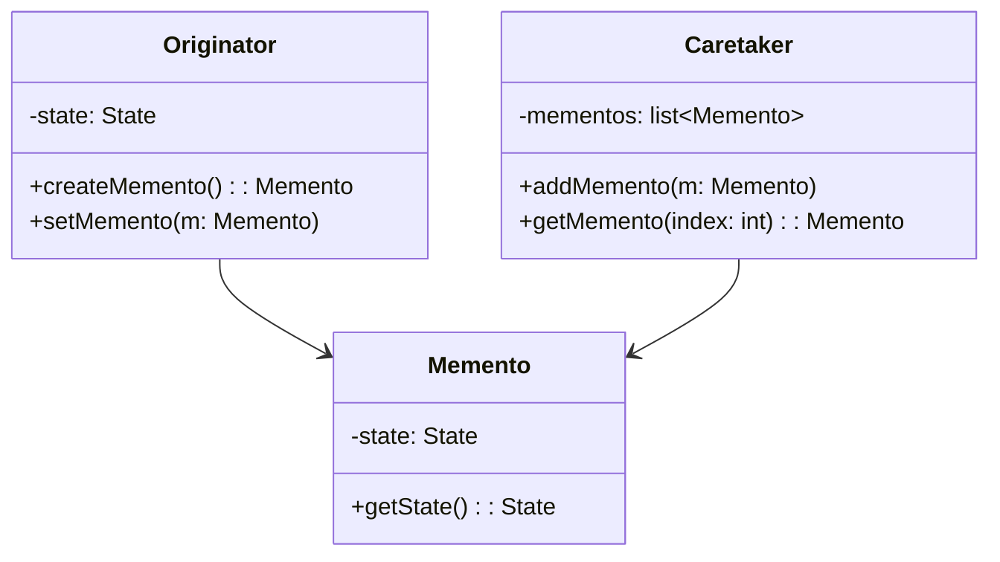

## 2.3.6 Memento

The Memento design pattern is a behavioral pattern that allows capturing and externalizing an object's internal state without violating encapsulation. This pattern provides the ability to restore the object to a previous state, making it particularly useful for implementing undo/redo functionality in applications.

### Understand the Intent

The primary intent of the Memento pattern is to:

- **Capture an Object's Internal State:** Safely store the state of an object so that it can be restored later.
- **Restore the Object to a Previous State:** Allow the object to revert to a previous state without exposing its internal structure.

### Implementation Steps

The Memento pattern involves three main components:

1. **Originator:**
   - This is the object whose state needs to be saved and restored.
   - It implements methods to create and set mementos.

2. **Memento:**
   - A struct that stores the state of the originator.
   - It is typically opaque to other objects, ensuring encapsulation.

3. **Caretaker:**
   - Manages the saving and restoring of mementos.
   - Holds mementos but does not manipulate or inspect them.

Below is a conceptual diagram illustrating the Memento pattern:



### When to Use

The Memento pattern is particularly useful in scenarios such as:

- **Implementing Undo/Redo Functionality:** Allows users to revert changes or redo actions in applications like text editors.
- **Snapshotting State:** When snapshots of an object's state are required for rollback or auditing purposes.

### Go-Specific Tips

- **Immutability:** Ensure that mementos are immutable after creation to maintain consistency and reliability.
- **Serialization:** Carefully serialize the state if the memento will be stored externally, ensuring data integrity and security.

### Example: Text Editor with Undo/Redo

Let's consider a simple text editor application where users can undo and redo changes to the text content.

```go
package main

import "fmt"

// Memento stores the state of the Originator
type Memento struct {
	state string
}

// Originator is the object whose state needs to be saved and restored
type Originator struct {
	state string
}

func (o *Originator) CreateMemento() Memento {
	return Memento{state: o.state}
}

func (o *Originator) RestoreMemento(m Memento) {
	o.state = m.state
}

func (o *Originator) SetState(state string) {
	o.state = state
}

func (o *Originator) GetState() string {
	return o.state
}

// Caretaker manages the mementos
type Caretaker struct {
	mementos []Memento
}

func (c *Caretaker) AddMemento(m Memento) {
	c.mementos = append(c.mementos, m)
}

func (c *Caretaker) GetMemento(index int) Memento {
	return c.mementos[index]
}

func main() {
	originator := &Originator{}
	caretaker := &Caretaker{}

	originator.SetState("State 1")
	caretaker.AddMemento(originator.CreateMemento())

	originator.SetState("State 2")
	caretaker.AddMemento(originator.CreateMemento())

	originator.SetState("State 3")
	fmt.Println("Current State:", originator.GetState())

	originator.RestoreMemento(caretaker.GetMemento(1))
	fmt.Println("Restored to State:", originator.GetState())

	originator.RestoreMemento(caretaker.GetMemento(0))
	fmt.Println("Restored to State:", originator.GetState())
}
```

### Advantages and Disadvantages

**Advantages:**

- **Encapsulation:** Maintains encapsulation boundaries by not exposing the internal state of objects.
- **Flexibility:** Provides a flexible way to manage state history and restore previous states.

**Disadvantages:**

- **Memory Overhead:** Can consume significant memory if many mementos are stored.
- **Complexity:** Adds complexity to the system, especially when managing multiple mementos.

### Best Practices

- **Limit Mementos:** Store only necessary mementos to reduce memory usage.
- **Immutable Mementos:** Ensure mementos are immutable to prevent accidental modifications.
- **Efficient State Storage:** Use efficient data structures and serialization techniques for state storage.

### Comparisons

The Memento pattern is often compared with the Command pattern, which can also implement undo functionality. However, the Command pattern focuses on encapsulating operations, while the Memento pattern encapsulates state.

### Conclusion

The Memento design pattern is a powerful tool for managing object state in Go applications, particularly when implementing undo/redo functionality. By capturing and restoring state without violating encapsulation, developers can create flexible and user-friendly applications.

## Quiz Time!



### What is the primary intent of the Memento pattern?

- [x] Capture an object's internal state without violating encapsulation.
- [ ] Provide a global point of access to an object.
- [ ] Define a one-to-many dependency between objects.
- [ ] Allow an object to alter its behavior when its internal state changes.

> **Explanation:** The Memento pattern is designed to capture and restore an object's state without exposing its internal structure.

### Which component of the Memento pattern is responsible for storing the state?

- [ ] Originator
- [x] Memento
- [ ] Caretaker
- [ ] Observer

> **Explanation:** The Memento is the component that stores the state of the Originator.

### What role does the Caretaker play in the Memento pattern?

- [ ] It modifies the state of the Originator.
- [ ] It inspects and manipulates mementos.
- [x] It manages the saving and restoring of mementos.
- [ ] It defines the interface for creating mementos.

> **Explanation:** The Caretaker manages mementos but does not inspect or manipulate them.

### When is the Memento pattern particularly useful?

- [x] Implementing undo/redo functionality.
- [ ] Managing concurrent operations.
- [ ] Decoupling an abstraction from its implementation.
- [ ] Providing a simplified interface to a subsystem.

> **Explanation:** The Memento pattern is useful for implementing undo/redo functionality by capturing and restoring object states.

### How should mementos be handled in Go to ensure consistency?

- [ ] They should be mutable.
- [x] They should be immutable.
- [ ] They should be serialized using JSON.
- [ ] They should be stored in a database.

> **Explanation:** Mementos should be immutable to ensure consistency and prevent accidental modifications.

### What is a potential disadvantage of using the Memento pattern?

- [ ] It violates encapsulation.
- [ ] It increases coupling between objects.
- [x] It can consume significant memory.
- [ ] It makes code less readable.

> **Explanation:** Storing many mementos can lead to high memory consumption.

### Which pattern is often compared with the Memento pattern for implementing undo functionality?

- [ ] Singleton
- [ ] Observer
- [x] Command
- [ ] Strategy

> **Explanation:** The Command pattern is also used for implementing undo functionality, but it focuses on operations rather than state.

### What should be considered when storing mementos externally?

- [ ] Use of global variables.
- [ ] Use of pointers.
- [x] Careful serialization of state.
- [ ] Use of reflection.

> **Explanation:** When storing mementos externally, careful serialization is necessary to maintain data integrity.

### Which of the following is NOT a component of the Memento pattern?

- [ ] Originator
- [ ] Memento
- [ ] Caretaker
- [x] Adapter

> **Explanation:** The Adapter is not a component of the Memento pattern; it is a separate design pattern.

### True or False: The Memento pattern allows direct access to the internal state of the Originator.

- [ ] True
- [x] False

> **Explanation:** The Memento pattern does not allow direct access to the Originator's internal state, maintaining encapsulation.


