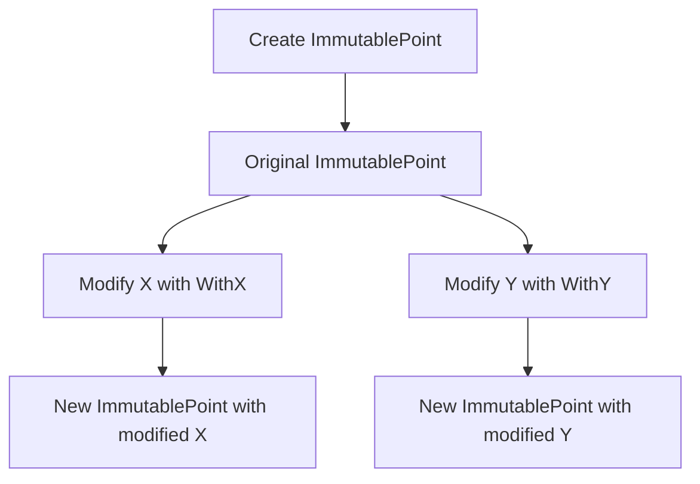

## 4.5 Immutability

Immutability is a powerful concept in software design that can lead to more predictable and reliable code. In Go, immutability can be particularly beneficial for concurrent programming, as it reduces the complexity associated with managing shared state. This section explores how to implement immutability in Go, the advantages it offers, and practical examples of its application.

### Introduction to Immutability

Immutability refers to the state of an object that cannot be modified after it is created. This concept is rooted in functional programming, where functions avoid side effects by not altering the state of their inputs. In Go, while the language does not enforce immutability, developers can adopt idiomatic patterns to achieve similar benefits.

### Immutable Data Structures

#### Defining Immutable Structs

In Go, you can create immutable data structures by defining structs with unexported fields and providing methods that do not modify the receiver. This approach ensures that once an object is created, its state cannot change.

```go
package main

import "fmt"

// ImmutablePoint represents a point in a 2D space
type ImmutablePoint struct {
	x, y int
}

// NewImmutablePoint creates a new ImmutablePoint
func NewImmutablePoint(x, y int) ImmutablePoint {
	return ImmutablePoint{x, y}
}

// X returns the x-coordinate
func (p ImmutablePoint) X() int {
	return p.x
}

// Y returns the y-coordinate
func (p ImmutablePoint) Y() int {
	return p.y
}

func main() {
	point := NewImmutablePoint(3, 4)
	fmt.Println("X:", point.X(), "Y:", point.Y())
}
```

In this example, the `ImmutablePoint` struct has unexported fields `x` and `y`, and methods `X()` and `Y()` to access these fields. The state of `ImmutablePoint` cannot be changed after its creation.

#### Functional Construction

Functional construction involves using constructor functions to create new instances rather than modifying existing ones. When changes are needed, new modified instances are returned instead of altering the original.

```go
// WithX returns a new ImmutablePoint with a modified x-coordinate
func (p ImmutablePoint) WithX(newX int) ImmutablePoint {
	return ImmutablePoint{newX, p.y}
}

// WithY returns a new ImmutablePoint with a modified y-coordinate
func (p ImmutablePoint) WithY(newY int) ImmutablePoint {
	return ImmutablePoint{p.x, newY}
}

func main() {
	point := NewImmutablePoint(3, 4)
	newPoint := point.WithX(5)
	fmt.Println("Original X:", point.X(), "New X:", newPoint.X())
}
```

Here, the `WithX` and `WithY` methods return new instances of `ImmutablePoint` with modified coordinates, leaving the original instance unchanged.

### Benefits for Concurrency

Immutability offers significant advantages in concurrent programming by reducing the need for synchronization. Since immutable objects cannot change state, they can be shared across goroutines without the risk of race conditions.

#### Simplifying Concurrency

Immutable data structures simplify reasoning about code behavior in concurrent environments. Developers can focus on the logic of their programs without worrying about the complexities of managing shared mutable state.

```go
package main

import (
	"fmt"
	"sync"
)

func main() {
	point := NewImmutablePoint(3, 4)
	var wg sync.WaitGroup

	for i := 0; i < 5; i++ {
		wg.Add(1)
		go func(i int) {
			defer wg.Done()
			newPoint := point.WithX(i)
			fmt.Println("Goroutine", i, "New X:", newPoint.X())
		}(i)
	}

	wg.Wait()
}
```

In this example, multiple goroutines create new instances of `ImmutablePoint` without any synchronization mechanisms, as the original `point` remains unchanged.

### Visualizing Immutability

To better understand the concept of immutability and its application in Go, consider the following diagram illustrating the creation and modification of immutable objects:



This diagram shows how new instances are created when modifications are needed, leaving the original object unchanged.

### Advantages and Disadvantages

#### Advantages

- **Thread Safety:** Immutable objects can be safely shared across goroutines without synchronization.
- **Predictability:** Code is easier to reason about, as objects do not change state unexpectedly.
- **Simplified Debugging:** Immutable data structures reduce the complexity of tracking state changes.

#### Disadvantages

- **Memory Overhead:** Creating new instances for every modification can lead to increased memory usage.
- **Performance:** In some cases, the overhead of creating new instances may impact performance.

### Best Practices for Implementing Immutability

- **Use Constructor Functions:** Always use constructor functions to create instances of immutable structs.
- **Avoid Exporting Fields:** Keep struct fields unexported to prevent external modification.
- **Provide Functional Methods:** Implement methods that return new instances for any modifications.

### Conclusion

Immutability is a valuable concept in Go, particularly for concurrent programming. By adopting immutable data structures and functional construction, developers can write more reliable and maintainable code. While there are trade-offs in terms of memory and performance, the benefits of thread safety and predictability often outweigh these concerns.

## Quiz Time!



### What is immutability in the context of programming?

- [x] The state of an object cannot be modified after it is created.
- [ ] An object can be modified by multiple threads concurrently.
- [ ] An object can change its state based on external inputs.
- [ ] An object is automatically garbage collected.

> **Explanation:** Immutability means that once an object is created, its state cannot be changed.

### How can you achieve immutability in Go?

- [x] Define structs with unexported fields and provide methods that do not modify the receiver.
- [ ] Use global variables to store object states.
- [ ] Allow direct modification of struct fields.
- [ ] Use pointers to modify the original object.

> **Explanation:** Immutability in Go can be achieved by defining structs with unexported fields and providing methods that do not modify the receiver.

### What is a benefit of immutability in concurrent programming?

- [x] It reduces the need for synchronization.
- [ ] It increases the complexity of managing shared state.
- [ ] It allows for direct modification of shared objects.
- [ ] It requires more locks and mutexes.

> **Explanation:** Immutability reduces the need for synchronization because immutable objects can be safely shared across goroutines.

### What is functional construction in Go?

- [x] Using constructor functions to create new instances rather than modifying existing ones.
- [ ] Modifying existing instances directly.
- [ ] Using global variables to store object states.
- [ ] Allowing direct access to struct fields.

> **Explanation:** Functional construction involves using constructor functions to create new instances rather than modifying existing ones.

### What is a potential disadvantage of immutability?

- [x] Increased memory usage due to creating new instances.
- [ ] Decreased code readability.
- [ ] Increased risk of race conditions.
- [ ] Difficulty in debugging.

> **Explanation:** A potential disadvantage of immutability is increased memory usage due to creating new instances for every modification.

### How can you modify an immutable object in Go?

- [x] Return a new modified instance instead of altering the original.
- [ ] Directly change the object's fields.
- [ ] Use pointers to modify the original object.
- [ ] Use global variables to store changes.

> **Explanation:** To modify an immutable object in Go, return a new modified instance instead of altering the original.

### Why are immutable objects thread-safe?

- [x] They cannot change state, so they can be shared across threads without synchronization.
- [ ] They require locks to prevent state changes.
- [ ] They are automatically synchronized by the Go runtime.
- [ ] They use global variables to store state.

> **Explanation:** Immutable objects are thread-safe because they cannot change state, so they can be shared across threads without synchronization.

### What is the purpose of unexported fields in an immutable struct?

- [x] To prevent external modification of the struct's state.
- [ ] To allow direct access to the struct's fields.
- [ ] To enable global access to the struct's state.
- [ ] To increase the visibility of the struct's fields.

> **Explanation:** Unexported fields in an immutable struct prevent external modification of the struct's state.

### How can immutability simplify debugging?

- [x] By reducing the complexity of tracking state changes.
- [ ] By allowing direct modification of object states.
- [ ] By increasing the number of locks and mutexes.
- [ ] By enabling global access to object states.

> **Explanation:** Immutability simplifies debugging by reducing the complexity of tracking state changes, as objects do not change state unexpectedly.

### Immutability is particularly beneficial for concurrent programming in Go.

- [x] True
- [ ] False

> **Explanation:** True. Immutability is beneficial for concurrent programming in Go because it reduces the need for synchronization and simplifies reasoning about code behavior.


