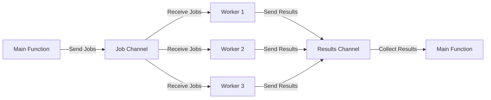

## 5.1 Worker Pools

Concurrency is a core feature of Go, enabling developers to build efficient and scalable applications. One of the most effective concurrency design patterns in Go is the Worker Pool pattern. This pattern helps manage a fixed number of worker goroutines to process tasks concurrently, optimizing resource usage and improving application performance. In this section, we will delve into the implementation of Worker Pools, explore job queue management, result handling, and graceful shutdown techniques.

### Introduction to Worker Pools

The Worker Pool pattern is designed to handle a large number of tasks using a limited number of resources. By defining a fixed number of worker goroutines, the pattern ensures that system resources are not overwhelmed, providing a balance between concurrency and resource consumption. This pattern is particularly useful in scenarios where tasks are independent and can be processed in parallel.

### Implementing a Worker Pool

#### Defining Worker Goroutines

The first step in implementing a Worker Pool is to define a fixed number of worker goroutines that listen on a job channel. Each worker will continuously wait for tasks to arrive on the channel and process them as they come.

```go
package main

import (
	"fmt"
	"sync"
	"time"
)

// Worker function that processes jobs from the job channel
func worker(id int, jobs <-chan int, results chan<- int, wg *sync.WaitGroup) {
	defer wg.Done()
	for job := range jobs {
		fmt.Printf("Worker %d processing job %d\n", id, job)
		time.Sleep(time.Second) // Simulate work
		results <- job * 2      // Simulate result
	}
}

func main() {
	const numWorkers = 3
	const numJobs = 5

	jobs := make(chan int, numJobs)
	results := make(chan int, numJobs)

	var wg sync.WaitGroup

	// Start worker goroutines
	for w := 1; w <= numWorkers; w++ {
		wg.Add(1)
		go worker(w, jobs, results, &wg)
	}

	// Send jobs to the job channel
	for j := 1; j <= numJobs; j++ {
		jobs <- j
	}
	close(jobs)

	// Wait for all workers to finish
	wg.Wait()
	close(results)

	// Collect results
	for result := range results {
		fmt.Printf("Result: %d\n", result)
	}
}
```

### Job Queue Management

#### Using a Buffered Channel

To prevent overwhelming the workers, a buffered channel is used as a job queue. This allows jobs to be queued up when all workers are busy, providing a buffer that can absorb bursts of incoming tasks.

#### Monitoring Backpressure

Monitoring the length of the job queue is crucial to managing backpressure. If the queue becomes too long, it may indicate that the workers are unable to keep up with the incoming tasks, necessitating adjustments such as increasing the number of workers or optimizing task processing.

### Result Handling

#### Collecting Results

Results from workers can be collected via a results channel. This channel aggregates the outputs of all workers, allowing for further processing or storage.

#### Aggregating Results

In some cases, it may be necessary to use a separate goroutine to aggregate results, especially if the result processing is complex or time-consuming.

```go
// Example of result aggregation
func aggregateResults(results <-chan int) {
	for result := range results {
		fmt.Printf("Aggregated Result: %d\n", result)
	}
}
```

### Graceful Shutdown

#### Signaling Completion

To gracefully shut down the worker pool, the job channel is closed to signal to the workers that no more jobs will arrive. This allows workers to complete their current tasks and exit cleanly.

#### Using `sync.WaitGroup`

The `sync.WaitGroup` is used to wait for all workers to complete processing before shutting down the application. This ensures that all tasks are finished and results are collected before exiting.

### Visualizing the Worker Pool

Below is a conceptual diagram illustrating the Worker Pool pattern, showing the flow of jobs and results between the main function and worker goroutines.



### Use Cases

The Worker Pool pattern is applicable in various real-world scenarios, such as:

- **Web Servers:** Handling multiple incoming requests concurrently.
- **Data Processing Pipelines:** Processing large datasets in parallel.
- **Task Scheduling Systems:** Distributing tasks across multiple workers for efficient execution.

### Advantages and Disadvantages

#### Advantages

- **Resource Efficiency:** Limits the number of concurrent tasks to prevent resource exhaustion.
- **Scalability:** Easily scales by adjusting the number of workers.
- **Simplicity:** Provides a straightforward model for concurrent task processing.

#### Disadvantages

- **Complexity in Result Handling:** May require additional logic for aggregating and processing results.
- **Potential Bottlenecks:** If not properly managed, the job queue can become a bottleneck.

### Best Practices

- **Monitor Queue Length:** Regularly check the job queue length to detect and address bottlenecks.
- **Optimize Task Processing:** Ensure that tasks are processed efficiently to prevent worker starvation.
- **Use Context for Cancellation:** Implement context-based cancellation to handle shutdowns gracefully.

### Conclusion

The Worker Pool pattern is a powerful tool in Go's concurrency toolkit, enabling efficient and scalable task processing. By managing a fixed number of worker goroutines, it balances resource usage and concurrency, making it ideal for a wide range of applications. By following best practices and understanding its advantages and limitations, developers can leverage this pattern to build robust and performant Go applications.

## Quiz Time!



### What is the primary purpose of the Worker Pool pattern in Go?

- [x] To manage a fixed number of worker goroutines for efficient task processing
- [ ] To create an unlimited number of goroutines for maximum concurrency
- [ ] To handle only one task at a time
- [ ] To eliminate the need for channels in Go

> **Explanation:** The Worker Pool pattern is designed to manage a fixed number of worker goroutines, optimizing resource usage and ensuring efficient task processing.

### How do you prevent overwhelming workers in a Worker Pool?

- [x] Use a buffered channel as a job queue
- [ ] Increase the number of workers indefinitely
- [ ] Use a single goroutine for all tasks
- [ ] Avoid using channels altogether

> **Explanation:** A buffered channel acts as a job queue, allowing tasks to be queued when all workers are busy, thus preventing them from being overwhelmed.

### What role does `sync.WaitGroup` play in a Worker Pool?

- [x] It waits for all workers to complete processing before shutting down
- [ ] It increases the number of workers dynamically
- [ ] It manages the job queue length
- [ ] It handles result aggregation

> **Explanation:** `sync.WaitGroup` is used to wait for all workers to finish processing, ensuring a graceful shutdown of the worker pool.

### How can results from workers be collected in a Worker Pool?

- [x] By using a results channel
- [ ] By printing directly from each worker
- [ ] By storing results in a global variable
- [ ] By using a single goroutine for all tasks

> **Explanation:** A results channel is used to collect outputs from all workers, allowing for further processing or storage.

### What is a potential disadvantage of the Worker Pool pattern?

- [x] Complexity in result handling
- [ ] Unlimited resource usage
- [ ] Lack of concurrency
- [ ] Inability to scale

> **Explanation:** Result handling can become complex, especially if aggregation or further processing is required.

### How can you signal workers that no more jobs will arrive?

- [x] Close the job channel
- [ ] Send a special "stop" job
- [ ] Use a global variable
- [ ] Terminate the program abruptly

> **Explanation:** Closing the job channel signals to workers that no more jobs will arrive, allowing them to complete their current tasks and exit.

### Which Go feature is essential for managing concurrent tasks in a Worker Pool?

- [x] Goroutines and channels
- [ ] Interfaces
- [ ] Reflection
- [ ] Struct embedding

> **Explanation:** Goroutines and channels are essential for managing concurrent tasks, enabling communication and synchronization between workers.

### What is a common use case for the Worker Pool pattern?

- [x] Web servers handling multiple requests
- [ ] Single-threaded applications
- [ ] Programs without any concurrency
- [ ] Applications that do not process tasks

> **Explanation:** The Worker Pool pattern is commonly used in web servers to handle multiple incoming requests concurrently.

### How can you optimize task processing in a Worker Pool?

- [x] Ensure tasks are processed efficiently to prevent worker starvation
- [ ] Increase the number of workers indefinitely
- [ ] Use a single goroutine for all tasks
- [ ] Avoid using channels altogether

> **Explanation:** Optimizing task processing ensures that workers are not starved and can handle tasks efficiently.

### True or False: The Worker Pool pattern eliminates the need for channels in Go.

- [ ] True
- [x] False

> **Explanation:** False. Channels are a fundamental part of the Worker Pool pattern, used for communication between the main function and worker goroutines.


