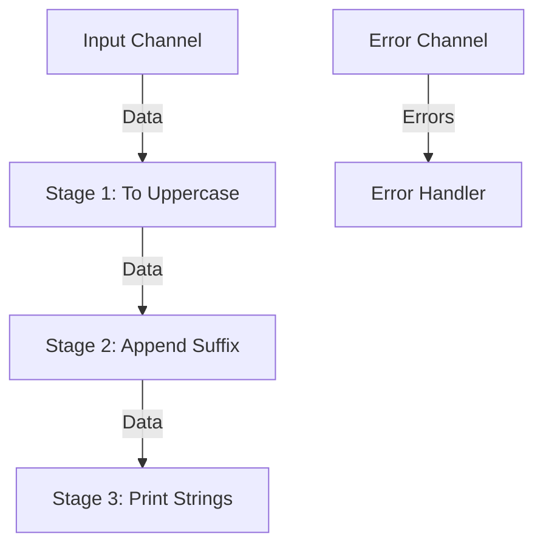

## 5.2 Pipeline Pattern

In the realm of concurrent programming, the Pipeline Pattern stands out as a robust design pattern that facilitates efficient data processing by organizing tasks into a series of stages. Each stage is responsible for a specific operation, and data flows through these stages, allowing for concurrent execution and improved performance. This pattern is particularly well-suited for Go, given its native support for goroutines and channels, which provide the necessary building blocks for implementing pipelines.

### Introduction

The Pipeline Pattern is a powerful tool for structuring concurrent programs. It allows developers to break down complex processing tasks into smaller, manageable stages, each running concurrently. This not only enhances performance but also improves code readability and maintainability by promoting separation of concerns.

### Detailed Explanation

#### Stage Design

At the heart of the Pipeline Pattern is the concept of stages. Each stage is a function that performs a specific task, processes input data, and sends the output to the next stage. The stages are connected by channels, which facilitate communication between them.

- **Goroutines and Channels:** Each stage runs in its own goroutine, allowing for concurrent execution. Channels are used to pass data between stages, ensuring thread-safe communication.
- **Reusability and Composability:** Stages should be designed to be reusable and composable. This means they should perform a single, well-defined task and be easily combined with other stages to form complex pipelines.

Here's a simple example of a pipeline with three stages:

```go
package main

import (
	"fmt"
	"strings"
)

// Stage 1: Convert input strings to uppercase
func toUpperCase(input <-chan string) <-chan string {
	output := make(chan string)
	go func() {
		defer close(output)
		for str := range input {
			output <- strings.ToUpper(str)
		}
	}()
	return output
}

// Stage 2: Append a suffix to each string
func appendSuffix(input <-chan string, suffix string) <-chan string {
	output := make(chan string)
	go func() {
		defer close(output)
		for str := range input {
			output <- str + suffix
		}
	}()
	return output
}

// Stage 3: Print each string
func printStrings(input <-chan string) {
	for str := range input {
		fmt.Println(str)
	}
}

func main() {
	input := make(chan string)
	go func() {
		defer close(input)
		input <- "hello"
		input <- "world"
	}()

	// Create the pipeline
	stage1 := toUpperCase(input)
	stage2 := appendSuffix(stage1, "!")
	printStrings(stage2)
}
```

In this example, the pipeline consists of three stages: converting strings to uppercase, appending a suffix, and printing the strings. Each stage runs concurrently, processing data as it becomes available.

#### Error Propagation

Handling errors in a pipeline can be challenging, especially when dealing with multiple stages. There are two common approaches to error propagation in pipelines:

1. **Error Channel:** Use a separate channel to pass errors alongside the data. Each stage can send errors to this channel, and a dedicated goroutine can handle them.

2. **Integrated Error Handling:** Integrate error handling into the data channel by using a struct or a tuple that includes both the data and any associated error.

Here's an example using an error channel:

```go
package main

import (
	"errors"
	"fmt"
	"strings"
)

// Stage 1: Convert input strings to uppercase, with error handling
func toUpperCaseWithError(input <-chan string, errors chan<- error) <-chan string {
	output := make(chan string)
	go func() {
		defer close(output)
		for str := range input {
			if str == "" {
				errors <- errors.New("empty string")
				continue
			}
			output <- strings.ToUpper(str)
		}
	}()
	return output
}

func main() {
	input := make(chan string)
	errors := make(chan error)

	go func() {
		defer close(input)
		input <- "hello"
		input <- ""
		input <- "world"
	}()

	// Create the pipeline with error handling
	stage1 := toUpperCaseWithError(input, errors)

	go func() {
		for err := range errors {
			fmt.Println("Error:", err)
		}
	}()

	for str := range stage1 {
		fmt.Println(str)
	}
}
```

In this example, an error channel is used to propagate errors from the `toUpperCaseWithError` stage. The main function listens for errors and prints them as they occur.

#### Cancellation Support

To support cancellation and timeouts, the `context.Context` package in Go provides a powerful mechanism. By passing a context to each stage, you can signal cancellation and manage timeouts effectively.

Here's how you can implement cancellation support in a pipeline:

```go
package main

import (
	"context"
	"fmt"
	"strings"
	"time"
)

// Stage 1: Convert input strings to uppercase with context support
func toUpperCaseWithContext(ctx context.Context, input <-chan string) <-chan string {
	output := make(chan string)
	go func() {
		defer close(output)
		for {
			select {
			case <-ctx.Done():
				return
			case str, ok := <-input:
				if !ok {
					return
				}
				output <- strings.ToUpper(str)
			}
		}
	}()
	return output
}

func main() {
	ctx, cancel := context.WithTimeout(context.Background(), 2*time.Second)
	defer cancel()

	input := make(chan string)

	go func() {
		defer close(input)
		input <- "hello"
		time.Sleep(3 * time.Second) // Simulate a delay
		input <- "world"
	}()

	// Create the pipeline with context support
	stage1 := toUpperCaseWithContext(ctx, input)

	for str := range stage1 {
		fmt.Println(str)
	}
}
```

In this example, the `toUpperCaseWithContext` stage checks the context for cancellation signals. If the context is canceled, the stage exits gracefully.

### Visual Aids

To better understand the flow of data and control in a pipeline, consider the following diagram illustrating a simple pipeline with three stages:



### Use Cases

The Pipeline Pattern is versatile and can be applied to various scenarios, including:

- **Data Processing:** Transforming and processing large datasets in a concurrent manner.
- **Image Processing:** Applying a series of filters or transformations to images.
- **Log Processing:** Analyzing and processing log files in real-time.
- **ETL Pipelines:** Extracting, transforming, and loading data from various sources.

### Advantages and Disadvantages

**Advantages:**

- **Concurrency:** Efficiently utilizes system resources by running stages concurrently.
- **Modularity:** Promotes separation of concerns, making code easier to understand and maintain.
- **Scalability:** Easily scales by adding more stages or increasing the number of goroutines.

**Disadvantages:**

- **Complexity:** Managing channels and goroutines can introduce complexity, especially in error handling and cancellation.
- **Debugging:** Concurrent execution can make debugging more challenging.

### Best Practices

- **Design for Reusability:** Ensure stages perform a single task and can be reused in different pipelines.
- **Handle Errors Gracefully:** Use dedicated error channels or integrate error handling into the data flow.
- **Support Cancellation:** Use contexts to manage cancellation and timeouts, especially in long-running stages.
- **Monitor Performance:** Profile and monitor pipelines to identify bottlenecks and optimize performance.

### Comparisons

The Pipeline Pattern is often compared to other concurrency patterns like the Fan-Out/Fan-In pattern. While both patterns involve concurrent processing, the Pipeline Pattern is more structured, with a clear sequence of stages, whereas Fan-Out/Fan-In focuses on distributing tasks across multiple workers and aggregating results.

### Conclusion

The Pipeline Pattern is a powerful concurrency design pattern that leverages Go's strengths in goroutines and channels. By structuring tasks into stages, it enables efficient data processing and enhances code maintainability. When implemented with best practices, it can significantly improve the performance and scalability of Go applications.

## Quiz Time!



### What is the primary purpose of the Pipeline Pattern in Go?

- [x] To organize tasks into a series of stages for concurrent execution
- [ ] To manage database connections efficiently
- [ ] To simplify error handling in Go applications
- [ ] To enhance user interface responsiveness

> **Explanation:** The Pipeline Pattern is designed to organize tasks into stages, allowing for concurrent execution and efficient data processing.

### How are stages in a pipeline typically connected?

- [x] Using channels
- [ ] Using mutexes
- [ ] Using files
- [ ] Using HTTP requests

> **Explanation:** Stages in a pipeline are connected using channels, which facilitate communication between goroutines.

### What is a common method for propagating errors in a pipeline?

- [x] Using a separate error channel
- [ ] Ignoring errors
- [ ] Logging errors to a file
- [ ] Using global variables

> **Explanation:** A separate error channel is often used to propagate errors alongside data in a pipeline.

### How can cancellation be supported in a pipeline?

- [x] By passing a context to each stage
- [ ] By using global variables
- [ ] By setting a timeout on channels
- [ ] By using a mutex

> **Explanation:** Passing a `context.Context` to each stage allows for cancellation and timeout management.

### What is a key advantage of the Pipeline Pattern?

- [x] It promotes concurrency and efficient resource utilization
- [ ] It simplifies user interface design
- [ ] It eliminates the need for error handling
- [ ] It reduces code readability

> **Explanation:** The Pipeline Pattern promotes concurrency, allowing stages to run concurrently and utilize system resources efficiently.

### Which Go feature is essential for implementing the Pipeline Pattern?

- [x] Goroutines and channels
- [ ] Reflection
- [ ] Interfaces
- [ ] Structs

> **Explanation:** Goroutines and channels are essential for implementing the Pipeline Pattern, enabling concurrent execution and communication.

### What is a disadvantage of the Pipeline Pattern?

- [x] Managing channels and goroutines can introduce complexity
- [ ] It cannot handle large datasets
- [ ] It is not compatible with Go
- [ ] It requires a graphical user interface

> **Explanation:** Managing channels and goroutines can introduce complexity, especially in error handling and cancellation.

### In what scenario is the Pipeline Pattern particularly useful?

- [x] Real-time log processing
- [ ] Static website hosting
- [ ] Single-threaded applications
- [ ] Simple arithmetic operations

> **Explanation:** The Pipeline Pattern is useful for real-time log processing, where data needs to be processed concurrently.

### What is a best practice when designing pipeline stages?

- [x] Ensure stages perform a single task and are reusable
- [ ] Use global variables for communication
- [ ] Avoid using channels
- [ ] Combine multiple tasks into a single stage

> **Explanation:** Stages should perform a single task and be reusable, promoting modularity and maintainability.

### True or False: The Pipeline Pattern can only be used for data processing tasks.

- [ ] True
- [x] False

> **Explanation:** The Pipeline Pattern can be used for various tasks, including image processing, ETL pipelines, and more.


