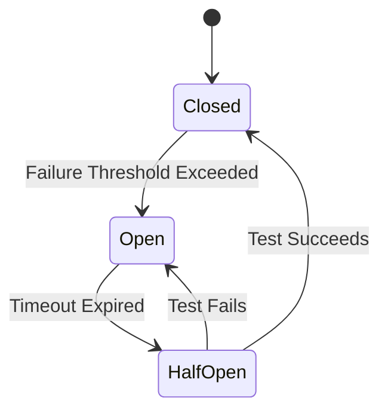

## 5.7 Circuit Breaker

In modern software systems, especially those involving microservices and distributed architectures, resilience is a key concern. The Circuit Breaker design pattern is a critical tool for managing failures and ensuring that your application can gracefully handle errors in external services. This pattern is particularly useful in Go, where concurrency and network interactions are common.

### Introduction

The Circuit Breaker pattern is inspired by electrical circuit breakers, which prevent electrical overloads by interrupting the flow of electricity. Similarly, in software, a Circuit Breaker prevents an application from repeatedly attempting to execute an operation that's likely to fail, thereby avoiding cascading failures and providing a fallback mechanism.

### Detailed Explanation

The Circuit Breaker pattern involves three primary states:

1. **Closed State:** The circuit is in normal operation. Requests are allowed to pass through, and the system monitors for failures.
2. **Open State:** The circuit is tripped due to a high failure rate. Requests are blocked to prevent further strain on the failing service.
3. **Half-Open State:** After a predefined period, the circuit allows a limited number of test requests to determine if the external service has recovered.

#### Circuit Breaker States

- **Closed State:** In this state, the Circuit Breaker allows all requests to pass through while monitoring the success and failure rates. If the failure rate exceeds a certain threshold, the circuit transitions to the Open state.

- **Open State:** When the failure threshold is exceeded, the Circuit Breaker opens, blocking all requests to the failing service. This state prevents the application from making requests that are likely to fail, reducing the load on the service and allowing it time to recover.

- **Half-Open State:** After a specified timeout, the Circuit Breaker transitions to the Half-Open state. In this state, it allows a limited number of requests to test if the service has recovered. If the requests succeed, the circuit closes; if they fail, the circuit reopens.

#### Failure Detection

Effective failure detection is crucial for the Circuit Breaker pattern. It involves:

- **Monitoring Error Rates:** Track the number of failed requests over a rolling window to determine if the failure rate exceeds the threshold.
- **Consecutive Failures:** Count consecutive failures to decide when to open the circuit.
- **Rolling Windows:** Use a time-based window to make decisions based on recent performance, ensuring that transient issues do not trigger the circuit unnecessarily.

#### Recovery

Recovery is managed through the Half-Open state:

- **Testing Recovery:** After a delay, the Circuit Breaker allows a limited number of requests to test the service's recovery.
- **Closing the Circuit:** If the test requests succeed, the circuit transitions back to the Closed state.
- **Reopening the Circuit:** If the test requests fail, the circuit returns to the Open state, and the process repeats.

### Visual Aids

Below is a conceptual diagram illustrating the Circuit Breaker states and transitions:



### Code Example

Let's implement a simple Circuit Breaker in Go using the `sony/gobreaker` library, which provides a robust implementation of the pattern.

```go
package main

import (
    "fmt"
    "net/http"
    "time"

    "github.com/sony/gobreaker"
)

func main() {
    cb := gobreaker.NewCircuitBreaker(gobreaker.Settings{
        Name:        "HTTP GET",
        MaxRequests: 1,
        Interval:    0,
        Timeout:     5 * time.Second,
        ReadyToTrip: func(counts gobreaker.Counts) bool {
            return counts.ConsecutiveFailures > 3
        },
    })

    for i := 0; i < 10; i++ {
        result, err := cb.Execute(func() (interface{}, error) {
            resp, err := http.Get("http://example.com")
            if err != nil {
                return nil, err
            }
            defer resp.Body.Close()
            return resp.Status, nil
        })

        if err != nil {
            fmt.Println("Request failed:", err)
        } else {
            fmt.Println("Request succeeded:", result)
        }

        time.Sleep(1 * time.Second)
    }
}
```

### Use Cases

- **Microservices Communication:** Prevent cascading failures in microservices architectures by managing service-to-service communication failures.
- **Third-Party API Calls:** Protect your application from failures in external API calls by using a Circuit Breaker to manage retries and fallbacks.
- **Database Connections:** Use Circuit Breakers to manage database connection failures, ensuring that your application can continue to function even if the database is temporarily unavailable.

### Advantages and Disadvantages

#### Advantages

- **Resilience:** Enhances system resilience by preventing repeated failures and allowing time for recovery.
- **Resource Optimization:** Reduces unnecessary load on failing services, allowing them to recover.
- **Improved User Experience:** Provides a fallback mechanism, improving the overall user experience during failures.

#### Disadvantages

- **Complexity:** Introduces additional complexity in managing state transitions and thresholds.
- **Latency:** May introduce latency due to the need to monitor and manage state transitions.

### Best Practices

- **Threshold Configuration:** Carefully configure thresholds and timeouts based on your application's needs and the characteristics of the external services.
- **Monitoring:** Implement robust monitoring to track the performance of the Circuit Breaker and adjust settings as needed.
- **Fallback Strategies:** Design effective fallback strategies to ensure that your application can continue to provide value even when services are unavailable.

### Comparisons

The Circuit Breaker pattern is often compared with the Retry pattern. While both aim to handle failures, the Circuit Breaker is more suitable for preventing cascading failures and managing persistent issues, whereas the Retry pattern is better for transient failures.

### Conclusion

The Circuit Breaker pattern is a powerful tool for enhancing the resilience of Go applications, particularly in distributed systems. By managing failures and preventing cascading errors, it ensures that your application can continue to operate smoothly even in the face of external service failures. Implementing this pattern using libraries like `sony/gobreaker` simplifies the process and allows you to focus on building robust, fault-tolerant systems.

## Quiz Time!



### What is the primary purpose of the Circuit Breaker pattern?

- [x] To prevent cascading failures in distributed systems
- [ ] To improve the performance of HTTP requests
- [ ] To manage database transactions
- [ ] To optimize memory usage

> **Explanation:** The Circuit Breaker pattern is designed to prevent cascading failures by managing requests to failing services.

### Which state allows a limited number of requests to test if a service has recovered?

- [ ] Closed
- [ ] Open
- [x] Half-Open
- [ ] Tripped

> **Explanation:** In the Half-Open state, the Circuit Breaker allows a limited number of requests to test if the service has recovered.

### What triggers the transition from Closed to Open state?

- [ ] Successful requests
- [x] Failure threshold exceeded
- [ ] Timeout expired
- [ ] Manual intervention

> **Explanation:** The transition from Closed to Open state occurs when the failure threshold is exceeded.

### Which library is commonly used in Go to implement the Circuit Breaker pattern?

- [ ] gorilla/mux
- [x] sony/gobreaker
- [ ] go-kit
- [ ] logrus

> **Explanation:** The `sony/gobreaker` library is commonly used in Go to implement the Circuit Breaker pattern.

### What is a key advantage of using the Circuit Breaker pattern?

- [x] Enhances system resilience
- [ ] Reduces code complexity
- [ ] Increases memory usage
- [ ] Simplifies database queries

> **Explanation:** The Circuit Breaker pattern enhances system resilience by preventing repeated failures and allowing time for recovery.

### What is the main disadvantage of the Circuit Breaker pattern?

- [ ] It reduces system resilience
- [x] It introduces additional complexity
- [ ] It increases memory usage
- [ ] It simplifies error handling

> **Explanation:** The main disadvantage of the Circuit Breaker pattern is that it introduces additional complexity in managing state transitions and thresholds.

### How does the Circuit Breaker pattern improve user experience?

- [x] By providing a fallback mechanism during failures
- [ ] By increasing the speed of HTTP requests
- [ ] By optimizing memory usage
- [ ] By simplifying database transactions

> **Explanation:** The Circuit Breaker pattern improves user experience by providing a fallback mechanism during failures.

### What is the role of rolling windows in failure detection?

- [x] To make decisions based on recent performance
- [ ] To increase the speed of HTTP requests
- [ ] To manage database transactions
- [ ] To optimize memory usage

> **Explanation:** Rolling windows are used in failure detection to make decisions based on recent performance, ensuring that transient issues do not trigger the circuit unnecessarily.

### In which state are all requests blocked?

- [ ] Closed
- [x] Open
- [ ] Half-Open
- [ ] Tripped

> **Explanation:** In the Open state, all requests are blocked to prevent further strain on the failing service.

### True or False: The Circuit Breaker pattern is only useful for HTTP requests.

- [ ] True
- [x] False

> **Explanation:** False. The Circuit Breaker pattern is useful for various types of operations, including HTTP requests, database connections, and more.


