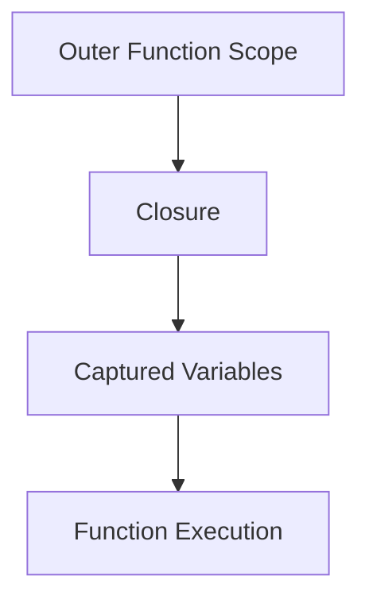

## 6.3 Closures and Lexical Scoping

In the realm of functional programming, closures and lexical scoping are fundamental concepts that empower developers to write more expressive and flexible code. In Go, these concepts are seamlessly integrated, allowing developers to create functions that capture and manipulate variables from their surrounding context. This article delves into the intricacies of closures and lexical scoping in Go, providing a comprehensive understanding along with practical examples and use cases.

### Introduction to Closures and Lexical Scoping

**Closures** are functions that capture variables from their surrounding lexical scope. This means that a closure can access and modify variables that were in scope when the closure was created, even after those variables have gone out of scope. This capability is particularly useful for maintaining state across function calls and creating function factories.

**Lexical Scoping**, on the other hand, refers to the visibility of variables within nested functions. In Go, a function can access variables declared in its outer scope, which is the essence of lexical scoping. This scoping rule is what enables closures to function effectively.

### Defining Closures in Go

In Go, defining a closure is straightforward. A closure is essentially an anonymous function that captures variables from its surrounding scope. Here's a simple example to illustrate this concept:

```go
package main

import "fmt"

func main() {
    // Define a closure that captures the variable `x`
    x := 10
    closure := func(y int) int {
        return x + y
    }

    // Call the closure with different arguments
    fmt.Println(closure(5))  // Output: 15
    fmt.Println(closure(10)) // Output: 20
}
```

In this example, the anonymous function `closure` captures the variable `x` from its surrounding scope. Each time the closure is called, it uses the captured value of `x` to compute the result.

### Maintaining State with Closures

One of the powerful features of closures is their ability to maintain state between function calls. This is particularly useful for creating functions that need to remember previous interactions. Consider the following example:

```go
package main

import "fmt"

// Counter returns a closure that increments and returns a counter value
func Counter() func() int {
    count := 0
    return func() int {
        count++
        return count
    }
}

func main() {
    counter := Counter()

    fmt.Println(counter()) // Output: 1
    fmt.Println(counter()) // Output: 2
    fmt.Println(counter()) // Output: 3
}
```

In this example, the `Counter` function returns a closure that captures the `count` variable. Each time the closure is called, it increments and returns the `count`, effectively maintaining state across calls.

### Use Cases for Closures

Closures have a wide range of applications in Go, from implementing memoization to creating function factories. Here are some common use cases:

#### Memoization or Caching

Memoization is an optimization technique that involves caching the results of expensive function calls and returning the cached result when the same inputs occur again. Closures are ideal for implementing memoization:

```go
package main

import "fmt"

// Memoize returns a closure that caches results of a function
func Memoize(f func(int) int) func(int) int {
    cache := make(map[int]int)
    return func(x int) int {
        if val, found := cache[x]; found {
            return val
        }
        result := f(x)
        cache[x] = result
        return result
    }
}

func main() {
    // Example function to memoize
    square := func(x int) int {
        return x * x
    }

    memoizedSquare := Memoize(square)

    fmt.Println(memoizedSquare(4)) // Output: 16
    fmt.Println(memoizedSquare(4)) // Output: 16 (cached result)
}
```

In this example, the `Memoize` function returns a closure that caches the results of the `square` function, avoiding redundant calculations.

#### Function Factories

Closures can also be used to create function factories, which are functions that return other functions with specific behaviors. This is useful for generating customized functions on the fly:

```go
package main

import "fmt"

// Adder returns a closure that adds a fixed number to its argument
func Adder(x int) func(int) int {
    return func(y int) int {
        return x + y
    }
}

func main() {
    addFive := Adder(5)
    addTen := Adder(10)

    fmt.Println(addFive(3))  // Output: 8
    fmt.Println(addTen(3))   // Output: 13
}
```

Here, the `Adder` function returns a closure that adds a fixed number `x` to its argument `y`. This allows for the creation of specialized adder functions like `addFive` and `addTen`.

### Visualizing Closures and Lexical Scoping

To better understand how closures capture variables from their lexical scope, consider the following diagram:



In this diagram, the closure captures variables from the outer function scope and retains access to them during its execution.

### Advantages and Disadvantages

**Advantages:**
- **State Maintenance:** Closures can maintain state across function calls, making them ideal for tasks like memoization and stateful computations.
- **Encapsulation:** They encapsulate behavior and state, promoting modular and reusable code.
- **Flexibility:** Closures allow for the creation of flexible and dynamic functions.

**Disadvantages:**
- **Complexity:** Overuse of closures can lead to complex and difficult-to-read code.
- **Memory Usage:** Capturing large variables can increase memory usage, especially if closures are long-lived.

### Best Practices for Using Closures

- **Keep It Simple:** Use closures judiciously to avoid unnecessary complexity.
- **Limit Scope:** Capture only the variables you need to minimize memory usage.
- **Document Behavior:** Clearly document the behavior and purpose of closures to enhance code readability.

### Conclusion

Closures and lexical scoping are powerful tools in Go's functional programming arsenal. By understanding and leveraging these concepts, developers can create more expressive, flexible, and efficient code. Whether you're implementing memoization, creating function factories, or maintaining state, closures offer a versatile solution to a wide range of programming challenges.

## Quiz Time!



### What is a closure in Go?

- [x] A function that captures variables from its surrounding scope.
- [ ] A function that cannot access variables outside its own scope.
- [ ] A function that is defined inside another function but does not capture any variables.
- [ ] A function that is used only for recursion.

> **Explanation:** A closure is a function that captures variables from its surrounding lexical scope, allowing it to access and manipulate those variables even after the scope has exited.

### What does lexical scoping mean?

- [x] Variables are accessible based on their position in the source code.
- [ ] Variables are accessible based on the order of function calls.
- [ ] Variables are accessible only within the function they are declared.
- [ ] Variables are accessible globally regardless of where they are declared.

> **Explanation:** Lexical scoping means that the accessibility of variables is determined by their position in the source code, allowing nested functions to access variables from their enclosing scopes.

### How can closures be used to maintain state?

- [x] By capturing and modifying variables from their surrounding scope.
- [ ] By defining global variables.
- [ ] By using static variables.
- [ ] By using only local variables.

> **Explanation:** Closures can maintain state by capturing variables from their surrounding scope and modifying them across function calls.

### What is a common use case for closures in Go?

- [x] Implementing memoization or caching.
- [ ] Creating global variables.
- [ ] Defining static functions.
- [ ] Writing recursive functions.

> **Explanation:** A common use case for closures is implementing memoization, where results of expensive function calls are cached for future use.

### What is a function factory?

- [x] A function that returns other functions with specific behaviors.
- [ ] A function that creates objects.
- [ ] A function that only processes data.
- [ ] A function that is used for testing.

> **Explanation:** A function factory is a function that returns other functions, often with specific behaviors or configurations.

### What is the main advantage of using closures?

- [x] They allow functions to maintain state across calls.
- [ ] They make code run faster.
- [ ] They reduce the number of lines of code.
- [ ] They eliminate the need for variables.

> **Explanation:** The main advantage of closures is their ability to maintain state across function calls by capturing variables from their surrounding scope.

### How do closures affect memory usage?

- [x] They can increase memory usage if they capture large variables.
- [ ] They always decrease memory usage.
- [ ] They have no effect on memory usage.
- [ ] They eliminate memory usage.

> **Explanation:** Closures can increase memory usage if they capture large variables, especially if the closures are long-lived.

### What should you document when using closures?

- [x] The behavior and purpose of the closure.
- [ ] The number of lines of code.
- [ ] The speed of execution.
- [ ] The number of variables used.

> **Explanation:** It's important to document the behavior and purpose of closures to enhance code readability and maintainability.

### What is a potential disadvantage of using closures?

- [x] They can lead to complex and difficult-to-read code.
- [ ] They always make code faster.
- [ ] They reduce the need for documentation.
- [ ] They eliminate the need for functions.

> **Explanation:** A potential disadvantage of closures is that they can lead to complex and difficult-to-read code if overused or misused.

### True or False: Closures can only be used in functional programming languages.

- [ ] True
- [x] False

> **Explanation:** False. Closures can be used in many programming languages, including Go, which is not strictly a functional programming language.


