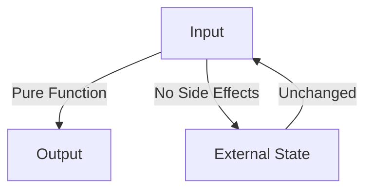

## 6.4 Pure Functions and Immutability

In the realm of functional programming, pure functions and immutability stand as pillars that promote code reliability, testability, and concurrency safety. This section delves into these concepts within the context of Go, illustrating their importance and application.

### Introduction to Pure Functions

Pure functions are a fundamental concept in functional programming. A pure function is defined by two main characteristics:

1. **No Side Effects:** A pure function does not alter any external state. It does not modify global variables, input parameters, or perform any I/O operations that could affect the outside world.
2. **Deterministic Output:** Given the same input, a pure function will always return the same output. This predictability makes pure functions easy to test and reason about.

#### Example of a Pure Function in Go

```go
// Pure function: Computes the square of a number
func square(x int) int {
    return x * x
}
```

In this example, the `square` function is pure because it does not modify any external state and consistently returns the same result for a given input.

### Writing Pure Functions in Go

To write pure functions in Go, adhere to the following guidelines:

- **Avoid Side Effects:** Ensure that your functions do not modify global variables, perform I/O operations, or alter input parameters.
- **Return Values:** Always return new values instead of modifying existing ones.
- **Use Local Variables:** Confine changes to local variables within the function scope.

#### Example: Converting an Impure Function to a Pure Function

Consider the following impure function:

```go
// Impure function: Modifies the input slice
func doubleValues(values []int) {
    for i := range values {
        values[i] *= 2
    }
}
```

To make it pure, we can modify it to return a new slice:

```go
// Pure function: Returns a new slice with doubled values
func doubleValuesPure(values []int) []int {
    result := make([]int, len(values))
    for i, v := range values {
        result[i] = v * 2
    }
    return result
}
```

### Benefits of Pure Functions

- **Simplified Testing:** Pure functions are easy to test because they do not depend on external state. You can test them with a variety of inputs and expect consistent outputs.
- **Concurrency Safety:** By avoiding shared mutable state, pure functions enhance concurrency safety, reducing the risk of race conditions.
- **Predictability and Debugging:** Pure functions are predictable, making them easier to debug and reason about.

### Immutability in Go

Immutability refers to the concept of data that cannot be changed once created. While Go does not enforce immutability by default, you can achieve it through careful design.

#### Implementing Immutability

- **Use `const` for Constants:** Declare constant values using the `const` keyword.
- **Avoid Modifying Structs:** Instead of modifying a struct, create a new instance with the desired changes.
- **Use Copying:** When passing data, consider copying it to prevent unintended modifications.

#### Example: Immutable Structs

```go
type Point struct {
    X, Y int
}

// Immutable function: Returns a new Point with updated coordinates
func movePoint(p Point, dx, dy int) Point {
    return Point{X: p.X + dx, Y: p.Y + dy}
}
```

In this example, the `movePoint` function returns a new `Point` instead of modifying the original, maintaining immutability.

### Visualizing Pure Functions and Immutability

To better understand these concepts, consider the following diagram illustrating the flow of data in pure functions:



This diagram shows that pure functions take input and produce output without altering external state.

### Use Cases for Pure Functions and Immutability

- **Functional Programming:** Pure functions are a cornerstone of functional programming, promoting modular and reusable code.
- **Concurrent Applications:** In concurrent applications, immutability reduces the complexity of managing shared state.
- **Data Transformation:** Pure functions are ideal for transforming data, such as in map-reduce operations.

### Advantages and Disadvantages

#### Advantages

- **Ease of Testing and Debugging:** Pure functions are straightforward to test and debug due to their deterministic nature.
- **Concurrency Safety:** Immutability and pure functions reduce the risk of race conditions in concurrent environments.

#### Disadvantages

- **Performance Overhead:** Creating new instances instead of modifying existing ones can lead to performance overhead.
- **Memory Usage:** Immutability may increase memory usage due to the creation of new objects.

### Best Practices for Implementing Pure Functions and Immutability

- **Design for Immutability:** Prefer immutable data structures and functions that do not modify state.
- **Leverage Go's Features:** Use Go's built-in features, such as slices and maps, to manage data efficiently.
- **Balance Performance and Immutability:** Consider the trade-offs between performance and immutability, optimizing where necessary.

### Conclusion

Pure functions and immutability are powerful concepts that enhance code reliability, testability, and concurrency safety. By understanding and applying these principles in Go, you can write more robust and maintainable software. As you continue to explore functional programming patterns, consider how these concepts can be integrated into your projects for improved outcomes.

## Quiz Time!



### What is a key characteristic of a pure function?

- [x] It has no side effects.
- [ ] It modifies global state.
- [ ] It performs I/O operations.
- [ ] It returns different outputs for the same input.

> **Explanation:** A pure function does not have side effects and always returns the same output for the same input.

### How can you achieve immutability in Go?

- [x] By creating new instances instead of modifying existing ones.
- [ ] By using global variables.
- [ ] By modifying input parameters.
- [ ] By performing I/O operations.

> **Explanation:** Immutability can be achieved by creating new instances rather than modifying existing data.

### Which of the following is a benefit of pure functions?

- [x] Simplified testing.
- [ ] Increased memory usage.
- [ ] Complexity in debugging.
- [ ] Increased risk of race conditions.

> **Explanation:** Pure functions simplify testing because they are deterministic and do not depend on external state.

### What does immutability help prevent in concurrent applications?

- [x] Race conditions.
- [ ] Memory leaks.
- [ ] Increased performance.
- [ ] Simplified testing.

> **Explanation:** Immutability helps prevent race conditions by avoiding shared mutable state.

### What is a disadvantage of immutability?

- [x] Performance overhead.
- [ ] Simplified testing.
- [ ] Concurrency safety.
- [ ] Predictability.

> **Explanation:** Immutability can lead to performance overhead due to the creation of new objects.

### How does Go support immutability?

- [x] Through careful design and use of copying.
- [ ] By enforcing immutability by default.
- [ ] By modifying global variables.
- [ ] By allowing side effects.

> **Explanation:** Go supports immutability through careful design, such as using copying and avoiding modifications.

### What is a pure function's relationship with external state?

- [x] It does not modify external state.
- [ ] It depends on external state.
- [ ] It alters external state.
- [ ] It performs I/O operations.

> **Explanation:** A pure function does not modify or depend on external state.

### Which keyword is used in Go to declare constant values?

- [x] `const`
- [ ] `var`
- [ ] `func`
- [ ] `type`

> **Explanation:** The `const` keyword is used to declare constant values in Go.

### What is a common use case for pure functions?

- [x] Data transformation.
- [ ] Modifying global state.
- [ ] Performing I/O operations.
- [ ] Altering input parameters.

> **Explanation:** Pure functions are commonly used for data transformation due to their deterministic nature.

### True or False: Pure functions can modify input parameters.

- [ ] True
- [x] False

> **Explanation:** Pure functions do not modify input parameters; they return new values instead.


