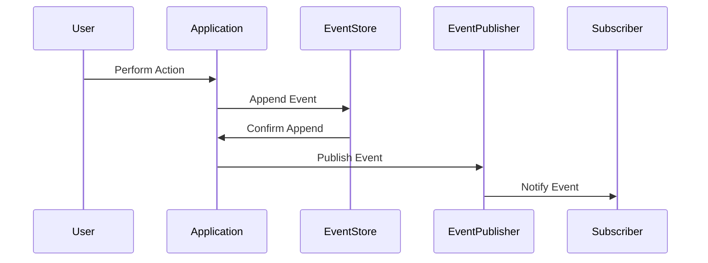

## 7.1 Event Sourcing

Event Sourcing is a powerful design pattern that records all changes to an application's state as a sequential series of events. This approach allows developers to reconstruct past states, providing robust auditing and debugging capabilities. In this article, we'll explore how to implement Event Sourcing in Go, leveraging its unique features and libraries to create efficient and scalable systems.

### Introduction to Event Sourcing

Event Sourcing is a design pattern where every change to the state of an application is captured as an event. These events are stored in an append-only log, allowing the system to reconstruct any past state by replaying the events. This pattern is particularly useful in systems that require complete audit trails, support for undo operations, or historical data analysis.

### Purpose of Event Sourcing

- **Record State Changes:** Capture every change to the application's state as an event.
- **Reconstruct Past States:** Enable the reconstruction of past states for auditing and debugging.
- **Support Historical Analysis:** Facilitate features like temporal queries and undo operations.

### Implementation Steps

#### 1. Define Events

The first step in implementing Event Sourcing is to define the events that represent state changes in your application. Each event should be a struct that includes all the necessary data to describe the change.

```go
type UserCreatedEvent struct {
    UserID    string
    Username  string
    Email     string
    CreatedAt time.Time
}

type UserUpdatedEvent struct {
    UserID   string
    NewEmail string
    UpdatedAt time.Time
}
```

#### 2. Event Store

An event store is a storage mechanism that persists events in order. It should support immutability and append-only operations to ensure the integrity of the event log.

```go
type EventStore interface {
    Append(event interface{}) error
    LoadEvents(aggregateID string) ([]interface{}, error)
}

type InMemoryEventStore struct {
    events map[string][]interface{}
}

func (store *InMemoryEventStore) Append(event interface{}) error {
    // Implementation for appending an event
}

func (store *InMemoryEventStore) LoadEvents(aggregateID string) ([]interface{}, error) {
    // Implementation for loading events
}
```

#### 3. State Reconstruction

To rebuild the current state, replay the events from the event store. For long event streams, use snapshots to optimize performance.

```go
type User struct {
    UserID   string
    Username string
    Email    string
}

func (u *User) Apply(event interface{}) {
    switch e := event.(type) {
    case UserCreatedEvent:
        u.UserID = e.UserID
        u.Username = e.Username
        u.Email = e.Email
    case UserUpdatedEvent:
        u.Email = e.NewEmail
    }
}

func RebuildState(events []interface{}) *User {
    user := &User{}
    for _, event := range events {
        user.Apply(event)
    }
    return user
}
```

#### 4. Event Publishing

Notify other components or services when new events occur. Use channels or message queues for event distribution.

```go
type EventPublisher interface {
    Publish(event interface{}) error
}

type SimplePublisher struct {
    subscribers []chan interface{}
}

func (p *SimplePublisher) Publish(event interface{}) error {
    for _, subscriber := range p.subscribers {
        subscriber <- event
    }
    return nil
}
```

### When to Use Event Sourcing

- **Audit Trails:** Systems requiring complete audit trails for compliance or debugging.
- **Historical Analysis:** Applications needing to analyze historical data or support undo operations.
- **Complex State Management:** Systems with complex state transitions that benefit from event-driven architectures.

### Go-Specific Tips

- **Concurrency:** Use Go's concurrency features, such as goroutines and channels, to handle event processing efficiently.
- **Interfaces:** Leverage Go's interfaces to create flexible and interchangeable event storage backends.

### Visual Aids

#### Event Sourcing Workflow



### Advantages and Disadvantages

#### Advantages

- **Auditability:** Provides a complete history of state changes.
- **Flexibility:** Supports complex state transitions and undo operations.
- **Scalability:** Efficiently handles large volumes of state changes.

#### Disadvantages

- **Complexity:** Increases system complexity due to event management.
- **Storage Requirements:** Requires significant storage for event logs.
- **Eventual Consistency:** May introduce eventual consistency in distributed systems.

### Best Practices

- **Event Versioning:** Implement versioning for events to handle schema changes gracefully.
- **Snapshotting:** Use snapshots to optimize state reconstruction performance.
- **Testing:** Thoroughly test event handling and state reconstruction logic.

### Comparisons

Event Sourcing can be compared to traditional CRUD operations, where state changes are directly applied to the database. While CRUD is simpler, Event Sourcing offers greater flexibility and auditability at the cost of increased complexity.

### Conclusion

Event Sourcing is a powerful pattern for managing state changes in Go applications. By capturing every change as an event, developers can build systems with robust auditing, debugging, and historical analysis capabilities. With Go's concurrency features and interfaces, implementing Event Sourcing can be both efficient and flexible.

## Quiz Time!



### What is the primary purpose of Event Sourcing?

- [x] To record all changes to application state as a sequential series of events.
- [ ] To store data in a relational database.
- [ ] To improve application performance.
- [ ] To simplify code complexity.

> **Explanation:** Event Sourcing captures every change to the application's state as an event, allowing for complete audit trails and state reconstruction.

### Which Go feature is particularly useful for handling event processing efficiently?

- [x] Goroutines and channels
- [ ] Struct embedding
- [ ] Reflection
- [ ] Pointers

> **Explanation:** Goroutines and channels are Go's concurrency features that enable efficient event processing.

### What is a key advantage of using Event Sourcing?

- [x] Provides a complete history of state changes.
- [ ] Reduces storage requirements.
- [ ] Simplifies system architecture.
- [ ] Ensures immediate consistency.

> **Explanation:** Event Sourcing offers a complete audit trail of all state changes, which is valuable for auditing and debugging.

### What is a common strategy to optimize performance in Event Sourcing?

- [x] Use snapshots
- [ ] Use reflection
- [ ] Use pointers
- [ ] Use global variables

> **Explanation:** Snapshots help optimize performance by reducing the need to replay long event streams.

### In Event Sourcing, what is the role of an Event Store?

- [x] To persist events in order and ensure immutability.
- [ ] To execute business logic.
- [ ] To render the user interface.
- [ ] To manage user sessions.

> **Explanation:** The Event Store is responsible for storing events in an append-only log, maintaining their order and immutability.

### Which of the following is a disadvantage of Event Sourcing?

- [x] Increases system complexity
- [ ] Reduces auditability
- [ ] Simplifies state management
- [ ] Decreases storage requirements

> **Explanation:** Event Sourcing can increase system complexity due to the need to manage events and state reconstruction.

### What is a common use case for Event Sourcing?

- [x] Systems requiring complete audit trails
- [ ] Simple CRUD applications
- [ ] Static websites
- [ ] Batch processing systems

> **Explanation:** Event Sourcing is ideal for systems that need complete audit trails and historical data analysis.

### How can Go's interfaces be leveraged in Event Sourcing?

- [x] To create flexible and interchangeable event storage backends.
- [ ] To manage memory allocation.
- [ ] To simplify pointer arithmetic.
- [ ] To handle HTTP requests.

> **Explanation:** Interfaces in Go allow for flexible implementations of event storage backends, enhancing modularity and testability.

### What is a potential drawback of using Event Sourcing in distributed systems?

- [x] May introduce eventual consistency
- [ ] Guarantees immediate consistency
- [ ] Reduces network latency
- [ ] Simplifies data replication

> **Explanation:** Event Sourcing can lead to eventual consistency in distributed systems due to the asynchronous nature of event processing.

### True or False: Event Sourcing is only suitable for small-scale applications.

- [ ] True
- [x] False

> **Explanation:** Event Sourcing is suitable for both small and large-scale applications, particularly those requiring audit trails and complex state management.


