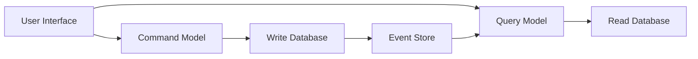

## 7.2 Command Query Responsibility Segregation (CQRS)

Command Query Responsibility Segregation (CQRS) is a powerful architectural pattern that separates the read and write operations of a system, allowing each to be optimized independently. This separation can lead to significant improvements in scalability, performance, and maintainability, especially in complex domains where read and write workloads differ substantially.

### Understanding CQRS

At its core, CQRS divides the system into two distinct models:

- **Command Model:** Handles all write operations, processing commands that change the state of the system.
- **Query Model:** Manages read operations, providing optimized data retrieval without affecting the write processes.

This separation allows each model to be tailored specifically to its purpose, leading to more efficient and scalable systems.

#### Conceptual Diagram

To better understand CQRS, let's visualize the separation of concerns:



In this diagram, the user interface interacts with both the command and query models. The command model updates the write database, which then triggers events stored in an event store. These events are used to update the read database, ensuring that the query model has the latest data.

### Implementation Steps

Implementing CQRS involves several key steps:

#### Define Command Model

1. **Implement Business Logic:** The command model should encapsulate all business logic required to process commands. This includes validation, authorization, and any other logic necessary to ensure that state changes are consistent and valid.

2. **State Management:** Commands should update the system's state in a way that maintains consistency. This often involves using transactions to ensure atomicity and isolation.

3. **Event Generation:** After processing a command, generate events that describe the changes made to the system. These events will be used to update the query model.

#### Define Query Model

1. **Read-Optimized Data Representations:** The query model should be designed for efficient data retrieval. This often involves creating denormalized views or projections that aggregate data in a way that supports fast queries.

2. **Data Projections:** Use projections to transform events into a format that is optimized for querying. This might involve flattening complex data structures or precomputing aggregates.

3. **Efficient Querying:** Ensure that the query model supports the types of queries your application needs to perform, optimizing for speed and responsiveness.

#### Synchronize Models

1. **Event Handling:** Use events generated by the command model to update the query model. This ensures that the read data is always up-to-date with the latest state changes.

2. **Eventual Consistency:** Accept that the query model may not always be immediately consistent with the command model. Instead, aim for eventual consistency, where updates propagate to the query model over time.

3. **Asynchronous Updates:** Implement asynchronous mechanisms, such as goroutines and channels in Go, to handle updates without blocking the main application flow.

### When to Use CQRS

CQRS is particularly beneficial in scenarios where:

- **Complex Domains:** The domain is complex, and the read and write workloads are significantly different.
- **High-Traffic Applications:** The application experiences high read and write loads, and separating these concerns can lead to better performance and scalability.
- **Scalability Needs:** The system needs to scale independently for read and write operations, allowing each to be optimized separately.

### Go-Specific Tips

When implementing CQRS in Go, consider the following tips:

- **Goroutines and Channels:** Use goroutines for handling asynchronous updates and channels for communication between components. This leverages Go's concurrency model to efficiently manage updates.
  
- **Interfaces for Abstraction:** Define interfaces for your data access layers to abstract the underlying database operations. This makes it easier to swap out implementations and test components in isolation.

- **Event Sourcing Integration:** Consider integrating event sourcing with CQRS to maintain a complete history of changes, which can be useful for auditing and debugging.

### Code Example

Here's a simple example of how you might implement a CQRS pattern in Go:

```go
package main

import (
    "fmt"
    "sync"
)

// Command represents a write operation
type Command struct {
    Name string
    Data interface{}
}

// Event represents a change in state
type Event struct {
    Name string
    Data interface{}
}

// CommandHandler processes commands
type CommandHandler struct {
    events chan Event
}

func (ch *CommandHandler) Handle(command Command) {
    // Process command and generate event
    event := Event{Name: "Processed" + command.Name, Data: command.Data}
    ch.events <- event
}

// QueryModel represents the read model
type QueryModel struct {
    data map[string]interface{}
    mu   sync.RWMutex
}

func (qm *QueryModel) Update(event Event) {
    qm.mu.Lock()
    defer qm.mu.Unlock()
    // Update query model based on event
    qm.data[event.Name] = event.Data
}

func (qm *QueryModel) Query(name string) interface{} {
    qm.mu.RLock()
    defer qm.mu.RUnlock()
    return qm.data[name]
}

func main() {
    events := make(chan Event)
    commandHandler := &CommandHandler{events: events}
    queryModel := &QueryModel{data: make(map[string]interface{})}

    // Start goroutine to update query model
    go func() {
        for event := range events {
            queryModel.Update(event)
        }
    }()

    // Example usage
    command := Command{Name: "CreateUser", Data: "John Doe"}
    commandHandler.Handle(command)

    // Simulate delay for eventual consistency
    // In real-world applications, use proper synchronization
    fmt.Println("Query result:", queryModel.Query("ProcessedCreateUser"))
}
```

### Advantages and Disadvantages

**Advantages:**

- **Scalability:** Allows independent scaling of read and write operations.
- **Performance Optimization:** Each model can be optimized for its specific workload.
- **Separation of Concerns:** Clear separation between command and query responsibilities.

**Disadvantages:**

- **Complexity:** Increases the complexity of the system architecture.
- **Eventual Consistency:** Requires handling of eventual consistency, which can complicate application logic.
- **Increased Infrastructure:** May require additional infrastructure to manage events and synchronize models.

### Best Practices

- **Eventual Consistency:** Design your application to handle eventual consistency gracefully, ensuring that users are not negatively impacted by delays in data propagation.
- **Testing:** Thoroughly test both the command and query models to ensure they function correctly and handle edge cases.
- **Monitoring and Logging:** Implement robust monitoring and logging to track events and diagnose issues quickly.

### Conclusion

CQRS is a powerful pattern that can greatly enhance the scalability and performance of Go applications, especially in complex domains with differing read and write workloads. By separating concerns and optimizing each model independently, developers can build systems that are both efficient and maintainable. However, it's important to weigh the benefits against the added complexity and ensure that the pattern aligns with the specific needs of your application.

## Quiz Time!



### What is the primary purpose of the CQRS pattern?

- [x] To separate read and write operations for scalability and performance.
- [ ] To combine read and write operations into a single model.
- [ ] To replace traditional database systems with in-memory databases.
- [ ] To eliminate the need for event sourcing.

> **Explanation:** CQRS separates read and write operations, allowing each to be optimized independently for scalability and performance.

### In CQRS, what is the role of the Command Model?

- [x] To handle write operations and process commands.
- [ ] To manage read operations and optimize data retrieval.
- [ ] To synchronize data between different databases.
- [ ] To generate reports from the read model.

> **Explanation:** The Command Model is responsible for handling write operations and processing commands that change the system's state.

### What is a key benefit of using CQRS in high-traffic applications?

- [x] Improved performance by optimizing read and write operations separately.
- [ ] Reduced complexity by combining read and write models.
- [ ] Elimination of eventual consistency issues.
- [ ] Simplified database schema design.

> **Explanation:** CQRS allows for separate optimization of read and write operations, improving performance in high-traffic applications.

### How does CQRS handle synchronization between the Command and Query models?

- [x] By using events to update the Query model with changes from the Command model.
- [ ] By directly updating the Query model from the Command model.
- [ ] By using a shared database for both models.
- [ ] By periodically copying data from the Command model to the Query model.

> **Explanation:** CQRS uses events to keep the Query model updated with changes from the Command model, ensuring eventual consistency.

### What is a potential disadvantage of implementing CQRS?

- [x] Increased complexity in system architecture.
- [ ] Reduced scalability of read operations.
- [ ] Inability to handle complex domains.
- [ ] Lack of support for event sourcing.

> **Explanation:** CQRS can increase the complexity of the system architecture, requiring careful design and management.

### Which Go feature is recommended for handling asynchronous updates in CQRS?

- [x] Goroutines and channels.
- [ ] Reflection and type assertions.
- [ ] Interfaces and structs.
- [ ] Pointers and slices.

> **Explanation:** Goroutines and channels are recommended for handling asynchronous updates in CQRS, leveraging Go's concurrency model.

### What is meant by "eventual consistency" in the context of CQRS?

- [x] The Query model may not be immediately consistent with the Command model but will become consistent over time.
- [ ] The Command model is always consistent with the Query model.
- [ ] The system guarantees immediate consistency between models.
- [ ] The Query model never becomes consistent with the Command model.

> **Explanation:** Eventual consistency means that the Query model may not be immediately consistent with the Command model but will become consistent over time.

### When is CQRS particularly beneficial?

- [x] In complex domains with differing read and write workloads.
- [ ] In simple applications with minimal read and write operations.
- [ ] In applications that do not require scalability.
- [ ] In systems that do not use event sourcing.

> **Explanation:** CQRS is beneficial in complex domains where read and write workloads differ significantly, allowing for optimized scalability.

### What is a common practice when designing the Query model in CQRS?

- [x] Creating read-optimized data representations.
- [ ] Combining read and write operations into a single model.
- [ ] Using a single database for both models.
- [ ] Ignoring eventual consistency issues.

> **Explanation:** The Query model should be designed with read-optimized data representations to support efficient data retrieval.

### True or False: CQRS eliminates the need for validation and consistency checks in the Command model.

- [ ] True
- [x] False

> **Explanation:** False. The Command model must still ensure validation and consistency during state changes to maintain system integrity.


