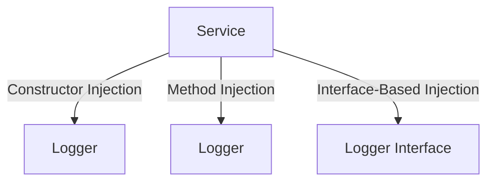

---

linkTitle: "7.3.1 Dependency Injection Techniques in Go"
title: "Dependency Injection Techniques in Go: Constructor, Method, and Interface-Based Approaches"
description: "Explore Dependency Injection techniques in Go, including Constructor, Method, and Interface-Based Injection, to enhance code flexibility and testability."
categories:
- Software Design
- Go Programming
- Dependency Injection
tags:
- Dependency Injection
- Go Programming
- Software Architecture
- Constructor Injection
- Interface-Based Injection
date: 2024-10-25
type: docs
nav_weight: 731000
canonical: "https://softwarepatternslexicon.com/patterns-go/7/3/1"
license: "© 2024 Tokenizer Inc. CC BY-NC-SA 4.0"
---

## 7.3.1 Dependency Injection Techniques in Go

Dependency Injection (DI) is a design pattern used to achieve Inversion of Control (IoC) between classes and their dependencies. It allows for more flexible, testable, and maintainable code by decoupling the creation of an object from its usage. In Go, DI can be implemented using several techniques, including Constructor Injection, Method Injection, and Interface-Based Injection. This article explores these techniques, providing insights into their implementation, benefits, and use cases.

### Introduction to Dependency Injection in Go

Dependency Injection is a fundamental concept in modern software design, promoting loose coupling and enhancing testability. In Go, DI is not enforced by the language but can be implemented using idiomatic patterns. By injecting dependencies, developers can create more modular and adaptable applications.

### Constructor Injection

Constructor Injection involves passing dependencies to an object through its constructor. This technique ensures that all necessary dependencies are provided at the time of object creation, promoting immutability and consistency.

#### Implementation

In Go, Constructor Injection is typically implemented by defining a constructor function that accepts dependencies as parameters and returns an instance of the struct.

```go
package main

import "fmt"

// Logger is a simple interface for logging
type Logger interface {
	Log(message string)
}

// ConsoleLogger is a concrete implementation of Logger
type ConsoleLogger struct{}

func (c *ConsoleLogger) Log(message string) {
	fmt.Println(message)
}

// Service is a struct that depends on Logger
type Service struct {
	logger Logger
}

// NewService is the constructor function for Service
func NewService(logger Logger) *Service {
	return &Service{logger: logger}
}

func (s *Service) PerformAction() {
	s.logger.Log("Performing an action")
}

func main() {
	logger := &ConsoleLogger{}
	service := NewService(logger)
	service.PerformAction()
}
```

#### Advantages

- **Immutability:** Dependencies are set once and cannot be changed, ensuring consistent behavior.
- **Clarity:** All dependencies are explicitly listed in the constructor, making the code easier to understand.
- **Testability:** Dependencies can be easily mocked for testing purposes.

#### Disadvantages

- **Complexity:** For objects with many dependencies, constructors can become unwieldy.
- **Rigidity:** All dependencies must be provided upfront, which may not be suitable for all scenarios.

### Method Injection

Method Injection provides dependencies through setter methods, allowing for more flexibility in changing dependencies after object creation.

#### Implementation

In Go, Method Injection can be implemented by defining setter methods on the struct that accept dependencies as parameters.

```go
package main

import "fmt"

// Logger is a simple interface for logging
type Logger interface {
	Log(message string)
}

// ConsoleLogger is a concrete implementation of Logger
type ConsoleLogger struct{}

func (c *ConsoleLogger) Log(message string) {
	fmt.Println(message)
}

// Service is a struct that depends on Logger
type Service struct {
	logger Logger
}

// SetLogger is a setter method for injecting Logger
func (s *Service) SetLogger(logger Logger) {
	s.logger = logger
}

func (s *Service) PerformAction() {
	if s.logger != nil {
		s.logger.Log("Performing an action")
	} else {
		fmt.Println("No logger provided")
	}
}

func main() {
	service := &Service{}
	logger := &ConsoleLogger{}
	service.SetLogger(logger)
	service.PerformAction()
}
```

#### Advantages

- **Flexibility:** Dependencies can be changed or updated after object creation.
- **Simplicity:** Initial object creation can be simpler without requiring all dependencies upfront.

#### Disadvantages

- **Inconsistency:** Objects may be in an incomplete state if dependencies are not set immediately.
- **Error-Prone:** Requires additional checks to ensure dependencies are set before use.

### Interface-Based Injection

Interface-Based Injection relies on interfaces rather than concrete implementations, promoting decoupling and enhancing testability.

#### Implementation

In Go, Interface-Based Injection is achieved by defining interfaces for dependencies and using these interfaces in the struct.

```go
package main

import "fmt"

// Logger is a simple interface for logging
type Logger interface {
	Log(message string)
}

// ConsoleLogger is a concrete implementation of Logger
type ConsoleLogger struct{}

func (c *ConsoleLogger) Log(message string) {
	fmt.Println(message)
}

// Service is a struct that depends on Logger interface
type Service struct {
	logger Logger
}

// NewService is the constructor function for Service
func NewService(logger Logger) *Service {
	return &Service{logger: logger}
}

func (s *Service) PerformAction() {
	s.logger.Log("Performing an action")
}

func main() {
	logger := &ConsoleLogger{}
	service := NewService(logger)
	service.PerformAction()
}
```

#### Advantages

- **Decoupling:** Reduces dependency on specific implementations, allowing for easier swapping of components.
- **Testability:** Facilitates mocking and testing by using interfaces.

#### Disadvantages

- **Overhead:** Requires defining interfaces for each dependency, which may add complexity.

### Visualizing Dependency Injection Techniques

Below is a conceptual diagram illustrating the three DI techniques:



### Use Cases

- **Constructor Injection:** Ideal for scenarios where dependencies are known upfront and should not change.
- **Method Injection:** Suitable for cases where dependencies may change or are optional.
- **Interface-Based Injection:** Best for applications requiring high flexibility and testability.

### Best Practices

- **Use Interfaces:** Leverage interfaces to decouple components and enhance testability.
- **Keep Constructors Simple:** Avoid constructors with too many parameters by grouping related dependencies.
- **Validate Dependencies:** Ensure that all required dependencies are set before use to prevent runtime errors.

### Conclusion

Dependency Injection is a powerful pattern that enhances the flexibility and testability of Go applications. By understanding and applying Constructor, Method, and Interface-Based Injection techniques, developers can create more maintainable and adaptable software. Each technique has its strengths and trade-offs, and the choice of which to use depends on the specific requirements and constraints of the project.

## Quiz Time!



### Which of the following is a key benefit of Constructor Injection?

- [x] Immutability of dependencies
- [ ] Ability to change dependencies at runtime
- [ ] Requires no interfaces
- [ ] Simplifies object creation

> **Explanation:** Constructor Injection ensures that dependencies are immutable once set, promoting consistent behavior.

### What is a disadvantage of Method Injection?

- [ ] Dependencies are immutable
- [x] Objects may be in an incomplete state
- [ ] Requires interfaces for all dependencies
- [ ] Increases coupling between components

> **Explanation:** Method Injection can lead to incomplete object states if dependencies are not set immediately after creation.

### How does Interface-Based Injection enhance testability?

- [ ] By using concrete implementations
- [x] By allowing easy mocking of dependencies
- [ ] By enforcing immutability
- [ ] By simplifying object creation

> **Explanation:** Interface-Based Injection allows for easy mocking of dependencies, enhancing testability.

### In Go, how is Constructor Injection typically implemented?

- [ ] Using setter methods
- [x] Using constructor functions
- [ ] Using interfaces
- [ ] Using global variables

> **Explanation:** Constructor Injection in Go is typically implemented using constructor functions that accept dependencies as parameters.

### Which DI technique is best for scenarios where dependencies may change after object creation?

- [ ] Constructor Injection
- [x] Method Injection
- [ ] Interface-Based Injection
- [ ] Singleton Pattern

> **Explanation:** Method Injection allows for changing dependencies after object creation, making it suitable for such scenarios.

### What is a common disadvantage of Interface-Based Injection?

- [ ] It requires setter methods
- [ ] It enforces immutability
- [x] It adds overhead by requiring interfaces
- [ ] It simplifies testing

> **Explanation:** Interface-Based Injection requires defining interfaces for each dependency, which can add complexity.

### Which DI technique promotes decoupling by relying on interfaces?

- [ ] Constructor Injection
- [ ] Method Injection
- [x] Interface-Based Injection
- [ ] Singleton Pattern

> **Explanation:** Interface-Based Injection promotes decoupling by relying on interfaces rather than concrete implementations.

### What is a potential issue with Method Injection?

- [ ] Dependencies are immutable
- [ ] It requires interfaces
- [x] Dependencies may not be set before use
- [ ] It simplifies object creation

> **Explanation:** Method Injection can lead to issues if dependencies are not set before they are used.

### Which DI technique is most suitable for applications requiring high flexibility?

- [ ] Constructor Injection
- [ ] Method Injection
- [x] Interface-Based Injection
- [ ] Singleton Pattern

> **Explanation:** Interface-Based Injection is most suitable for applications requiring high flexibility due to its decoupling nature.

### True or False: Constructor Injection requires all dependencies to be provided upfront.

- [x] True
- [ ] False

> **Explanation:** Constructor Injection requires all dependencies to be provided upfront, ensuring they are immutable and consistent.




