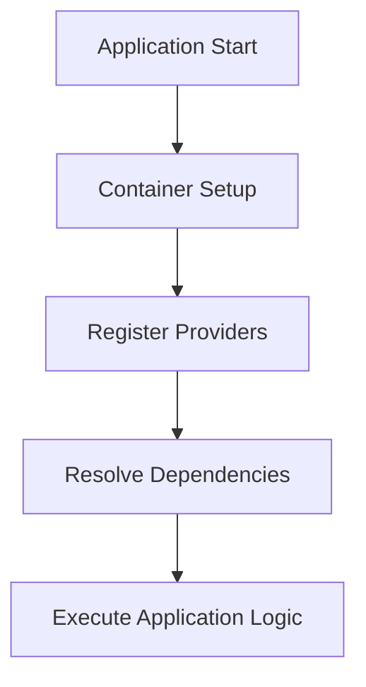

## 7.3.2 Dependency Injection Libraries

Dependency Injection (DI) is a fundamental design pattern that facilitates the development of loosely coupled and testable code. In Go, several libraries have emerged to simplify the implementation of DI, making it easier to manage complex dependency graphs. This article delves into the use of popular DI libraries in Go, including `dig`, `wire`, and `fx`, and provides a comprehensive guide on implementing DI using these tools.

### Introduction to Dependency Injection Libraries

Dependency Injection is a technique where an object's dependencies are provided externally rather than being created by the object itself. This pattern promotes loose coupling, enhances testability, and improves code modularity. In Go, DI can be implemented manually, but using libraries can significantly streamline the process, especially in large applications with intricate dependency structures.

### Using DI Libraries in Go

#### Implementing Dependency Injection with `dig`, `wire`, and `fx`

1. **Define Providers:**
   - Providers are functions that specify how to construct each dependency. They are the building blocks of your DI setup.

2. **Set Up the Container:**
   - The container is a central component that holds all providers. It manages the lifecycle and resolution of dependencies.

3. **Resolve Dependencies:**
   - The container handles the instantiation and wiring of dependencies, ensuring that each component receives the necessary dependencies.

### Implementation Steps with Libraries

#### Step 1: Define Providers

Providers are functions that describe how to create instances of your dependencies. Each provider function should return the type it provides and any error encountered during creation.

```go
package main

import (
	"fmt"
	"go.uber.org/dig"
)

type Database struct {
	Name string
}

func NewDatabase() (*Database, error) {
	return &Database{Name: "MyDB"}, nil
}
```

#### Step 2: Set Up the Container

The container is responsible for managing the lifecycle of dependencies. You register providers with the container, which then takes care of instantiating and injecting them where needed.

```go
func main() {
	container := dig.New()

	err := container.Provide(NewDatabase)
	if err != nil {
		panic(err)
	}
}
```

#### Step 3: Resolve Dependencies

Once the container is set up, you can resolve dependencies by invoking functions that require them. The container automatically injects the necessary dependencies.

```go
func PrintDatabaseName(db *Database) {
	fmt.Println("Database Name:", db.Name)
}

func main() {
	container := dig.New()

	err := container.Provide(NewDatabase)
	if err != nil {
		panic(err)
	}

	err = container.Invoke(PrintDatabaseName)
	if err != nil {
		panic(err)
	}
}
```

### Benefits of Using DI Libraries

- **Simplifies Dependency Management:** DI libraries automate the wiring of dependencies, reducing boilerplate code and potential errors.
- **Enhances Testability:** By decoupling components, DI makes it easier to test individual parts of your application in isolation.
- **Promotes Modularity:** Components can be developed and maintained independently, leading to cleaner and more maintainable codebases.

### Visualizing Dependency Injection with Mermaid.js

To better understand the flow of dependencies, let's visualize the DI process using a Mermaid.js diagram.



### Comparative Analysis of DI Libraries

#### `dig`

- **Pros:** Simple API, flexible, and integrates well with existing Go code.
- **Cons:** Requires manual setup of providers and invocations.

#### `wire`

- **Pros:** Compile-time dependency injection, which catches errors early.
- **Cons:** Requires code generation, which can be complex for beginners.

#### `fx`

- **Pros:** Built on top of `dig`, provides additional features like lifecycle management.
- **Cons:** More complex setup, may introduce overhead for small projects.

### Best Practices for Using DI Libraries

- **Keep Providers Simple:** Ensure that provider functions are straightforward and only focus on creating instances.
- **Use Interfaces:** Define dependencies in terms of interfaces to promote flexibility and testability.
- **Avoid Overuse:** While DI is powerful, avoid overusing it in simple applications where manual dependency management is sufficient.

### Conclusion

Dependency Injection is a powerful pattern that, when combined with Go's DI libraries, can greatly enhance the modularity and testability of your applications. By leveraging libraries like `dig`, `wire`, and `fx`, developers can efficiently manage complex dependency graphs and focus on building robust, maintainable software.

## Quiz Time!



### What is the primary purpose of Dependency Injection?

- [x] To promote loose coupling and enhance testability
- [ ] To increase code complexity
- [ ] To reduce the number of functions in a codebase
- [ ] To make code execution faster

> **Explanation:** Dependency Injection aims to decouple components, making them easier to test and maintain.

### Which Go library provides compile-time dependency injection?

- [ ] dig
- [x] wire
- [ ] fx
- [ ] none of the above

> **Explanation:** `wire` provides compile-time dependency injection, catching errors early in the development process.

### What is a provider in the context of DI libraries?

- [x] A function that specifies how to construct a dependency
- [ ] A variable that holds a dependency
- [ ] A method that destroys a dependency
- [ ] A class that manages dependencies

> **Explanation:** Providers are functions that describe how to create instances of dependencies.

### Which DI library is built on top of `dig` and offers additional features?

- [ ] wire
- [x] fx
- [ ] none of the above
- [ ] all of the above

> **Explanation:** `fx` is built on top of `dig` and provides additional features like lifecycle management.

### What is a key benefit of using DI libraries?

- [x] Simplifies the management of complex dependency graphs
- [ ] Increases code execution time
- [ ] Reduces the number of lines of code
- [ ] Decreases test coverage

> **Explanation:** DI libraries automate the wiring of dependencies, simplifying management and reducing errors.

### What should provider functions focus on?

- [x] Creating instances of dependencies
- [ ] Managing application state
- [ ] Handling user input
- [ ] Rendering UI components

> **Explanation:** Provider functions should focus on creating instances of dependencies.

### Why is it beneficial to define dependencies in terms of interfaces?

- [x] Promotes flexibility and testability
- [ ] Increases code complexity
- [ ] Reduces code readability
- [ ] Decreases performance

> **Explanation:** Using interfaces allows for more flexible and testable code by decoupling implementations from their usage.

### What is a potential downside of using `fx`?

- [x] More complex setup
- [ ] Lack of features
- [ ] Poor documentation
- [ ] Incompatibility with Go

> **Explanation:** `fx` can introduce complexity, especially for smaller projects.

### Which step involves the container handling the instantiation of dependencies?

- [ ] Define Providers
- [ ] Set Up the Container
- [x] Resolve Dependencies
- [ ] Execute Application Logic

> **Explanation:** During the "Resolve Dependencies" step, the container handles instantiation and wiring.

### True or False: Dependency Injection should be used in all Go projects regardless of size.

- [ ] True
- [x] False

> **Explanation:** While DI is beneficial, it may not be necessary for small projects where manual dependency management is sufficient.


