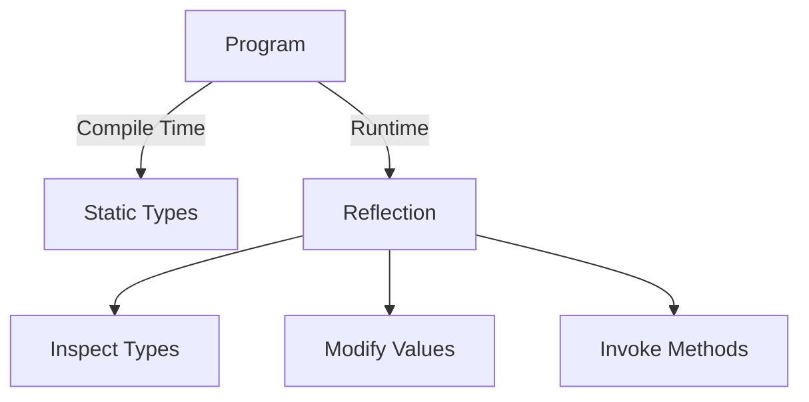
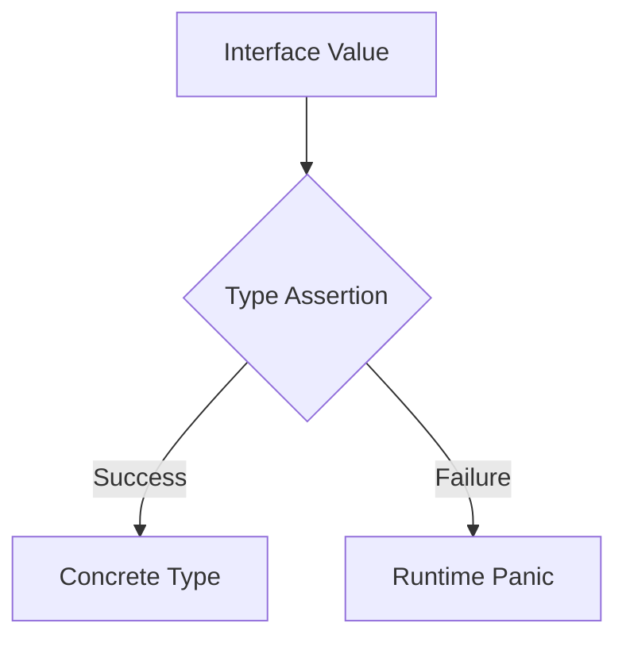

## 7.6 Reflection and Type Assertions

In the world of Go programming, reflection and type assertions are powerful tools that allow developers to write dynamic and flexible code. These features enable runtime type inspection and manipulation, which can be particularly useful in scenarios where types are not known at compile time. This article delves into the intricacies of reflection and type assertions in Go, providing a comprehensive guide on their usage, best practices, and potential pitfalls.

### Introduction

Reflection in Go is a mechanism that allows a program to inspect and manipulate its own structure at runtime. This capability is provided by the `reflect` package, which offers a rich set of functions and types for working with values and types dynamically. On the other hand, type assertions are a way to extract the concrete type from an interface, allowing developers to handle different types flexibly.

### Detailed Explanation

#### Using Reflection

Reflection in Go is centered around two key types: `reflect.Type` and `reflect.Value`. These types provide information about the type and value of an object, respectively.

- **Importing the `reflect` Package:**
  To use reflection, you need to import the `reflect` package:

  ```go
  import "reflect"
  ```

- **Inspecting Variables:**
  You can inspect variables to determine their type and value at runtime. This is particularly useful for generic programming or when working with interfaces.

- **Accessing Struct Fields:**
  Reflection allows you to access and modify struct fields dynamically, which can be useful for tasks like serialization or implementing custom logic based on struct tags.

- **Invoking Methods Dynamically:**
  With reflection, you can call methods on objects dynamically, which is useful for building flexible APIs or frameworks.

#### Type Assertions

Type assertions are used to extract the concrete type from an interface. This is done using the syntax `value.(ConcreteType)`, where `value` is an interface and `ConcreteType` is the expected type.

- **Handling Multiple Types with Type Switches:**
  Type switches provide a way to handle multiple types in a concise and readable manner. They are particularly useful when dealing with interfaces that can hold different types.

### Implementation Steps

#### Reflect on Values

To work with reflection, you first need to obtain reflection objects using `reflect.ValueOf` and `reflect.TypeOf`.

```go
package main

import (
	"fmt"
	"reflect"
)

func main() {
	var x float64 = 3.4
	v := reflect.ValueOf(x)
	fmt.Println("Type:", v.Type())
	fmt.Println("Kind:", v.Kind())
	fmt.Println("Value:", v.Float())
}
```

#### Modify Variables

Reflection allows you to modify variables, but the value must be addressable. This means you need a pointer to the value you want to change.

```go
package main

import (
	"fmt"
	"reflect"
)

func main() {
	var x float64 = 3.4
	v := reflect.ValueOf(&x).Elem()
	v.SetFloat(7.1)
	fmt.Println("Modified Value:", x)
}
```

#### Dynamic Method Invocation

Reflection enables dynamic method invocation based on runtime information. This can be useful for building extensible systems.

```go
package main

import (
	"fmt"
	"reflect"
)

type MyStruct struct{}

func (m MyStruct) Hello(name string) {
	fmt.Println("Hello,", name)
}

func main() {
	m := MyStruct{}
	v := reflect.ValueOf(m)
	method := v.MethodByName("Hello")
	args := []reflect.Value{reflect.ValueOf("World")}
	method.Call(args)
}
```

### Cautions

While reflection and type assertions are powerful, they come with certain caveats:

- **Potential Panics:**
  Incorrect type assertions can lead to runtime panics. It's crucial to handle these scenarios gracefully, often using the comma-ok idiom.

- **Performance Implications:**
  Reflection can be slower than direct method calls or field access due to the additional overhead of runtime type inspection. Use it judiciously, especially in performance-critical code.

### Visual Aids

#### Conceptual Diagram of Reflection



#### Type Assertion Workflow



### Use Cases

Reflection and type assertions are particularly useful in scenarios such as:

- **Serialization and Deserialization:**
  Automatically converting structs to JSON/XML and vice versa.

- **Building Flexible APIs:**
  Allowing dynamic method invocation and parameter handling.

- **Testing Frameworks:**
  Implementing generic test utilities that can operate on various types.

### Advantages and Disadvantages

**Advantages:**

- Enables dynamic programming and flexibility.
- Facilitates generic programming and code reuse.
- Useful for building extensible frameworks and libraries.

**Disadvantages:**

- Can lead to runtime panics if not used carefully.
- May introduce performance overhead.
- Can make code harder to read and maintain.

### Best Practices

- **Use Sparingly:**
  Limit the use of reflection to scenarios where it's truly necessary.

- **Handle Errors Gracefully:**
  Always check for potential panics and handle errors using the comma-ok idiom.

- **Document Code:**
  Clearly document the use of reflection to aid future maintainers.

### Conclusion

Reflection and type assertions in Go provide powerful capabilities for dynamic programming. While they offer flexibility and enable advanced use cases, they should be used judiciously to avoid potential pitfalls. By understanding their mechanics and best practices, developers can leverage these features to build robust and flexible Go applications.

## Quiz Time!



### What package is used for reflection in Go?

- [x] reflect
- [ ] runtime
- [ ] fmt
- [ ] types

> **Explanation:** The `reflect` package in Go provides the necessary tools for reflection, allowing inspection and manipulation of types and values at runtime.

### What is the syntax for a type assertion in Go?

- [x] value.(ConcreteType)
- [ ] value[ConcreteType]
- [ ] value{ConcreteType}
- [ ] value<ConcreteType>

> **Explanation:** Type assertions in Go use the syntax `value.(ConcreteType)` to extract the concrete type from an interface.

### Which method is used to obtain a reflection object for a value?

- [x] reflect.ValueOf
- [ ] reflect.TypeOf
- [ ] reflect.New
- [ ] reflect.Make

> **Explanation:** `reflect.ValueOf` is used to obtain a reflection object representing the value of a variable.

### What is a potential risk of using type assertions?

- [x] Runtime panic
- [ ] Compile-time error
- [ ] Memory leak
- [ ] Deadlock

> **Explanation:** Incorrect type assertions can lead to runtime panics if the asserted type does not match the actual type.

### How can you modify a value using reflection?

- [x] Use reflect.Value and ensure the value is addressable
- [ ] Use reflect.Type and ensure the value is addressable
- [ ] Use reflect.New and ensure the value is addressable
- [ ] Use reflect.Make and ensure the value is addressable

> **Explanation:** To modify a value using reflection, you must use `reflect.Value` and ensure that the value is addressable (i.e., a pointer).

### What is a common use case for reflection in Go?

- [x] Serialization and deserialization
- [ ] Memory management
- [ ] Thread synchronization
- [ ] File I/O

> **Explanation:** Reflection is commonly used for serialization and deserialization tasks, allowing dynamic conversion of structs to JSON/XML and vice versa.

### What is the purpose of the `reflect.TypeOf` function?

- [x] To obtain the type of a variable
- [ ] To obtain the value of a variable
- [ ] To modify the value of a variable
- [ ] To invoke a method on a variable

> **Explanation:** `reflect.TypeOf` is used to obtain the type information of a variable at runtime.

### What is the benefit of using type switches?

- [x] Handling multiple types concisely
- [ ] Improving compile-time checks
- [ ] Reducing memory usage
- [ ] Increasing execution speed

> **Explanation:** Type switches allow handling multiple types in a concise and readable manner, especially when working with interfaces.

### Which of the following is a disadvantage of using reflection?

- [x] Performance overhead
- [ ] Compile-time errors
- [ ] Increased memory usage
- [ ] Lack of flexibility

> **Explanation:** Reflection can introduce performance overhead due to the additional runtime type inspection and manipulation.

### True or False: Reflection can be used to invoke methods dynamically.

- [x] True
- [ ] False

> **Explanation:** Reflection in Go allows for dynamic method invocation, enabling flexible and extensible programming patterns.


