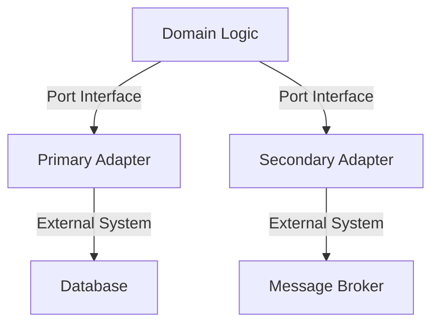

## 8.1 Hexagonal Architecture (Ports and Adapters)

Hexagonal Architecture, also known as Ports and Adapters, is an architectural pattern that aims to create loosely coupled application components that can be easily connected to their software environment through ports and adapters. This pattern is particularly beneficial in Go applications due to its emphasis on simplicity and modularity.

### Introduction

Hexagonal Architecture was introduced by Alistair Cockburn to address the challenges of maintaining and scaling software systems. The core idea is to separate the business logic from external concerns, such as user interfaces, databases, and other services, by using interfaces (ports) and their implementations (adapters).

### Core Concepts

- **Domain (Core Logic):** The heart of the application where business rules and entities reside. It should be independent of external systems.
- **Ports:** Interfaces that define how the domain interacts with the outside world. They act as a contract between the domain and external systems.
- **Adapters:** Implementations of the ports that handle communication with external systems like databases, message brokers, and user interfaces.

### Visual Representation

To better understand Hexagonal Architecture, let's look at a conceptual diagram:



In this diagram, the domain logic communicates with external systems through ports and adapters. The primary adapter might handle user interactions, while the secondary adapter could manage database operations.

### Implementation Steps

#### 1. Define Domain Logic

The domain logic should encapsulate all business rules and entities. It should not have any dependencies on external systems. Here's an example in Go:

```go
package domain

type Order struct {
    ID     string
    Amount float64
}

type OrderService interface {
    CreateOrder(order Order) error
    GetOrder(id string) (Order, error)
}
```

#### 2. Create Ports

Ports are interfaces that define how the domain interacts with external systems. They allow the domain to remain decoupled from specific implementations.

```go
package ports

import "example.com/project/domain"

type OrderRepository interface {
    Save(order domain.Order) error
    FindByID(id string) (domain.Order, error)
}
```

#### 3. Develop Adapters

Adapters implement the ports and handle the specifics of interacting with external systems.

```go
package adapters

import (
    "database/sql"
    "example.com/project/domain"
    "example.com/project/ports"
)

type SQLOrderRepository struct {
    DB *sql.DB
}

func (r *SQLOrderRepository) Save(order domain.Order) error {
    // Implementation for saving order to SQL database
    return nil
}

func (r *SQLOrderRepository) FindByID(id string) (domain.Order, error) {
    // Implementation for finding order by ID
    return domain.Order{}, nil
}
```

#### 4. Wire Up Dependencies

Use dependency injection to inject adapters into the domain logic. This can be done manually or using a DI library.

```go
package main

import (
    "database/sql"
    "example.com/project/adapters"
    "example.com/project/domain"
    "example.com/project/ports"
)

func main() {
    db, _ := sql.Open("mysql", "user:password@/dbname")
    orderRepo := &adapters.SQLOrderRepository{DB: db}
    var orderService domain.OrderService = domain.NewOrderService(orderRepo)

    // Use orderService to handle orders
}
```

### Benefits

- **Testability:** By decoupling the domain logic from external systems, you can easily mock dependencies for testing.
- **Maintainability:** The separation of concerns makes it easier to update or replace parts of the system without affecting the core logic.
- **Scalability:** The architecture supports scaling by allowing independent development and deployment of adapters.

### Use Cases

Hexagonal Architecture is suitable for applications that require a high degree of flexibility and adaptability, such as:

- Microservices that need to interact with various external systems.
- Applications that require frequent changes to external dependencies.
- Systems that need to support multiple user interfaces or data sources.

### Advantages and Disadvantages

**Advantages:**

- Promotes clean separation of concerns.
- Enhances flexibility and adaptability.
- Facilitates testing and maintenance.

**Disadvantages:**

- Initial setup can be complex.
- May introduce overhead in simple applications.

### Best Practices

- **Keep the Domain Pure:** Ensure that the domain logic remains free of external dependencies.
- **Use Interfaces Wisely:** Define clear and concise interfaces for ports to avoid unnecessary complexity.
- **Leverage Dependency Injection:** Use DI to manage dependencies and enhance testability.

### Comparisons

Hexagonal Architecture can be compared to other architectural patterns like Clean Architecture and Layered Architecture. While all aim to separate concerns, Hexagonal Architecture emphasizes the use of ports and adapters to achieve this goal.

### Conclusion

Hexagonal Architecture provides a robust framework for building scalable and maintainable applications in Go. By organizing the application into a domain and adapters, it allows for flexibility and adaptability in interacting with external systems. This pattern is particularly beneficial in environments where change is constant and systems need to evolve rapidly.

## Quiz Time!



### What is the primary goal of Hexagonal Architecture?

- [x] To separate business logic from external concerns
- [ ] To increase the complexity of the application
- [ ] To tightly couple the domain with external systems
- [ ] To eliminate the need for interfaces

> **Explanation:** Hexagonal Architecture aims to separate business logic from external concerns, enhancing modularity and testability.

### In Hexagonal Architecture, what role do ports play?

- [x] They define interfaces for interactions between the domain and external systems
- [ ] They store data for the application
- [ ] They are responsible for user authentication
- [ ] They manage network connections

> **Explanation:** Ports are interfaces that define how the domain interacts with external systems, acting as a contract between them.

### What is an adapter in the context of Hexagonal Architecture?

- [x] An implementation of a port that interacts with external systems
- [ ] A database connection
- [ ] A user interface component
- [ ] A security protocol

> **Explanation:** Adapters implement ports and handle communication with external systems like databases and message brokers.

### How does Hexagonal Architecture enhance testability?

- [x] By allowing mocking of external systems through interfaces
- [ ] By eliminating the need for tests
- [ ] By integrating testing frameworks directly into the domain
- [ ] By using only in-memory databases

> **Explanation:** Hexagonal Architecture enhances testability by decoupling the domain from external systems, allowing for easy mocking.

### Which of the following is a benefit of Hexagonal Architecture?

- [x] Facilitates maintenance and scalability
- [ ] Increases code complexity
- [ ] Requires more hardware resources
- [ ] Reduces the need for documentation

> **Explanation:** Hexagonal Architecture facilitates maintenance and scalability by keeping the core logic independent of external systems.

### What is a common disadvantage of Hexagonal Architecture?

- [x] Initial setup can be complex
- [ ] It leads to tightly coupled code
- [ ] It reduces application performance
- [ ] It eliminates the need for interfaces

> **Explanation:** The initial setup of Hexagonal Architecture can be complex, especially in simple applications.

### How does Hexagonal Architecture support scalability?

- [x] By allowing independent development and deployment of adapters
- [ ] By requiring a monolithic codebase
- [ ] By using only one type of database
- [ ] By eliminating the use of interfaces

> **Explanation:** Hexagonal Architecture supports scalability by allowing adapters to be developed and deployed independently.

### What is the role of dependency injection in Hexagonal Architecture?

- [x] To inject adapters into the domain logic
- [ ] To eliminate the need for interfaces
- [ ] To manage database connections
- [ ] To handle user authentication

> **Explanation:** Dependency injection is used to inject adapters into the domain logic, enhancing modularity and testability.

### Which pattern is Hexagonal Architecture often compared to?

- [x] Clean Architecture
- [ ] Singleton Pattern
- [ ] Factory Pattern
- [ ] Observer Pattern

> **Explanation:** Hexagonal Architecture is often compared to Clean Architecture, as both aim to separate concerns and enhance modularity.

### True or False: Hexagonal Architecture eliminates the need for external dependencies.

- [ ] True
- [x] False

> **Explanation:** Hexagonal Architecture does not eliminate external dependencies but organizes them through ports and adapters to enhance modularity.


