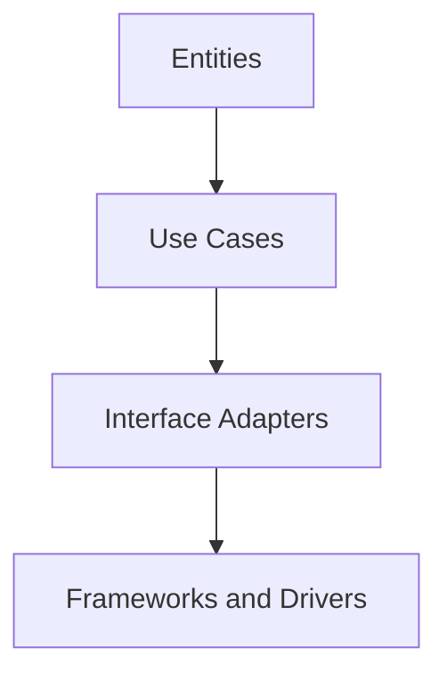

## 8.2 Clean Architecture

Clean Architecture is a software design philosophy that emphasizes the separation of concerns and the independence of business logic from external frameworks and technologies. This approach is particularly beneficial in Go, where simplicity and clarity are paramount. By structuring your application into distinct layers, Clean Architecture helps ensure that your codebase remains maintainable, scalable, and testable.

### Structural Layers

Clean Architecture is composed of four primary layers, each with a specific role and responsibility:

#### 1. Entities

Entities are the core business models and logic of your application. They represent the fundamental data structures and rules that define your business domain. Entities should be pure business objects, free from any dependencies on external systems or frameworks. This ensures that the core logic of your application remains stable and unaffected by changes in technology.

#### 2. Use Cases

Use Cases, also known as Interactors, encapsulate the application-specific business rules. They coordinate the operations of the application, orchestrating the interaction between entities and other components. Use Cases are responsible for executing the business logic and ensuring that the application behaves as expected.

#### 3. Interface Adapters

Interface Adapters are responsible for converting data formats between the inner layers (Entities and Use Cases) and the outer layers (Frameworks and Drivers). This layer typically includes controllers, presenters, and gateways that bridge the gap between the core logic and external interfaces. By isolating the core logic from external dependencies, Interface Adapters help maintain the integrity of the application.

#### 4. Frameworks and Drivers

The outermost layer consists of Frameworks and Drivers, which include external agents like databases, web frameworks, and other third-party tools. This layer is where the actual implementation of external interfaces occurs. By keeping these dependencies at the outermost layer, Clean Architecture ensures that the core logic remains independent and adaptable to changes in technology.

### Implementation Steps

Implementing Clean Architecture in Go involves a series of steps to ensure that each layer is properly defined and integrated:

#### Step 1: Define Entities

Begin by creating pure business objects that represent the core data structures and rules of your application. These entities should be independent of any external dependencies, focusing solely on the business logic.

```go
// Entity example in Go
type User struct {
    ID       int
    Name     string
    Email    string
    Password string
}

// Business logic method
func (u *User) IsValidEmail() bool {
    // Simple email validation logic
    return strings.Contains(u.Email, "@")
}
```

#### Step 2: Implement Use Cases

Use Cases coordinate the operations of the application, orchestrating the interaction between entities and other components. They encapsulate the business logic and ensure that the application behaves as expected.

```go
// Use Case example in Go
type UserUseCase struct {
    UserRepo UserRepository
}

func (uc *UserUseCase) RegisterUser(name, email, password string) error {
    user := &User{Name: name, Email: email, Password: password}
    if !user.IsValidEmail() {
        return errors.New("invalid email")
    }
    return uc.UserRepo.Save(user)
}
```

#### Step 3: Set Up Interface Adapters

Write controllers, presenters, and gateways to bridge the use cases and the outer layers. This involves converting data formats and ensuring that the core logic remains isolated from external dependencies.

```go
// Interface Adapter example in Go
type UserController struct {
    UserUseCase *UserUseCase
}

func (uc *UserController) RegisterUserHandler(w http.ResponseWriter, r *http.Request) {
    // Extract user data from request
    name := r.FormValue("name")
    email := r.FormValue("email")
    password := r.FormValue("password")

    // Call use case
    err := uc.UserUseCase.RegisterUser(name, email, password)
    if err != nil {
        http.Error(w, err.Error(), http.StatusBadRequest)
        return
    }

    w.WriteHeader(http.StatusCreated)
}
```

#### Step 4: Integrate Frameworks

Use external tools and libraries strictly within the outermost layer. This ensures that the core logic remains independent and adaptable to changes in technology.

```go
// Framework integration example in Go
func main() {
    userRepo := NewUserRepository()
    userUseCase := &UserUseCase{UserRepo: userRepo}
    userController := &UserController{UserUseCase: userUseCase}

    http.HandleFunc("/register", userController.RegisterUserHandler)
    log.Fatal(http.ListenAndServe(":8080", nil))
}
```

### Dependency Rule

A fundamental principle of Clean Architecture is the Dependency Rule, which states that inner layers should not know anything about outer layers. Data can cross boundaries, but the form (e.g., data structures) should not. This ensures that the core logic remains unaffected by changes in external systems.

### Visualizing Clean Architecture

To better understand the structure of Clean Architecture, consider the following diagram:



This diagram illustrates the flow of dependencies from the innermost layer (Entities) to the outermost layer (Frameworks and Drivers), adhering to the Dependency Rule.

### Advantages and Disadvantages

**Advantages:**

- **Separation of Concerns:** Clean Architecture promotes a clear separation of concerns, making the codebase easier to understand and maintain.
- **Independence from Frameworks:** By isolating the core logic from external dependencies, Clean Architecture allows for greater flexibility and adaptability.
- **Testability:** The separation of layers facilitates unit testing, as each layer can be tested independently.

**Disadvantages:**

- **Complexity:** Implementing Clean Architecture can introduce additional complexity, particularly in smaller projects where the overhead may not be justified.
- **Initial Setup:** The initial setup of Clean Architecture can be time-consuming, requiring careful planning and design.

### Best Practices

- **Adhere to the Dependency Rule:** Ensure that inner layers remain independent of outer layers, focusing on core business logic.
- **Use Interfaces:** Leverage Go's interfaces to define contracts between layers, promoting decoupling and flexibility.
- **Keep It Simple:** Avoid over-engineering by applying Clean Architecture principles judiciously, particularly in smaller projects.

### Conclusion

Clean Architecture offers a robust framework for building maintainable, scalable, and testable applications in Go. By adhering to its principles and focusing on the separation of concerns, developers can create software that is both flexible and resilient to change. While the initial setup may require careful planning, the long-term benefits of Clean Architecture make it a valuable approach for many projects.

## Quiz Time!



### What is the primary goal of Clean Architecture?

- [x] To separate concerns and maintain independence of business logic from external frameworks.
- [ ] To integrate as many external libraries as possible.
- [ ] To focus solely on performance optimization.
- [ ] To minimize the number of code layers.

> **Explanation:** Clean Architecture aims to separate concerns and ensure that business logic remains independent of external frameworks, enhancing maintainability and scalability.

### Which layer in Clean Architecture is responsible for core business models and logic?

- [x] Entities
- [ ] Use Cases
- [ ] Interface Adapters
- [ ] Frameworks and Drivers

> **Explanation:** The Entities layer is responsible for core business models and logic, representing the fundamental data structures and rules of the business domain.

### What is the role of Use Cases in Clean Architecture?

- [x] To encapsulate application-specific business rules and coordinate operations.
- [ ] To handle database interactions directly.
- [ ] To manage external frameworks and drivers.
- [ ] To convert data formats between layers.

> **Explanation:** Use Cases encapsulate application-specific business rules and coordinate operations, ensuring that the application behaves as expected.

### What is the Dependency Rule in Clean Architecture?

- [x] Inner layers should not know anything about outer layers.
- [ ] Outer layers should depend on inner layers.
- [ ] All layers should be tightly coupled.
- [ ] Data should not cross boundaries.

> **Explanation:** The Dependency Rule states that inner layers should not know anything about outer layers, ensuring that the core logic remains independent.

### Which layer is responsible for converting data formats between inner and outer layers?

- [ ] Entities
- [ ] Use Cases
- [x] Interface Adapters
- [ ] Frameworks and Drivers

> **Explanation:** Interface Adapters are responsible for converting data formats between inner and outer layers, bridging the gap between core logic and external interfaces.

### What is a potential disadvantage of Clean Architecture?

- [x] Increased complexity and initial setup time.
- [ ] Lack of separation of concerns.
- [ ] Difficulty in testing individual components.
- [ ] Dependence on specific frameworks.

> **Explanation:** Clean Architecture can introduce increased complexity and require significant initial setup time, particularly in smaller projects.

### How can Go's interfaces be used in Clean Architecture?

- [x] To define contracts between layers, promoting decoupling and flexibility.
- [ ] To tightly couple all layers together.
- [ ] To replace all entities with interfaces.
- [ ] To eliminate the need for Use Cases.

> **Explanation:** Go's interfaces can be used to define contracts between layers, promoting decoupling and flexibility in Clean Architecture.

### What is the main benefit of keeping the core logic independent of external dependencies?

- [x] Greater flexibility and adaptability to changes in technology.
- [ ] Faster execution speed.
- [ ] Reduced code size.
- [ ] Elimination of all bugs.

> **Explanation:** Keeping the core logic independent of external dependencies allows for greater flexibility and adaptability to changes in technology.

### Which layer would typically include controllers, presenters, and gateways?

- [ ] Entities
- [ ] Use Cases
- [x] Interface Adapters
- [ ] Frameworks and Drivers

> **Explanation:** Interface Adapters typically include controllers, presenters, and gateways to bridge the gap between core logic and external interfaces.

### True or False: Clean Architecture requires that data forms do not cross boundaries.

- [x] True
- [ ] False

> **Explanation:** In Clean Architecture, data can cross boundaries, but the form (e.g., data structures) should not, ensuring that core logic remains unaffected by changes in external systems.


