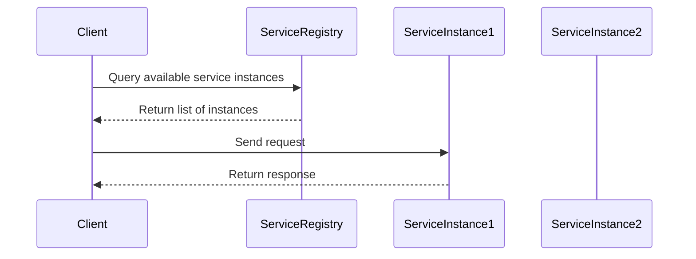
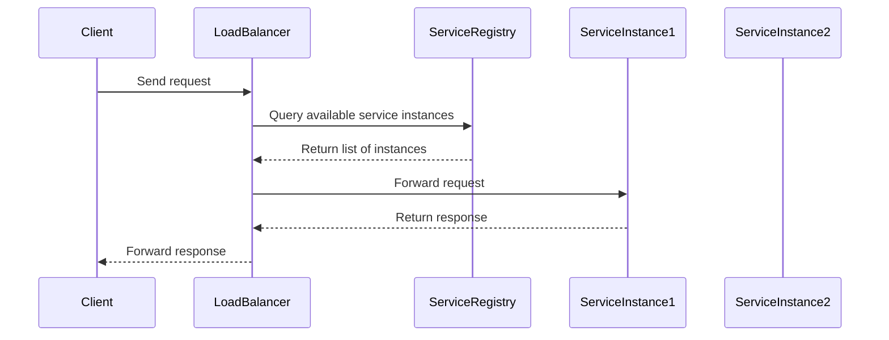

## 8.3.1 Service Discovery

In the realm of microservices architecture, service discovery is a crucial component that enables services to find and communicate with each other dynamically. As microservices are often deployed across multiple servers or containers, knowing the exact location of a service instance at any given time can be challenging. Service discovery addresses this challenge by providing a mechanism to dynamically locate services.

### Introduction to Service Discovery

Service discovery is the process by which microservices dynamically locate each other on a network. It is essential for maintaining the flexibility and scalability of a microservices architecture, where services can be added, removed, or relocated without disrupting the overall system.

There are two primary models of service discovery:

1. **Client-Side Discovery**: The client is responsible for determining the network locations of available service instances and load balancing requests across them.
2. **Server-Side Discovery**: A load balancer or API gateway handles the discovery of service instances and routes client requests accordingly.

### Implementing Service Discovery

#### Client-Side Discovery

In client-side discovery, the client queries a service registry to obtain the network locations of service instances. The client then selects an appropriate instance and makes a request directly to it. This model requires the client to implement logic for service discovery and load balancing.

**Components:**

- **Service Registry**: A centralized database that stores the network locations of service instances.
- **Service Client**: A client library that queries the service registry and performs load balancing.

**Workflow:**



**Example in Go:**

```go
package main

import (
    "fmt"
    "log"
    "net/http"
    "time"

    "go.etcd.io/etcd/clientv3"
    "go.etcd.io/etcd/clientv3/naming"
    "google.golang.org/grpc/resolver"
)

func main() {
    // Connect to etcd
    cli, err := clientv3.New(clientv3.Config{
        Endpoints:   []string{"localhost:2379"},
        DialTimeout: 5 * time.Second,
    })
    if err != nil {
        log.Fatal(err)
    }
    defer cli.Close()

    // Use etcd as a service registry
    r := &naming.GRPCResolver{Client: cli}
    resolver.Register(r)

    // Discover service instances
    target := "etcd:///my-service"
    conn, err := grpc.Dial(target, grpc.WithInsecure())
    if err != nil {
        log.Fatal(err)
    }
    defer conn.Close()

    // Make a request to a discovered service instance
    resp, err := http.Get("http://service-instance-url")
    if err != nil {
        log.Fatal(err)
    }
    defer resp.Body.Close()

    fmt.Println("Response received:", resp.Status)
}
```

#### Server-Side Discovery

In server-side discovery, the client sends requests to a load balancer or API gateway, which is responsible for querying the service registry and routing requests to the appropriate service instances. This model offloads the discovery logic from the client to the server.

**Components:**

- **Load Balancer/API Gateway**: Handles incoming requests and routes them to available service instances.
- **Service Registry**: Stores the network locations of service instances.

**Workflow:**



**Example in Go:**

```go
package main

import (
    "log"
    "net/http"

    "github.com/gorilla/mux"
    "github.com/urfave/negroni"
)

func main() {
    // Create a new router
    router := mux.NewRouter()

    // Define a simple handler
    router.HandleFunc("/service", func(w http.ResponseWriter, r *http.Request) {
        w.Write([]byte("Service response"))
    }).Methods("GET")

    // Create a new Negroni instance
    n := negroni.Classic()
    n.UseHandler(router)

    // Start the server
    log.Println("Starting server on :8080")
    http.ListenAndServe(":8080", n)
}
```

### Service Registry

The service registry is a critical component of both client-side and server-side discovery. It maintains a list of available service instances and their network locations. When a service starts, it registers itself with the service registry, and when it stops, it deregisters itself.

**Key Responsibilities:**

- **Registration**: Services register themselves with the registry upon startup.
- **Deregistration**: Services deregister themselves upon shutdown.
- **Health Checks**: The registry performs periodic health checks to ensure service instances are available.

**Go-Specific Tips:**

- Use packages like `etcd` or `Consul` for service registry implementation.
- Implement health checks using Go's `net/http` package to ensure service availability.
- Use `context` for managing timeouts and cancellations in service discovery operations.

### Advantages and Disadvantages

**Advantages:**

- **Scalability**: Service discovery allows for dynamic scaling of services.
- **Flexibility**: Services can be added or removed without affecting the overall system.
- **Fault Tolerance**: Reduces the impact of service failures by rerouting requests to healthy instances.

**Disadvantages:**

- **Complexity**: Adds complexity to the system architecture.
- **Latency**: May introduce latency due to additional network calls for service discovery.

### Best Practices

- **Use Health Checks**: Regularly check the health of service instances to ensure reliability.
- **Automate Registration**: Automate the registration and deregistration of services to minimize human error.
- **Monitor Performance**: Continuously monitor the performance of the service registry to prevent bottlenecks.

### Conclusion

Service discovery is a fundamental aspect of microservices architecture, enabling dynamic communication between services. By implementing service discovery using client-side or server-side models, and leveraging tools like `etcd` in Go, developers can build scalable and resilient systems. Understanding the trade-offs and best practices associated with service discovery is crucial for designing effective microservices architectures.

## Quiz Time!



### What is the primary purpose of service discovery in microservices architecture?

- [x] To dynamically locate services on a network
- [ ] To store service data in a database
- [ ] To manage user authentication
- [ ] To handle data encryption

> **Explanation:** Service discovery is used to dynamically locate services on a network, which is essential in a microservices architecture where services can be added, removed, or relocated.

### In client-side discovery, who is responsible for determining the network locations of service instances?

- [x] The client
- [ ] The server
- [ ] The database
- [ ] The API gateway

> **Explanation:** In client-side discovery, the client is responsible for determining the network locations of service instances and performing load balancing.

### What component handles incoming requests in server-side discovery?

- [x] Load Balancer/API Gateway
- [ ] Service Registry
- [ ] Client
- [ ] Database

> **Explanation:** In server-side discovery, a load balancer or API gateway handles incoming requests and routes them to the appropriate service instances.

### Which package can be used in Go for service registry implementation?

- [x] etcd
- [ ] fmt
- [ ] net/http
- [ ] os

> **Explanation:** The `etcd` package can be used in Go for implementing a service registry.

### What is a key responsibility of a service registry?

- [x] Registration and deregistration of services
- [ ] Encrypting service data
- [ ] Managing user sessions
- [ ] Compiling Go code

> **Explanation:** A service registry is responsible for the registration and deregistration of services, maintaining a list of available service instances.

### What is one advantage of service discovery?

- [x] Scalability
- [ ] Increased complexity
- [ ] Higher latency
- [ ] Manual service registration

> **Explanation:** Service discovery allows for scalability by enabling dynamic scaling of services.

### What should be implemented to ensure service availability?

- [x] Health Checks
- [ ] Data Encryption
- [ ] User Authentication
- [ ] Manual Registration

> **Explanation:** Implementing health checks ensures service availability by regularly checking the health of service instances.

### What is a disadvantage of service discovery?

- [x] Complexity
- [ ] Simplicity
- [ ] Reduced latency
- [ ] Manual scaling

> **Explanation:** Service discovery adds complexity to the system architecture.

### What Go package can be used for managing timeouts and cancellations in service discovery operations?

- [x] context
- [ ] fmt
- [ ] os
- [ ] io

> **Explanation:** The `context` package in Go can be used for managing timeouts and cancellations in service discovery operations.

### True or False: Service discovery is not necessary in a microservices architecture.

- [ ] True
- [x] False

> **Explanation:** False. Service discovery is crucial in a microservices architecture to enable dynamic communication between services.


