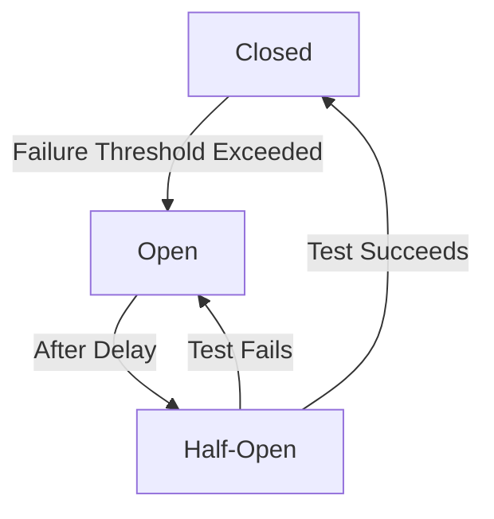

## 8.3.3 Circuit Breaker

In the realm of microservices architecture, the Circuit Breaker pattern plays a crucial role in enhancing system resilience and fault tolerance. This pattern is inspired by electrical circuit breakers, which prevent electrical overloads by interrupting the flow of electricity. Similarly, a software circuit breaker prevents system overloads by halting requests to a failing service, allowing it time to recover. This article delves into the Circuit Breaker pattern, exploring its states, failure detection mechanisms, and recovery processes.

### Introduction to Circuit Breaker Pattern

The Circuit Breaker pattern is designed to handle failures gracefully in distributed systems, such as microservices. It acts as a protective barrier, preventing cascading failures and maintaining system stability. By implementing a circuit breaker, you can detect failures early, avoid unnecessary load on failing services, and recover gracefully when services become available again.

### Circuit Breaker States

The Circuit Breaker pattern operates through three primary states:

1. **Closed State:**
   - **Normal Operation:** In this state, requests flow freely to the service. The circuit breaker monitors for failures.
   - **Transition to Open:** If the failure rate exceeds a predefined threshold, the circuit transitions to the Open state.

2. **Open State:**
   - **Blocking Requests:** In this state, requests are blocked from reaching the service, preventing further strain on a failing service.
   - **Transition to Half-Open:** After a specified delay, the circuit transitions to the Half-Open state to test if the service has recovered.

3. **Half-Open State:**
   - **Testing Recovery:** A limited number of requests are allowed through to test the service's recovery.
   - **Transition to Closed:** If the test requests succeed, the circuit transitions back to the Closed state.
   - **Transition to Open:** If the test requests fail, the circuit returns to the Open state.



### Failure Detection

Failure detection is a critical component of the Circuit Breaker pattern. It involves monitoring the service for errors and deciding when to open the circuit. Key aspects include:

- **Error Rate Monitoring:** Track the rate of errors or failures over time. If the error rate exceeds a certain threshold, the circuit opens.
- **Consecutive Failures:** Monitor consecutive failures to quickly detect persistent issues.
- **Rolling Windows:** Use rolling windows to evaluate recent performance, ensuring decisions are based on current data rather than historical anomalies.

### Recovery Mechanism

Recovery is an essential feature of the Circuit Breaker pattern, allowing systems to return to normal operation after a failure. The recovery process involves:

- **Half-Open State Testing:** After a delay, the circuit enters the Half-Open state, allowing a limited number of requests to test the service's recovery.
- **Successful Recovery:** If the test requests succeed, the circuit closes, resuming normal operation.
- **Failed Recovery:** If the test requests fail, the circuit reopens, continuing to block requests until the next recovery attempt.

### Implementing Circuit Breaker in Go

To implement a Circuit Breaker in Go, you can use libraries such as `go-resiliency` or `go-kit`. These libraries provide robust implementations of the Circuit Breaker pattern, allowing you to integrate it seamlessly into your microservices architecture.

#### Example Code

Here's a basic example of implementing a Circuit Breaker using the `go-resiliency` library:

```go
package main

import (
    "fmt"
    "github.com/eapache/go-resiliency/breaker"
    "time"
)

func main() {
    // Create a new Circuit Breaker with a failure threshold of 3 and a timeout of 1 second
    cb := breaker.New(3, 1*time.Second)

    for i := 0; i < 5; i++ {
        result := cb.Run(func() error {
            // Simulate a service call
            return fmt.Errorf("service failure")
        })

        if result == breaker.ErrBreakerOpen {
            fmt.Println("Circuit breaker is open, skipping request")
        } else if result != nil {
            fmt.Println("Service call failed:", result)
        } else {
            fmt.Println("Service call succeeded")
        }

        time.Sleep(500 * time.Millisecond)
    }
}
```

### Use Cases

The Circuit Breaker pattern is particularly useful in scenarios where:

- **External Service Dependencies:** Your application relies on external services that may become unavailable or slow.
- **Preventing Cascading Failures:** You need to prevent failures in one part of the system from affecting the entire application.
- **Graceful Degradation:** You want to degrade functionality gracefully when a service is unavailable.

### Advantages and Disadvantages

#### Advantages

- **Improved Resilience:** Prevents cascading failures and enhances system stability.
- **Resource Optimization:** Reduces unnecessary load on failing services.
- **Graceful Recovery:** Allows systems to recover gracefully when services become available.

#### Disadvantages

- **Complexity:** Adds complexity to the system, requiring careful configuration and monitoring.
- **Potential Delays:** May introduce delays in recovery if not configured correctly.

### Best Practices

- **Set Appropriate Thresholds:** Configure failure thresholds and timeouts based on service performance and requirements.
- **Monitor Performance:** Continuously monitor the performance of the circuit breaker to adjust configurations as needed.
- **Integrate with Logging:** Use logging to track circuit breaker state changes and failures for better observability.

### Comparisons

The Circuit Breaker pattern is often compared with the Retry pattern. While both aim to handle failures, the Circuit Breaker pattern is more suitable for preventing system overloads, whereas the Retry pattern focuses on retrying failed requests.

### Conclusion

The Circuit Breaker pattern is a vital tool in building resilient microservices architectures. By understanding its states, failure detection mechanisms, and recovery processes, you can effectively implement this pattern to enhance the stability and reliability of your applications.

## Quiz Time!



### What is the primary purpose of the Circuit Breaker pattern in microservices?

- [x] To prevent cascading failures and enhance system resilience
- [ ] To improve data consistency across services
- [ ] To optimize database queries
- [ ] To enhance user interface performance

> **Explanation:** The Circuit Breaker pattern is designed to prevent cascading failures and enhance system resilience by stopping requests to a failing service.

### Which state of the Circuit Breaker allows requests to flow normally to the service?

- [x] Closed
- [ ] Open
- [ ] Half-Open
- [ ] Failed

> **Explanation:** In the Closed state, requests flow normally to the service, and the circuit breaker monitors for failures.

### What happens in the Open state of a Circuit Breaker?

- [ ] Requests are allowed through to test the service
- [x] Requests are blocked to prevent further strain on the service
- [ ] The circuit breaker resets its state
- [ ] The service is restarted automatically

> **Explanation:** In the Open state, requests are blocked to prevent further strain on a failing service.

### How does the Circuit Breaker pattern detect failures?

- [ ] By monitoring CPU usage
- [x] By tracking error rates or consecutive failures
- [ ] By analyzing network latency
- [ ] By checking memory consumption

> **Explanation:** The Circuit Breaker pattern detects failures by tracking error rates or consecutive failures.

### What is the purpose of the Half-Open state in a Circuit Breaker?

- [ ] To permanently block requests
- [x] To test if the service has recovered
- [ ] To reset the circuit breaker
- [ ] To log error messages

> **Explanation:** The Half-Open state allows a limited number of requests to test if the service has recovered.

### Which library can be used to implement a Circuit Breaker in Go?

- [x] go-resiliency
- [ ] gorilla/mux
- [ ] go-kit
- [ ] testify

> **Explanation:** The `go-resiliency` library provides implementations for the Circuit Breaker pattern in Go.

### What is a potential disadvantage of using the Circuit Breaker pattern?

- [ ] It improves system resilience
- [x] It adds complexity to the system
- [ ] It reduces system stability
- [ ] It increases data consistency

> **Explanation:** The Circuit Breaker pattern adds complexity to the system, requiring careful configuration and monitoring.

### How does the Circuit Breaker pattern enhance resource optimization?

- [ ] By increasing the number of requests
- [ ] By reducing error logging
- [x] By reducing unnecessary load on failing services
- [ ] By optimizing database queries

> **Explanation:** The Circuit Breaker pattern reduces unnecessary load on failing services, optimizing resource usage.

### What should be monitored to adjust Circuit Breaker configurations?

- [ ] User interface performance
- [x] Circuit breaker performance and state changes
- [ ] Database schema changes
- [ ] Network topology

> **Explanation:** Monitoring circuit breaker performance and state changes helps adjust configurations as needed.

### True or False: The Circuit Breaker pattern is more suitable for optimizing database queries than preventing system overloads.

- [ ] True
- [x] False

> **Explanation:** The Circuit Breaker pattern is more suitable for preventing system overloads than optimizing database queries.


