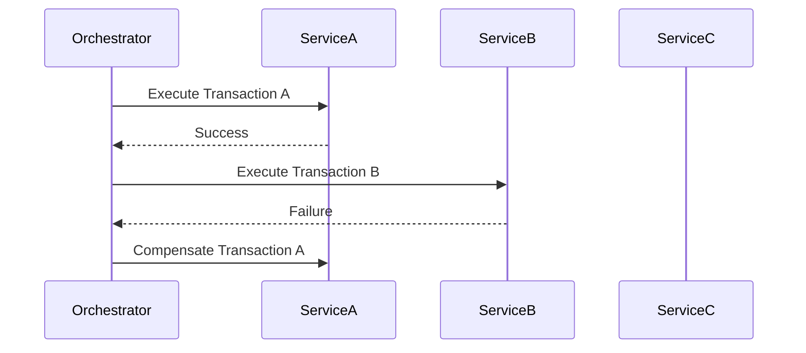
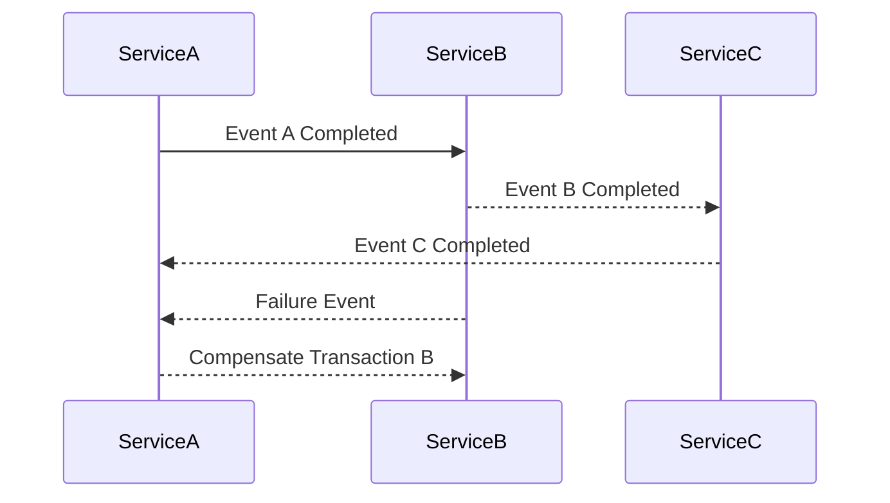

## 8.3.4 Saga Pattern

In the realm of microservices architecture, managing distributed transactions is a complex challenge. The Saga Pattern offers a robust solution by coordinating a series of local transactions across multiple services, ensuring data consistency without the need for distributed locks. This article delves into the intricacies of the Saga Pattern, its implementation in Go, and best practices for handling failures through compensating transactions.

### Introduction to the Saga Pattern

The Saga Pattern is a design pattern used to manage distributed transactions across microservices. Unlike traditional ACID transactions, which are difficult to implement in a distributed system, the Saga Pattern breaks down a transaction into a series of smaller, isolated transactions. Each of these transactions updates a single service and publishes an event or message to trigger the next step. If a step fails, compensating transactions are executed to undo the changes made by previous steps, thus maintaining data consistency.

### Detailed Explanation

#### Orchestration-Based Saga

In an orchestration-based saga, a central orchestrator is responsible for managing the sequence of transactions. The orchestrator directs each step of the saga, ensuring that all necessary actions are completed in the correct order. This approach centralizes control and simplifies the coordination of complex workflows.

**Implementation Steps:**

1. **Define the Saga:** Identify the sequence of transactions and the services involved.
2. **Implement the Orchestrator:** Create a central orchestrator service that manages the saga's lifecycle.
3. **Execute Transactions:** The orchestrator sends commands to services to perform their respective transactions.
4. **Handle Failures:** If a transaction fails, the orchestrator triggers compensating transactions to revert changes.

**Mermaid Diagram:**



#### Choreography-Based Saga

In a choreography-based saga, there is no central orchestrator. Instead, each service listens for events and decides autonomously whether to proceed with its transaction. This decentralized approach reduces coupling and allows services to react to events independently.

**Implementation Steps:**

1. **Define Events:** Identify the events that trigger each step in the saga.
2. **Implement Event Handlers:** Each service implements handlers to process relevant events.
3. **Execute Transactions:** Services perform their transactions upon receiving events.
4. **Handle Failures:** Services listen for failure events and execute compensating transactions as needed.

**Mermaid Diagram:**



### Compensation Strategies

Compensating transactions are crucial for maintaining consistency in the Saga Pattern. They are designed to undo the effects of a transaction that has already been committed. Here are some strategies for defining compensating actions:

- **Idempotency:** Ensure that compensating transactions can be safely retried without causing side effects.
- **Reversibility:** Design transactions so that their effects can be reversed if needed.
- **Consistency:** Ensure that compensating transactions restore the system to a consistent state.

### Go-Specific Tips

Go's concurrency features make it well-suited for implementing the Saga Pattern. Here are some tips for leveraging Go in your saga implementations:

- **Goroutines and Channels:** Use goroutines to execute transactions concurrently and channels for communication between services.
- **Timeouts and Retries:** Implement timeouts and retries to handle network failures and ensure robustness.
- **Context Package:** Use the `context` package to manage cancellation and timeouts across distributed transactions.

### Code Example

Below is a simplified example of an orchestration-based saga in Go:

```go
package main

import (
	"context"
	"fmt"
	"time"
)

type Service interface {
	Execute(ctx context.Context) error
	Compensate(ctx context.Context) error
}

type Orchestrator struct {
	services []Service
}

func (o *Orchestrator) ExecuteSaga(ctx context.Context) error {
	for _, service := range o.services {
		if err := service.Execute(ctx); err != nil {
			fmt.Println("Transaction failed, executing compensations")
			o.Compensate(ctx)
			return err
		}
	}
	return nil
}

func (o *Orchestrator) Compensate(ctx context.Context) {
	for _, service := range o.services {
		service.Compensate(ctx)
	}
}

type ServiceA struct{}

func (s *ServiceA) Execute(ctx context.Context) error {
	fmt.Println("Executing Service A")
	return nil
}

func (s *ServiceA) Compensate(ctx context.Context) error {
	fmt.Println("Compensating Service A")
	return nil
}

type ServiceB struct{}

func (s *ServiceB) Execute(ctx context.Context) error {
	fmt.Println("Executing Service B")
	return fmt.Errorf("Service B failed")
}

func (s *ServiceB) Compensate(ctx context.Context) error {
	fmt.Println("Compensating Service B")
	return nil
}

func main() {
	ctx, cancel := context.WithTimeout(context.Background(), 5*time.Second)
	defer cancel()

	orchestrator := &Orchestrator{
		services: []Service{&ServiceA{}, &ServiceB{}},
	}

	if err := orchestrator.ExecuteSaga(ctx); err != nil {
		fmt.Println("Saga execution failed:", err)
	}
}
```

### Use Cases

The Saga Pattern is particularly useful in scenarios where:

- **Distributed Systems:** Transactions span multiple services, each with its own database.
- **Event-Driven Architectures:** Systems rely on events to trigger and coordinate actions.
- **Microservices:** Services need to maintain consistency without tight coupling.

### Advantages and Disadvantages

**Advantages:**

- **Scalability:** Decouples services, allowing them to scale independently.
- **Resilience:** Compensating transactions handle failures gracefully.
- **Flexibility:** Supports both orchestration and choreography approaches.

**Disadvantages:**

- **Complexity:** Implementing compensating transactions can be complex.
- **Latency:** Increased latency due to multiple network calls and compensations.
- **Consistency:** Achieving eventual consistency can be challenging.

### Best Practices

- **Design for Failure:** Assume that failures will occur and design compensations accordingly.
- **Test Thoroughly:** Test compensating transactions to ensure they work as expected.
- **Monitor and Log:** Implement monitoring and logging to track saga execution and failures.

### Comparisons

The Saga Pattern can be compared to other patterns like Two-Phase Commit (2PC). While 2PC provides strong consistency, it is less suitable for microservices due to its blocking nature and single point of failure. The Saga Pattern, on the other hand, offers eventual consistency and better fault tolerance.

### Conclusion

The Saga Pattern is a powerful tool for managing distributed transactions in microservices. By coordinating a series of local transactions and handling failures through compensating actions, it ensures data consistency and system resilience. Implementing the Saga Pattern in Go leverages the language's concurrency features, making it a robust choice for modern distributed systems.

## Quiz Time!



### What is the primary purpose of the Saga Pattern in microservices?

- [x] To manage distributed transactions across multiple services
- [ ] To enhance the performance of microservices
- [ ] To simplify the deployment process
- [ ] To improve user interface design

> **Explanation:** The Saga Pattern is used to manage distributed transactions across multiple services, ensuring data consistency without distributed locks.

### Which approach involves a central orchestrator in the Saga Pattern?

- [x] Orchestration-Based Saga
- [ ] Choreography-Based Saga
- [ ] Event-Driven Saga
- [ ] Centralized Saga

> **Explanation:** In an orchestration-based saga, a central orchestrator manages the sequence of transactions.

### What is a key advantage of the choreography-based saga approach?

- [x] Reduced coupling between services
- [ ] Centralized control
- [ ] Simplified transaction management
- [ ] Improved performance

> **Explanation:** The choreography-based saga approach reduces coupling by allowing services to react to events independently.

### What is the role of compensating transactions in the Saga Pattern?

- [x] To undo the effects of a failed transaction
- [ ] To enhance transaction speed
- [ ] To improve data storage efficiency
- [ ] To simplify service communication

> **Explanation:** Compensating transactions are used to undo the effects of a failed transaction, maintaining data consistency.

### Which Go feature is particularly useful for implementing the Saga Pattern?

- [x] Goroutines and Channels
- [ ] Pointers and Structs
- [ ] Interfaces and Methods
- [ ] Maps and Slices

> **Explanation:** Goroutines and channels are useful for managing concurrency and communication in the Saga Pattern.

### What is a potential disadvantage of the Saga Pattern?

- [x] Increased latency due to multiple network calls
- [ ] Lack of scalability
- [ ] Inability to handle failures
- [ ] Tight coupling between services

> **Explanation:** The Saga Pattern can introduce increased latency due to multiple network calls and compensations.

### How does the Saga Pattern compare to Two-Phase Commit (2PC)?

- [x] Saga offers eventual consistency, while 2PC provides strong consistency
- [ ] Saga is more suitable for small applications
- [ ] Saga is less resilient to failures
- [ ] Saga requires more resources

> **Explanation:** The Saga Pattern offers eventual consistency, making it more suitable for microservices than the blocking nature of 2PC.

### What should be a focus when designing compensating transactions?

- [x] Idempotency and reversibility
- [ ] Performance optimization
- [ ] User experience
- [ ] Data redundancy

> **Explanation:** Compensating transactions should be idempotent and reversible to ensure they can be safely retried and restore consistency.

### Which of the following is NOT a step in implementing an orchestration-based saga?

- [ ] Define the Saga
- [ ] Implement the Orchestrator
- [ ] Execute Transactions
- [x] Decentralize Control

> **Explanation:** Decentralizing control is a characteristic of choreography-based sagas, not orchestration-based.

### True or False: The Saga Pattern is only applicable to microservices architectures.

- [x] True
- [ ] False

> **Explanation:** The Saga Pattern is specifically designed for managing distributed transactions in microservices architectures.


