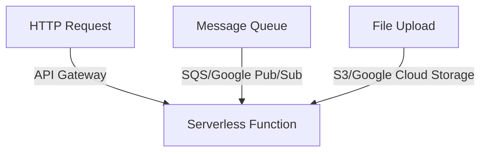

## 8.5 Serverless Architecture

Serverless architecture represents a paradigm shift in how applications are built and deployed, focusing on running code in response to events without the need to manage servers. This approach allows developers to concentrate on writing code while cloud providers handle the infrastructure, scaling, and maintenance. In this section, we will explore how to develop serverless applications using Go, covering function development, event sources, deployment strategies, and the benefits and limitations of serverless computing.

### Developing Serverless Applications

#### Function Development

In a serverless architecture, applications are composed of stateless functions that are triggered by specific events. These functions are designed to perform discrete tasks and can be written in Go to leverage its performance and concurrency features.

- **Stateless Functions:** Serverless functions should be stateless, meaning they do not retain any data between invocations. This ensures that functions can scale horizontally without issues related to shared state.
- **Event-Driven Execution:** Functions are triggered by events such as HTTP requests, database changes, or message queue updates. This event-driven model allows for highly responsive and scalable applications.

**Example: A Simple Go Function**

```go
package main

import (
    "context"
    "fmt"
    "github.com/aws/aws-lambda-go/lambda"
)

type MyEvent struct {
    Name string `json:"name"`
}

func HandleRequest(ctx context.Context, event MyEvent) (string, error) {
    return fmt.Sprintf("Hello, %s!", event.Name), nil
}

func main() {
    lambda.Start(HandleRequest)
}
```

In this example, a simple AWS Lambda function is written in Go. It takes an event with a `Name` field and returns a greeting message. The function is stateless and can be triggered by various event sources.

#### Event Sources

Event sources are the triggers that invoke serverless functions. Configuring these sources is crucial for building responsive applications.

- **HTTP Requests:** Functions can be triggered by HTTP requests using API Gateway services, making it easy to build RESTful APIs.
- **Message Queues:** Services like AWS SQS or Google Pub/Sub can trigger functions when messages are added to a queue, enabling asynchronous processing.
- **File Uploads:** Functions can respond to file uploads in cloud storage services, such as AWS S3 or Google Cloud Storage, to process files as they are uploaded.

**Mermaid Diagram: Event Source Configuration**



This diagram illustrates how different event sources can trigger a serverless function, highlighting the flexibility of serverless architectures.

#### Deployment

Deploying serverless applications involves packaging the function code and configuring the cloud provider to execute the functions in response to events.

- **AWS Lambda:** AWS Lambda is a popular service for deploying serverless functions. It supports Go and provides integration with a wide range of AWS services.
- **Azure Functions:** Azure Functions offer a similar platform for deploying serverless applications, with support for multiple languages, including Go.
- **Google Cloud Functions:** Google Cloud Functions provide a serverless environment for executing functions in response to cloud events.

**Deployment Example: AWS Lambda**

To deploy a Go function to AWS Lambda, you need to:

1. **Package the Function:** Compile the Go code into a binary.
2. **Create a Lambda Function:** Use the AWS Management Console or CLI to create a new Lambda function.
3. **Configure Triggers:** Set up event sources such as API Gateway or S3 to trigger the function.

### Benefits of Serverless Architecture

Serverless architecture offers several advantages that make it an attractive choice for modern application development:

- **Automatic Scaling:** Functions automatically scale with demand, ensuring that applications can handle varying workloads without manual intervention.
- **Reduced Operational Overhead:** Developers focus on writing code while the cloud provider manages the infrastructure, reducing the complexity of operations.
- **Pay-Per-Use Pricing:** Costs are based on the number of function invocations and execution time, leading to cost savings compared to traditional server-based models.

### Limitations of Serverless Architecture

Despite its benefits, serverless architecture has some limitations that developers must consider:

- **Cold Start Latency:** Functions may experience a delay, known as a cold start, when they are invoked after being idle. This can impact performance for latency-sensitive applications.
- **Execution Time Limits:** Most serverless platforms impose limits on function execution time, which can be a constraint for long-running processes.
- **Resource Constraints:** Functions have limited memory and CPU resources, which may not be suitable for resource-intensive tasks.

### Best Practices for Serverless Development

To maximize the benefits of serverless architecture, consider the following best practices:

- **Optimize Function Performance:** Minimize cold start latency by keeping functions warm and optimizing initialization code.
- **Use Environment Variables:** Store configuration data in environment variables to keep functions stateless and easily configurable.
- **Monitor and Log:** Implement monitoring and logging to gain insights into function performance and troubleshoot issues effectively.

### Conclusion

Serverless architecture provides a powerful model for building scalable and cost-effective applications. By leveraging cloud services like AWS Lambda, Azure Functions, and Google Cloud Functions, developers can focus on writing efficient Go code while benefiting from automatic scaling and reduced operational overhead. However, it is essential to be aware of the limitations, such as cold start latency and resource constraints, and to follow best practices to ensure optimal performance.

## Quiz Time!



### What is a key characteristic of serverless functions?

- [x] They are stateless.
- [ ] They require manual scaling.
- [ ] They are always running.
- [ ] They are only triggered by HTTP requests.

> **Explanation:** Serverless functions are stateless, meaning they do not retain data between invocations, allowing for horizontal scaling.

### Which of the following is an example of an event source for serverless functions?

- [x] HTTP requests
- [x] Message queues
- [x] File uploads
- [ ] Manual triggers

> **Explanation:** HTTP requests, message queues, and file uploads can all serve as event sources for serverless functions.

### What is a benefit of serverless architecture?

- [x] Automatic scaling
- [ ] Unlimited execution time
- [ ] No cold start latency
- [ ] Requires dedicated servers

> **Explanation:** Serverless architecture automatically scales functions based on demand, reducing the need for manual scaling.

### Which cloud service is commonly used for deploying serverless functions in Go?

- [x] AWS Lambda
- [ ] AWS EC2
- [ ] Google Compute Engine
- [ ] Azure Virtual Machines

> **Explanation:** AWS Lambda is a popular service for deploying serverless functions, including those written in Go.

### What is a limitation of serverless architecture?

- [x] Cold start latency
- [ ] Unlimited resource allocation
- [ ] High operational overhead
- [ ] Requires manual scaling

> **Explanation:** Cold start latency is a common limitation of serverless architecture, affecting performance for some applications.

### How can you optimize serverless function performance?

- [x] Minimize cold start latency
- [ ] Increase execution time limits
- [ ] Use dedicated servers
- [ ] Avoid environment variables

> **Explanation:** Minimizing cold start latency is a key strategy for optimizing serverless function performance.

### What is the pricing model for serverless architecture?

- [x] Pay-per-use
- [ ] Fixed monthly fee
- [ ] Per server cost
- [ ] Subscription-based

> **Explanation:** Serverless architecture typically uses a pay-per-use pricing model, charging based on function invocations and execution time.

### Which of the following is NOT a serverless platform?

- [ ] AWS Lambda
- [ ] Azure Functions
- [ ] Google Cloud Functions
- [x] Docker Swarm

> **Explanation:** Docker Swarm is a container orchestration tool, not a serverless platform.

### What should serverless functions avoid to remain stateless?

- [x] Retaining data between invocations
- [ ] Using environment variables
- [ ] Logging events
- [ ] Handling HTTP requests

> **Explanation:** Serverless functions should avoid retaining data between invocations to remain stateless.

### True or False: Serverless architecture eliminates the need for any server management.

- [ ] True
- [x] False

> **Explanation:** While serverless architecture reduces the need for server management, some configuration and management tasks are still necessary.


