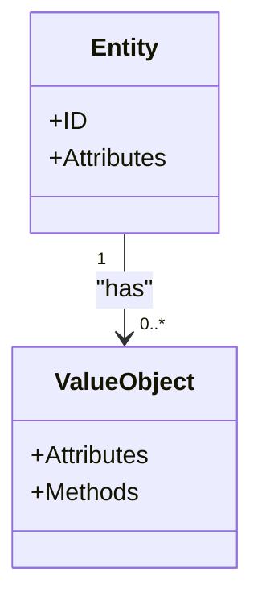

## 9.2 Value Objects

In Domain-Driven Design (DDD), Value Objects play a crucial role in representing descriptive aspects of the domain. Unlike entities, which are defined by their identity, Value Objects are defined by their attributes. This section delves into the concept of Value Objects, their implementation in Go, and best practices for leveraging them effectively.

### Definition of Value Objects

Value Objects are immutable objects that encapsulate attributes related to a specific domain concept. They are characterized by:

- **Immutability:** Once created, the state of a Value Object cannot be altered. This ensures consistency and reliability across the application.
- **Equality by Content:** Two Value Objects are considered equal if all their attributes are identical, regardless of their memory address or identity.

Value Objects are often used to model concepts like monetary values, dates, and other domain-specific descriptors where identity is irrelevant.

### Implementation Steps

Implementing Value Objects in Go involves several key steps to ensure immutability and correctness:

#### Define Structs

1. **Create Structs:** Define structs for your Value Objects with exported fields. This allows for easy access while maintaining encapsulation.
2. **Field Initialization:** Ensure that all fields are initialized during the creation of the Value Object. Avoid zero-value fields to maintain data integrity.

#### Immutability

1. **No Setter Methods:** Do not provide setter methods for modifying fields. The state of a Value Object should be set only at the time of creation.
2. **Factory Functions:** Use factory functions to enforce validation and creation rules. This approach ensures that Value Objects are always in a valid state.

### Best Practices

- **Use Cases:** Employ Value Objects for concepts like `Money`, `Address`, `Coordinates`, and other domain-specific descriptors.
- **Domain Logic:** Implement value-specific methods such as formatting, calculations, and conversions to encapsulate domain logic within the Value Object.

### Example: Address Value Object

Let's consider an example of creating an `Address` Value Object in Go. This example demonstrates how to define a struct, ensure immutability, and implement domain-specific methods.

```go
package main

import (
	"fmt"
)

// Address represents a Value Object for a physical address.
type Address struct {
	street  string
	city    string
	state   string
	zipCode string
}

// NewAddress is a factory function for creating a new Address Value Object.
func NewAddress(street, city, state, zipCode string) (*Address, error) {
	if street == "" || city == "" || state == "" || zipCode == "" {
		return nil, fmt.Errorf("all address fields must be provided")
	}
	return &Address{
		street:  street,
		city:    city,
		state:   state,
		zipCode: zipCode,
	}, nil
}

// String returns the formatted address.
func (a *Address) String() string {
	return fmt.Sprintf("%s, %s, %s %s", a.street, a.city, a.state, a.zipCode)
}

// Equals checks if two Address Value Objects are equal.
func (a *Address) Equals(other *Address) bool {
	return a.street == other.street &&
		a.city == other.city &&
		a.state == other.state &&
		a.zipCode == other.zipCode
}

func main() {
	address1, _ := NewAddress("123 Main St", "Anytown", "CA", "12345")
	address2, _ := NewAddress("123 Main St", "Anytown", "CA", "12345")

	fmt.Println("Address 1:", address1.String())
	fmt.Println("Address 2:", address2.String())
	fmt.Println("Addresses are equal:", address1.Equals(address2))
}
```

### Visual Representation

To further illustrate the concept of Value Objects, consider the following diagram showing the relationship between entities and Value Objects:



### Advantages and Disadvantages

#### Advantages

- **Immutability:** Ensures thread safety and consistency across the application.
- **Simplified Equality:** Equality is based on content, making comparison straightforward.
- **Encapsulation:** Encapsulates domain logic within the Value Object, promoting a clean design.

#### Disadvantages

- **Overhead:** May introduce additional complexity in managing multiple Value Objects.
- **Memory Usage:** Immutable objects can lead to increased memory usage if not managed properly.

### Best Practices

- **Validation:** Always validate input data in factory functions to ensure Value Objects are created in a valid state.
- **Method Implementation:** Implement methods that encapsulate domain logic within the Value Object to keep the logic close to the data it operates on.
- **Use in Aggregates:** Use Value Objects within aggregates to maintain consistency and encapsulate domain rules.

### Comparisons with Other Patterns

Value Objects are often compared with Entities. While both are fundamental to DDD, they serve different purposes. Entities are defined by their identity, while Value Objects are defined by their attributes. This distinction is crucial when modeling a domain.

### Conclusion

Value Objects are a powerful tool in Domain-Driven Design, providing a way to model domain-specific concepts with immutability and encapsulation. By following best practices and leveraging Go's features, developers can create robust and maintainable applications that accurately reflect the domain.

## Quiz Time!



### What is a key characteristic of Value Objects in DDD?

- [x] Immutability
- [ ] Identity
- [ ] Mutable state
- [ ] Unique identifiers

> **Explanation:** Value Objects are immutable and defined by their attributes, not by identity.

### How is equality determined for Value Objects?

- [x] By content
- [ ] By identity
- [ ] By memory address
- [ ] By reference

> **Explanation:** Equality for Value Objects is determined by their content, meaning all attributes must be identical.

### What is a common use case for Value Objects?

- [x] Modeling domain-specific descriptors like `Money` or `Address`
- [ ] Managing unique identifiers
- [ ] Handling mutable state
- [ ] Implementing database transactions

> **Explanation:** Value Objects are used to model domain-specific descriptors where identity is irrelevant.

### What is the purpose of a factory function in the context of Value Objects?

- [x] To enforce validation and creation rules
- [ ] To modify existing Value Objects
- [ ] To manage database transactions
- [ ] To handle mutable state

> **Explanation:** Factory functions are used to ensure Value Objects are created in a valid state with all necessary attributes.

### Why should Value Objects not have setter methods?

- [x] To maintain immutability
- [ ] To allow for mutable state
- [ ] To simplify database operations
- [ ] To manage identity

> **Explanation:** Value Objects should be immutable, and setter methods would allow for state changes, violating this principle.

### Which of the following is a disadvantage of using Value Objects?

- [x] Potential increased memory usage
- [ ] Simplified equality checks
- [ ] Encapsulation of domain logic
- [ ] Thread safety

> **Explanation:** While Value Objects offer many benefits, they can lead to increased memory usage due to their immutable nature.

### What is the relationship between Entities and Value Objects in a domain model?

- [x] Entities can have multiple Value Objects
- [ ] Value Objects can have multiple Entities
- [ ] Entities and Value Objects are interchangeable
- [ ] Value Objects define the identity of Entities

> **Explanation:** Entities can have multiple Value Objects to encapsulate domain-specific attributes.

### What is a benefit of encapsulating domain logic within Value Objects?

- [x] Keeps logic close to the data it operates on
- [ ] Allows for mutable state
- [ ] Simplifies database transactions
- [ ] Increases memory usage

> **Explanation:** Encapsulating domain logic within Value Objects keeps the logic close to the data, promoting a clean design.

### How do Value Objects contribute to thread safety?

- [x] By being immutable
- [ ] By managing unique identifiers
- [ ] By allowing state changes
- [ ] By simplifying database operations

> **Explanation:** The immutability of Value Objects ensures that they are thread-safe, as their state cannot be altered.

### True or False: Value Objects are defined by their identity.

- [ ] True
- [x] False

> **Explanation:** Value Objects are defined by their attributes, not by identity.


