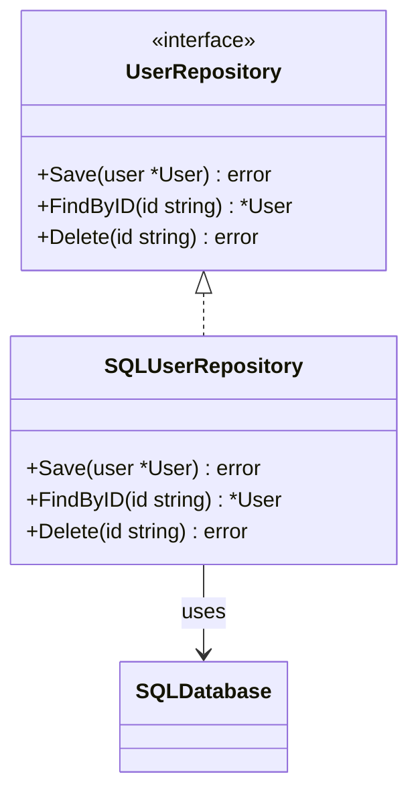

## 9.4 Repositories

In the realm of Domain-Driven Design (DDD), the Repository pattern plays a crucial role in abstracting the data persistence mechanism. It provides a clean interface for accessing and manipulating aggregates, ensuring that the domain logic remains decoupled from the underlying data storage concerns. This article delves into the purpose, implementation, and best practices for using repositories in Go, along with practical examples and visual aids to enhance understanding.

### Purpose of Repositories

Repositories serve as a bridge between the domain and data mapping layers, offering a collection-like interface for accessing domain objects. Their primary purposes include:

- **Abstracting Data Persistence:** Repositories hide the complexities of data storage, allowing domain logic to interact with a simplified interface.
- **Providing an Interface for Aggregates:** They offer methods for accessing and manipulating aggregates, ensuring that domain rules are consistently applied.

### Implementation Steps

Implementing a repository in Go involves several key steps, each aimed at maintaining a clear separation of concerns and promoting code maintainability.

#### 1. Define Repository Interface

The first step is to define an interface that outlines the methods required for interacting with aggregates. This interface should include methods like `Save`, `FindByID`, and `Delete`.

```go
// UserRepository defines the interface for user data operations.
type UserRepository interface {
    Save(user *User) error
    FindByID(id string) (*User, error)
    Delete(id string) error
}
```

#### 2. Implement Persistence Logic

Next, create concrete types that implement the repository interface using databases or storage services. This implementation should handle the specifics of data storage, such as SQL queries or API calls.

```go
// SQLUserRepository is a concrete implementation of UserRepository using SQL.
type SQLUserRepository struct {
    db *sql.DB
}

// Save persists a user in the database.
func (r *SQLUserRepository) Save(user *User) error {
    _, err := r.db.Exec("INSERT INTO users (id, name) VALUES (?, ?)", user.ID, user.Name)
    return err
}

// FindByID retrieves a user by their ID.
func (r *SQLUserRepository) FindByID(id string) (*User, error) {
    row := r.db.QueryRow("SELECT id, name FROM users WHERE id = ?", id)
    user := &User{}
    err := row.Scan(&user.ID, &user.Name)
    if err != nil {
        return nil, err
    }
    return user, nil
}

// Delete removes a user from the database.
func (r *SQLUserRepository) Delete(id string) error {
    _, err := r.db.Exec("DELETE FROM users WHERE id = ?", id)
    return err
}
```

### Best Practices

To effectively implement repositories in Go, consider the following best practices:

- **Focus on Aggregate Operations:** Repository methods should be centered around operations that involve aggregates, ensuring that domain rules are consistently enforced.
- **Dependency Injection:** Inject repositories into services or use cases that require data access, promoting loose coupling and testability.
- **Interface Segregation:** Define interfaces that are specific to the needs of the client, avoiding large, monolithic interfaces.

### Example

Let's consider a practical example of a `UserRepository` interface and its implementation using a SQL database.

```go
// User represents a domain entity.
type User struct {
    ID   string
    Name string
}

// UserRepository interface for user data operations.
type UserRepository interface {
    Save(user *User) error
    FindByID(id string) (*User, error)
    Delete(id string) error
}

// SQLUserRepository implements UserRepository using SQL.
type SQLUserRepository struct {
    db *sql.DB
}

// Save persists a user in the database.
func (r *SQLUserRepository) Save(user *User) error {
    _, err := r.db.Exec("INSERT INTO users (id, name) VALUES (?, ?)", user.ID, user.Name)
    return err
}

// FindByID retrieves a user by their ID.
func (r *SQLUserRepository) FindByID(id string) (*User, error) {
    row := r.db.QueryRow("SELECT id, name FROM users WHERE id = ?", id)
    user := &User{}
    err := row.Scan(&user.ID, &user.Name)
    if err != nil {
        return nil, err
    }
    return user, nil
}

// Delete removes a user from the database.
func (r *SQLUserRepository) Delete(id string) error {
    _, err := r.db.Exec("DELETE FROM users WHERE id = ?", id)
    return err
}
```

### Visual Aids

To better understand the repository pattern, let's visualize the interaction between the domain layer and the data persistence layer using a conceptual diagram.



### Advantages and Disadvantages

**Advantages:**

- **Decoupling:** Repositories decouple domain logic from data access logic, promoting a clean architecture.
- **Testability:** By abstracting data access, repositories make it easier to test domain logic without relying on a database.
- **Consistency:** They ensure that all data access operations adhere to domain rules.

**Disadvantages:**

- **Complexity:** Implementing repositories can introduce additional complexity, especially in simple applications.
- **Overhead:** There may be some performance overhead due to the abstraction layer.

### Best Practices

- **Keep It Simple:** Avoid over-engineering repositories. Focus on the essential operations required by the domain.
- **Use Interfaces Wisely:** Define interfaces that are specific to the needs of the client, promoting flexibility and adaptability.
- **Leverage Go's Features:** Utilize Go's interfaces and dependency injection to enhance the flexibility and testability of repositories.

### Conclusion

Repositories are a fundamental component of Domain-Driven Design, providing a clean interface for data access and manipulation. By abstracting the data persistence mechanism, they promote a decoupled architecture and enhance the testability of domain logic. Implementing repositories in Go requires careful consideration of best practices and design principles to ensure maintainability and scalability.

## Quiz Time!



### What is the primary purpose of a repository in Domain-Driven Design?

- [x] To abstract the data persistence mechanism
- [ ] To implement business logic
- [ ] To handle user authentication
- [ ] To manage application configuration

> **Explanation:** Repositories abstract the data persistence mechanism, providing a clean interface for accessing and manipulating aggregates.

### Which method is typically included in a repository interface?

- [x] Save
- [ ] Authenticate
- [ ] Configure
- [ ] Log

> **Explanation:** A repository interface typically includes methods like `Save`, `FindByID`, and `Delete` to manage aggregates.

### What is a key advantage of using repositories?

- [x] Decoupling domain logic from data access logic
- [ ] Increasing application complexity
- [ ] Reducing code readability
- [ ] Enhancing user interface design

> **Explanation:** Repositories decouple domain logic from data access logic, promoting a clean architecture.

### How should repositories be injected into services?

- [x] Using dependency injection
- [ ] Through global variables
- [ ] By hardcoding them
- [ ] Using environment variables

> **Explanation:** Repositories should be injected into services using dependency injection to promote loose coupling and testability.

### What is a disadvantage of using repositories?

- [x] Complexity
- [ ] Improved testability
- [ ] Enhanced consistency
- [ ] Simplified architecture

> **Explanation:** Implementing repositories can introduce additional complexity, especially in simple applications.

### Which Go feature enhances the flexibility of repositories?

- [x] Interfaces
- [ ] Goroutines
- [ ] Channels
- [ ] Structs

> **Explanation:** Go's interfaces enhance the flexibility and testability of repositories by allowing different implementations.

### What should repository methods focus on?

- [x] Aggregate operations
- [ ] User interface design
- [ ] Network communication
- [ ] File system access

> **Explanation:** Repository methods should focus on operations that involve aggregates, ensuring domain rules are consistently enforced.

### What is a common method in a `UserRepository` interface?

- [x] FindByID
- [ ] AuthenticateUser
- [ ] ConfigureSettings
- [ ] LogActivity

> **Explanation:** `FindByID` is a common method in a `UserRepository` interface for retrieving users by their ID.

### What is the role of a concrete repository implementation?

- [x] To handle the specifics of data storage
- [ ] To define business rules
- [ ] To manage user sessions
- [ ] To configure application settings

> **Explanation:** A concrete repository implementation handles the specifics of data storage, such as SQL queries or API calls.

### Repositories ensure that all data access operations adhere to domain rules.

- [x] True
- [ ] False

> **Explanation:** Repositories ensure consistency by enforcing domain rules in all data access operations.


