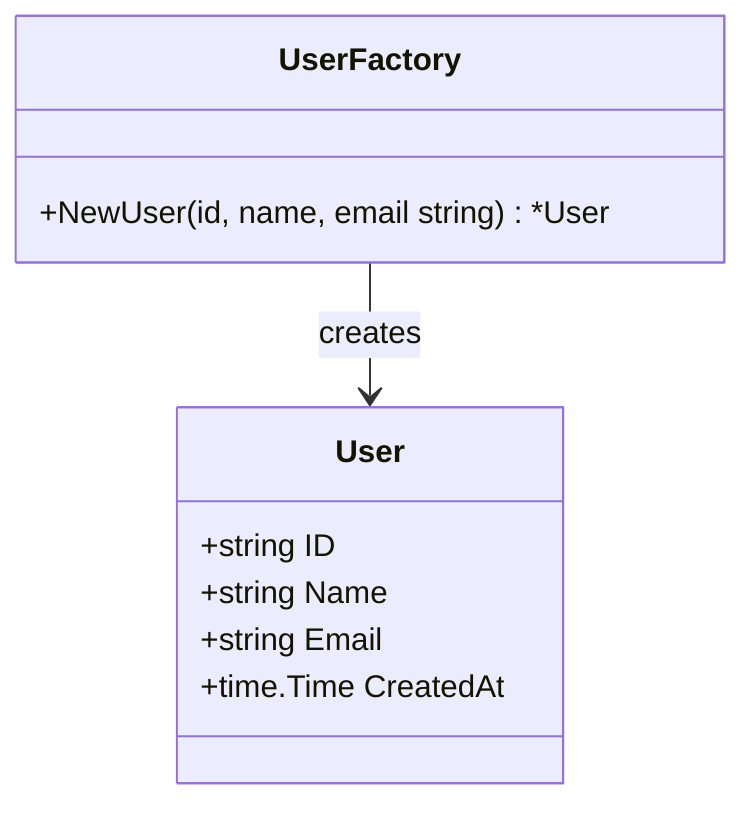

## 9.7 Factories

In the realm of Domain-Driven Design (DDD), factories play a crucial role in managing the creation of complex objects, particularly aggregates and entities. By encapsulating the creation logic, factories ensure that objects are instantiated with all necessary invariants and validations, promoting consistency and integrity within the domain model.

### Definition

Factories are responsible for encapsulating the logic required to create complex objects. This is especially important for aggregates and entities in DDD, where maintaining the integrity and consistency of the domain model is paramount. Factories abstract the process of object creation, ensuring that all necessary conditions and setups are met before an object is returned to the client.

### Implementation Steps

Implementing factories in Go involves a few key steps to ensure that the creation logic is both encapsulated and efficient:

#### 1. Create Factory Functions

Factory functions are the cornerstone of the factory pattern in Go. These functions are responsible for returning fully initialized objects, complete with any necessary defaults and validations.

- **Function Signature:** Define a function that returns the desired object type. This function should encapsulate all the logic required to create a valid instance of the object.

- **Validation and Setup:** Include any validation logic or setup procedures that are necessary for the object. This ensures that the object is in a valid state upon creation.

#### Example: `NewUser` Factory Function

Consider a `User` entity that requires certain defaults and validations upon creation. A factory function can encapsulate this logic:

```go
package user

import (
    "errors"
    "time"
)

// User represents a user entity in the domain.
type User struct {
    ID        string
    Name      string
    Email     string
    CreatedAt time.Time
}

// NewUser is a factory function that creates a new User entity.
func NewUser(id, name, email string) (*User, error) {
    if id == "" || name == "" || email == "" {
        return nil, errors.New("id, name, and email must be provided")
    }

    // Additional validation logic can be added here.

    return &User{
        ID:        id,
        Name:      name,
        Email:     email,
        CreatedAt: time.Now(),
    }, nil
}
```

### Best Practices

To effectively utilize factories in your Go applications, consider the following best practices:

- **Maintain Invariants:** Use factories to ensure that all invariants of the object are maintained. This includes setting default values and performing necessary validations.

- **Encapsulate Creation Logic:** Keep the creation logic within the factory to prevent duplication and ensure consistency across the application.

- **Package Organization:** Place factory methods in the same package as the objects they create. This promotes cohesion and makes it easier to manage changes to the object or its creation logic.

- **Testability:** Factories should be easy to test. Ensure that factory functions are covered by unit tests to verify that they produce valid objects under various conditions.

### Visual Aids

To better understand the role of factories in object creation, consider the following conceptual diagram illustrating the relationship between a factory and the objects it creates:



### Use Cases

Factories are particularly useful in scenarios where object creation is complex or involves multiple steps. Some common use cases include:

- **Aggregate Creation:** When creating aggregates that consist of multiple entities or value objects, factories can manage the instantiation and assembly of these components.

- **Complex Initialization:** For objects that require complex initialization logic, factories can encapsulate this complexity, providing a simple interface for clients.

- **Consistency and Validation:** Factories ensure that all necessary validations are performed, and default values are set, maintaining consistency across the application.

### Advantages and Disadvantages

#### Advantages

- **Encapsulation:** Factories encapsulate complex creation logic, reducing duplication and improving maintainability.
- **Consistency:** By centralizing creation logic, factories ensure that objects are consistently initialized across the application.
- **Testability:** Factories can be easily tested to ensure that they produce valid objects under various conditions.

#### Disadvantages

- **Overhead:** Introducing factories can add an additional layer of abstraction, which may be unnecessary for simple objects.
- **Complexity:** For simple applications, the use of factories may introduce unnecessary complexity.

### Best Practices

- **Use When Necessary:** Employ factories when object creation is complex or involves multiple steps. Avoid using factories for simple objects where direct instantiation is sufficient.
- **Keep Simple:** Keep factory functions simple and focused on object creation. Avoid adding unrelated logic to factories.
- **Document:** Clearly document the purpose and usage of factory functions to aid in understanding and maintenance.

### Comparisons

Factories can be compared to other creational patterns, such as the Builder pattern. While factories focus on encapsulating the creation logic for complex objects, builders are more suited for constructing objects step-by-step, particularly when the construction process is complex and involves multiple optional parameters.

### Conclusion

Factories are a powerful tool in the Domain-Driven Design toolkit, providing a structured approach to object creation. By encapsulating complex creation logic, factories ensure that objects are consistently and correctly initialized, maintaining the integrity of the domain model. As with any design pattern, it's important to use factories judiciously, balancing the benefits of encapsulation and consistency with the potential for added complexity.

## Quiz Time!



### What is the primary purpose of a factory in Domain-Driven Design?

- [x] To encapsulate complex object creation logic
- [ ] To manage the lifecycle of objects
- [ ] To provide a global point of access to an object
- [ ] To decouple an abstraction from its implementation

> **Explanation:** Factories are used to encapsulate complex object creation logic, ensuring that objects are correctly initialized with all necessary invariants and validations.

### Which of the following is a key benefit of using factories?

- [x] Consistency in object creation
- [ ] Simplifying object destruction
- [ ] Reducing memory usage
- [ ] Enhancing object serialization

> **Explanation:** Factories provide consistency in object creation by centralizing and encapsulating the creation logic.

### In Go, where should factory methods be placed?

- [x] In the same package as the objects they create
- [ ] In a separate package dedicated to factories
- [ ] In the main package
- [ ] In a utility package

> **Explanation:** Factory methods should be placed in the same package as the objects they create to promote cohesion and manageability.

### What is a potential disadvantage of using factories?

- [x] They can introduce unnecessary complexity
- [ ] They increase memory usage
- [ ] They make testing more difficult
- [ ] They reduce code readability

> **Explanation:** Factories can introduce unnecessary complexity, especially in simple applications where direct instantiation is sufficient.

### How do factories enhance testability?

- [x] By centralizing creation logic, making it easier to test object initialization
- [ ] By providing a global point of access to objects
- [ ] By reducing the number of dependencies
- [ ] By simplifying object destruction

> **Explanation:** Factories enhance testability by centralizing creation logic, making it easier to test that objects are initialized correctly under various conditions.

### What is the relationship between a factory and the objects it creates?

- [x] The factory encapsulates the creation logic and returns fully initialized objects
- [ ] The factory manages the lifecycle of the objects
- [ ] The factory provides a global point of access to the objects
- [ ] The factory decouples the objects from their implementation

> **Explanation:** The factory encapsulates the creation logic and returns fully initialized objects, ensuring they meet all necessary conditions.

### When should factories be used?

- [x] When object creation is complex or involves multiple steps
- [ ] When objects need to be destroyed
- [ ] When objects require serialization
- [ ] When objects need to be accessed globally

> **Explanation:** Factories should be used when object creation is complex or involves multiple steps, ensuring consistency and correctness.

### Which design pattern is more suited for constructing objects step-by-step?

- [x] Builder pattern
- [ ] Singleton pattern
- [ ] Adapter pattern
- [ ] Observer pattern

> **Explanation:** The Builder pattern is more suited for constructing objects step-by-step, particularly when the construction process is complex and involves multiple optional parameters.

### What is a common use case for factories?

- [x] Aggregate creation
- [ ] Object destruction
- [ ] Object serialization
- [ ] Object caching

> **Explanation:** Factories are commonly used for aggregate creation, managing the instantiation and assembly of multiple entities or value objects.

### True or False: Factories should always be used for object creation in Go.

- [ ] True
- [x] False

> **Explanation:** Factories should not always be used for object creation in Go. They are most beneficial when object creation is complex or involves multiple steps. For simple objects, direct instantiation may be sufficient.


