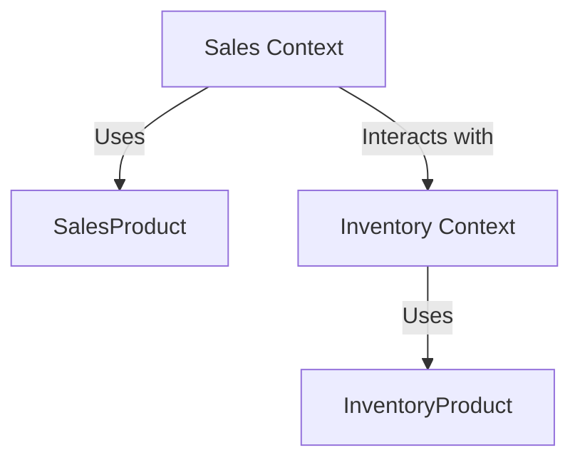

## 9.9 Bounded Contexts

In the realm of Domain-Driven Design (DDD), the concept of Bounded Contexts is pivotal for managing complexity in large software systems. This article delves into the intricacies of Bounded Contexts, their implementation in Go, and best practices to ensure a robust and scalable architecture.

### Introduction

Bounded Contexts are a fundamental pattern in DDD, providing a way to divide a domain model into distinct sections where particular terms and models are defined consistently. This separation helps manage complexity by ensuring that each context has its own ubiquitous language and model, reducing ambiguity and enhancing clarity.

### Definition

A Bounded Context is a boundary within which a particular domain model is defined and applicable. It encapsulates the model and its associated language, ensuring that terms have specific meanings within that context. This separation is crucial in large systems where different parts of the organization may have different interpretations of the same terms.

### Implementation Steps

Implementing Bounded Contexts involves several key steps:

#### 1. Identify Contexts

The first step is to analyze the domain to find areas with distinct models or language. This involves understanding the business processes, stakeholders, and the specific language used in different parts of the organization.

#### 2. Establish Boundaries

Once the contexts are identified, the next step is to define clear interfaces and contracts between them. This involves specifying how different contexts interact and ensuring that each context's internal details are hidden from others.

### Best Practices

To effectively implement Bounded Contexts, consider the following best practices:

- **Context Mapping:** Use context mapping to understand relationships between contexts. This involves creating diagrams that show how different contexts interact and where they overlap.
  
- **Limit Knowledge of Other Contexts:** Reduce coupling by limiting knowledge of other contexts' internals. This ensures that changes in one context do not inadvertently affect others.

- **Consistent Language:** Ensure that each context has its own ubiquitous language, which is consistently used across all components within that context.

### Example

Consider a system with `Sales` and `Inventory` contexts. Each context has its own definition of a `Product` entity:

- **Sales Context:** The `Product` entity in the Sales context might include attributes like `Price`, `Discount`, and `SalesChannel`.
  
- **Inventory Context:** In contrast, the `Product` entity in the Inventory context might focus on `StockLevel`, `WarehouseLocation`, and `ReorderThreshold`.

By separating these contexts, each can evolve independently, and changes in one do not directly impact the other.

```go
// Sales context
type SalesProduct struct {
    ID           string
    Name         string
    Price        float64
    Discount     float64
    SalesChannel string
}

// Inventory context
type InventoryProduct struct {
    ID              string
    Name            string
    StockLevel      int
    WarehouseLocation string
    ReorderThreshold int
}
```

### Visual Aids

To better understand Bounded Contexts, let's visualize the separation and interaction between contexts using a Mermaid.js diagram.



### Advantages and Disadvantages

#### Advantages

- **Clarity and Consistency:** Bounded Contexts provide clarity by ensuring that terms have specific meanings within each context.
- **Flexibility:** They allow different parts of the system to evolve independently, reducing the risk of changes in one area affecting others.
- **Scalability:** By dividing the domain into manageable sections, Bounded Contexts facilitate scalability.

#### Disadvantages

- **Complexity in Integration:** Defining clear boundaries and managing interactions between contexts can be complex.
- **Overhead:** There may be an overhead in maintaining separate models and languages for each context.

### Best Practices

- **Regularly Review Contexts:** As the domain evolves, regularly review and adjust context boundaries to ensure they remain relevant.
- **Collaborate with Domain Experts:** Work closely with domain experts to accurately define contexts and their boundaries.
- **Use Tools for Context Mapping:** Leverage tools to create and maintain context maps, ensuring a clear understanding of relationships.

### Comparisons

Bounded Contexts are often compared with Microservices. While both aim to manage complexity, Bounded Contexts focus on the domain model and language, whereas Microservices focus on technical boundaries and deployment.

### Conclusion

Bounded Contexts are a powerful tool in DDD, helping manage complexity by dividing the domain into distinct sections with clear boundaries. By following best practices and leveraging tools like context mapping, developers can ensure a scalable and maintainable architecture.

## Quiz Time!



### What is a Bounded Context in DDD?

- [x] A boundary within which a particular domain model is defined and applicable.
- [ ] A boundary that separates different programming languages.
- [ ] A context that limits the number of developers working on a project.
- [ ] A context that defines the user interface of an application.

> **Explanation:** A Bounded Context is a boundary within which a particular domain model is defined and applicable, ensuring consistency in terms and models.

### What is the first step in implementing Bounded Contexts?

- [x] Identify Contexts
- [ ] Establish Boundaries
- [ ] Define Interfaces
- [ ] Create a Database Schema

> **Explanation:** The first step is to identify contexts by analyzing the domain to find areas with distinct models or language.

### Why is context mapping important?

- [x] To understand relationships between contexts.
- [ ] To define the user interface.
- [ ] To create a database schema.
- [ ] To limit the number of developers.

> **Explanation:** Context mapping is important to understand relationships between contexts and how they interact.

### What is a disadvantage of Bounded Contexts?

- [x] Complexity in Integration
- [ ] Lack of Scalability
- [ ] Inconsistent Language
- [ ] Limited Flexibility

> **Explanation:** A disadvantage of Bounded Contexts is the complexity in defining clear boundaries and managing interactions between contexts.

### How can Bounded Contexts enhance scalability?

- [x] By dividing the domain into manageable sections.
- [ ] By increasing the number of developers.
- [ ] By using a single database schema.
- [ ] By reducing the number of contexts.

> **Explanation:** Bounded Contexts enhance scalability by dividing the domain into manageable sections, allowing different parts to evolve independently.

### What is a key benefit of limiting knowledge of other contexts?

- [x] Reducing coupling
- [ ] Increasing complexity
- [ ] Enhancing user interface
- [ ] Improving database performance

> **Explanation:** Limiting knowledge of other contexts helps reduce coupling, ensuring changes in one context do not affect others.

### Which tool can be used for context mapping?

- [x] Mermaid.js
- [ ] SQL
- [ ] HTML
- [ ] CSS

> **Explanation:** Tools like Mermaid.js can be used for context mapping to visualize relationships between contexts.

### What is a common comparison to Bounded Contexts?

- [x] Microservices
- [ ] User Interfaces
- [ ] Database Schemas
- [ ] Programming Languages

> **Explanation:** Bounded Contexts are often compared with Microservices, as both aim to manage complexity in large systems.

### What should be regularly reviewed as the domain evolves?

- [x] Context Boundaries
- [ ] Database Schemas
- [ ] User Interfaces
- [ ] Programming Languages

> **Explanation:** As the domain evolves, context boundaries should be regularly reviewed to ensure they remain relevant.

### True or False: Bounded Contexts focus on technical boundaries and deployment.

- [ ] True
- [x] False

> **Explanation:** Bounded Contexts focus on the domain model and language, not technical boundaries and deployment.


