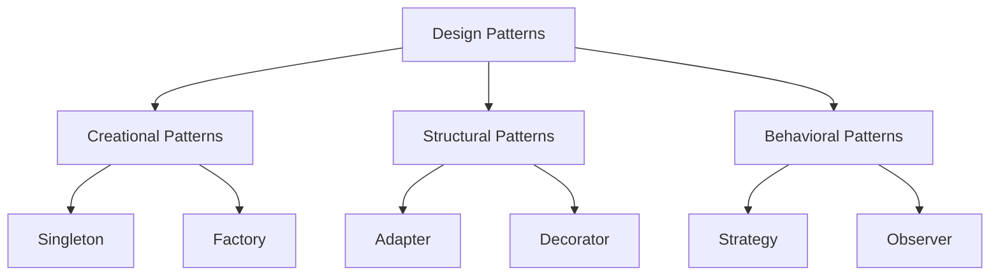

## 1.1 What Are Design Patterns?

### Definition and Purpose

Design patterns are a cornerstone of software engineering, offering general, reusable solutions to common problems encountered in software design. These patterns provide a template for solving problems that can be adapted to fit specific situations, promoting best practices and efficient design. In the context of Haskell, a functional programming language, design patterns help developers leverage Haskell's unique features, such as immutability, higher-order functions, and strong static typing, to build robust and scalable applications.

### Historical Context

The concept of design patterns originated in the field of architecture, introduced by Christopher Alexander in the late 1970s. Alexander's work focused on identifying recurring problems in architecture and proposing solutions that could be reused across different projects. This idea was later adapted to software engineering by the "Gang of Four" (Erich Gamma, Richard Helm, Ralph Johnson, and John Vlissides) in their seminal book "Design Patterns: Elements of Reusable Object-Oriented Software," published in 1994. This book introduced 23 design patterns that became foundational in object-oriented programming (OOP).

As programming paradigms evolved, so did the application of design patterns. With the rise of functional programming languages like Haskell, there was a need to reinterpret these patterns to fit the functional paradigm. Unlike OOP, which focuses on objects and their interactions, functional programming emphasizes functions, immutability, and declarative code. This shift necessitated a reevaluation of traditional design patterns and the development of new patterns that align with functional principles.

### The Role of Design Patterns in Haskell

In Haskell, design patterns serve several purposes:

1. **Enhancing Code Reusability**: By providing a proven solution to common problems, design patterns allow developers to reuse code across different projects, reducing duplication and improving maintainability.

2. **Improving Code Readability**: Design patterns offer a common vocabulary for developers, making it easier to communicate complex ideas and understand code written by others.

3. **Facilitating Design Decisions**: Patterns guide developers in making design decisions by offering a set of best practices and trade-offs for different scenarios.

4. **Leveraging Haskell's Unique Features**: Haskell's features, such as lazy evaluation, type classes, and monads, enable the creation of powerful and expressive design patterns that are not possible in other languages.

### Key Concepts in Haskell Design Patterns

#### Pure Functions and Immutability

Haskell's emphasis on pure functions and immutability is central to its design patterns. Pure functions, which have no side effects and always produce the same output for a given input, enable predictable and testable code. Immutability ensures that data cannot be changed once created, reducing the risk of bugs and making concurrent programming easier.

#### Higher-Order Functions and Function Composition

Higher-order functions, which take other functions as arguments or return them as results, are a powerful tool in Haskell. They enable function composition, allowing developers to build complex functionality by combining simple functions. This approach aligns with the functional programming paradigm and is a key aspect of many Haskell design patterns.

#### Strong Static Typing and Type Inference

Haskell's type system is one of its most powerful features, providing strong static typing and type inference. This allows developers to catch errors at compile time and write more robust code. Design patterns in Haskell often leverage the type system to enforce constraints and ensure correctness.

#### Monads and Functors

Monads and functors are fundamental concepts in Haskell, providing a way to handle side effects and structure computations. Many design patterns in Haskell, such as the State Monad Pattern and the Reader Monad Pattern, rely on these abstractions to manage state and dependencies in a functional way.

### Adapting Traditional Design Patterns to Haskell

While some traditional design patterns, such as the Singleton and Factory patterns, can be adapted to Haskell, others require a different approach. For example, the Strategy pattern, which involves selecting an algorithm at runtime, can be implemented using higher-order functions in Haskell. Similarly, the Observer pattern, which involves notifying observers of changes in state, can be implemented using functional reactive programming (FRP) libraries.

### Haskell-Specific Design Patterns

Haskell also introduces new design patterns that are unique to functional programming. These include:

- **Monadic Design Patterns**: Patterns that leverage monads to structure computations and manage side effects.
- **Lenses and Optics**: Patterns that provide a composable way to access and modify data structures.
- **Recursion Schemes**: Patterns that abstract common recursion patterns, making it easier to work with recursive data structures.

### Code Examples

Let's explore a simple example of a design pattern in Haskell: the Strategy pattern. In Haskell, we can implement this pattern using higher-order functions.

```haskell
-- Define a type for strategies
type Strategy = Int -> Int -> Int

-- Define some strategies
add :: Strategy
add x y = x + y

multiply :: Strategy
multiply x y = x * y

-- A function that takes a strategy and applies it
applyStrategy :: Strategy -> Int -> Int -> Int
applyStrategy strategy x y = strategy x y

main :: IO ()
main = do
    let x = 5
    let y = 10
    putStrLn $ "Addition: " ++ show (applyStrategy add x y)
    putStrLn $ "Multiplication: " ++ show (applyStrategy multiply x y)
```

In this example, we define a `Strategy` type as a function that takes two integers and returns an integer. We then define two strategies, `add` and `multiply`, and a function `applyStrategy` that takes a strategy and applies it to two integers. This demonstrates how higher-order functions can be used to implement the Strategy pattern in Haskell.

### Visualizing Design Patterns

To better understand how design patterns fit into the broader context of software design, let's visualize the relationship between different patterns and their roles in a software system.



This diagram illustrates the three main categories of design patterns: Creational, Structural, and Behavioral. Each category contains specific patterns that address different aspects of software design.

### Try It Yourself

Experiment with the code example by adding new strategies, such as subtraction or division, and see how the `applyStrategy` function can be used to apply different strategies to the same set of inputs. This will help reinforce your understanding of how higher-order functions can be used to implement design patterns in Haskell.

### References and Further Reading

- [Design Patterns: Elements of Reusable Object-Oriented Software](https://en.wikipedia.org/wiki/Design_Patterns) by Erich Gamma, Richard Helm, Ralph Johnson, and John Vlissides
- [Learn You a Haskell for Great Good!](http://learnyouahaskell.com/) - A beginner's guide to Haskell
- [Haskell Programming from First Principles](https://haskellbook.com/) - A comprehensive guide to Haskell programming

### Knowledge Check

1. What are design patterns, and why are they important in software design?
2. How do design patterns differ between object-oriented and functional programming paradigms?
3. What are some unique features of Haskell that influence its design patterns?
4. How can higher-order functions be used to implement design patterns in Haskell?
5. What is the role of monads in Haskell design patterns?

### Embrace the Journey

Remember, understanding design patterns is just the beginning of your journey in mastering Haskell and functional programming. As you progress, you'll discover new patterns and techniques that will enhance your ability to build scalable and maintainable software. Keep experimenting, stay curious, and enjoy the journey!

## Quiz: What Are Design Patterns?



### What is a design pattern in software engineering?

- [x] A reusable solution to a common problem in software design
- [ ] A specific implementation of a software feature
- [ ] A programming language syntax rule
- [ ] A type of software bug

> **Explanation:** Design patterns provide general solutions to common problems in software design, allowing developers to reuse proven solutions.

### Who introduced the concept of design patterns to software engineering?

- [x] The Gang of Four
- [ ] Christopher Alexander
- [ ] Alan Turing
- [ ] Donald Knuth

> **Explanation:** The Gang of Four (Erich Gamma, Richard Helm, Ralph Johnson, and John Vlissides) introduced design patterns to software engineering in their book.

### How do design patterns in Haskell differ from those in object-oriented programming?

- [x] They leverage functional programming concepts like immutability and higher-order functions
- [ ] They focus on class hierarchies and inheritance
- [ ] They are not applicable to Haskell
- [ ] They are implemented using global variables

> **Explanation:** Haskell design patterns leverage functional programming concepts such as immutability and higher-order functions, differing from the class-based focus of object-oriented patterns.

### What is a key feature of Haskell that influences its design patterns?

- [x] Strong static typing
- [ ] Dynamic typing
- [ ] Lack of a type system
- [ ] Use of global state

> **Explanation:** Haskell's strong static typing is a key feature that influences its design patterns, allowing for compile-time error checking and robust code.

### Which Haskell feature allows for the composition of functions?

- [x] Higher-order functions
- [ ] Global variables
- [ ] Class inheritance
- [ ] Dynamic typing

> **Explanation:** Higher-order functions in Haskell allow for the composition of functions, enabling complex functionality to be built from simple functions.

### What is a monad in Haskell?

- [x] An abstraction that allows for structuring computations
- [ ] A type of variable
- [ ] A syntax rule
- [ ] A global state management tool

> **Explanation:** Monads in Haskell are abstractions that allow for structuring computations and managing side effects.

### How can the Strategy pattern be implemented in Haskell?

- [x] Using higher-order functions
- [ ] Using global variables
- [ ] Using class inheritance
- [ ] Using dynamic typing

> **Explanation:** The Strategy pattern can be implemented in Haskell using higher-order functions, which allow for the selection of algorithms at runtime.

### What is the purpose of design patterns in Haskell?

- [x] To provide reusable solutions and improve code readability
- [ ] To enforce global state management
- [ ] To replace the need for a type system
- [ ] To eliminate the need for testing

> **Explanation:** Design patterns in Haskell provide reusable solutions to common problems and improve code readability by offering a common vocabulary for developers.

### What is a unique design pattern in Haskell?

- [x] Monadic Design Patterns
- [ ] Singleton Pattern
- [ ] Factory Pattern
- [ ] Global State Pattern

> **Explanation:** Monadic Design Patterns are unique to Haskell and functional programming, leveraging monads to structure computations.

### True or False: Design patterns are only applicable to object-oriented programming.

- [ ] True
- [x] False

> **Explanation:** Design patterns are applicable to various programming paradigms, including functional programming, where they are adapted to fit the paradigm's principles.


