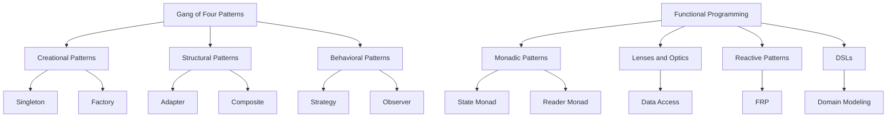

## 1.2 History and Evolution of Design Patterns

Design patterns have long been a cornerstone of software engineering, providing reusable solutions to common problems. This section delves into the origins, transition, and modern perspectives of design patterns, particularly in the context of functional programming and Haskell.

### Origins: The Inception of Design Patterns

The concept of design patterns in software engineering was popularized by the seminal work of the "Gang of Four" (GoF) — Erich Gamma, Richard Helm, Ralph Johnson, and John Vlissides. Their book, *Design Patterns: Elements of Reusable Object-Oriented Software*, published in 1994, introduced 23 foundational patterns that addressed recurring design problems in object-oriented programming (OOP).

#### The Gang of Four (GoF) Patterns

The GoF patterns are categorized into three types:

1. **Creational Patterns**: These patterns deal with object creation mechanisms, trying to create objects in a manner suitable to the situation. Examples include the Singleton, Factory, and Builder patterns.

2. **Structural Patterns**: These patterns ease the design by identifying a simple way to realize relationships between entities. Examples include Adapter, Composite, and Decorator patterns.

3. **Behavioral Patterns**: These patterns are concerned with algorithms and the assignment of responsibilities between objects. Examples include Strategy, Observer, and Command patterns.

The GoF patterns emphasized the importance of encapsulation, inheritance, and polymorphism — key principles of OOP. They provided a common vocabulary for developers and a framework for designing flexible and reusable software.

### Transition to Functional Programming

As programming paradigms evolved, so did the application of design patterns. The rise of functional programming languages like Haskell brought new challenges and opportunities for design patterns. Functional programming emphasizes immutability, first-class functions, and higher-order functions, which necessitated a rethinking of traditional design patterns.

#### Adapting GoF Patterns to Functional Programming

In functional programming, many GoF patterns become redundant or are implemented differently due to the language's inherent features. For instance:

- **Singleton Pattern**: In Haskell, the need for a Singleton is often eliminated by using pure functions and immutable data. A constant value can be defined at the module level, ensuring a single instance without explicit pattern implementation.

- **Strategy Pattern**: This pattern is naturally expressed using higher-order functions in Haskell. Functions can be passed as arguments, allowing for dynamic behavior changes without the need for a separate pattern.

- **Observer Pattern**: Functional Reactive Programming (FRP) in Haskell provides a more powerful abstraction for handling events and state changes, often replacing the need for the traditional Observer pattern.

#### New Patterns in Functional Programming

Functional programming has also introduced new patterns that leverage its unique features:

- **Monadic Patterns**: Monads, a core concept in Haskell, provide a way to handle side effects, manage state, and sequence computations. Patterns like the State Monad and Reader Monad encapsulate stateful computations and dependency injection, respectively.

- **Lenses and Optics**: These patterns provide a composable way to access and modify data structures, addressing the challenges of immutability in functional programming.

### Modern Perspectives: Current Trends and Developments

The evolution of design patterns continues as software development practices and technologies advance. In the context of functional programming and Haskell, several trends and developments are noteworthy.

#### Embracing Algebraic Data Types (ADTs)

Haskell's strong type system and support for Algebraic Data Types (ADTs) allow developers to model complex domains with precision. Patterns that leverage ADTs, such as the Visitor pattern using data types à la carte, enable flexible and type-safe designs.

#### Category Theory and Design Patterns

Category theory, a branch of mathematics, has influenced the development of new design patterns in Haskell. Concepts like Functors, Applicatives, and Monads are rooted in category theory and provide powerful abstractions for handling computations and effects.

#### Reactive and Concurrent Patterns

With the increasing demand for responsive and concurrent applications, patterns for reactive programming and concurrency have gained prominence. Libraries like Conduit and STM (Software Transactional Memory) in Haskell offer patterns for managing asynchronous data streams and concurrent state.

#### Domain-Specific Languages (DSLs)

Haskell's expressive syntax and type system make it an ideal language for designing Domain-Specific Languages (DSLs). Patterns for creating DSLs allow developers to tailor the language to specific problem domains, enhancing productivity and maintainability.

### Visualizing the Evolution of Design Patterns

To better understand the transition and evolution of design patterns from OOP to functional programming, let's visualize the key concepts and relationships.



**Diagram Explanation**: This diagram illustrates the transition from traditional GoF patterns to modern patterns in functional programming. It highlights how certain patterns have evolved or been replaced by new abstractions in Haskell.

### Code Examples: Adapting Patterns to Haskell

Let's explore how some traditional patterns are adapted in Haskell with code examples.

#### Singleton Pattern in Haskell

In Haskell, the Singleton pattern can be implemented using a module-level constant:

```haskell
-- Singleton.hs
module Singleton (singletonValue) where

-- Define a constant value at the module level
singletonValue :: Int
singletonValue = 42
```

**Explanation**: This code defines a constant `singletonValue` that acts as a Singleton. It is immutable and accessible throughout the module.

#### Strategy Pattern with Higher-Order Functions

The Strategy pattern can be implemented using higher-order functions:

```haskell
-- Strategy.hs
module Strategy where

-- Define a type for strategies
type Strategy = Int -> Int

-- Implement different strategies as functions
addStrategy :: Strategy
addStrategy x = x + 10

multiplyStrategy :: Strategy
multiplyStrategy x = x * 10

-- Function that applies a strategy
applyStrategy :: Strategy -> Int -> Int
applyStrategy strategy x = strategy x

-- Example usage
resultAdd = applyStrategy addStrategy 5
resultMultiply = applyStrategy multiplyStrategy 5
```

**Explanation**: Here, strategies are represented as functions, and `applyStrategy` takes a strategy and applies it to an integer. This demonstrates the flexibility of higher-order functions in Haskell.

### Try It Yourself

Encourage experimentation by modifying the code examples:

- **Singleton Pattern**: Change the type of `singletonValue` to a different data type, such as `String`, and observe how it affects the module.

- **Strategy Pattern**: Add a new strategy function, such as `subtractStrategy`, and test it with `applyStrategy`.

### References and Further Reading

- [Design Patterns: Elements of Reusable Object-Oriented Software](https://en.wikipedia.org/wiki/Design_Patterns) by Erich Gamma, Richard Helm, Ralph Johnson, and John Vlissides.
- [Functional Programming Design Patterns](https://www.oreilly.com/library/view/functional-programming-patterns/9781449365509/) by Tomas Petricek.
- [Learn You a Haskell for Great Good!](http://learnyouahaskell.com/) by Miran Lipovača.

### Knowledge Check

- **Question**: How do monads in Haskell replace certain GoF patterns?
- **Exercise**: Implement a simple Observer pattern using FRP libraries in Haskell.

### Embrace the Journey

Remember, understanding the history and evolution of design patterns is just the beginning. As you delve deeper into Haskell and functional programming, you'll discover new patterns and techniques that enhance your software design skills. Keep experimenting, stay curious, and enjoy the journey!

## Quiz: History and Evolution of Design Patterns



### Who are the authors of the book "Design Patterns: Elements of Reusable Object-Oriented Software"?

- [x] Erich Gamma, Richard Helm, Ralph Johnson, John Vlissides
- [ ] Martin Fowler, Kent Beck, Erich Gamma, John Vlissides
- [ ] Robert C. Martin, Martin Fowler, Kent Beck, Ralph Johnson
- [ ] Erich Gamma, Martin Fowler, Robert C. Martin, John Vlissides

> **Explanation:** The book was authored by Erich Gamma, Richard Helm, Ralph Johnson, and John Vlissides, collectively known as the "Gang of Four."

### What is a key feature of functional programming that influences design patterns?

- [x] Immutability
- [ ] Inheritance
- [ ] Encapsulation
- [ ] Polymorphism

> **Explanation:** Immutability is a core feature of functional programming that affects how design patterns are implemented.

### Which pattern is naturally expressed using higher-order functions in Haskell?

- [x] Strategy Pattern
- [ ] Singleton Pattern
- [ ] Observer Pattern
- [ ] Factory Pattern

> **Explanation:** The Strategy pattern can be easily implemented using higher-order functions in Haskell.

### What concept from category theory is fundamental in Haskell's design patterns?

- [x] Monads
- [ ] Classes
- [ ] Interfaces
- [ ] Inheritance

> **Explanation:** Monads, derived from category theory, are fundamental in Haskell's design patterns for handling computations and effects.

### How does Haskell's type system influence design patterns?

- [x] By enabling precise domain modeling with Algebraic Data Types
- [ ] By enforcing encapsulation through private fields
- [ ] By supporting multiple inheritance
- [ ] By allowing dynamic typing

> **Explanation:** Haskell's type system, with its support for Algebraic Data Types, allows for precise domain modeling.

### Which library in Haskell is used for reactive programming?

- [x] FRP Libraries
- [ ] Conduit
- [ ] Aeson
- [ ] Warp

> **Explanation:** FRP (Functional Reactive Programming) libraries are used for reactive programming in Haskell.

### What pattern is often replaced by Functional Reactive Programming in Haskell?

- [x] Observer Pattern
- [ ] Singleton Pattern
- [ ] Factory Pattern
- [ ] Strategy Pattern

> **Explanation:** The Observer pattern is often replaced by Functional Reactive Programming in Haskell.

### What is a common use of the Reader Monad in Haskell?

- [x] Dependency Injection
- [ ] State Management
- [ ] Error Handling
- [ ] Logging

> **Explanation:** The Reader Monad is commonly used for dependency injection in Haskell.

### True or False: In Haskell, the Singleton pattern is often unnecessary due to immutability.

- [x] True
- [ ] False

> **Explanation:** In Haskell, immutability often eliminates the need for the Singleton pattern.

### Which pattern provides a composable way to access and modify data structures in Haskell?

- [x] Lenses and Optics
- [ ] Monads
- [ ] Functors
- [ ] Applicatives

> **Explanation:** Lenses and Optics provide a composable way to access and modify data structures in Haskell.


