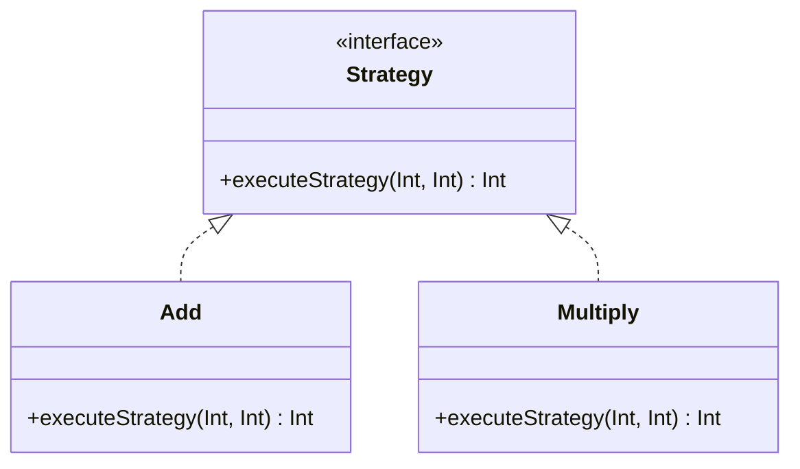

## 1.3 Importance of Design Patterns in Haskell

Design patterns are a cornerstone of software engineering, providing reusable solutions to common problems. In Haskell, a language renowned for its strong type system, purity, and functional programming paradigm, design patterns take on a unique form. This section explores the importance of design patterns in Haskell, focusing on leveraging Haskell's features to solve common problems and enhance code quality.

### Leveraging Haskell's Features

Haskell's features, such as its strong static type system, purity, and higher-order functions, offer a fertile ground for implementing robust design patterns. Let's delve into how these features can be harnessed effectively.

#### Strong Type System

Haskell's type system is one of its most powerful features. It allows developers to express complex invariants and constraints directly in the type system, reducing runtime errors and enhancing code safety.

- **Type Safety**: By using types to enforce constraints, Haskell ensures that many errors are caught at compile time. This is particularly useful in design patterns where type correctness is crucial.
- **Type Inference**: Haskell's ability to infer types reduces boilerplate code, making patterns more concise and expressive.
- **Algebraic Data Types (ADTs)**: ADTs enable the creation of complex data structures that can be used to implement patterns like the Composite or Visitor pattern.

#### Purity and Immutability

Haskell's purity and immutability are central to its functional nature. These features lead to more predictable and reliable code.

- **Referential Transparency**: Functions in Haskell are referentially transparent, meaning they always produce the same output for the same input. This property simplifies reasoning about code and is a boon for implementing patterns like the Singleton or Factory.
- **Immutability**: Immutable data structures prevent accidental state changes, making it easier to implement patterns that rely on state management, such as the Memento or State pattern.

#### Higher-Order Functions and Function Composition

Higher-order functions and function composition are fundamental to Haskell's expressiveness.

- **Higher-Order Functions**: These functions take other functions as arguments or return them as results, enabling patterns like Strategy or Command to be implemented elegantly.
- **Function Composition**: By composing functions, complex operations can be built from simpler ones, facilitating patterns like Chain of Responsibility or Decorator.

### Solving Common Problems

Design patterns in Haskell address recurring challenges in software development, providing tried-and-tested solutions.

#### Addressing Recurring Challenges

- **Code Reusability**: Patterns promote code reuse, reducing duplication and improving maintainability.
- **Complexity Management**: By abstracting common solutions, patterns help manage complexity, making systems easier to understand and modify.
- **Consistency**: Patterns provide a consistent approach to solving problems, which is especially valuable in large teams or projects.

#### Examples of Patterns Solving Problems

Let's explore some examples of how design patterns solve common problems in Haskell.

- **Singleton Pattern**: In Haskell, the Singleton pattern can be implemented using modules and constants to ensure a single instance of a resource is used throughout an application.
  
  ```haskell
  module Logger (getLogger, logMessage) where

  import System.IO (Handle, hPutStrLn, stdout)

  data Logger = Logger { logHandle :: Handle }

  getLogger :: Logger
  getLogger = Logger stdout

  logMessage :: Logger -> String -> IO ()
  logMessage logger msg = hPutStrLn (logHandle logger) msg
  ```

- **Factory Pattern**: The Factory pattern can be implemented using smart constructors and phantom types to create objects with specific properties.

  ```haskell
  data Shape = Circle Float | Rectangle Float Float

  circle :: Float -> Shape
  circle radius = Circle radius

  rectangle :: Float -> Float -> Shape
  rectangle width height = Rectangle width height
  ```

- **Strategy Pattern**: This pattern can be implemented using higher-order functions to encapsulate algorithms.

  ```haskell
  type Strategy = Int -> Int -> Int

  add :: Strategy
  add x y = x + y

  multiply :: Strategy
  multiply x y = x * y

  executeStrategy :: Strategy -> Int -> Int -> Int
  executeStrategy strategy x y = strategy x y
  ```

### Enhancing Code Quality

Design patterns play a crucial role in enhancing the quality of Haskell code. They improve readability, maintainability, and scalability.

#### Improving Readability

- **Clear Intent**: Patterns make the intent of the code clearer, as they are well-known solutions with established names and structures.
- **Modular Design**: Patterns encourage modular design, breaking down complex systems into manageable components.

#### Enhancing Maintainability

- **Decoupling**: Patterns often decouple components, making it easier to change one part of the system without affecting others.
- **Extensibility**: Many patterns are designed to be extended, allowing new functionality to be added with minimal changes to existing code.

#### Ensuring Scalability

- **Scalable Architectures**: Patterns like the Observer or Mediator can be used to build scalable architectures that handle increasing loads gracefully.
- **Performance Optimization**: Patterns can also aid in performance optimization by providing efficient solutions to common problems.

### Visualizing Design Patterns in Haskell

To better understand the role of design patterns in Haskell, let's visualize some of these concepts using Mermaid.js diagrams.

#### Example: Singleton Pattern


*Diagram Description*: This class diagram represents the Singleton pattern in Haskell, where a single instance of `Logger` is used throughout the application.

#### Example: Strategy Pattern



*Diagram Description*: This class diagram illustrates the Strategy pattern, where different strategies (`Add`, `Multiply`) implement a common interface.

### References and Further Reading

- [Haskell Language Documentation](https://www.haskell.org/documentation/)
- [Design Patterns: Elements of Reusable Object-Oriented Software](https://en.wikipedia.org/wiki/Design_Patterns)
- [Functional Programming Design Patterns](https://www.oreilly.com/library/view/functional-programming-patterns/9781449365509/)

### Knowledge Check

- **Question**: How does Haskell's type system contribute to the implementation of design patterns?
- **Exercise**: Implement a simple Observer pattern in Haskell using higher-order functions.

### Embrace the Journey

Remember, mastering design patterns in Haskell is a journey. As you progress, you'll discover new ways to leverage Haskell's features to build robust, scalable applications. Keep experimenting, stay curious, and enjoy the journey!

### Quiz: Importance of Design Patterns in Haskell



### How does Haskell's type system enhance design patterns?

- [x] By providing compile-time error checking
- [ ] By allowing dynamic typing
- [ ] By enabling runtime polymorphism
- [ ] By supporting mutable state

> **Explanation:** Haskell's type system provides compile-time error checking, which enhances the reliability and safety of design patterns.

### What is a key benefit of using design patterns in Haskell?

- [x] Improved code maintainability
- [ ] Increased code verbosity
- [ ] Reduced type safety
- [ ] Enhanced runtime errors

> **Explanation:** Design patterns improve code maintainability by providing reusable solutions and clear structures.

### Which Haskell feature aids in implementing the Strategy pattern?

- [x] Higher-order functions
- [ ] Mutable variables
- [ ] Dynamic typing
- [ ] Global state

> **Explanation:** Higher-order functions allow the encapsulation of algorithms, which is essential for the Strategy pattern.

### What is a benefit of Haskell's purity in design patterns?

- [x] Predictable function behavior
- [ ] Increased side effects
- [ ] Mutable state management
- [ ] Dynamic typing

> **Explanation:** Haskell's purity ensures predictable function behavior, which simplifies reasoning about code.

### How does immutability benefit design patterns in Haskell?

- [x] Prevents accidental state changes
- [ ] Allows mutable state
- [ ] Increases runtime errors
- [ ] Reduces type safety

> **Explanation:** Immutability prevents accidental state changes, making it easier to manage state in design patterns.

### What role do algebraic data types play in Haskell design patterns?

- [x] They enable complex data structures
- [ ] They allow dynamic typing
- [ ] They support mutable state
- [ ] They increase runtime errors

> **Explanation:** Algebraic data types enable the creation of complex data structures, which are essential for many design patterns.

### Which pattern benefits from Haskell's referential transparency?

- [x] Singleton pattern
- [ ] Observer pattern
- [ ] Command pattern
- [ ] Visitor pattern

> **Explanation:** Referential transparency ensures consistent behavior, which is beneficial for the Singleton pattern.

### What is a common challenge that design patterns address?

- [x] Complexity management
- [ ] Increased code verbosity
- [ ] Reduced type safety
- [ ] Enhanced runtime errors

> **Explanation:** Design patterns help manage complexity by providing reusable solutions to common problems.

### How do design patterns enhance code scalability?

- [x] By providing scalable architectures
- [ ] By increasing code verbosity
- [ ] By reducing type safety
- [ ] By enhancing runtime errors

> **Explanation:** Design patterns provide scalable architectures that handle increasing loads gracefully.

### True or False: Design patterns in Haskell reduce code reusability.

- [ ] True
- [x] False

> **Explanation:** Design patterns enhance code reusability by providing reusable solutions to common problems.


