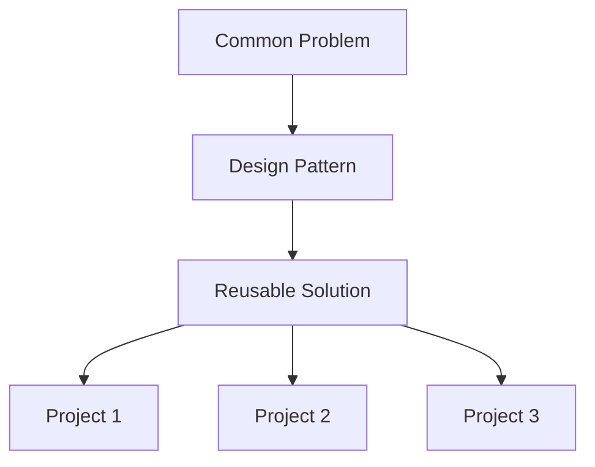
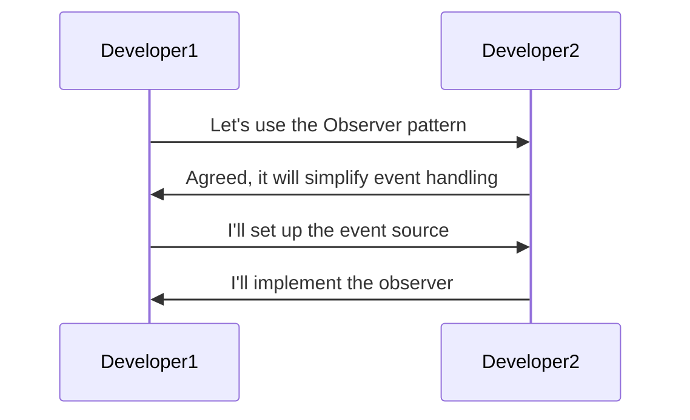

## 1.4 Benefits of Using Design Patterns in Haskell

Design patterns are a crucial aspect of software engineering, providing a structured approach to solving recurring design problems. In Haskell, a language known for its strong emphasis on functional programming, design patterns take on unique characteristics that align with its paradigms. In this section, we will delve into the myriad benefits of using design patterns in Haskell, focusing on reusability, communication, and efficiency. By the end of this article, you will have a comprehensive understanding of how design patterns can elevate your Haskell projects to new heights.

### Reusability: Encouraging Code Reuse by Abstracting Solutions to Common Problems

One of the primary benefits of using design patterns in Haskell is the promotion of code reusability. Design patterns provide a blueprint for solving common problems, allowing developers to apply these solutions across different projects and contexts. This not only saves time but also ensures consistency and reliability in codebases.

#### Code Example: Singleton Pattern in Haskell

The Singleton pattern is a classic example of a design pattern that promotes reusability. In Haskell, we can implement a Singleton using a module with a constant value:

```haskell
module Logger (getLogger) where

import System.IO.Unsafe (unsafePerformIO)
import Data.IORef

data Logger = Logger { logMessage :: String -> IO () }

-- Create a singleton logger instance
loggerInstance :: IORef (Maybe Logger)
loggerInstance = unsafePerformIO $ newIORef Nothing

getLogger :: IO Logger
getLogger = do
    maybeLogger <- readIORef loggerInstance
    case maybeLogger of
        Just logger -> return logger
        Nothing -> do
            let logger = Logger { logMessage = putStrLn }
            writeIORef loggerInstance (Just logger)
            return logger
```

In this example, we use `IORef` to store a singleton instance of a `Logger`. The `getLogger` function ensures that only one instance of the logger is created, promoting reusability across the application.

#### Visualizing Reusability with Design Patterns



*Diagram: The flow of reusability through design patterns, where a common problem is abstracted into a reusable solution that can be applied across multiple projects.*

### Communication: Providing a Shared Language for Developers to Discuss Design Solutions

Design patterns serve as a lingua franca among developers, enabling clear and concise communication about design solutions. This shared language is especially valuable in collaborative environments, where team members must quickly convey complex ideas.

#### Example: Communicating with the Observer Pattern

The Observer pattern is widely used for implementing event-driven systems. In Haskell, we can leverage functional reactive programming (FRP) libraries to implement this pattern:

```haskell
import Reactive.Banana
import Reactive.Banana.Frameworks

-- Define an event source
eventSource :: AddHandler Int
eventSource = ...

-- Define an observer
observer :: Int -> IO ()
observer value = putStrLn $ "Observed value: " ++ show value

-- Set up the event network
setupNetwork :: MomentIO ()
setupNetwork = do
    eValue <- fromAddHandler eventSource
    reactimate $ fmap observer eValue

main :: IO ()
main = do
    network <- compile setupNetwork
    actuate network
```

In this example, we use the `reactive-banana` library to set up an event network. The `observer` function is triggered whenever a new value is emitted by the `eventSource`. By using the Observer pattern, developers can easily communicate the intent of the code to others familiar with the pattern.

#### Visualizing Communication with Design Patterns



*Diagram: A sequence diagram illustrating how design patterns facilitate communication between developers.*

### Efficiency: Reducing Development Time by Applying Proven Solutions

Efficiency is another significant advantage of using design patterns in Haskell. By applying proven solutions, developers can reduce development time and focus on implementing unique features rather than reinventing the wheel.

#### Code Example: Factory Pattern with Smart Constructors

The Factory pattern is useful for creating objects without specifying the exact class of object that will be created. In Haskell, we can use smart constructors to implement this pattern:

```haskell
data Shape = Circle Double | Rectangle Double Double

-- Smart constructor for Circle
createCircle :: Double -> Maybe Shape
createCircle radius
    | radius > 0 = Just (Circle radius)
    | otherwise = Nothing

-- Smart constructor for Rectangle
createRectangle :: Double -> Double -> Maybe Shape
createRectangle width height
    | width > 0 && height > 0 = Just (Rectangle width height)
    | otherwise = Nothing
```

In this example, smart constructors `createCircle` and `createRectangle` ensure that only valid shapes are created, encapsulating the creation logic and reducing the likelihood of errors.

#### Visualizing Efficiency with Design Patterns


*Diagram: A flowchart demonstrating how design patterns streamline development by providing ready-made solutions, allowing developers to focus on unique aspects of their projects.*

### Haskell-Specific Benefits of Design Patterns

Haskell's unique features, such as strong static typing, immutability, and higher-order functions, enhance the benefits of design patterns. Let's explore how these features contribute to the effectiveness of design patterns in Haskell.

#### Strong Static Typing

Haskell's type system provides compile-time guarantees that can prevent many common errors. Design patterns in Haskell leverage this feature to create robust and reliable solutions.

#### Example: Type-Safe Builder Pattern

The Builder pattern is used to construct complex objects step by step. In Haskell, we can use phantom types to ensure type safety:

```haskell
data Car = Car { engine :: String, wheels :: Int, color :: String }

data CarBuilder = CarBuilder { buildEngine :: Maybe String, buildWheels :: Maybe Int, buildColor :: Maybe String }

-- Phantom types for build stages
data EngineSet
data WheelsSet
data ColorSet

-- Smart constructors with phantom types
setEngine :: String -> CarBuilder -> CarBuilder
setEngine e cb = cb { buildEngine = Just e }

setWheels :: Int -> CarBuilder -> CarBuilder
setWheels w cb = cb { buildWheels = Just w }

setColor :: String -> CarBuilder -> CarBuilder
setColor c cb = cb { buildColor = Just c }

buildCar :: CarBuilder -> Maybe Car
buildCar (CarBuilder (Just e) (Just w) (Just c)) = Just (Car e w c)
buildCar _ = Nothing
```

In this example, the `CarBuilder` uses phantom types to ensure that all necessary components are set before a `Car` is built, providing compile-time safety.

#### Immutability and Persistent Data Structures

Haskell's immutability and persistent data structures align well with design patterns, ensuring that state changes are predictable and manageable.

#### Example: Memento Pattern with Immutable Data

The Memento pattern is used to capture and restore an object's state. In Haskell, we can leverage immutability to implement this pattern:

```haskell
data EditorState = EditorState { content :: String }

-- Save the state
saveState :: EditorState -> EditorState
saveState = id

-- Restore the state
restoreState :: EditorState -> EditorState
restoreState = id

-- Example usage
main :: IO ()
main = do
    let initialState = EditorState "Initial content"
    let savedState = saveState initialState
    let newState = EditorState "New content"
    print $ content $ restoreState savedState
```

In this example, the `EditorState` is immutable, and the `saveState` and `restoreState` functions simply return the state, ensuring that the original state is preserved.

#### Higher-Order Functions and Function Composition

Haskell's support for higher-order functions and function composition allows for elegant and concise implementations of design patterns.

#### Example: Strategy Pattern with Higher-Order Functions

The Strategy pattern defines a family of algorithms and makes them interchangeable. In Haskell, we can use higher-order functions to implement this pattern:

```haskell
type Strategy = Int -> Int -> Int

addStrategy :: Strategy
addStrategy x y = x + y

multiplyStrategy :: Strategy
multiplyStrategy x y = x * y

executeStrategy :: Strategy -> Int -> Int -> Int
executeStrategy strategy x y = strategy x y

main :: IO ()
main = do
    print $ executeStrategy addStrategy 5 3
    print $ executeStrategy multiplyStrategy 5 3
```

In this example, `executeStrategy` takes a `Strategy` function and applies it to two integers, demonstrating the flexibility of higher-order functions.

### Try It Yourself: Experimenting with Design Patterns in Haskell

Now that we've explored the benefits of design patterns in Haskell, it's time to experiment with the concepts we've discussed. Try modifying the code examples provided to suit different scenarios or implement additional patterns using Haskell's unique features.

### Knowledge Check

Before we conclude, let's reinforce what we've learned with a few questions:

1. How do design patterns promote code reusability in Haskell?
2. What role do design patterns play in developer communication?
3. How can design patterns improve development efficiency?
4. How does Haskell's type system enhance the benefits of design patterns?
5. What are some Haskell-specific features that align well with design patterns?

### Embrace the Journey

Remember, this is just the beginning. As you continue to explore design patterns in Haskell, you'll discover new ways to leverage the language's features to create elegant and efficient solutions. Keep experimenting, stay curious, and enjoy the journey!

## Quiz: Benefits of Using Design Patterns in Haskell



### How do design patterns promote code reusability in Haskell?

- [x] By providing a blueprint for solving common problems
- [ ] By enforcing strict coding standards
- [ ] By limiting the use of higher-order functions
- [ ] By discouraging the use of modules

> **Explanation:** Design patterns provide a reusable solution to common problems, allowing developers to apply these solutions across different projects.

### What role do design patterns play in developer communication?

- [x] They provide a shared language for discussing design solutions
- [ ] They enforce a specific coding style
- [ ] They limit the use of certain language features
- [ ] They dictate the structure of all projects

> **Explanation:** Design patterns serve as a common language among developers, facilitating clear communication about design solutions.

### How can design patterns improve development efficiency?

- [x] By applying proven solutions to reduce development time
- [ ] By increasing the complexity of code
- [ ] By requiring additional documentation
- [ ] By enforcing strict type checking

> **Explanation:** Design patterns provide ready-made solutions, allowing developers to focus on unique features and reduce development time.

### How does Haskell's type system enhance the benefits of design patterns?

- [x] By providing compile-time guarantees that prevent common errors
- [ ] By enforcing dynamic typing
- [ ] By allowing runtime type changes
- [ ] By limiting the use of polymorphism

> **Explanation:** Haskell's strong static typing provides compile-time guarantees, enhancing the reliability of design patterns.

### What are some Haskell-specific features that align well with design patterns?

- [x] Immutability and persistent data structures
- [ ] Dynamic typing and mutable state
- [ ] Lack of higher-order functions
- [ ] Absence of type inference

> **Explanation:** Haskell's immutability and persistent data structures align well with design patterns, ensuring predictable state changes.

### Which pattern is used to capture and restore an object's state in Haskell?

- [x] Memento Pattern
- [ ] Singleton Pattern
- [ ] Observer Pattern
- [ ] Strategy Pattern

> **Explanation:** The Memento pattern is used to capture and restore an object's state, leveraging Haskell's immutability.

### How can higher-order functions be used in design patterns?

- [x] By defining interchangeable algorithms in the Strategy pattern
- [ ] By enforcing a single algorithm for all operations
- [ ] By limiting the use of function composition
- [ ] By discouraging the use of lambda expressions

> **Explanation:** Higher-order functions allow for the definition of interchangeable algorithms, as seen in the Strategy pattern.

### What is a benefit of using smart constructors in Haskell?

- [x] They ensure that only valid objects are created
- [ ] They allow for dynamic type changes
- [ ] They enforce mutable state
- [ ] They limit the use of modules

> **Explanation:** Smart constructors encapsulate creation logic, ensuring that only valid objects are created.

### How does the Singleton pattern promote reusability?

- [x] By ensuring a single instance of a class is used across the application
- [ ] By allowing multiple instances of a class
- [ ] By enforcing dynamic typing
- [ ] By limiting the use of modules

> **Explanation:** The Singleton pattern ensures that a single instance of a class is used across the application, promoting reusability.

### True or False: Design patterns in Haskell can reduce development time by providing proven solutions.

- [x] True
- [ ] False

> **Explanation:** Design patterns provide proven solutions that can be applied to common problems, reducing development time.



By understanding and applying design patterns in Haskell, you can enhance your software development process, making it more efficient, communicative, and reusable. As you continue your journey, remember to embrace the unique features of Haskell and explore the vast possibilities that design patterns offer.
