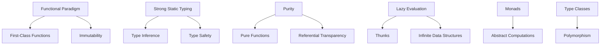

## 1.5 Overview of Haskell Features Relevant to Design Patterns

In this section, we delve into the distinctive features of Haskell that make it an ideal language for implementing design patterns. As an expert software engineer or architect, understanding these features will enable you to leverage Haskell's strengths in creating robust, scalable, and maintainable systems. Let's explore the core aspects of Haskell that are particularly relevant to design patterns.

### Functional Paradigm: Emphasizing Functions and Immutability

Haskell is a purely functional programming language, which means that functions are first-class citizens. This paradigm emphasizes immutability and the use of functions as the primary building blocks of programs.

#### Key Concepts:

- **First-Class Functions**: Functions can be passed as arguments, returned from other functions, and assigned to variables.
- **Immutability**: Data structures are immutable, meaning once they are created, they cannot be changed. This leads to safer and more predictable code.

#### Code Example: Higher-Order Functions

```haskell
-- Define a higher-order function that takes a function and a list
applyFunction :: (a -> b) -> [a] -> [b]
applyFunction f xs = map f xs

-- Example usage
square :: Int -> Int
square x = x * x

main :: IO ()
main = print (applyFunction square [1, 2, 3, 4])
-- Output: [1, 4, 9, 16]
```

In this example, `applyFunction` is a higher-order function that takes another function `f` and applies it to each element of the list `xs`.

### Strong Static Typing: Leveraging Haskell's Type System for Safer Code

Haskell's type system is one of its most powerful features. It provides strong static typing, which means that type errors are caught at compile time, reducing runtime errors.

#### Key Concepts:

- **Type Inference**: Haskell can often infer the types of expressions without explicit type annotations.
- **Type Safety**: The type system ensures that operations are performed on compatible types, preventing many common errors.

#### Code Example: Type Inference and Safety

```haskell
-- Define a function with inferred types
add :: Num a => a -> a -> a
add x y = x + y

main :: IO ()
main = print (add 5 10)
-- Output: 15
```

Here, the `add` function uses type inference to determine that `x` and `y` must be of a numeric type (`Num a =>`).

### Purity and Referential Transparency: Ensuring Consistent and Predictable Functions

Purity in Haskell means that functions have no side effects. Referential transparency ensures that a function call can be replaced with its output value without changing the program's behavior.

#### Key Concepts:

- **Pure Functions**: Functions that always produce the same output for the same input and have no side effects.
- **Referential Transparency**: The property that allows expressions to be replaced with their corresponding values.

#### Code Example: Pure Functions

```haskell
-- Define a pure function
double :: Int -> Int
double x = x * 2

main :: IO ()
main = print (double 4)
-- Output: 8
```

The `double` function is pure because it always returns the same result for the same input and does not modify any state.

### Lazy Evaluation: Impact on Performance and Design Considerations

Haskell employs lazy evaluation, meaning expressions are not evaluated until their values are needed. This can lead to performance improvements and allows for the creation of infinite data structures.

#### Key Concepts:

- **Thunks**: Deferred computations that are evaluated only when needed.
- **Infinite Data Structures**: Structures that can be defined without specifying their entire content.

#### Code Example: Lazy Evaluation

```haskell
-- Define an infinite list of natural numbers
naturals :: [Int]
naturals = [0..]

-- Take the first 10 elements
main :: IO ()
main = print (take 10 naturals)
-- Output: [0,1,2,3,4,5,6,7,8,9]
```

In this example, the list `naturals` is infinite, but only the first 10 elements are evaluated and printed.

### Monads and Type Classes: Abstracting Computations and Behaviors

Monads and type classes are powerful abstractions in Haskell that allow for flexible and reusable code. Monads provide a way to handle side effects, while type classes enable polymorphism.

#### Key Concepts:

- **Monads**: Abstractions that represent computations instead of values.
- **Type Classes**: Interfaces that define a set of functions that can be implemented by different types.

#### Code Example: Monads and Type Classes

```haskell
-- Define a simple Maybe Monad usage
safeDivide :: Double -> Double -> Maybe Double
safeDivide _ 0 = Nothing
safeDivide x y = Just (x / y)

main :: IO ()
main = do
    print (safeDivide 10 2) -- Output: Just 5.0
    print (safeDivide 10 0) -- Output: Nothing
```

The `safeDivide` function uses the `Maybe` monad to handle division by zero safely.

### Visualizing Haskell's Features

To better understand how these features interact, let's visualize the relationships between them using a Mermaid.js diagram.



This diagram illustrates how Haskell's features are interconnected, providing a cohesive framework for implementing design patterns.

### Try It Yourself

Experiment with the code examples provided. Try modifying the `applyFunction` to work with different types of functions or explore creating your own infinite data structures using lazy evaluation.

### Knowledge Check

- How does immutability contribute to safer code in Haskell?
- What are the benefits of using type inference in Haskell?
- How can lazy evaluation improve performance in Haskell programs?
- Explain the role of monads in handling side effects.

### Summary

In this section, we've explored the key features of Haskell that make it particularly well-suited for implementing design patterns. By understanding and leveraging these features, you can create more robust and maintainable software systems. Remember, this is just the beginning. As you continue to explore Haskell, you'll discover even more powerful tools and techniques to enhance your software design.

## Quiz: Overview of Haskell Features Relevant to Design Patterns



### Which feature of Haskell ensures that functions have no side effects?

- [x] Purity
- [ ] Immutability
- [ ] Type Inference
- [ ] Lazy Evaluation

> **Explanation:** Purity in Haskell means that functions have no side effects, ensuring consistent and predictable behavior.

### What does lazy evaluation in Haskell allow for?

- [x] Infinite data structures
- [ ] Type safety
- [ ] Referential transparency
- [ ] Strong static typing

> **Explanation:** Lazy evaluation allows for the creation of infinite data structures by deferring computation until the values are needed.

### How does Haskell's type system contribute to safer code?

- [x] By catching type errors at compile time
- [ ] By allowing dynamic typing
- [ ] By enabling lazy evaluation
- [ ] By supporting first-class functions

> **Explanation:** Haskell's strong static typing catches type errors at compile time, reducing runtime errors and contributing to safer code.

### What is a key benefit of using monads in Haskell?

- [x] Abstracting computations
- [ ] Enabling type inference
- [ ] Supporting infinite data structures
- [ ] Ensuring immutability

> **Explanation:** Monads abstract computations, allowing for flexible and reusable code, especially in handling side effects.

### Which concept in Haskell allows functions to be passed as arguments?

- [x] First-Class Functions
- [ ] Type Classes
- [ ] Monads
- [ ] Lazy Evaluation

> **Explanation:** First-class functions in Haskell can be passed as arguments, returned from other functions, and assigned to variables.

### What does referential transparency in Haskell ensure?

- [x] Expressions can be replaced with their corresponding values
- [ ] Functions have no side effects
- [ ] Data structures are immutable
- [ ] Computations are deferred

> **Explanation:** Referential transparency ensures that expressions can be replaced with their corresponding values without changing the program's behavior.

### How does immutability benefit Haskell programs?

- [x] By making data structures safer and more predictable
- [ ] By enabling lazy evaluation
- [ ] By supporting type inference
- [ ] By allowing dynamic typing

> **Explanation:** Immutability makes data structures safer and more predictable, as they cannot be changed once created.

### What role do type classes play in Haskell?

- [x] Enabling polymorphism
- [ ] Supporting lazy evaluation
- [ ] Ensuring purity
- [ ] Abstracting computations

> **Explanation:** Type classes in Haskell enable polymorphism, allowing different types to implement the same set of functions.

### Which feature of Haskell allows for deferred computations?

- [x] Lazy Evaluation
- [ ] Strong Static Typing
- [ ] Purity
- [ ] Type Classes

> **Explanation:** Lazy evaluation allows for deferred computations, meaning expressions are not evaluated until their values are needed.

### True or False: Haskell's type inference requires explicit type annotations for all expressions.

- [ ] True
- [x] False

> **Explanation:** Haskell's type inference often does not require explicit type annotations, as it can infer the types of expressions.



Remember, this is just the beginning. As you progress, you'll build more complex and interactive systems using Haskell's powerful features. Keep experimenting, stay curious, and enjoy the journey!
