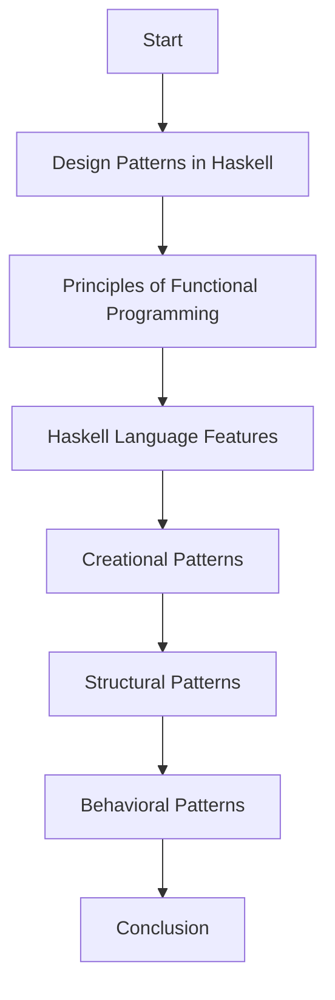

## 1.6 How to Use This Guide

Welcome to the **Haskell Design Patterns: Advanced Guide for Expert Software Engineers and Architects**. This guide is meticulously crafted to enhance your understanding of Haskell's advanced design patterns, enabling you to build scalable, fault-tolerant systems. Whether you are a seasoned Haskell developer or an architect looking to deepen your expertise, this guide will serve as a valuable resource. Let's explore how to make the most of this guide.

### Structure of the Guide

The guide is organized into comprehensive sections, each focusing on different aspects of Haskell design patterns. Here's a brief overview of how the guide is structured:

- **Introduction to Design Patterns in Haskell**: This section lays the foundation by explaining what design patterns are, their history, and their significance in Haskell.
- **Principles of Functional Programming in Haskell**: Dive into the core principles that make Haskell a powerful functional programming language.
- **Haskell Language Features and Best Practices**: Explore advanced language features and best practices to write idiomatic Haskell code.
- **Creational, Structural, and Behavioral Patterns**: Learn how to implement classic design patterns in a functional paradigm.
- **Functional, Concurrency, and Reactive Patterns**: Discover patterns unique to functional programming and how they apply to concurrent and reactive systems.
- **Enterprise Integration and Microservices Patterns**: Understand how to integrate Haskell into enterprise systems and design microservices.
- **Architectural Patterns**: Gain insights into designing robust architectures using Haskell.
- **Interoperability, Testing, and Security Patterns**: Learn how to integrate Haskell with other systems, test your applications, and ensure security.
- **Logging, Monitoring, and Anti-Patterns**: Explore best practices for observability and recognize common pitfalls.
- **Applying Multiple Patterns and Performance Optimization**: Master the art of combining patterns and optimizing performance.
- **Design Patterns in the Haskell Ecosystem**: Leverage Haskell's ecosystem to implement design patterns effectively.
- **Best Practices and Case Studies**: Apply what you've learned through real-world examples and best practices.
- **Conclusion and Appendices**: Recap key concepts and provide additional resources for further learning.

### Navigating the Content

#### For Beginners

If you're new to Haskell or design patterns, start with the **Introduction to Design Patterns in Haskell**. This section will provide you with the necessary background and context. As you progress, the **Principles of Functional Programming in Haskell** will help you understand the core concepts that underpin Haskell's approach to design patterns.

#### For Experienced Developers

Experienced developers can dive directly into sections that align with their interests or current projects. For instance, if you're working on a concurrent system, the **Concurrency and Asynchronous Patterns** section will be particularly relevant. Similarly, if you're integrating Haskell into an enterprise environment, the **Enterprise Integration Patterns** will offer valuable insights.

#### For Architects

Architects looking to design scalable systems should focus on the **Architectural Patterns** and **Microservices Design Patterns** sections. These chapters provide a deep dive into designing robust architectures using Haskell's unique features.

### Code Conventions

Throughout the guide, you'll encounter numerous code examples designed to illustrate key concepts. Here's an overview of the coding styles and notation used:

- **Functional and Idiomatic Haskell**: Code examples adhere to Haskell's idiomatic practices, emphasizing purity, immutability, and type safety.
- **Commented Code**: Each code snippet includes comments to explain the logic and highlight important lines.
- **Consistent Formatting**: Code blocks are consistently formatted for readability, using proper indentation and spacing.
- **Highlighting Key Concepts**: Important lines or sections within code examples are highlighted to draw attention to critical concepts.

#### Example Code Block

```haskell
-- Define a simple data type for a binary tree
data Tree a = Leaf a | Node (Tree a) a (Tree a)

-- Function to insert an element into a binary tree
insert :: Ord a => a -> Tree a -> Tree a
insert x (Leaf y)
  | x <= y    = Node (Leaf x) y (Leaf y)
  | otherwise = Node (Leaf y) y (Leaf x)
insert x (Node left y right)
  | x <= y    = Node (insert x left) y right
  | otherwise = Node left y (insert x right)

-- Example usage
main :: IO ()
main = do
  let tree = Node (Leaf 1) 2 (Leaf 3)
  print $ insert 0 tree  -- Insert 0 into the tree
```

In this example, we define a simple binary tree and a function to insert elements into it. The code is well-commented, and key lines are highlighted to aid understanding.

### Visualizing Concepts

To enhance your understanding, the guide incorporates diagrams and visual aids. These visuals are created using Hugo-compatible Mermaid.js diagrams, which are seamlessly integrated into the guide. Here's an example of how a diagram might be used:



**Diagram Description**: This flowchart illustrates the progression through the guide, starting with an introduction to design patterns and moving through various sections, culminating in the conclusion.

### References and Links

Throughout the guide, you'll find hyperlinks to reputable external resources for further reading. These links provide deeper dives into topics and supplement the explanations provided in the guide. For example, you might find links to the [Haskell Wiki](https://wiki.haskell.org/) or [Hackage](https://hackage.haskell.org/) for additional information on specific libraries or language features.

### Knowledge Check

To reinforce your learning, the guide includes questions and small challenges within the text. These are designed to engage you and encourage active learning. At the end of each chapter, you'll find exercises or practice problems to test your understanding.

#### Example Challenge

**Challenge**: Implement a function that calculates the depth of a binary tree. Use recursion and pattern matching to achieve this.

### Embrace the Journey

Remember, mastering Haskell design patterns is a journey. This guide is just the beginning. As you progress, you'll build more complex and scalable systems. Keep experimenting, stay curious, and enjoy the journey!

### Formatting and Structure

The guide is organized with clear headings and subheadings to help you navigate the content easily. Bullet points are used to break down complex information, and important terms or concepts are highlighted using bold or italic text sparingly.

### Writing Style

The guide uses a collaborative tone, employing first-person plural (we, let's) to create a sense of partnership in learning. Gender-specific pronouns are avoided, and acronyms and abbreviations are defined upon first use to ensure clarity.

## Quiz: How to Use This Guide



### What is the primary purpose of this guide?

- [x] To enhance understanding of Haskell's advanced design patterns
- [ ] To introduce basic programming concepts
- [ ] To provide a history of Haskell
- [ ] To teach object-oriented programming

> **Explanation:** The guide is designed to enhance understanding of Haskell's advanced design patterns for expert software engineers and architects.

### How is the guide structured?

- [x] Into comprehensive sections focusing on different aspects of Haskell design patterns
- [ ] As a single continuous narrative
- [ ] As a collection of unrelated articles
- [ ] As a series of quizzes

> **Explanation:** The guide is organized into comprehensive sections, each focusing on different aspects of Haskell design patterns.

### What should beginners focus on first?

- [x] Introduction to Design Patterns in Haskell
- [ ] Concurrency and Asynchronous Patterns
- [ ] Enterprise Integration Patterns
- [ ] Architectural Patterns

> **Explanation:** Beginners should start with the Introduction to Design Patterns in Haskell to gain necessary background and context.

### What is emphasized in the code examples?

- [x] Functional and idiomatic Haskell practices
- [ ] Object-oriented programming
- [ ] Procedural programming
- [ ] Dynamic typing

> **Explanation:** Code examples emphasize functional and idiomatic Haskell practices, focusing on purity, immutability, and type safety.

### How are key concepts highlighted in code examples?

- [x] By using comments and highlighting important lines
- [ ] By using different colors
- [ ] By using bold text
- [ ] By using larger font sizes

> **Explanation:** Key concepts in code examples are highlighted using comments and by drawing attention to important lines.

### What visual tool is used to enhance understanding?

- [x] Hugo-compatible Mermaid.js diagrams
- [ ] PowerPoint slides
- [ ] Hand-drawn sketches
- [ ] Video tutorials

> **Explanation:** The guide uses Hugo-compatible Mermaid.js diagrams to visually represent concepts and enhance understanding.

### What is the tone of the guide?

- [x] Encouraging and supportive
- [ ] Formal and distant
- [ ] Critical and harsh
- [ ] Casual and humorous

> **Explanation:** The guide maintains an encouraging and supportive tone to motivate readers and enhance learning.

### What is included at the end of each chapter?

- [x] Exercises or practice problems
- [ ] A summary of unrelated topics
- [ ] A list of references
- [ ] A glossary of terms

> **Explanation:** Exercises or practice problems are included at the end of each chapter to reinforce learning.

### What is the writing style of the guide?

- [x] Collaborative, using first-person plural
- [ ] Authoritative, using third-person singular
- [ ] Casual, using second-person singular
- [ ] Formal, using passive voice

> **Explanation:** The guide uses a collaborative writing style, employing first-person plural to create a sense of partnership in learning.

### True or False: The guide avoids gender-specific pronouns.

- [x] True
- [ ] False

> **Explanation:** The guide avoids gender-specific pronouns to ensure inclusivity and clarity.



By following this guide, you'll gain a deep understanding of Haskell's advanced design patterns, empowering you to build robust, scalable systems. Let's embark on this journey together!
