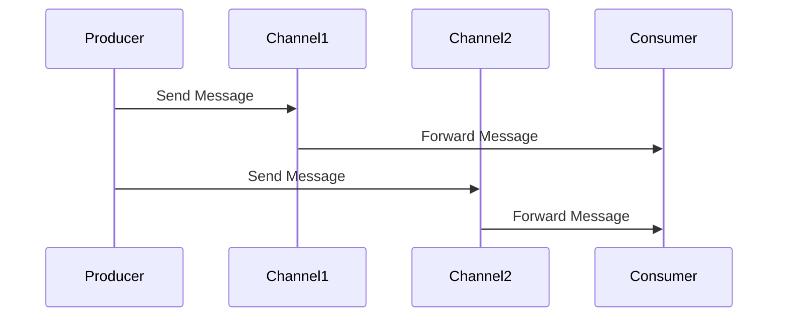

## 10.1 Introduction to Enterprise Integration Patterns

In the realm of software engineering, especially within large enterprises, integrating disparate systems is a common challenge. Enterprise Integration Patterns (EIPs) offer a set of standardized solutions to address these challenges, enabling seamless communication and data exchange between heterogeneous systems. In this section, we will delve into the core concepts of EIPs, their significance, and how they can be effectively implemented in Haskell.

### Overview of Enterprise Integration Patterns

Enterprise Integration Patterns are a collection of design patterns that provide solutions for integrating applications and services within an enterprise environment. These patterns are crucial for ensuring that different systems can communicate and work together efficiently, despite differences in technology, data formats, and protocols.

#### Key Concepts

- **Messaging Channels**: These are pathways through which messages are sent and received. They form the backbone of communication in an integrated system.
- **Message Endpoints**: These are the interfaces through which systems send and receive messages. They act as the entry and exit points for data.
- **Routing Patterns**: These patterns determine how messages are directed from one endpoint to another, ensuring that they reach the correct destination.

### Importance of Enterprise Integration Patterns

The importance of EIPs cannot be overstated in today's interconnected world. As organizations grow, they often acquire or develop multiple systems that need to work together. EIPs facilitate this integration by providing a common language and set of practices that ensure reliable and efficient communication.

#### Benefits of Using EIPs

- **Scalability**: EIPs allow systems to scale by decoupling components and enabling asynchronous communication.
- **Flexibility**: They provide the flexibility to integrate new systems without disrupting existing ones.
- **Reliability**: By standardizing communication, EIPs enhance the reliability and robustness of integrated systems.

### Patterns in Enterprise Integration

Let's explore some of the fundamental patterns in enterprise integration and how they can be applied in Haskell.

#### Messaging Channels

Messaging channels are the conduits through which messages flow between systems. They can be thought of as virtual pipes that connect different components of an enterprise system.

```haskell
-- Define a simple message channel using Haskell's type system
data MessageChannel = MessageChannel
  { channelName :: String
  , sendMessage :: String -> IO ()
  , receiveMessage :: IO String
  }

-- Example of creating a message channel
createChannel :: String -> MessageChannel
createChannel name = MessageChannel
  { channelName = name
  , sendMessage = \msg -> putStrLn ("Sending message: " ++ msg)
  , receiveMessage = return "Received message"
  }
```

In this example, we define a `MessageChannel` data type with functions to send and receive messages. This abstraction allows us to implement various messaging protocols while maintaining a consistent interface.

#### Message Endpoints

Message endpoints are the interfaces through which systems interact with messaging channels. They can be producers, consumers, or both.

```haskell
-- Define a message producer endpoint
data MessageProducer = MessageProducer
  { produceMessage :: String -> IO ()
  }

-- Define a message consumer endpoint
data MessageConsumer = MessageConsumer
  { consumeMessage :: IO String
  }

-- Example of creating a producer and consumer
createProducer :: MessageChannel -> MessageProducer
createProducer channel = MessageProducer
  { produceMessage = sendMessage channel
  }

createConsumer :: MessageChannel -> MessageConsumer
createConsumer channel = MessageConsumer
  { consumeMessage = receiveMessage channel
  }
```

Here, we create `MessageProducer` and `MessageConsumer` types that interact with a `MessageChannel`. This separation of concerns allows for greater flexibility and reusability.

#### Routing Patterns

Routing patterns determine how messages are directed within an enterprise system. They ensure that messages reach the correct destination based on predefined rules.

```haskell
-- Define a simple routing function
routeMessage :: String -> [MessageChannel] -> IO ()
routeMessage msg channels = mapM_ (\channel -> sendMessage channel msg) channels

-- Example of routing a message to multiple channels
main :: IO ()
main = do
  let channel1 = createChannel "Channel1"
  let channel2 = createChannel "Channel2"
  routeMessage "Hello, World!" [channel1, channel2]
```

In this example, we define a `routeMessage` function that sends a message to multiple channels. This pattern can be extended to include more complex routing logic based on message content or metadata.

### Visualizing Enterprise Integration Patterns

To better understand how these patterns work together, let's visualize a simple enterprise integration scenario using Mermaid.js.



**Diagram Description**: This sequence diagram illustrates a simple integration scenario where a producer sends messages to two channels, which then forward the messages to a consumer. This setup demonstrates the use of messaging channels and endpoints in a typical enterprise integration pattern.

### Haskell's Unique Features in Enterprise Integration

Haskell offers several unique features that make it well-suited for implementing enterprise integration patterns:

- **Strong Static Typing**: Haskell's type system ensures that integration components are correctly connected, reducing runtime errors.
- **Immutability**: By default, data in Haskell is immutable, which simplifies reasoning about state changes in distributed systems.
- **Concurrency**: Haskell's lightweight concurrency model, based on Software Transactional Memory (STM) and asynchronous programming, allows for efficient handling of concurrent message processing.

### Differences and Similarities with Other Patterns

While enterprise integration patterns share similarities with other design patterns, such as those found in object-oriented programming, they are distinct in their focus on communication and data exchange between systems. Unlike traditional design patterns, which often focus on structuring code within a single application, EIPs address the challenges of integrating multiple applications.

### Design Considerations

When implementing enterprise integration patterns in Haskell, consider the following:

- **Decoupling**: Ensure that components are loosely coupled to facilitate easy integration and maintenance.
- **Scalability**: Design patterns should support horizontal scaling to handle increased load.
- **Error Handling**: Implement robust error handling to manage failures in communication and data processing.

### Try It Yourself

To deepen your understanding, try modifying the code examples provided:

- **Experiment with Different Messaging Protocols**: Implement different messaging protocols, such as HTTP or AMQP, using the `MessageChannel` abstraction.
- **Add Routing Logic**: Extend the `routeMessage` function to include conditional routing based on message content.
- **Implement Error Handling**: Introduce error handling mechanisms to manage failures in message sending and receiving.

### Knowledge Check

Before moving on, consider the following questions:

- What are the key components of enterprise integration patterns?
- How do messaging channels facilitate communication between systems?
- What are the benefits of using Haskell for implementing EIPs?

### Summary

In this section, we've explored the foundational concepts of enterprise integration patterns and their implementation in Haskell. By leveraging Haskell's unique features, such as strong static typing and concurrency support, we can build robust and scalable integration solutions. As you continue your journey, remember that mastering these patterns is key to designing efficient and reliable enterprise systems.

## Quiz: Introduction to Enterprise Integration Patterns



### What is the primary purpose of Enterprise Integration Patterns?

- [x] To facilitate communication and data exchange between heterogeneous systems
- [ ] To design user interfaces for web applications
- [ ] To optimize database queries
- [ ] To manage memory allocation in software applications

> **Explanation:** Enterprise Integration Patterns are designed to enable seamless communication and data exchange between different systems within an enterprise.

### Which of the following is a key component of Enterprise Integration Patterns?

- [x] Messaging Channels
- [ ] User Interfaces
- [ ] Database Tables
- [ ] Memory Buffers

> **Explanation:** Messaging Channels are a fundamental component of Enterprise Integration Patterns, serving as the pathways for message exchange.

### How does Haskell's strong static typing benefit Enterprise Integration?

- [x] It reduces runtime errors by ensuring correct component connections
- [ ] It increases the speed of message processing
- [ ] It simplifies user interface design
- [ ] It enhances memory management

> **Explanation:** Haskell's strong static typing helps ensure that integration components are correctly connected, reducing the likelihood of runtime errors.

### What is a Message Endpoint in the context of Enterprise Integration Patterns?

- [x] An interface through which systems send and receive messages
- [ ] A database table for storing messages
- [ ] A user interface component for displaying messages
- [ ] A memory buffer for temporary message storage

> **Explanation:** Message Endpoints are interfaces that allow systems to send and receive messages, acting as entry and exit points for data.

### Which Haskell feature is particularly useful for handling concurrent message processing?

- [x] Software Transactional Memory (STM)
- [ ] Lazy Evaluation
- [ ] Pattern Matching
- [ ] List Comprehensions

> **Explanation:** Haskell's Software Transactional Memory (STM) is a concurrency model that allows for efficient handling of concurrent message processing.

### What is the role of Routing Patterns in Enterprise Integration?

- [x] To direct messages to the correct destination based on predefined rules
- [ ] To design user interfaces for message display
- [ ] To optimize database queries for message storage
- [ ] To manage memory allocation for message processing

> **Explanation:** Routing Patterns determine how messages are directed within an enterprise system, ensuring they reach the correct destination.

### How can you extend the `routeMessage` function in Haskell?

- [x] By adding conditional routing logic based on message content
- [ ] By optimizing database queries
- [ ] By designing a new user interface
- [ ] By managing memory allocation

> **Explanation:** The `routeMessage` function can be extended by adding conditional routing logic to direct messages based on their content.

### What is a benefit of using immutable data in Haskell for enterprise integration?

- [x] It simplifies reasoning about state changes in distributed systems
- [ ] It increases the speed of message processing
- [ ] It enhances user interface design
- [ ] It optimizes memory management

> **Explanation:** Immutable data in Haskell simplifies reasoning about state changes, which is beneficial in distributed systems where state consistency is crucial.

### What is the significance of decoupling in Enterprise Integration Patterns?

- [x] It facilitates easy integration and maintenance of components
- [ ] It increases the speed of message processing
- [ ] It enhances user interface design
- [ ] It optimizes memory management

> **Explanation:** Decoupling ensures that components are loosely connected, making it easier to integrate and maintain them within an enterprise system.

### True or False: Enterprise Integration Patterns are only applicable to large organizations.

- [ ] True
- [x] False

> **Explanation:** While Enterprise Integration Patterns are often used in large organizations, they are applicable to any environment where multiple systems need to communicate and exchange data.



Remember, this is just the beginning. As you progress, you'll build more complex and interactive systems using these patterns. Keep experimenting, stay curious, and enjoy the journey!
